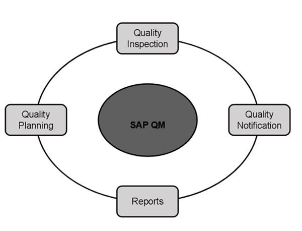

# SAP QM - Overview
SAP Quality Management is a part of SAP R/3 system and is integrated with other SAP modules like SAP Material Management (MM), Production Planning (PP), and Plant Maintenance (PM). QM is an integral part of logistic management and it is used to perform quality functions such as quality planning, quality assurance, and quality control, at various stages such as incoming material stage, in-process manufacturing process stage, and after production as well.

With Quality Management module, you can implement the key modules of QM system as defined in manufacturing standards like ISO 9000.

As SAP Quality Management is an integral part of SAP R/3 system, it performs the following key functions in manufacturing of goods −

   * **Quality Planning** − Quality planning allows to plan the inspection of goods from the vendor, raw material, work-in-process, and final product.
   * **Quality Notifications** − Quality notification includes the defect identification and steps to be taken by quality department.
   * **Quality Inspection** − Here, quality results are captured and decision is taken as to whether an inspection lot is to be accepted or rejected.

In the following diagram, you can see the key components that are involved in SAP Quality Management process.

[Previous Page](../sap_qm/index.md) [Next Page](../sap_qm/sap_qm_components.md) 
