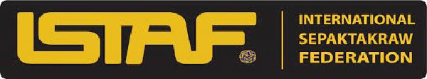

# Sepak Takraw - Championships
Sepak Takraw is a form of volleyball where the players have to hit the ball with foot instead of hands. Many championships have been organized worldwide but still the game has not yet been included in Olympics. The main governing body of this game is International Sepak Takraw Federation(ISTAF).

## International Sepak Takraw Federation
The International Sepak Takraw Federation (ISTAF) works as the international governing body for Sepak Takraw. It was formed in 1988. The main goal of ISTAF popularise the game in 75 countries in order to include it in Olympics. Under its memberships, ISTAF presently has 31 national associations representing their respective countries.

ISTAF is responsible for organizing major Sepak Takraw tournaments worldwide notably the ISTAF Super Series (ISS) and ISTAF World Championship (IWC). Since 1990, it is also a medal sports in the Asian games. It is also a part of Southeast Asian games (SEA) since 1967.

## King’s Cup Sepak Takraw Championship
Kings Cup Sepak Takraw Championship is dedicated to the King of Thailand. It is a team game where a team is formed by three regus. The team that has won two points out of three is the winner. For men’s the championship was started in 1992 and for women in 2005.In both men and women categories, Thailand has mostly won the championship.

## Korea Sepak Takraw Championship
Korea Sepak Takraw Championship is the largest domestic tournament which is organized every year. The championship included both regu and doubles competitions. The competition is divided into four divisions which are

   * Open division
   * College division
   * High school division
   * Middle school division

[Previous Page](../sepak_takraw/sepak_takraw_penalties.md) [Next Page](../sepak_takraw/sepak_takraw_quick_guide.md) 
