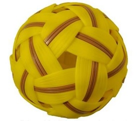
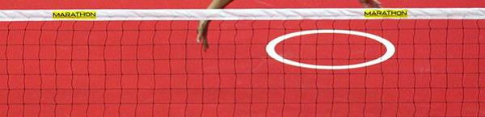
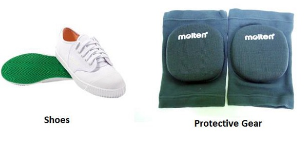

# Sepak Takraw - Equipment
The equipment used in Sepak Takraw are mostly comprised of the net and the hand woven rattan ball. Besides these two, other equipment such as playing jersey, shoes and protective guards are also used. A brief description about all these equipment is as follows.

## Ball

Considered as the most essential equipment of the game, the ball is spherical in shape and usually made of synthetic fibre. In some cases, a hand woven layer is also used. Initially, the ball was made up of rattan strips which were gradually replaced by synthetic strips. Usually the ball has a maximum weight of 170-180 gram for men and 150-160 gram for women.

Usually the ball has a diameter of 5 inch. Balls made of without synthetic rubber must have 12 holes and 20 intersections with a maximum circumference of 42- 44 cm for men and 43- 45 cm for women. The ball can be single coloured or multi coloured but colours impairing player’s performance are not allowed.

In order to soften the impact of the ball on the player’s body, the ball can be made of synthetic rubber or any other soft durable material that is approved by the governing committee.

## Net

The net used in the game is usually made of ordinary cord or nylon with 6-8 cm mess and is usually heavier and stronger than badminton nets in order to provide better impact when the ball hits it. The net shall be 0.7 metres with a maximum length of 6.1 metres. The height of the net should be 1.42 metres from the centre of the court for women and 1.52 metres for men.

## Shoes
The shoes used in this game are light in weight and have flat sides with soles. It has a good grip on both indoor and outdoor surfaces and has a sole inside for supporting the high impact of constant jumping and landing. These are especially made for players to help them kick perfectly.

## Protective gears
In this game, usually ankle supportive bands are used by players for providing protection as high jumping is involved throughout the game. Even knee tensors are also used by players in order to prevent joints and tendon injury. Some players use ankle gears for ankle support. Players also use forehead bandanas in order to stop the sweat running into eyes.

[Previous Page](../sepak_takraw/sepak_takraw_playing_environment.md) [Next Page](../sepak_takraw/how_to_play_sepak_takraw.md) 
