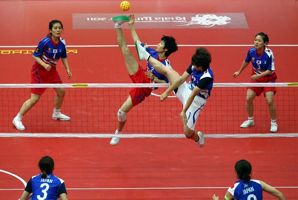
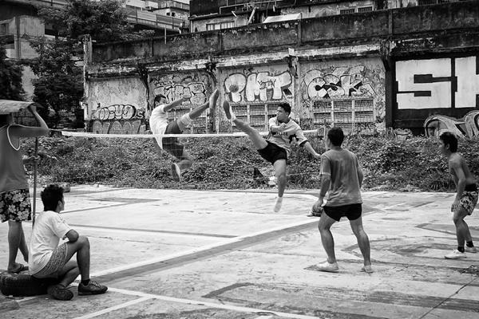

# Sepak Takraw - Overview
Sepak Takraw is a foot volleyball game where players touch as well as handle the ball using only their feet, knee, chest and head. The rules and regulations of the game are very much similar to that of volleyball. A very popular game around Southeast Asia, the game is played using a rattan or synthetic ball. Since 1990, Sepak takraw is also included in Asian games.

Similar to volleyball, here also two teams of players try to control the ball by touching it using only their feet, chest, knee or head and try to kick the ball past the net to the opposition side. Failing to kicking the ball past the net results in a point to the opposition and the first team scoring the maximum point is declared winner.

## History of Sepak Takraw
Sepak Takraw was originated in Malaysia around 500 years ago. In the 15 century, it was mostly played by the royal court. Around 16 century, the game was spread across Indonesia, where people called it **Sepak Raga**. By 1940, the net version of the game was spread across Southeast Asia and formal rules and regulations were formed for the game.

The first official Sepak Takraw competition was held at a swim club on May 16th, 1945 in Penang where teams mostly from various villages of Penang participated in it. During that period, the game used to be called **Sepak Raga Jaring**. Slowly the game spread across Southeast Asia and around 1950s, it was played in almost every school.

The Malaysian Sepak Raga Federation was founded in 1960 at Penang and in 1965 it was included in South East Asia Peninsular Games. It was then formally named as Sepak Takraw and in 1965 the Asian Sepak takraw Federation (ASTAF) was founded as the governing committee of the sports. In 1992, the International Sepak takraw Federation (ISTAF) was formed as the world governing body of the game.

## Participating Countries
Even though Sepak Takraw is quite popular in Southeast Asian countries, its popularity is also spreading in other parts of the world including European as well as American countries. In Los Angeles, there is already a Sepak Takraw community which is familiarizing the game around the country. In Canada also, the game has experienced widespread popularity.

Some of the countries where Sepak Takraw is quite popular or emerging as one of the popular games are Malaysia, Thailand, Indonesia, Korea, Japan, India, Philippines, Brunei, USA, Pakistan.

[Previous Page](../sepak_takraw/index.md) [Next Page](../sepak_takraw/sepak_takraw_playing_environment.md) 
