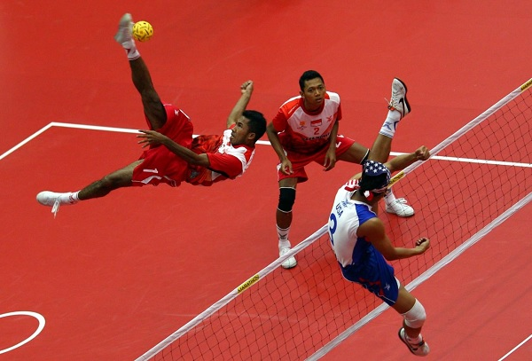
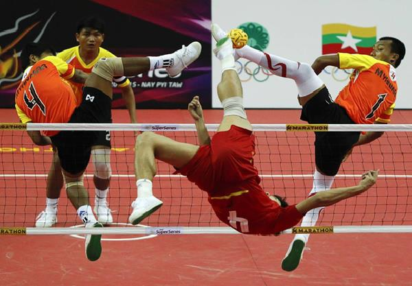

# Sepak Takraw - Penalties
In order to make a match free from any controversy, players are enforced with different penalties in order to behave in appropriately and with proper sportsman attitude during the game.

In some of the cases, players are normally cautioned whereas in some severe offenses, the players are sent off. Details are explained below.

Cases when a player is given a caution and shown the yellow card are −

   * If the player is showing unsporting behaviours which are against the norms of the sports ethics.
   * If the player is persistently breaking the laws of the game.
   * If the player is delaying the re-start of the game.
   * If the player enters or re-enters or deliberately leaves the court without taking referee’s permission.

Some cases where a player is sent off and shown the red card are −

   * If the player is guilty of serious foul play.
   * If the player is guilty of violent conducts by deliberately trying to injure his opponent players.
   * If the player either spits or uses any offensive languages against any of the opponent players.
   * If the player gets two yellow cards in the same game.

When the player gets the first yellow card, normal caution is given to him. In case of getting a second yellow card in the same match, the player is suspended from the next match. Similarly if a player gets a third yellow card in the same match, he gets suspended for two next matches with a fine of $100.

In case of a fourth yellow card in the same match, the player is suspended immediate for the next as well as subsequent matches of that tournament. In case a player gets a red card, he is awarded a send-off from the game as well as immediate suspension from playing any tournament until a disciplinary committee is convened and a decision is taken.

Disciplinary actions are taken against any misconduct or disturbances committed by any team officials in or outside of the court. Similar to players, a team official causing disturbances during the game gets suspended immediately till a disciplinary committee is convened and decisions taken.

[Previous Page](../sepak_takraw/sepak_takraw_faults.md) [Next Page](../sepak_takraw/sepak_takraw_championships.md) 
