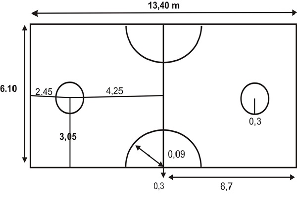

# Sepak Takraw - Playing Environment
The Sepak takraw court is very much similar to that of volleyball court with a flat, horizontal and uniform surface. The dimension of the court is same as doubles badminton i.e. around 20' X 44’ with different boundary lines drawn over it. Court borderlines should be 10 feet away from all obstacles. The net height at the centre is around 5 feet 1 inch.

Different parts and lines of the Sepak takraw court are as follows −

   * **Center Line** − The central line is of 0.02 metre drawn in the middle of the court, dividing it into two equal halves.
   * **Quarter Circles** − At each side of the central line corners, quarter circles with a radius of 3 feet are drawn.
   * **The Service Circle** − Each half has a service circle from where the server serves the ball. Each of them has a radius of around 1 foot and the centre of each circle is 8 feet from the back lines and 10 feet from the side lines.

[Previous Page](../sepak_takraw/sepak_takraw_overview.md) [Next Page](../sepak_takraw/sepak_takraw_equipment.md) 
