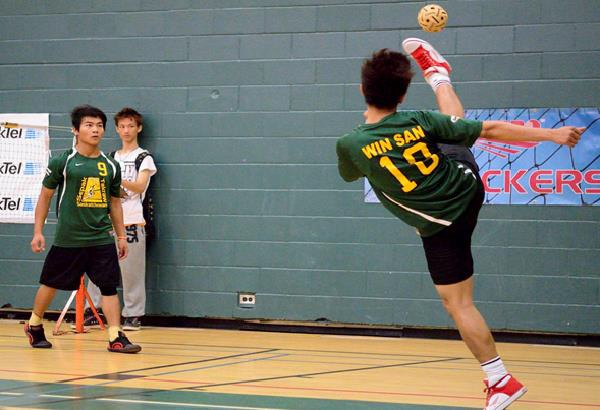
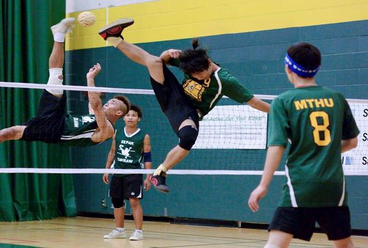
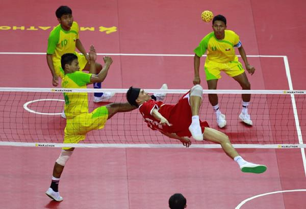
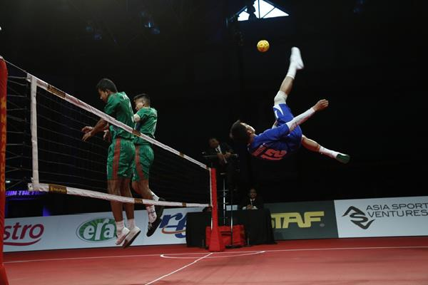

# Sepak Takraw - Quick Guide
# Sepak Takraw - Overview
Sepak Takraw is a foot volleyball game where players touch as well as handle the ball using only their feet, knee, chest and head. The rules and regulations of the game are very much similar to that of volleyball. A very popular game around Southeast Asia, the game is played using a rattan or synthetic ball. Since 1990, Sepak takraw is also included in Asian games.

Similar to volleyball, here also two teams of players try to control the ball by touching it using only their feet, chest, knee or head and try to kick the ball past the net to the opposition side. Failing to kicking the ball past the net results in a point to the opposition and the first team scoring the maximum point is declared winner.

## History of Sepak Takraw
Sepak Takraw was originated in Malaysia around 500 years ago. In the 15 century, it was mostly played by the royal court. Around 16 century, the game was spread across Indonesia, where people called it **Sepak Raga**. By 1940, the net version of the game was spread across Southeast Asia and formal rules and regulations were formed for the game.

The first official Sepak Takraw competition was held at a swim club on May 16th, 1945 in Penang where teams mostly from various villages of Penang participated in it. During that period, the game used to be called **Sepak Raga Jaring**. Slowly the game spread across Southeast Asia and around 1950s, it was played in almost every school.

The Malaysian Sepak Raga Federation was founded in 1960 at Penang and in 1965 it was included in South East Asia Peninsular Games. It was then formally named as Sepak Takraw and in 1965 the Asian Sepak takraw Federation (ASTAF) was founded as the governing committee of the sports. In 1992, the International Sepak takraw Federation (ISTAF) was formed as the world governing body of the game.

## Participating Countries
Even though Sepak Takraw is quite popular in Southeast Asian countries, its popularity is also spreading in other parts of the world including European as well as American countries. In Los Angeles, there is already a Sepak Takraw community which is familiarizing the game around the country. In Canada also, the game has experienced widespread popularity.

Some of the countries where Sepak Takraw is quite popular or emerging as one of the popular games are Malaysia, Thailand, Indonesia, Korea, Japan, India, Philippines, Brunei, USA, Pakistan.

# Sepak Takraw - Playing Environment
The Sepak takraw court is very much similar to that of volleyball court with a flat, horizontal and uniform surface. The dimension of the court is same as doubles badminton i.e. around 20' X 44’ with different boundary lines drawn over it. Court borderlines should be 10 feet away from all obstacles. The net height at the centre is around 5 feet 1 inch.

Different parts and lines of the Sepak takraw court are as follows −

   * **Center Line** − The central line is of 0.02 metre drawn in the middle of the court, dividing it into two equal halves.
   * **Quarter Circles** − At each side of the central line corners, quarter circles with a radius of 3 feet are drawn.
   * **The Service Circle** − Each half has a service circle from where the server serves the ball. Each of them has a radius of around 1 foot and the centre of each circle is 8 feet from the back lines and 10 feet from the side lines.

# Sepak Takraw - Equipment
The equipment used in Sepak Takraw are mostly comprised of the net and the hand woven rattan ball. Besides these two, other equipment such as playing jersey, shoes and protective guards are also used. A brief description about all these equipment is as follows.

## Ball

Considered as the most essential equipment of the game, the ball is spherical in shape and usually made of synthetic fibre. In some cases, a hand woven layer is also used. Initially, the ball was made up of rattan strips which were gradually replaced by synthetic strips. Usually the ball has a maximum weight of 170-180 gram for men and 150-160 gram for women.

Usually the ball has a diameter of 5 inch. Balls made of without synthetic rubber must have 12 holes and 20 intersections with a maximum circumference of 42- 44 cm for men and 43- 45 cm for women. The ball can be single coloured or multi coloured but colours impairing player’s performance are not allowed.

In order to soften the impact of the ball on the player’s body, the ball can be made of synthetic rubber or any other soft durable material that is approved by the governing committee.

## Net

The net used in the game is usually made of ordinary cord or nylon with 6-8 cm mess and is usually heavier and stronger than badminton nets in order to provide better impact when the ball hits it. The net shall be 0.7 metres with a maximum length of 6.1 metres. The height of the net should be 1.42 metres from the centre of the court for women and 1.52 metres for men.

## Shoes
The shoes used in this game are light in weight and have flat sides with soles. It has a good grip on both indoor and outdoor surfaces and has a sole inside for supporting the high impact of constant jumping and landing. These are especially made for players to help them kick perfectly.

## Protective gears
In this game, usually ankle supportive bands are used by players for providing protection as high jumping is involved throughout the game. Even knee tensors are also used by players in order to prevent joints and tendon injury. Some players use ankle gears for ankle support. Players also use forehead bandanas in order to stop the sweat running into eyes.

# How to Play Sepak Takraw?
The rules and regulations of Sepak takraw are very much similar to that of volleyball. The rules vary based on event levels and organizations. The game is played between two teams which are known as **Regu**. There are two types of sepak takraw events −

   * **Regu** − Three players on each side.
   * **Doubles Regu** − Each team has two players.

In Regu, each team has three players including two substitute players. On the court, the team comprises of a **Striker**, a **Server**, and a **Feeder**. Each player possesses different set of skills and tactics.

## Server
The main job of the **server** or **Tekong** is to serve the ball. Prior to the match, each team must register with minimum 9 players or maximum 12 players. The server usually hits the ball with high speed across the net with great speed making it difficult for the opponent players to defend.

## Striker
The **striker** or **killer** is responsible for executing the volleys in to opponent side with high speed. When the striker does not possess the ball, he usually tries to block high kicks from the opponent side.

## Feeder
The third type of player is the **Feeder**, who has the maximum control over the ball during the match. He is the most agile and responsive player in the team. The main job of the feeder is to set the ball in a suitable way for the striker to kick hard past the net. He can also hit the ball across the net. The server usually stands in the back whereas the striker and feeder take the front left side and front right side.

## How to Play?
The very basic rules of the game are as follows −

   * The game starts with a **serve**. The team that has to serve first is decided by **tossing a coin**. The winner of the toss can either choose to serve or choose to defend. The side that serves first starts the set.
   * During the serve, the server must have one of his legs inside the service circle, whereas the other players must stay in their respective quarter circles.
   * Either the feeder or the striker first tosses the ball to the server who then kicks the ball across the net to the opponent side with no foot in the service circle.
   * Tossing the ball to the server must be done only after the referee announces the score. If the throw takes place before the score call, then the ball is again re-thrown and a warning is given to the team.
   * A **serve** is called valid if it passes over the net to the opponent side inside the boundary before the boundary line of the opponent team. Whether it touches the net or not doesn’t matter. Once the serve is done, the players are free to move in to any part of their respective court.
   * In order to respond the serve, the defending team tries to again pass the ball across the net to the opponent side within three touches of the ball.
   * Usually the feeder and the server move around the court to defend the serve of the opposition and set the ball for the striker to strike in two touches.
   * The side that wins the first set has the option of choosing the service.
   * The game continues till one of the team makes a **fault**. Once a fault is done by a team, the opponent team gets a point.
   * When the ball is not in play, each team is entitled to a **tactical timeout** of one minute during the game. There are no automatic timeouts.
   * During the timeout, maximum five players are allowed on the base line in case of Regu matches.
   * In case a player gets injured and needs immediate treatment, the referee can suspend the game temporarily for 5 minutes. If after the 5 minutes, the player is still unable to play, he can be substituted with another player.

## Scoring
An official Regu or Doubles Regu match usually comprises of three sets of game with each set having 21 points. In case of a team event, three back to back matches are played using different players for each Regu.

The winner is determined by **best of three** sets. Once a set is over, the teams change their side and the team which lost the previous set serves first.

If both teams are at 20-20 at the end of the game, the game is extended up to 25 points and the first team to be ahead by 2 points wins the set. When a team wins two sets, the match is won. If any of the team doesn’t win two back to back matches, the third match which is also called the **tie-breaker match**, only has the target of 15 points.

Before a tie-breaker match takes place, again a coin is tossed by the referee and the winner of the toss chooses to either serve or defend. After 7 points during the tie-breaker match, the teams change sides. In case of a tie- breaker match, if both teams are at 14-14, then the match is extended up to 17 points and the first team to be ahead by 2 points wins the match.

## Substitution
During the matches, teams can make a substitution from the two substitute players. The same player cannot be repeated for any team competition involving more than one team. Out of the registered players, different players are chosen for different Regus. A player can be substituted at any time on request made by the team when the ball is not on play.

A team can consider a maximum of two substitute players but during a match, only one substitution is allowed. A player who has been sent off by the referee can be substituted, if and only if no substitution has been done till that moment. A team with less than three players is not allowed to play in the game and is considered as the looser side.

# Sepak Takraw - Shots and Techniques
Except agility and quickness, players also have to perform different kind of shots based on the situation as well as player characteristics. A player as a striker can play offensive shots where as a feeder on the defending side tries to defend the shot first in order to set it for the striker. Some of the shots performed by players are as follows −

## Inside Kick
An inside kick is the most basic form of kick performed by Sepak takraw players. It is mostly used to control the ball. To perform this shot, players usually have to stand with their feet apart and then while bending their supporting leg a little, they need to hit the ball in upward direction using the inside of the other leg.

## Outside Kick
This shot mostly used as a part of defense in order to propel the ball move upward. To perform this shot, the player needs to bend his supportive leg a little while he needs to make the contact with the ball using the outside of his playing leg. The knee of the playing leg turns inward and makes a right angle with the leg while performing the shot.

## Knee Kick
The knee kick is mostly a defensive shot and performed mostly while defending a serve from the opponent side. Here the player actually uses the thigh just above the knee. During the shot, the players try to raise his knee as high as possible.

## Header
Unlike a football header, the header shot in this game is played using the forehead to hit the ball and make it fly. This shot is mostly performed when the ball height is too much for performing a shot using their legs. This shot is played both as a serving as well as striking shot.

## Horse Kick Serve
A difficult shot to perform, the horse kick serve requires players to have a high degree of flexibility in order to perform the shot. It is usually a high kick used to hit the ball as high as the player wants. Here the player needs to perform a high kick and for that he needs to use his foot to hit the ball in backward direction over his shoulder or head.

## Sunback Spike
This shot is very much similar to that of horse kick serve. The only difference is that the shot is performed in a jump. Here the player needs to jump on one leg while using the other leg to hit the ball while still in air. Here the player needs to hit the ball in backward direction over his shoulders or head before finishing the kick and touching the ground.

## Roll Spike
One of the toughest and most stylish shot, here the player first need to jump using one leg and while being airborne, he needs to flip in the direction in which he wants the ball to go. He usually needs to kick the ball backward over the opposite shoulders and the kick has to happen before the player touches the ground.

# Sepak Takraw - Faults
During a set in a match, the game continues till any of the teams make a fault. It is considered as fault if −

   * A player fails to pass the ball to the opponent team within three touches.
   * The ball hits the ground before being kicked off to the other side.
   * The ball lands out of bounds.
   * The inside player plays the ball after the score call before passing it to the server.
   * The inside players lift their foot, cross the quarter circle, or touch the net during tossing of the ball before the serve.
   * The server jumps of the ground during a serve.
   * The server fails to kick the ball once it is tossed by the inside players.
   * The ball does not goes to the opponent side after serve.
   * The players use any other part of the body besides the legal ones.
   * The ball hits the hand or arm of a player.
   * The players shout during the game.
   * The player touches the ball at the opponent team side.
   * Any body part crosses under or over the net.
   * The player holds the ball under the arm or between the legs.
   * The ball hits the roof or walls of the court.

# Sepak Takraw - Penalties
In order to make a match free from any controversy, players are enforced with different penalties in order to behave in appropriately and with proper sportsman attitude during the game.

In some of the cases, players are normally cautioned whereas in some severe offenses, the players are sent off. Details are explained below.

Cases when a player is given a caution and shown the yellow card are −

   * If the player is showing unsporting behaviours which are against the norms of the sports ethics.
   * If the player is persistently breaking the laws of the game.
   * If the player is delaying the re-start of the game.
   * If the player enters or re-enters or deliberately leaves the court without taking referee’s permission.

Some cases where a player is sent off and shown the red card are −

   * If the player is guilty of serious foul play.
   * If the player is guilty of violent conducts by deliberately trying to injure his opponent players.
   * If the player either spits or uses any offensive languages against any of the opponent players.
   * If the player gets two yellow cards in the same game.

When the player gets the first yellow card, normal caution is given to him. In case of getting a second yellow card in the same match, the player is suspended from the next match. Similarly if a player gets a third yellow card in the same match, he gets suspended for two next matches with a fine of $100.

In case of a fourth yellow card in the same match, the player is suspended immediate for the next as well as subsequent matches of that tournament. In case a player gets a red card, he is awarded a send-off from the game as well as immediate suspension from playing any tournament until a disciplinary committee is convened and a decision is taken.

Disciplinary actions are taken against any misconduct or disturbances committed by any team officials in or outside of the court. Similar to players, a team official causing disturbances during the game gets suspended immediately till a disciplinary committee is convened and decisions taken.

# Sepak Takraw - Championships
Sepak Takraw is a form of volleyball where the players have to hit the ball with foot instead of hands. Many championships have been organized worldwide but still the game has not yet been included in Olympics. The main governing body of this game is International Sepak Takraw Federation(ISTAF).

## International Sepak Takraw Federation
The International Sepak Takraw Federation (ISTAF) works as the international governing body for Sepak Takraw. It was formed in 1988. The main goal of ISTAF popularise the game in 75 countries in order to include it in Olympics. Under its memberships, ISTAF presently has 31 national associations representing their respective countries.

ISTAF is responsible for organizing major Sepak Takraw tournaments worldwide notably the ISTAF Super Series (ISS) and ISTAF World Championship (IWC). Since 1990, it is also a medal sports in the Asian games. It is also a part of Southeast Asian games (SEA) since 1967.

## King’s Cup Sepak Takraw Championship
Kings Cup Sepak Takraw Championship is dedicated to the King of Thailand. It is a team game where a team is formed by three regus. The team that has won two points out of three is the winner. For men’s the championship was started in 1992 and for women in 2005.In both men and women categories, Thailand has mostly won the championship.

## Korea Sepak Takraw Championship
Korea Sepak Takraw Championship is the largest domestic tournament which is organized every year. The championship included both regu and doubles competitions. The competition is divided into four divisions which are

   * Open division
   * College division
   * High school division
   * Middle school division

[Previous Page](../sepak_takraw/sepak_takraw_championships.md) [Next Page](../sepak_takraw/sepak_takraw_useful_resources.md) 
