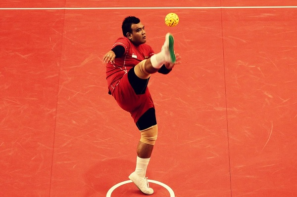
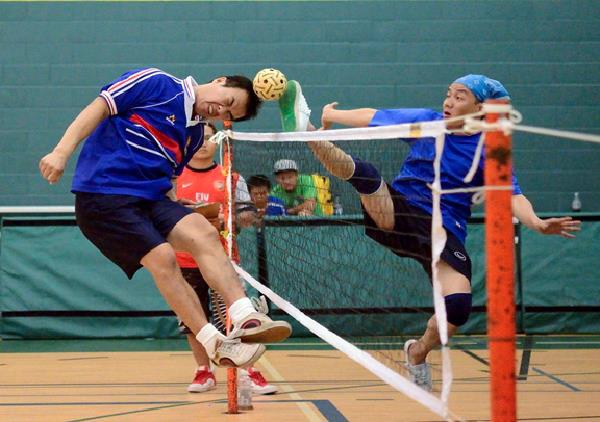

# Sepak Takraw - Shots and Techniques
Except agility and quickness, players also have to perform different kind of shots based on the situation as well as player characteristics. A player as a striker can play offensive shots where as a feeder on the defending side tries to defend the shot first in order to set it for the striker. Some of the shots performed by players are as follows −

## Inside Kick
An inside kick is the most basic form of kick performed by Sepak takraw players. It is mostly used to control the ball. To perform this shot, players usually have to stand with their feet apart and then while bending their supporting leg a little, they need to hit the ball in upward direction using the inside of the other leg.

## Outside Kick
This shot mostly used as a part of defense in order to propel the ball move upward. To perform this shot, the player needs to bend his supportive leg a little while he needs to make the contact with the ball using the outside of his playing leg. The knee of the playing leg turns inward and makes a right angle with the leg while performing the shot.

## Knee Kick
The knee kick is mostly a defensive shot and performed mostly while defending a serve from the opponent side. Here the player actually uses the thigh just above the knee. During the shot, the players try to raise his knee as high as possible.

## Header
Unlike a football header, the header shot in this game is played using the forehead to hit the ball and make it fly. This shot is mostly performed when the ball height is too much for performing a shot using their legs. This shot is played both as a serving as well as striking shot.

## Horse Kick Serve
A difficult shot to perform, the horse kick serve requires players to have a high degree of flexibility in order to perform the shot. It is usually a high kick used to hit the ball as high as the player wants. Here the player needs to perform a high kick and for that he needs to use his foot to hit the ball in backward direction over his shoulder or head.

## Sunback Spike
This shot is very much similar to that of horse kick serve. The only difference is that the shot is performed in a jump. Here the player needs to jump on one leg while using the other leg to hit the ball while still in air. Here the player needs to hit the ball in backward direction over his shoulders or head before finishing the kick and touching the ground.

## Roll Spike
One of the toughest and most stylish shot, here the player first need to jump using one leg and while being airborne, he needs to flip in the direction in which he wants the ball to go. He usually needs to kick the ball backward over the opposite shoulders and the kick has to happen before the player touches the ground.

[Previous Page](../sepak_takraw/how_to_play_sepak_takraw.md) [Next Page](../sepak_takraw/sepak_takraw_faults.md) 
