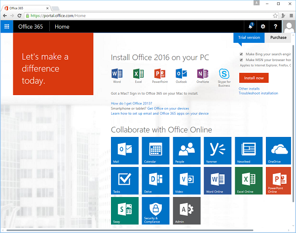
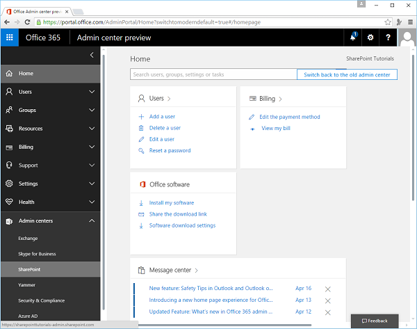
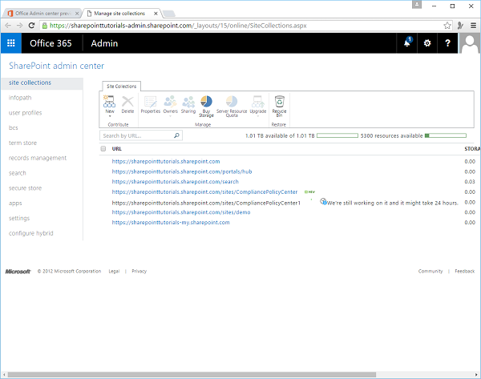

# SharePoint - Central Administration
In this chapter, we will be covering the high-level introduction of SharePoint Central Administration. Central Administration is the place where you can perform administration tasks from a central location. As we have already signed up for an Office 365, so we also have an administration site.

Open the URL [https://portal.office.com/](https://portal.office.com/)  in the browser.

**Step 1** − Select the Admin icon.

**Step 2** − Now select **Admin centers → SharePoint** in the left pane.

The following page will open.

You can see a variety of site collection administration features and manage the following activities −

   * Application management
   * Monitoring
   * Security
   * General application settings
   * System settings
   * Backup and restore
   * Upgrade and migration
   * Configuration wizard
   * Apps

## Application Management
In Application Management, you can perform tasks like creating new web applications and site collections. You can manage the services that are installed on your SharePoint site such as Word, Excel or BCS and manage your content database.

You can also perform tasks like modifying the properties of the content database, activating features, and creating new site collections etc.

## Monitoring
Monitoring is the central place wherein you can manage reporting, monitoring, and the status of your SharePoint site. The Monitoring site is divided into three areas, which are as follows −

   * **Health Status** − You can see the status of different services on your SharePoint Server.
   * **Timer Jobs** − You can define the specific jobs and decide when to run them.
   * **Reporting** − A set of tools that enables you to create and manage reports, run diagnostic logging, and view reports on various server-side activities.

## Security
Security settings is all about the security in the main browser UI, where the users and the site administrators can assess specific permissions that relate to users for their sites. Security covers many areas such as −

   * Management of administrator accounts
   * Configuration and management of service accounts.
   * Management of password change settings and policies.
   * Specifications of authentication providers, trusted identity providers.
   * Antivirus settings.
   * Blocked file types.
   * Self-service security.
   * Secure token services.

## General Application Settings
In General Application Settings, you can configure a number of general options for your SharePoint site collections and sites such as send mail to users.

You can also manage a number of deployment and approval options such as content deployment location and approvers of that content. In general, think of this site as the generic settings for your SharePoint sites.

## System Settings
You can configure server-centric settings such as farm-level or access features, or even manage the services like Excel and Word Services, which are available to the users of the site collection. You manage these types of settings from within the System Settings site.

## Backup and Restore
Sometimes, you might need to backup and restore your SharePoint site. The backup and restore feature enables you to create and schedule regular backups for your SharePoint, perform ad hoc backups, restore from a previously backed-up SharePoint site etc.

## Upgrade and Migration
Sometimes, you might want to upgrade from one version of SharePoint to another version such as moving from SharePoint Standard to SharePoint Enterprise. This requires a license and some facility to upgrade the server.

This type of activity can be done in the Upgrade and Migration section of the Central Administration site. You can also install service patches, check on installation, and upgrade progress from within this part of the administration toolset.

## Configuration wizard
It is simply a step-by-step wizard that configures SharePoint Server for you.

You should have seen this wizard when you first installed SharePoint. However, you can run it again after installation to change some of the configurations on your SharePoint server.

## Apps
Apps is a new category within the Central Administration site that enables you to manage different facets of the apps that are installed on your SharePoint instance.

For example, you can use Apps to manage the licenses, ensure that apps are running and performing in an error-free way, and also manage the App Catalog.

[Previous Page](../sharepoint/sharepoint_apis.md) [Next Page](../sharepoint/sharepoint_app_model.md) 
