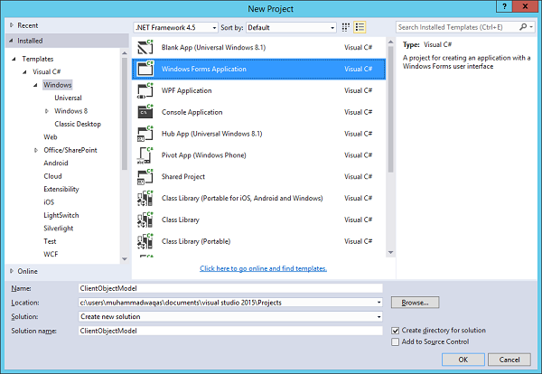
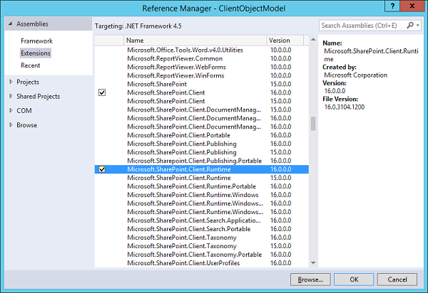
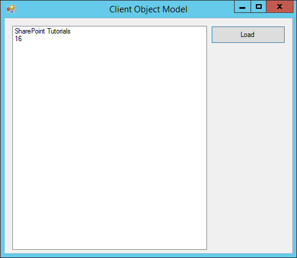

# SharePoint - Client Object Model
In this chapter, we will take a look at the Client Object Model or CSOM. This was one of the two APIs, for building remote applications that were added to SharePoint 2010.

One of the design goals of the Client Object Model was to mimic the Server Object Model as much as possible, so there would be a shorter learning curve for developers already familiar with doing development on the Server side.

The heart of the Client Object Model is a web service called Client.svc, which lives in the **_vti_bin** virtual directory. We are not supposed to communicate directly with Client.svc, but we are given three proxies or entry points, which we can use. They are −

   * .NET Managed code.
   * JavaScript.
   * JavaScript.

The code communicates with these proxies and then these proxies eventually communicate with the web service.

Since this is a remote API and communication is done with SharePoint via web service calls, the Client Object Model is designed to allow us to batch up commands and requests for information.

### .NET Managed code
The two core assemblies for the .NET Manage Implementation are −

**Microsoft.SharePoint.Client.dll** and **Microsoft.SharePoint.Client.Runtime.dll.**

### Silverlight code
The assemblies for the Silverlight implementation live in **TEMPLATE\LAYOUTS\ClientBin**. The assembly names also start with **Microsoft.SharePoint.Client**. For all assemblies but one, the assembly name ends in Silverlight.

The two core assemblies for the Silverlight implementation are −

   * Microsoft.SharePoint.Client.Silverlight.dll
   * Microsoft.SharePoint.Client.Silverlight.Runtime.dll

### JavaScript
The JavaScript implementation on the Client Object Model lives in the TEMPLATE\LAYOUTS folder underneath the SharePoint System Root. The JavaScript library names all start with SP. The three core libraries are **SP.js, Sp.Runtime.js**, and **SP.Core.js**.

The Client Object Model is expanded in SharePoint 2013.

## Retrieve Resources with Load using .NET
Let us look at a simple example in which we will use the managed implementation of the Client Object Model using Windows forms application. Therefore, first we need to create a new project.

**Step 1** − Select **Windows Forms Application** in the middle pane and enter name in the Name field. Click OK.



**Step 2** − Once the project is created, let us add one list box and one button as shown below. To use the Client Object Model, we need to add a couple of assembly references. Right-click on the References and choose Add Reference.


**Step 3** − Select **Extensions** in the left pane under **Assemblies**.

The two core assemblies for the managed implementation of the Client Object Model are **Microsoft.SharePoint.Client** and **Microsoft.SharePoint.Client.Runtime**. Check these two options and click OK.



Now double-click the Load button to add the event handler as given below.

```
using Microsoft.SharePoint.Client;
using System;
using System.Collections.Generic;
using System.ComponentModel;
using System.Data;
using System.Drawing;
using System.Linq;
using System.Text;
using System.Threading.Tasks;
using System.Windows.Forms;

namespace ClientObjectModel {
   public partial class Form1 : Microsoft.SharePoint.Client.Form {
      public Form1() {
         InitializeComponent();
      }
      private void loadBtn_Click(object sender, EventArgs e) {
         using (var context = new ClientContext("http://waqasserver/sites/demo")) {
            var web = context.Web;
            context.Load(web);
            context.Load(web.Lists);
            context.ExecuteQuery();
            ResultListBox.Items.Add(web.Title);
            ResultListBox.Items.Add(web.Lists.Count);
         }
      }
   }
}
```
The entry point into the Client Object Model is the client context. It is the remote of client version of the **SPContext** object. This is a disposable type, so it is wrapped in a **using** statement. We pass the URL the SharePoint site in **ClientContext**.

So now, we have our context. We need an object to represent the current site so that is **var web = context.web**.

**Note** − Remember, this object is just an empty shell, so we need to load the web objects by using context.load and pass the web object. This indicates that we want web objects properties to be populated in the next batch retrieval.

Next, we need to call **context.ExecuteQuery** and that actually kicks off the batch retrieval. We retrieve the property values from the server and add to list box.

When the above code is compiled and executed, you will see the following output −



Click the Load button and you will see that we get both, the title and count of the lists.

It enables our project setup to use the Client Object Model to check the loading resources using the load method.


[Previous Page](../sharepoint/sharepoint_server_object_model.md) [Next Page](../sharepoint/sharepoint_rest_apis.md) 
