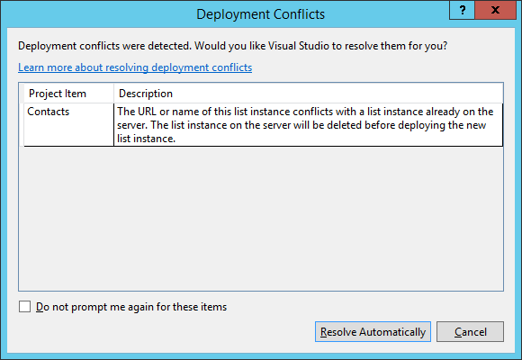
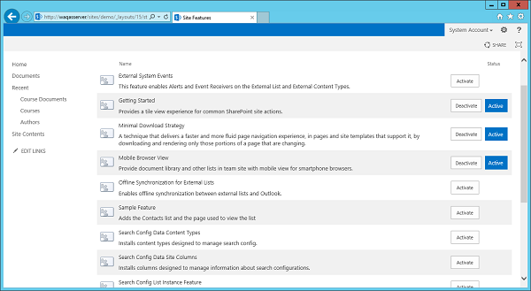
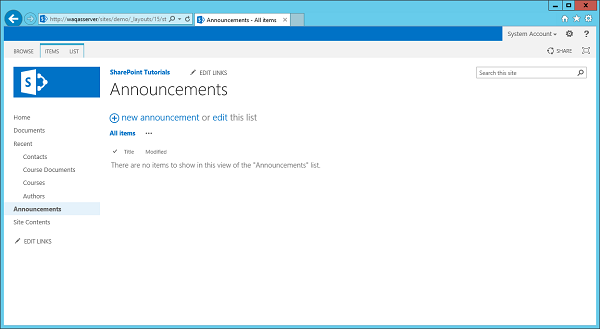
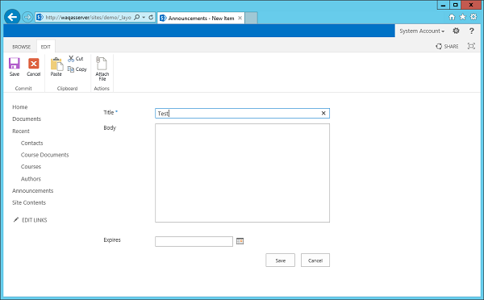
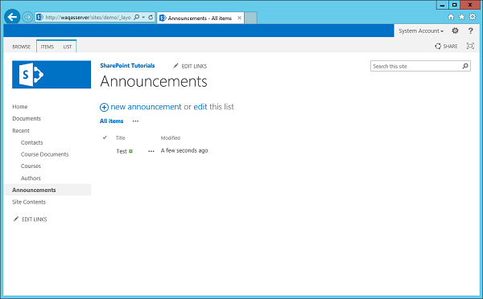
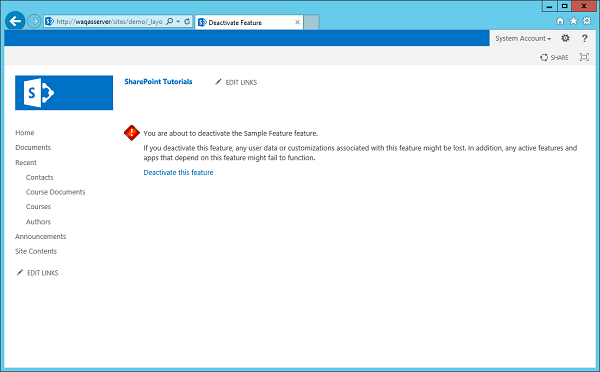

# SharePoint - Feature\Event Receiver
In this chapter, we will learn to add **code handle**. Code handles are events that are raised when a Feature is activated or deactivated. In other words, we will be examining **Feature Receivers**.

The Visual Studio project that we created in the last chapter had one Feature and when it was activated, it provisioned our Contacts list, our SitePage, and the link to the SitePage.

However, when the Feature is deactivated, SharePoint only removes the link, the SitePage and the Contacts list still remain.

We can write the code when the Feature is deactivated to remove the list and the page, if we want to. In this chapter, we will learn how to remove content and elements, when a Feature is deactivated.

To handle the events for a Feature, we need a **Feature Receiver**.

**Step 1** − To get Feature receiver, right-click on the Feature in the Solution Explorer and then choose **Add Event Receiver**.

```
using System;
using System.Runtime.InteropServices;
using System.Security.Permissions;
using Microsoft.SharePoint;

namespace FeaturesAndElements.Features.Sample {
   /// <summary>
      /// This class handles events raised during feature activation, deactivation,
         installation, uninstallation, and upgrade.
   /// </summary>
   /// <remarks>
      /// The GUID attached to this class may be used during packaging and should not be modified.
   /// </remarks>
   [Guid("e873932c-d514-46f9-9d17-320bd3fbcb86")]
  
   public class SampleEventReceiver : SPFeatureReceiver {
      // Uncomment the method below to handle the event raised after a feature has been activated.
      //public override void FeatureActivated(SPFeatureReceiverProperties properties)//{
         //
      }
      // Uncomment the method below to handle the event raised before a feature is deactivated.
      //public override void FeatureDeactivating(SPFeatureReceiverProperties properties)// {
         //
      }
      // Uncomment the method below to handle the event raised after a feature has been installed.
      //public override void FeatureInstalled(SPFeatureReceiverProperties properties)// {
         //
      }
      // Uncomment the method below to handle the event raised before a feature is uninstalled.
      //public override void FeatureUninstalling(SPFeatureReceiverProperties properties)// {
         //
      }
      // Uncomment the method below to handle the event raised when a feature is upgrading.
      //public override void FeatureUpgrading(SPFeatureReceiverProperties
         properties, string upgradeActionName,
         System.Collections.Generic.IDictionary<string, string> parameters) // {
         //
      }
   }
}
```
You can see what we get is a class that inherits from **SPFeatureReceiver**.

In SharePoint, there are different classes for different kinds of events you can handle. For example, events on lists, events on list items, events on sites. You can create a class that is derived from a specific event receiver and then you can override methods inside of that class to handle the events.

The Events of a Feature are used when it is being −

   * Activated
   * Deactivated
   * Installed
   * Uninstalled
   * Upgrading

Next, you need to attach that class as the event handler for the specific item. For example, if there is an event handler that handles list events, you need to attach that class to the list.

Therefore, we will handle two Features −

   * When the feature is activated and
   * When it is being deactivated.

**Step 2** − We will implement the **FeatureActivated** and FeatureDeactivated methods as shown below −

```
using System;
using System.Runtime.InteropServices;
using System.Security.Permissions;
using Microsoft.SharePoint;

namespace FeaturesAndElements.Features.Sample {
   /// <summary>
      /// This class handles events raised during feature activation, deactivation,
         installation, uninstallation, and upgrade.
   /// </summary>
   /// <remarks>
      /// The GUID attached to this class may be used during packaging and should
         not be modified.
   /// </remarks>

   [Guid("e873932c-d514-46f9-9d17-320bd3fbcb86")]
   public class SampleEventReceiver : SPFeatureReceiver {
      private const string listName = "Announcements";
      
      public override void FeatureActivated(SPFeatureReceiverProperties properties) {
         var web = properties.Feature.Parent as SPWeb;
         
         if (web == null) return;
         var list = web.Lists.TryGetList(listName);
         
         if (list != null) return;
         var listId = web.Lists.Add(listName, string.Empty,
         SPListTemplateType.Announcements);
         list = web.Lists[listId];
         list.OnQuickLaunch = true;
         list.Update();
      }
      public override void FeatureDeactivating(SPFeatureReceiverProperties properties) {
         var web = properties.Feature.Parent as SPWeb;
         
         if (web == null) return;
         var list = web.Lists.TryGetList(listName);
         
         if (list == null) return;
         if (list.ItemCount == 0) {
            list.Delete();
         }
      }
   }
}
```
**Note** −

   * When the feature is activated, we will create an Announcements list.
   * When the feature is deactivated, we will check to see if the Announcements list is empty and if it is, we will delete it.

**Step 3** − Now right-click on the Project and choose deploy. You will see the following Deployment Conflict warning.



Visual Studio is telling us that we are trying to create a list called contacts, but there is already a list in the site called Contacts. It is asking us if we want to overwrite the existing list, and in this case click **Resolve**.

**Step 4** − Go back to SharePoint and then refresh your site and go to **Site Actions → Site settings → Manage site features → Sample feature**.



You can see that there are no announcements list in the left pane.

**Step 5** − Let us Activate Sample feature and you will see the Announcements list, but it is empty right now.



**Note** − If you deactivate your Sample Feature then you will notice that the Announcements list goes away.

**Step 6** − Let us reactivate the feature. Go to Announcements and then Add a new announcement. We will call this Test and then click Save.



You will see the Test file under Announcements.



Now when you Deactivate Announcements, you will see that the Announcements list stays because it was not empty.




[Previous Page](../sharepoint/sharepoint_features_and_elements.md) [Next Page](../sharepoint/sharepoint_azure_platform.md) 
