# SharePoint - List Functionality
In this chapter, we will discuss from an end-user perspective mostly, covering Lists and some of the value-added features on top of lists like views, validation etc. When the end users create content within SharePoint, it is stored in the form of lists.

   * Lists are really the data storage mechanism within SharePoint.
   * It provides the user interface to be able to view the items in a list, add, edit, and delete items or view individual items.

Let us have a look into a simple example in which we will add a contacts list.

**Step 1** − Open your SharePoint site and go to the Site Contents page. You can see the current contents, lists and libraries, and we have the ability to add new content by clicking **add an app**.

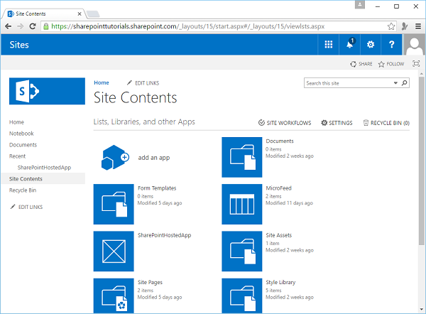

**Step 2** − So let us take a look at some of the things we can add to our site −

   * We can create a new document library.
   * We can create a custom list where we define the schema.
   * There are also some lists with predefined schemas like the task list here.
   * We can add pictures, some wiki pages, forms, a links list, announcements list, contacts list, and calendar etc.

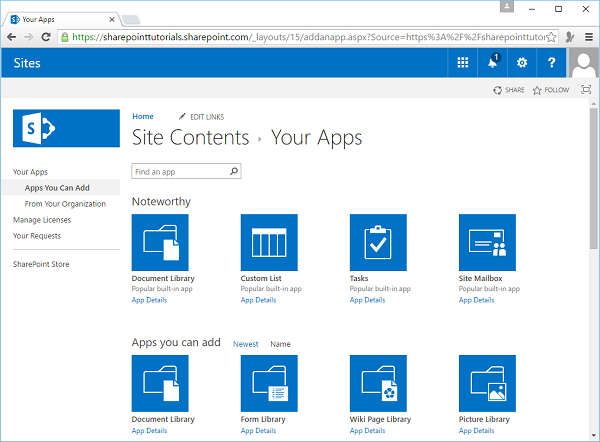

**Step 3** − Let us select the contacts list.

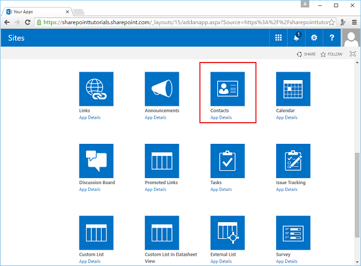

**Step 4** − We will call this list- **Contacts** and then click the **Create** button.

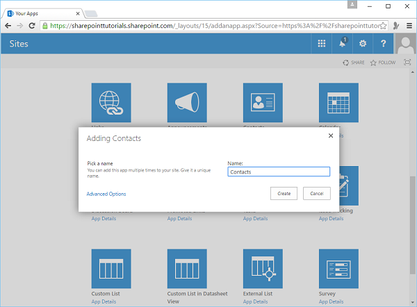

**Step 5** − So now you can see here in your site contacts, you have the contacts list and you can click on that to work with the items in the list.

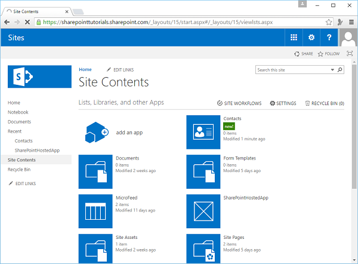

**Step 6** − One way to add a new item to this list is to click this New Item link and then add it in my content.

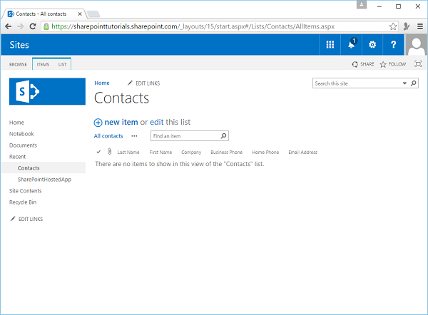

**Step 7** − Enter the Last Name and First name, and then come up to the tool bar or the Ribbon and click **Save**.

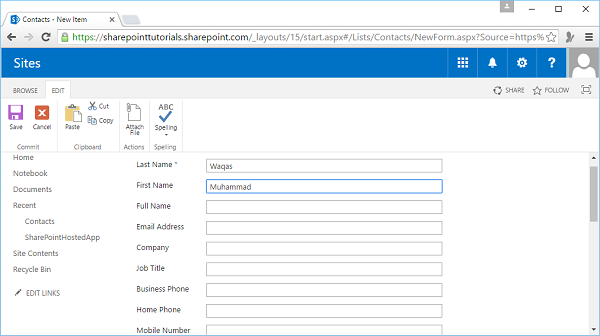

**Step 8** − We can also put the list into edit mode by clicking on the **edit** link.

**Step 9** − Next, we can add some other Contacts. Once editing is finished, click the **Stop editing** to get out of badge edit mode.

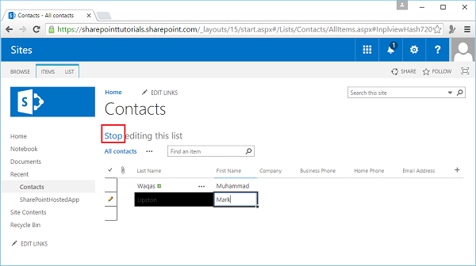

The page will show all the contacts.

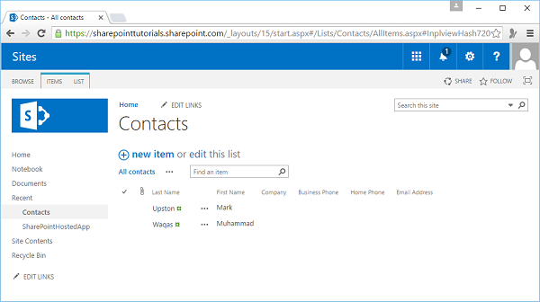

A couple of other things when we are working with the list here.

**Step 10** − Click **ITEMS** to get access to the items on **Ribbon**.

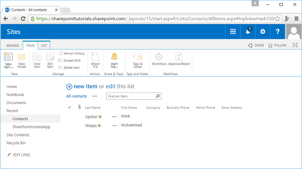

**Step 11** − Click **LIST** here to get access to the **Ribbon** items related to the entire list.

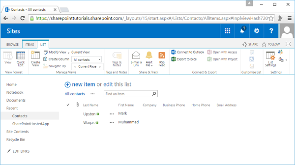

[Previous Page](../sharepoint/sharepoint_development_tools.md) [Next Page](../sharepoint/sharepoint_additional_list_functionality.md) 
