# SharePoint - REST APIs
In this chapter, we will be covering the REST APIs. This is not a traditional API, where we have a set of libraries that contain types and those types contain properties and methods.

The REST API is implemented as Data-centric web service based on the Open Data Protocol or OData. The way these web services work, use each resource in the system is addressable by a specific URL that you pass off to the server.

Let us look at this in Internet Explorer in which SharePoint site is open.

**Step 1** − If you are using Internet Explorer, go to Internet Explorer settings and on Content tab, select the settings for Feeds and Web Slices as shown in the screenshot below.

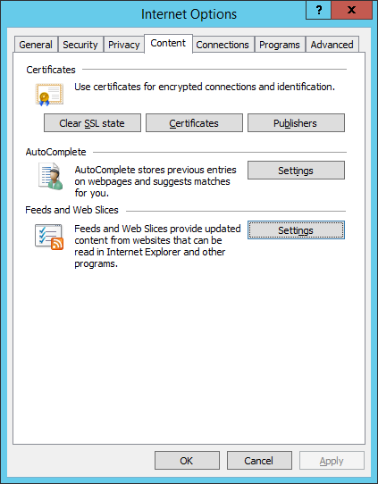

You will see the following dialog box. Make sure **feed reading view** is **off** and click OK.

**Step 2** − Now let us change the URL to the site URL +/_api/web and press Enter.

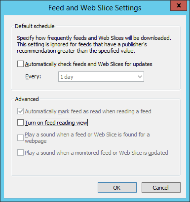

Now you should get a view that looks like the following screenshot.

We want information about the current web or the current site. Therefore, the site URL +/_api is the base URL for the SharePoint 2013 REST API and web is our query. We want information about the current web.

We get an XML document back and if we scroll down, we will get information about our current web.

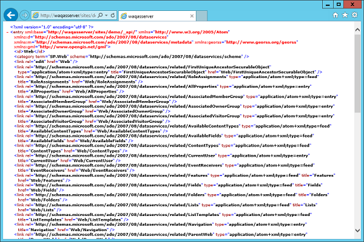

Next, if you want to know about the lists in the web, you can append the lists to your URL. Instead of information about an individual object, we will get a collection of information about all of the lists in the current site.

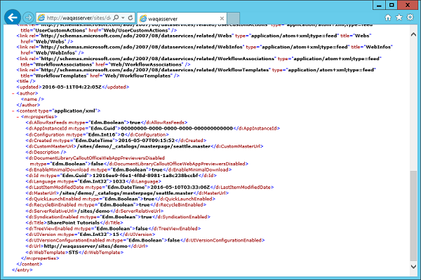

When we were using the browser, we were issuing get requests to the server, which means we want to retrieve information. However, we can also do the rest of the standard CRUD operations.

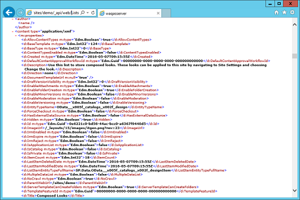

## Retrieve Resources using REST API
The SharePoint 2013 REST API does not expose metadata. Therefore, when we are working with it in Managed Code, we cannot use Visual Studio to generate a service proxy using the service reference dialog. Instead, we can use a type like the web client of the http web request object to send a request up to the server and just get the raw results back.

Whether those results are returned as XML or JSON are determined by the accept header we send along with the request.

   * If we get back XML then we can use LINQ to XML to retrieve the information out of the response we need for our application.
   * If we get back JSON, then we can use one of the various JSON serializes to parse the JSON into .NET objects and then use that to retrieve the information we need.

When working with the REST API in JavaScript, we can use jQuery or the SP.RequestExecutor object to make the call up to the service. Just as in the Managed Code example, we can control whether we get back XML or JSON using the accept header. Since, we are working in JavaScript majority of times, we are going to want to get back JSON.

The one other thing to note is when you are building the URL to the service, we can use the **_spPageContextInfo** object to get the absolute URL from the site and then just append the service URL plus the query to it. This is because the REST API service does not expose metadata and you cannot create a service reference in Visual Studio, using the REST API in Managed Code is really a non-starter.

Let us take a look at calling the REST API from JavaScript by creating a new project.

**Step 1** − Select **App for SharePoint** in middle pane and enter name for your project. Click **OK**.


**Step 2** − Enter your site URL and select the **SharePoint – hosted** option and click Next. Click Finish.

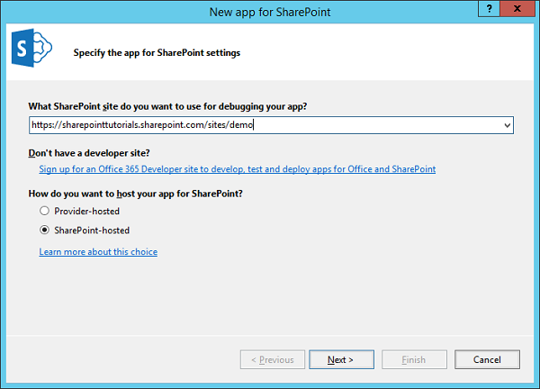

**Step 3** − Once the project is created, let us open the Default.aspx page, which is under Pages in Solution Explorer and add one button.

```

```
Here is the complete implementation of the Default.aspx file.

```
<%-- The following 4 lines are ASP.NET directives needed when using SharePoint
   components --%>

<%@ Page Inherits = ”Microsoft.SharePoint.WebPartPages.WebPartPage,
   Microsoft.SharePoint, Version = 15.0.0.0, Culture = neutral,
   PublicKeyToken = 71e9bce111e9429c” MasterPageFile = ”~masterurl/default.master”
   Language = ”C#” %>

<%@ Register TagPrefix = ”Utilities” Namespace = ”Microsoft.SharePoint.Utilities”
   Assembly = ”Microsoft.SharePoint, Version = 15.0.0.0, Culture = neutral,
   PublicKeyToken = 71e9bce111e9429c” %>

<%@ Register TagPrefix = ”WebPartPages”
   Namespace = ”Microsoft.SharePoint.WebPartPages” Assembly = ”Microsoft.SharePoint,
   Version = 15.0.0.0, Culture = neutral, PublicKeyToken = 71e9bce111e9429c” %>

<%@ Register TagPrefix = ”SharePoint” Namespace = ”Microsoft.SharePoint.WebControls”
   Assembly = ”Microsoft.SharePoint, Version = 15.0.0.0, Culture = neutral,
   PublicKeyToken = 71e9bce111e9429c” %>

<%-- The markup and script in the following Content element will be placed in
   the <head> of the page --%>

<asp:Content ContentPlaceHolderID = ”PlaceHolderAdditionalPageHead”
   runat = ”server”>
   <script type = ”text/javascript” src = ”../Scripts/jquery-1.9.1.min.js”></script>
   <SharePoint:ScriptLink name = ”sp.js” runat = ”server” OnDemand = ”true”
      LoadAfterUI = ”true” Localizable = ”false” />
   <meta name = ”WebPartPageExpansion” content = ”full” />
   <!–Add your CSS styles to the following file ->
   <link rel = ”Stylesheet” type = ”text/css” href = ”../Content/App.css” />
   <!–Add your JavaScript to the following file ->
   <script type = ”text/javascript” src = ”../Scripts/App.js”></script>
</asp:Content>

<%-- The markup in the following Content element will be placed in the TitleArea
   of the page --%>

<asp:Content ContentPlaceHolderID = ”PlaceHolderPageTitleInTitleArea”
   runat = ”server”>
   Page Title
</asp:Content>

<%-- The markup and script in the following Content element will be placed in
   the <body> of the page --%>

<asp:Content ContentPlaceHolderID = ”PlaceHolderMain” runat = ”server”>
   <div>
      <p id = ”message”>
         <!–The following content will be replaced with the user name when
            you run the app – see App.js -> initializing…
      </p>
      <input id = ”loadButton” type  = ”button” value = ”Load” />
   </div>
</asp:Content>
```
**Step 4** − Open the App.js file, which is under Script in Solution Explorer and replace it with the following code.

```
JQuery(document).ready(function () {
   JQuery("#loadButton").click(usingLoad)
});

function usingLoad() {
   var context = SP.ClientContext.get_current();
   var web = context.get_web();
   context.load(web);
   context.executeQueryAsync(success, fail);
   
   function success() {
      var message = jQuery("#message");
      message.text(web.get_title());
      message.append("<br/>");
      message.append(lists.get_count());
   }
   function fail(sender, args) {
      alert("Call failed. Error: " + args.get_message());
   }
}
```
We are using jQuery to create the **document.ready** function. Here, we just want to attach the click event handler to the button. Hence, we have used the selector to get the **loadButton** and then we have added the click event-handler using **Load**.

So when we click the button, we want to do the same thing we did in the managed version of the demo, we want to show the Title of the web.

**Step 5** − Publish your application and you will see the following file −

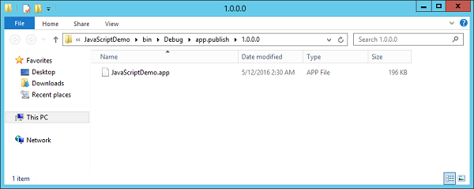

**Step 6** − Drag this file to your SharePoint site apps page.

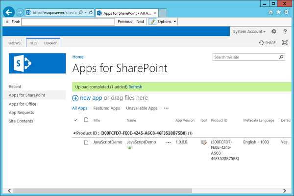

You will see the file **JavaScriptDemo** in the list.

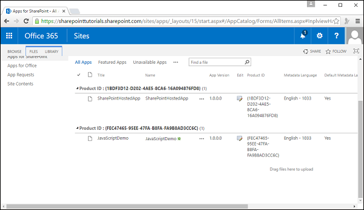

**Step 7** − Click on the Site Contents in the left pane and then select add an app. Click the **JavaScriptDemo** icon.

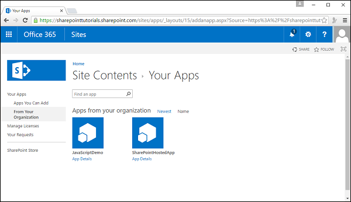

**Step 8** − Click **Trust it**.

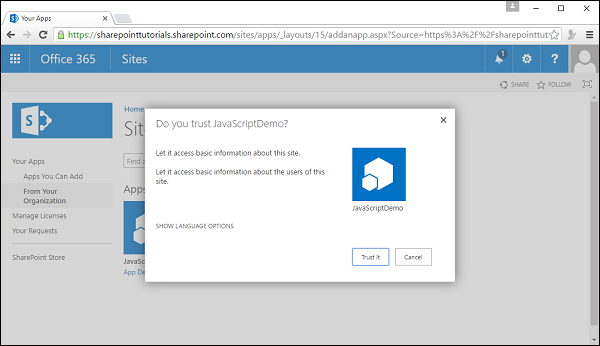

**Step 9** − Now you will see your app. Click the app icon.

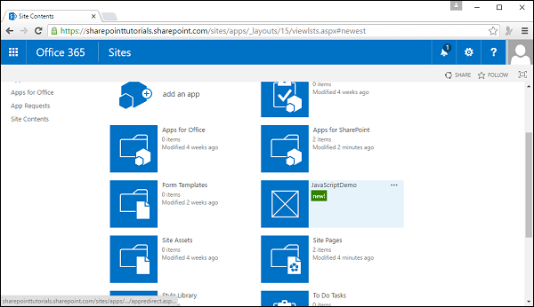

**Step 10** − When you click the Load button, it will update the text.

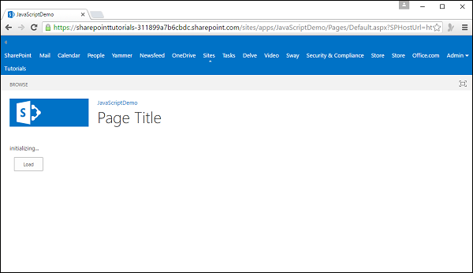

You can see the updated text.

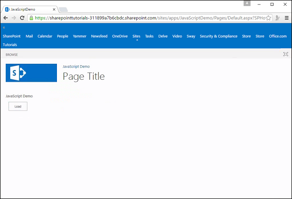


[Previous Page](../sharepoint/sharepoint_client_object_model.md) [Next Page](../sharepoint/sharepoint_features_and_elements.md) 
