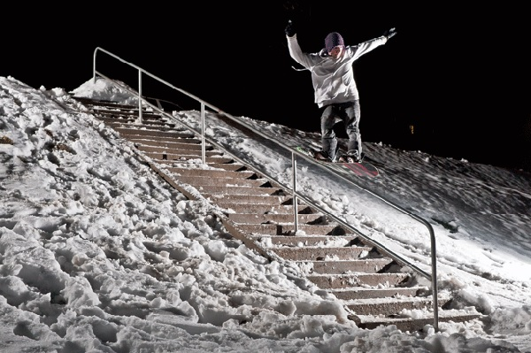
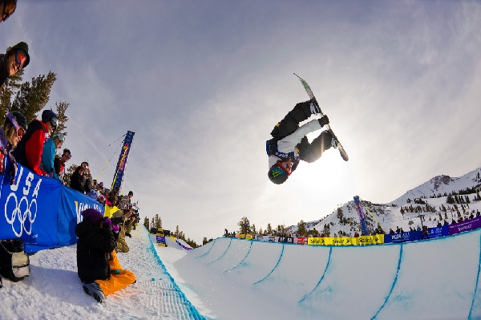
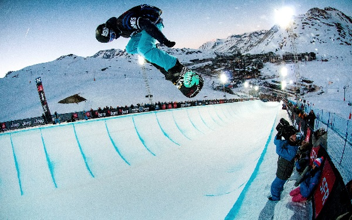
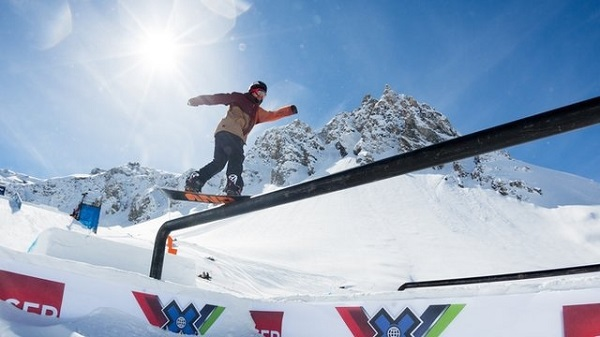
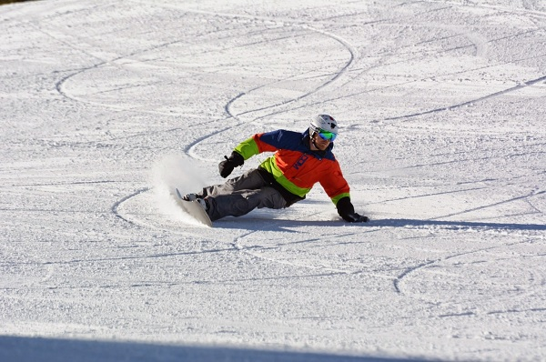
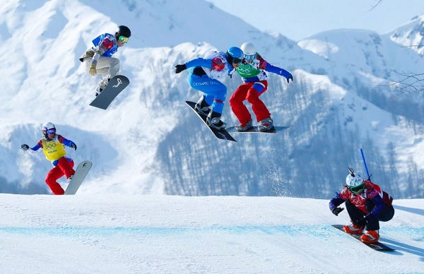

# How to Play Snowboarding?
Since its invention, Snowboarding has gone through a lot of changes and improvisations. Based on the modern snowboarding, different variants have been invented which are **Jibbing, Alpine, Freestyle, Snowboard Racing** where all of these types differ from each other in case of equipment and the bases used as the snowboarding surface. These snowboarding styles are described below.

## Jibbing
Jibbing is also known as **Cruising** in which the rider rides on nonstandard surfaces and performs different tricks. In case of jibbing, the players mostly ride and slide above surfaces that are mostly other than snow. These surfaces can be boxes, metal rails, logs, benches, rocks etc. Basically the rider has to ride on anything that comes in his/her way. It is mostly performed in skate parks.

## Freestyle Snowboarding
In case of freestyle snowboarding, the more importance is given to the tricks performed rather than the surfaces. The players have to ride on a snowboard on any of the surfaces that comes along the way which can be a log, rock, metal rails, or boxes.

These surfaces can be either manmade or natural. Freestyle snowboarding can be performed in a skate park or in natural environment. There are different types of freestyle snowboarding based on the surfaces used.

## Halfpipe Snowboarding
Halfpipe snowboarding is one of the most popular formats of snowboarding. Here the surface used has the shape of a half pipe. It is a semi-circular surface with two sides covered with walls and the middle sloppy ramp surface is filled with snow for the ride.

The players start at one edge of the slope, slide down to and from different sides perform different tricks while moving from one side to another and being in the air. The height of the walls of the half pipe lies between 8 feet to 23 feet.

## Slopestyle Snowboarding
In case of slope style snowboarding, the surface used is a terrain park. Here, the terrains are filled with different manmade surfaces which can be boxes, logs, metal rails, jibs etc. Here the basis of scoring is the surface chosen and efficiency of the tricks performed.

In order to win the slope style competition, the player not only has to go for hardest surfaces, he/she must perform all the tricks smoothly on the chosen surface. Slope style snowboarding competitions are mostly held at specially built surfaces in mountain areas.

## Alpine Snowboarding
In case of alpine snowboarding, the sport takes place in a hard packed snowed surface. Also called as carving, here the players have to mostly focus on carving blinked turns similar to surfing and skiing. Here the players wear hard plastic boots and then place the board below their feet with the front toe being in line with the snowboard tip.

The snowboard used in alpine snowboarding is narrower in comparison to the snowboards of other variants. Here the players tilt the snowboard high on the edge while leaning in turns till his/her hand touches the snow, which is known as carving. Carving is helpful in maintaining the speed as well as proper balance in case of alpine. Speed is a major plus in this variant and there is very less or zero jumping throughout the race.

## Snowboard Racing
In case of freestyle and alpine, the scoring is based on the efficiency and smoothness of the tricks performed by the rider. In case of snowboard racing, players race against each other on a narrow snow filled surface having turns. The players perform different tricks such as jumps, berms, roller, steep etc. in order to stay in control while racing. One of the major forms of snowboard racing is called snowboard cross.

In case of snowboard cross competition, there are two rounds which are time trial round and knock out round. In case of knock out round, a certain number of players qualify for the next round while other players are eliminated from the race. Once the knock down round is over, it is followed by the time trial round where players either ride alone on a singular track or parallel adjacent tracks. In this round, the player to complete the race in fastest time is declared winner.

[Previous Page](../snowboarding/snowboarding_playing_environment.md) [Next Page](../snowboarding/snowboarding_tricks.md) 
