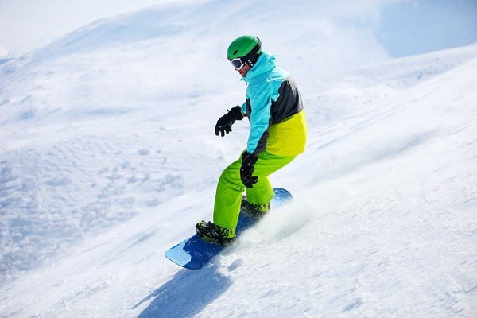

# Snowboarding - Overview
Snowboarding is one of the popular Winter sports all over the world. In this sport, a player rides on a snow covered slope with the help of a specially designed snowboard. Snowboarding also constitutes of different kinds of styles and tricks. It’s been a part of Winter Olympics since 1998.

In this sport, players perform one by one based on the category and style of the sport. Boarding tricks and surfaces vary from type to type. In all types, the score awarded on the basis of degree of difficulty, efficiency in performing the skills, and creativity. The player who gets the highest score is declared as the winner.

## A Brief History of Snowboarding
Modern snowboarding was originated in USA in the year 1965 by Sherman Poppen who invented a toy for his daughter by fastening the two skis together with a rope attached at one end for better control. Because of its increasing popularity among his daughter’s friends, he licensed the idea to Brunswick Corporation, who later on sold about a million boards over the next decade.

Around the 1970s, Poppen organized many snowboarding events that attracted the attention of many people around the country. National Snurfing Championship held at Muskegon State Park, Muskego was the first snowboarding championship to offer prize money. In 1979, Jake Burton Carpenter started participating in competitions with a snowboard designed by himself which was considered as the first snowboard of modern snowboarding.

The first World Championship halfpipe competition was held at Soda Springs, California in 1983 and in 1985, the first Snowboarding World Cup was held at Zürs, Austria. In 1990, the International Snowboard Federation (ISF) was formed to work as the international governing body of snowboarding. It was included in the Olympic Games for the first time at 1998 Winter Olympic Games in Nagano, Japan.

## Participating Countries
Even though it has a lot of similarity with other extreme sports like skateboarding, surfing, skiing, snowboarding has got a worldwide fan base because of its unique styles and categories. Initially started in USA, it is now played all over the world both as a sport and a recreational activity. Different movies and magazines based on the sport further enhanced its popularity.

Some of the countries where snowboarding is very much popular are USA, Australia, Norway, France, Canada, Switzerland, Finland, New Zealand, and Chile.

[Previous Page](../snowboarding/index.md) [Next Page](../snowboarding/snowboarding_equipment.md) 
