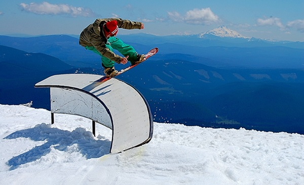
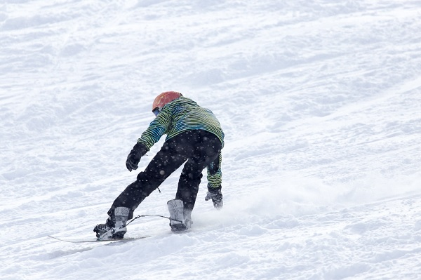

# Snowboarding - Playing Environment
Depending on the type of snowboarding, different types of surfaces are used. In case of freestyle and jibbing, mostly skateparks and halfpipe surfaces are used. In case of alpine snowboarding, a special designed race course is created. A brief idea about these surface areas is as follows −

## Freestyle Snowboarding
In case of freestyle snowboarding, the snowboarders mostly use skate parks as the playing environment. The basic surfaces used are metal rails, logs, boxes, stairs etc. There are no certain specifications about the surfaces in case of jibbing and free style snowboarding.

## Halfpipe Snowboarding
For halfpipe snowboarding, players use a halfpipe surface which looks like the bottom half of a pipe with two sides covered with walls and the middle sloppy ramp surface filled with snow for the ride. The walls on both side must have a height between 8-23 feet.

In case of skateboarding, the halfpipe surface used is basically made of wood or cement, here the surface will be completely made of snow or partially with a coating of snow over the basic surface.

## Alpine Snowboarding
In case of alpine snowboarding, the playing environment used is called **piste** and it comprises of a landscape above 1200 m and is covered with snow. The landscape is basically a slope structured area. For the race, different paths are drawn over the landscape with turns and slopes over the course.

Usually the **pistes** have groomed and symmetric surfaces without any unevenness which is achieved by running a snowcat over the **piste**. Based on the degree of difficulty in riding over these slope surfaces, different colours are used. Usually in all regions, green is used to denote the easiest slopes whereas black colour is used for the expert level slopes.

[Previous Page](../snowboarding/snowboarding_equipment.md) [Next Page](../snowboarding/how_to_play_snowboarding.md) 
