# Snowboarding - Quick Guide
# Snowboarding - Overview
Snowboarding is one of the popular Winter sports all over the world. In this sport, a player rides on a snow covered slope with the help of a specially designed snowboard. Snowboarding also constitutes of different kinds of styles and tricks. It’s been a part of Winter Olympics since 1998.

In this sport, players perform one by one based on the category and style of the sport. Boarding tricks and surfaces vary from type to type. In all types, the score awarded on the basis of degree of difficulty, efficiency in performing the skills, and creativity. The player who gets the highest score is declared as the winner.

## A Brief History of Snowboarding
Modern snowboarding was originated in USA in the year 1965 by Sherman Poppen who invented a toy for his daughter by fastening the two skis together with a rope attached at one end for better control. Because of its increasing popularity among his daughter’s friends, he licensed the idea to Brunswick Corporation, who later on sold about a million boards over the next decade.

Around the 1970s, Poppen organized many snowboarding events that attracted the attention of many people around the country. National Snurfing Championship held at Muskegon State Park, Muskego was the first snowboarding championship to offer prize money. In 1979, Jake Burton Carpenter started participating in competitions with a snowboard designed by himself which was considered as the first snowboard of modern snowboarding.

The first World Championship halfpipe competition was held at Soda Springs, California in 1983 and in 1985, the first Snowboarding World Cup was held at Zürs, Austria. In 1990, the International Snowboard Federation (ISF) was formed to work as the international governing body of snowboarding. It was included in the Olympic Games for the first time at 1998 Winter Olympic Games in Nagano, Japan.

## Participating Countries
Even though it has a lot of similarity with other extreme sports like skateboarding, surfing, skiing, snowboarding has got a worldwide fan base because of its unique styles and categories. Initially started in USA, it is now played all over the world both as a sport and a recreational activity. Different movies and magazines based on the sport further enhanced its popularity.

Some of the countries where snowboarding is very much popular are USA, Australia, Norway, France, Canada, Switzerland, Finland, New Zealand, and Chile.

# Snowboarding - Equipment
Besides normal sport equipment, player also use different safety equipment in order to avoid injuries. The major equipment that is needed for this sport is the snowboard. Some basic details of the equipment used in this sport are as follows −

## Snowboard
Snowboards are the basic equipment for snowboarding and are used for sliding over the snow filled surface. Usually the snowboard is made of hard wood core that is sandwiched between multiple layers of fibre glass. Other elements like carbon fibre, Kevlar, aluminium are also used in the making of a modern snowboard.

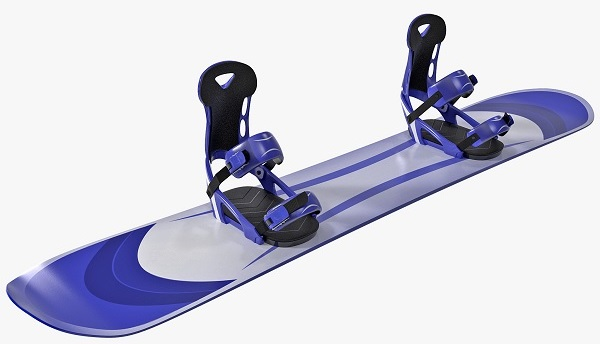

The nose and tail of the board are curled in upward direction in order to ensure flawless movement on even or uneven snow. There are two different ways to design the base of the board which are **extruded** and **sintered.**

   * **Extruded Base** − In case of extruded base, plastic based materials are normally melted and molded in to the desired form.
   * **Sintered Base** − In case of sintered base, the plastic based materials are first powdered and then are molded to the desired form using heat and pressure. Snowboards with sintered bases are much faster than boards with extruded base because of its ability to absorb wax which greatly reduces the friction between the board and the surface.

Based on different variants of the sport and the surface used, different types of snowboards are used. Some of them are −

   * **Freestyle board** − In case of freestyle snowboarding, the boards used are in mirror image of each other along the lateral axis. These boards are mostly used on surfaces like metal rails, logs, boxes, etc.
   * **Free ride boards** − These boards are typically longer in length than freestyle boards. These boards are typically directional and has a pointed tip suitable to be placed along the direction of motion. These kinds of boards can be used on any surface starting from **backcountry riding**, to **extreme big-mountain descents**.
   * **Alpine boards** − Alpine boards or racing boards are long, narrow, and rigid in shape and similar to free ride boards They are also typically directional and are specially designed to excel in groomed slopes. The narrow shape helps the rider to perform better during the race. Mostly hard plastic boots are ridden over it.

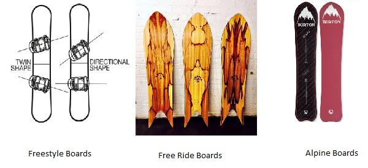

## Snowboarding Boots
The boots used in snowboarding are generally soft plastic boots except in case of alpine snowboarding, where hard plastic boots are used. The primary functionality of these boots is to pass the rider’s motion energy to the snowboard. Based on different designs, generally three types of boots are used which are **standard boots, step-in boots**, and hard boots.

   * **Standard Boots** − No part of the boot is connected to the board. Most of the applied pressure is achieved through the binding.
   * **Step-in Boots** − In these boots, metal claps are there below the boot to attach it to the step-in bindings over the board.
   * **Hard Boots** − The hard boots use special bindings and are mostly used in case of alpine snowboarding for better control over the board during the racing.

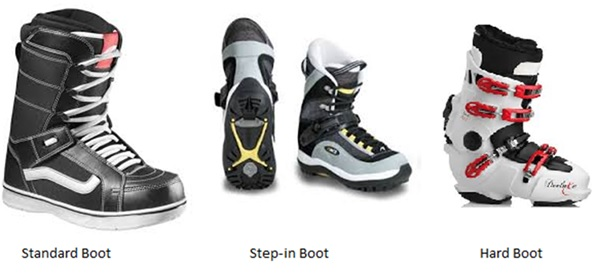

## Snowboard Bindings
These are specially designed equipment and are attached to the snowboard. The major functionality of these bindings is to hold the boot of the rider in proper place in order to efficiently transfer the rider’s force into the motion of the board. Based on their characteristics, there are three types of bindings which are **strap-in, step-in**, and **hybrid** bindings.

   * **Strap Bindings** − In strap bindings, people use boots with thick flexible sole and padded uppers. These shoes are held on the board using two padded buckle straps for better grip over the shoe. These straps are tightly fitted over different parts of the shoe to distribute pressure. Normally two strap bindings are used, but in some cases, people use three strap bindings.
   * **Step-in Bindings** − Step-in bindings were improvised in order to provide better control than strap binding. Here the riders use a specially designed step-in boots and place their foot over the step-in binding.
   * **Hybrid Bindings** − Hybrid designs are mostly used in case of freestyle and recreational riders because of the minimum risk involved with it. It is very much similar to strap-in bindings. But the foot of the rider enters the bindings through the back side then flipped up and tightened with a clamp to give a proper grip to the rider.

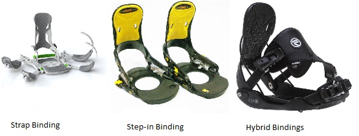

# Snowboarding - Playing Environment
Depending on the type of snowboarding, different types of surfaces are used. In case of freestyle and jibbing, mostly skateparks and halfpipe surfaces are used. In case of alpine snowboarding, a special designed race course is created. A brief idea about these surface areas is as follows −

## Freestyle Snowboarding
In case of freestyle snowboarding, the snowboarders mostly use skate parks as the playing environment. The basic surfaces used are metal rails, logs, boxes, stairs etc. There are no certain specifications about the surfaces in case of jibbing and free style snowboarding.

## Halfpipe Snowboarding
For halfpipe snowboarding, players use a halfpipe surface which looks like the bottom half of a pipe with two sides covered with walls and the middle sloppy ramp surface filled with snow for the ride. The walls on both side must have a height between 8-23 feet.

In case of skateboarding, the halfpipe surface used is basically made of wood or cement, here the surface will be completely made of snow or partially with a coating of snow over the basic surface.

## Alpine Snowboarding
In case of alpine snowboarding, the playing environment used is called **piste** and it comprises of a landscape above 1200 m and is covered with snow. The landscape is basically a slope structured area. For the race, different paths are drawn over the landscape with turns and slopes over the course.

Usually the **pistes** have groomed and symmetric surfaces without any unevenness which is achieved by running a snowcat over the **piste**. Based on the degree of difficulty in riding over these slope surfaces, different colours are used. Usually in all regions, green is used to denote the easiest slopes whereas black colour is used for the expert level slopes.

# How to Play Snowboarding?
Since its invention, Snowboarding has gone through a lot of changes and improvisations. Based on the modern snowboarding, different variants have been invented which are **Jibbing, Alpine, Freestyle, Snowboard Racing** where all of these types differ from each other in case of equipment and the bases used as the snowboarding surface. These snowboarding styles are described below.

## Jibbing
Jibbing is also known as **Cruising** in which the rider rides on nonstandard surfaces and performs different tricks. In case of jibbing, the players mostly ride and slide above surfaces that are mostly other than snow. These surfaces can be boxes, metal rails, logs, benches, rocks etc. Basically the rider has to ride on anything that comes in his/her way. It is mostly performed in skate parks.

## Freestyle Snowboarding
In case of freestyle snowboarding, the more importance is given to the tricks performed rather than the surfaces. The players have to ride on a snowboard on any of the surfaces that comes along the way which can be a log, rock, metal rails, or boxes.

These surfaces can be either manmade or natural. Freestyle snowboarding can be performed in a skate park or in natural environment. There are different types of freestyle snowboarding based on the surfaces used.

## Halfpipe Snowboarding
Halfpipe snowboarding is one of the most popular formats of snowboarding. Here the surface used has the shape of a half pipe. It is a semi-circular surface with two sides covered with walls and the middle sloppy ramp surface is filled with snow for the ride.

The players start at one edge of the slope, slide down to and from different sides perform different tricks while moving from one side to another and being in the air. The height of the walls of the half pipe lies between 8 feet to 23 feet.

## Slopestyle Snowboarding
In case of slope style snowboarding, the surface used is a terrain park. Here, the terrains are filled with different manmade surfaces which can be boxes, logs, metal rails, jibs etc. Here the basis of scoring is the surface chosen and efficiency of the tricks performed.

In order to win the slope style competition, the player not only has to go for hardest surfaces, he/she must perform all the tricks smoothly on the chosen surface. Slope style snowboarding competitions are mostly held at specially built surfaces in mountain areas.

## Alpine Snowboarding
In case of alpine snowboarding, the sport takes place in a hard packed snowed surface. Also called as carving, here the players have to mostly focus on carving blinked turns similar to surfing and skiing. Here the players wear hard plastic boots and then place the board below their feet with the front toe being in line with the snowboard tip.

The snowboard used in alpine snowboarding is narrower in comparison to the snowboards of other variants. Here the players tilt the snowboard high on the edge while leaning in turns till his/her hand touches the snow, which is known as carving. Carving is helpful in maintaining the speed as well as proper balance in case of alpine. Speed is a major plus in this variant and there is very less or zero jumping throughout the race.

## Snowboard Racing
In case of freestyle and alpine, the scoring is based on the efficiency and smoothness of the tricks performed by the rider. In case of snowboard racing, players race against each other on a narrow snow filled surface having turns. The players perform different tricks such as jumps, berms, roller, steep etc. in order to stay in control while racing. One of the major forms of snowboard racing is called snowboard cross.

In case of snowboard cross competition, there are two rounds which are time trial round and knock out round. In case of knock out round, a certain number of players qualify for the next round while other players are eliminated from the race. Once the knock down round is over, it is followed by the time trial round where players either ride alone on a singular track or parallel adjacent tracks. In this round, the player to complete the race in fastest time is declared winner.

# Snowboarding - Tricks
Based on the variant and surface used, different tricks are performed by the players in case of snowboarding competitions. More the degree of difficulty of the trick, more score will be given based on the smoothness of the execution of the trick. Most of the snowboarding tricks are very much similar to that of skateboarding. Some of the tricks are as follows −

## Straight Air Tricks
The straight air tricks are as follows −

   * **Ollie** − Ollie is considered as one of the basic tricks where the rider has to jump with the snowboard sticking to his/her shoes. While jumping upward, the player needs to push the back tail of the board with his/her back foot by striking it against the surface which will raise the front part of the board known as popping. While on air, the player needs to use his front leg to guide the board or balance the board by pushing it using the front leg which will make it parallel to the ground and then land safely.
   * **Nollie** − The reverse to ollie is called nollie or nose ollie where the player has to use his front foot to pop the board while using his back foot to control and guide the board in air to land safely.
   * **Switch Ollie** − In case of switch ollie, the player has to perform an ollie while switching his position on the snowboard reverse his both feet positions.
   * **Fakie Ollie** − In case of fakie ollie, first the player has to perform ollie and while performing ollie, he has to switch his foot position. At the same time he/she has to spring off the board in direction of his switch.
   * **Air to Fakie** − This trick is mostly performed on a half-pipe surface where first the player moves on the half pipe surface and once he is in vertical position, he needs to re-enter the surface while performing a fakie without any switch.

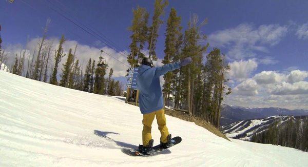

## Grab Tricks
The grab tricks are as follows −

   * **Indy Grab** − In this trick, when a player is in the air, he has to bend down on the board and grab the toe edge of the board between his / her two legs or mostly the middle edge of the board using his/her back hand at that moment. Before landing, he/she has to leave the board.
   * **Frontside Grab** − In this trick, when a player is in the air, he has to bend down on the board and grab the toe edge between the binding of the board using his/her trailing hand at that moment. Before landing, he has to leave the board.
   * **Tail Grab** − In this trick, when a player is in the air, he has to hold the tail of the snowboard using his/her trailing hand. It can be achieved by pushing the board using the front leg while bending down the back leg in airborne stage.
   * **One-Two** − In this trick, when a player is in the air, he has to grab the heel edge behind his back foot using front hand.
   * **Bloody Dracula** − In this trick, when a player is in the air, he has to grab the tail of the snowboard using both hands.
   * **Mute Grab** − In this trick, when a player is in the air, he has to bend down on the board and grab the toe edge of the board between his two legs. He also has to grab the the middle edge of the board using his front hand at that moment.
   * **Cannonball** − In this trick, when a player is in the air, he has to grab both the nose as well as the tail of the board.
   * **Chicken Salad** − In this trick, when a player is in the air, he has to grab the heel edge of the board using his/her front hand which should be between the two legs.
   * **Gorilla Grab** − In this trick, when a player is the air, he has to hold the toe side edge of the board using both of his/ her hand.
   * **Nose Grab** − In this trick, when a player is in the air, he has to hold the nose of the snowboard using his/her front hand. It can be achieved by pushing the board using the back leg while bending down the front leg while being in air.
   * **Rocket Grab** − In this trick, when a player is in the air, he has to hold the nose of the snowboard using both hands. Here while the rear leg stays boned, the front leg gets pulled up.
   * **Melon Grab** − In this trick, when a player is in the air, he has to grab the heel edge between the bindings using his front hand.
   * **Method Grab** − In this trick, when a player is in the air, he has to bend his knees to lift the board at his back side and then he has to grab the heel edge of the board using his front hand.
   * **Stalefish Grab** − In this trick, when a player is in the air, he has to hold the backside heel edge of the snowboard between the bindings using the back hand.
   * **Roasted Beef Grab** − In this trick, when a player is in the air, he has to grab the heel edge through his legs using his back hand.
   * **Mute Grab** − In this trick, when a player is in the air, he has to grab the toe edge through his legs using his front hand.

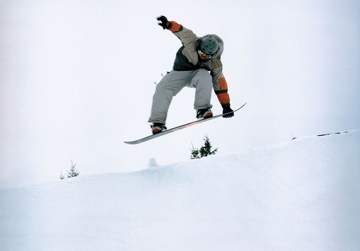

## Flipping Tricks
The flipping tricks are as follows −

   * **Back Flip** − In this trick, when a player is in the air he flips in backward direction.
   * **Front Flip** − In this trick, when a player is in the air, he makes a flip in forward direction.
   * **Wild Cat** − In this trick, when a player is in the air, he flips in backward direction with an axis of rotation in a cartwheel-like fashion.
   * **Tame dog** − In this trick, when a player is in the air, he flips in forward direction with an axis of rotation in a cartwheel-like fashion.
   * **Crippler** − Crippler is mostly performed in case of a halfpipe surface. Here once touching the front wall and being in air, the player has to make an inverted 540 degree spin before landing.

## Snowboarding − Scoring
In case of snowboarding competition, the rules vary based on different categories. In case of free style or jibbing, the players perform different tricks over the surfaces. The score depends on the degree of difficulty of those tricks performed, efficiency in performing tricks as well as on creativity. The players have to gain more score to win the sport. In case of alpine snowboarding, the first player to complete the race wins the sport.

# Snowboarding - Rules
Since snowboarding is an extreme sport, accidents and injuries are pretty much likely to happen in it. Mostly in case of Alpine snowboarding, the injury rate is much higher than that of other snowboarding categories.

In order to avoid injuries players are strongly recommended to use different protective equipment like wrist guard and gloves for wrists, helmets to avoid head injuries, locked bindings to avoid knee as well as lower body injuries. Back protection guards that are used during a race during a race to prevent spine and back injuries are a mandatory requirement during the race.

Snowboarders are prohibited from obstructing or preventing other snowboarders during a race which might result in fatal accidents. Players are also prohibited from going outside the boundary lines during a race. During a race, even false starts are discouraged by awarding disquallification.

# Snowboarding - Champions
The International Snowboarding Federation (ISF) works as the international governing body for snowboarding worldwide. It was founded by five nations and 120 racers in 1990. International Snowboarding Federation works as the international governing body for winter sports worldwide and is recognized as the official governing body of snowboarding by the Olympic committee.

Some of the major snowboarding events organized worldwide are as follows −

   * FIS Snowboard World Cup
   * FIS Snowboarding World Championships
   * Winter X Games
   * Winter Dew Tour

Let us now discuss briefly about some of the champions who have made their mark in Snowboarding.

## Shaun Roger White
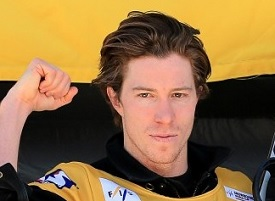

Shaun Roger White is from San Diego, California, U.S who is considered as one of the best snowboarders of present era.

He has won two golds at the Olympic Games in the year 2006 and 2010 in halfpipe category.

He also holds the record of winning maximum number of medals at the X Games which includes 13 golds, 2 silvers and 2 bronzes.

He also holds the record for the highest score in the men's halfpipe at the Winter Olympics.

## Terje Håkonsen
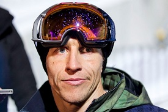

Terje Håkonsen is from Vinje, Norway and is considered as the most influential snowboarder of all time. He has won three golds in the International Snowboarding Federation (ISF) World Championship in halfpipe in 1993, 1995 and 1997 and also has won the European Championship in halfpipe in 1991, 1992, 1993, 1994 and 1997.

He has won the US Open Halfpipe three times in the year 1992, 1993 and 1995 and the Mt. Baker Banked Slalom seven times in 1995, 1996, 1998, 2000, 2003, 2004 and 2012.

He is still active in the sport and occasionally takes part in competitions.

## Danny Kass
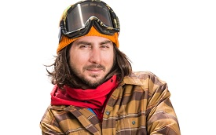

Danny Kass is from New Jersey, United States and is a professional snowboarder. He has won two silvers at the Olympic Games in the year 2002 and 2006 in halfpipe category.

He also has won one gold and two silvers in halfpipe category, two silvers in slopestyle category, and one bronze in superpipe category at the X Games.

Presently, along with his brother, he has opened Grenade Gloves, which specializes in snowboarding gloves and other extreme sports accessories.

## Seth Benjamin Wescott
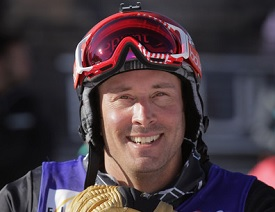

Seth Benjamin Wescott is from Durham, North Carolina and is a professional snowboarder. He has won two golds at the Olympic Games in the year 2006 and 2010 in snowboard cross discipline.

He also has won one gold in 2005 and three silvers in 2003, 2007, and 2011 at the Snowboarding World Championship in snowboard cross discipline.

He also has won one bronze in 2007 and three silvers in 2004, 2005, and 2010 at the Winter X Games in snowboard cross discipline.

## Torah Jane Bright

Torah Jane Bright is from Cooma, New South Wales and is a professional snowboarder and Australia's most successful Winter Olympics athlete.

She has won one gold and one silver at the Olympic Games in the year 2010 and 2014 in halfpipe category.

She also has won two golds in 2007 and 2009, two silvers in 2006 and 2008, and one bronze in 2015 at the Winter X Games in superpipe discipline. She also has won one bronze at the Snowboarding World Championship in the year 2013.

## Hannah Teter
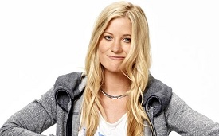

Hannah Teter is from Belmont, Vermont, U.S. and is a professional snowboarder. She has won one gold and one silver at the Olympic Games in the year 2006 and 2010 in halfpipe category.

She also has won one gold in 2003 and five bronzes in 2004, 2005, 2009, 2010, 2012 in superpipe category and one bronze in dual slalom category in 2016 at the Winter X Games. She also has won one bronze at the Snowboarding World Championship in 2005.

## Dominique Maltais
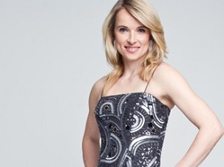

Dominique Maltais is from Petite-Rivière-Saint- François, Quebec and is a professional snowboarder. She has won one bronze and one silver at the Olympic Games in the year 2006 and 2014 respectively in snowboard cross category.

She also has won one gold and one silver at the Winter X Games in the year 2012 and 2015 respectively in snowboard cross category.

She also has won one bronze and one silver at the FIS Snowboarding World Championships in the year 2011 and 2013 respectively.

## Kelly Clark
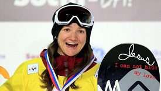

Kelly Clark is from Dover, Vermont, U.S. and is a professional snowboarder. She has won one gold in 2002 and two bronzes in 2010 and 2014 at the Olympic Games in halfpipe category.

She also has won five golds, four silvers, and one bronze at the Winter X Games in superpipe category.

She also has won one gold and three silvers at the Winter Dew Tour in superpipe discipline and one gold in New Zealand Winter Games in the year 2013 in halfpipe discipline.

## Gretchen Elisabeth Bleiler
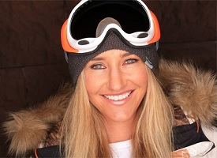

Gretchen Elisabeth Bleiler is from Toledo, Ohio and is a professional snowboarder. She has won one silver at the Olympic Games in the year 2006 in halfpipe category.

She also has won four golds in 2003, 2005, 2008, and 2010 and one silver in 2007 at the Winter X Games in superpipe category.

She also has won two golds at the Winter Dew Tour in the year 2008 and 2009 in superpipe discipline and one bronze in New Zealand Winter Games in the year 2013 in halfpipe discipline.

[Previous Page](../snowboarding/snowboarding_champions.md) [Next Page](../snowboarding/snowboarding_useful_resources.md) 
