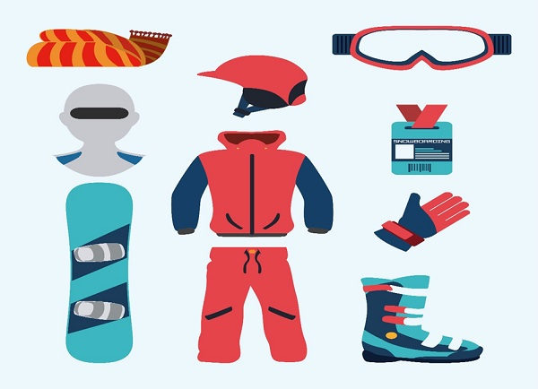

# Snowboarding - Rules
Since snowboarding is an extreme sport, accidents and injuries are pretty much likely to happen in it. Mostly in case of Alpine snowboarding, the injury rate is much higher than that of other snowboarding categories.

In order to avoid injuries players are strongly recommended to use different protective equipment like wrist guard and gloves for wrists, helmets to avoid head injuries, locked bindings to avoid knee as well as lower body injuries. Back protection guards that are used during a race during a race to prevent spine and back injuries are a mandatory requirement during the race.

Snowboarders are prohibited from obstructing or preventing other snowboarders during a race which might result in fatal accidents. Players are also prohibited from going outside the boundary lines during a race. During a race, even false starts are discouraged by awarding disquallification.

[Previous Page](../snowboarding/snowboarding_tricks.md) [Next Page](../snowboarding/snowboarding_champions.md) 
