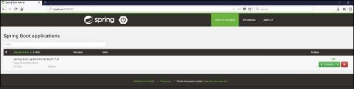
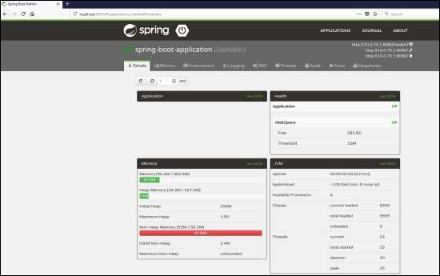

# Spring Boot - Admin Client
For monitoring and managing your microservice application via Spring Boot Admin Server, you should add the Spring Boot Admin starter client dependency and point out the Admin Server URI into the application properties file.

**Note** − For monitoring an application, you should enable the Spring Boot Actuator Endpoints for your Microservice application.

First, add the following Spring Boot Admin starter client dependency and Spring Boot starter actuator dependency in your build configuration file.

Maven users can add the following dependencies in your pom.xml file −

```
<dependency>
   <groupId>de.codecentric</groupId>
   <artifactId>spring-boot-admin-starter-client</artifactId>
   <version>1.5.5</version>
</dependency>
<dependency>
   <groupId>org.springframework.boot</groupId>
   <artifactId>spring-boot-starter-actuator</artifactId>
</dependency>
```
Gradle users can add the following dependencies in your build.gradle file.

```
compile group: 'de.codecentric', name: 'spring-boot-admin-starter-client', version: '1.5.5'
compile('org.springframework.boot:spring-boot-starter-actuator')
```
Now, add the Spring Boot Admin Server URL into your application properties file.

For properties file users, add the following properties in the application.properties file.

```
spring.boot.admin.url = http://localhost:9090/
```
For YAML users, add the following property in application.yml file.

```
spring:
   boot:
      admin:
         url: http://localhost:9000/
```
Now, create an executable JAR file, and run the Spring Boot application by using the following Maven or Gradle commands.

For Maven, you can use the command as shown −

```
mvn clean install
```
After “BUILD SUCCESS”, you can find the JAR file under the target directory.

For Gradle, you can use the command as shown −

```
gradle clean build
```
After “BUILD SUCCESSFUL”, you can find the JAR file under the build/libs directory.

Now, run the JAR file by using the command shown −

```
java –jar <JARFILE>
```
Now, the application has started on the Tomcat port 9090 as shown −


Now hit the following URL from your web browser and see your spring Boot application is registered with Spring Boot Admin Server.

**http://localhost:9090/**



Now, click the **Details** button and the see the actuator endpoints in Admin Server UI.




[Previous Page](../spring_boot/spring_boot_admin_server.md) [Next Page](../spring_boot/spring_boot_enabling_swagger2.md) 
