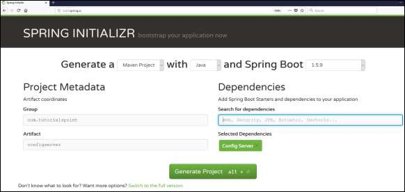
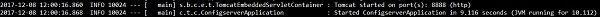
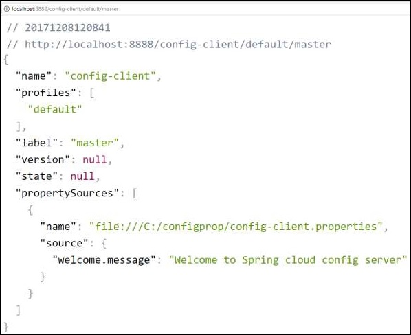

# Spring Boot - Cloud Configuration Server
Spring Cloud Configuration Server is a centralized application that manages all the application related configuration properties. In this chapter, you will learn in detail about how to create Spring Cloud Configuration server.

## Creating Spring Cloud Configuration Server
First, download the Spring Boot project from the Spring Initializer page and choose the Spring Cloud Config Server dependency. Observe the screenshot given below −



Now, add the Spring Cloud Config server dependency in your build configuration file as explained below −

Maven users can add the below dependency into the pom.xml file.

```
<dependency>
   <groupId>org.springframework.cloud</groupId>
   <artifactId>spring-cloud-config-server</artifactId>
</dependency>
```
Gradle users can add the below dependency in your build.gradle file.

```
compile('org.springframework.cloud:spring-cloud-config-server')
```
Now, add the @EnableConfigServer annotation in your main Spring Boot application class file. The @EnableConfigServer annotation makes your Spring Boot application act as a Configuration Server.

The main Spring Boot application class file is given below −

```
package com.tutorialspoint.configserver;

import org.springframework.boot.SpringApplication;
import org.springframework.boot.autoconfigure.SpringBootApplication;
import org.springframework.cloud.config.server.EnableConfigServer;

@SpringBootApplication
@EnableConfigServer
public class ConfigserverApplication {
   public static void main(String[] args) {
      SpringApplication.run(ConfigserverApplication.class, args);
   }
}
```
Now, add the below configuration to your properties file and replace the application.properties file into bootstrap.properties file. Observe the code given below −

```
server.port = 8888
spring.cloud.config.server.native.searchLocations=file:///C:/configprop/
SPRING_PROFILES_ACTIVE=native
```
Configuration Server runs on the Tomcat port 8888 and application configuration properties are loaded from native search locations.

Now, in **file:///C:/configprop/**, place your client application - application.properties file. For example, your client application name is **config-client**, then rename your application.properties file as **config-client.properties** and place the properties file on the path **file:///C:/configprop/**.

The code for config-client properties file is given below −

```
welcome.message = Welcome to Spring cloud config server
```
The complete build configuration file is given below −

Maven users can use **pom.xml** given below −

```
<?xml version = "1.0" encoding = "UTF-8"?>
<project xmlns = "http://maven.apache.org/POM/4.0.0" 
   xmlns:xsi = "http://www.w3.org/2001/XMLSchema-instance"
   xsi:schemaLocation = "http://maven.apache.org/POM/4.0.0 
   http://maven.apache.org/xsd/maven-4.0.0.xsd">
   
   <modelVersion>4.0.0</modelVersion>
   <groupId>com.tutorialspoint</groupId>
   <artifactId>configserver</artifactId>
   <version>0.0.1-SNAPSHOT</version>
   <packaging>jar</packaging>

   <name>configserver</name>
   <description>Demo project for Spring Boot</description>
   <parent>
      <groupId>org.springframework.boot</groupId>
      <artifactId>spring-boot-starter-parent</artifactId>
      <version>1.5.9.RELEASE</version>
      <relativePath/> <!-- lookup parent from repository -->
   </parent>

   <properties>
      <project.build.sourceEncoding>UTF-8</project.build.sourceEncoding>
      <project.reporting.outputEncoding>UTF-8</project.reporting.outputEncoding>
      <java.version>1.8</java.version>
      <spring-cloud.version>Edgware.RELEASE</spring-cloud.version>
   </properties>

   <dependencies>
      <dependency>
         <groupId>org.springframework.cloud</groupId>
         <artifactId>spring-cloud-config-server</artifactId>
      </dependency>
      <dependency>
         <groupId>org.springframework.boot</groupId>
         <artifactId>spring-boot-starter-test</artifactId>
         <scope>test</scope>
      </dependency>
   </dependencies>

   <dependencyManagement>
      <dependencies>
         <dependency>
            <groupId>org.springframework.cloud</groupId>
            <artifactId>spring-cloud-dependencies</artifactId>
            <version>${spring-cloud.version}</version>
            <type>pom</type>
            <scope>import</scope>
         </dependency>
      </dependencies>
   </dependencyManagement>

   <build>
      <plugins>
         <plugin>
            <groupId>org.springframework.boot</groupId>
            <artifactId>spring-boot-maven-plugin</artifactId>
         </plugin>
      </plugins>
   </build>
   
</project>
```
Gradle users can use the build.gradle file given below −

```
<scope>import</scope>
</dependency>
</dependencies>
buildscript {
   ext {
      springBootVersion = '1.5.9.RELEASE'
   }
   repositories {
      mavenCentral()
   }
   dependencies {
      classpath("org.springframework.boot:spring-boot-gradle-plugin:${springBootVersion}")
   }
}
apply plugin: 'java'
apply plugin: 'eclipse'
apply plugin: 'org.springframework.boot'

group = 'com.tutorialspoint'
version = '0.0.1-SNAPSHOT'
sourceCompatibility = 1.8

repositories {
   mavenCentral()
}
ext {
   springCloudVersion = 'Edgware.RELEASE'
}
dependencies {
   compile('org.springframework.cloud:spring-cloud-config-server')
   testCompile('org.springframework.boot:spring-boot-starter-test')
}
dependencyManagement {
   imports {
      mavenBom "org.springframework.cloud:spring-cloud-dependencies:${springCloudVersion}"
   }
}
```
Now, create an executable JAR file, and run the Spring Boot application by using the following Maven or Gradle commands −

For Maven, use the command given below −

```
mvn clean install
```
After “BUILD SUCCESS”, you can find the JAR file under the target directory.

For Gradle, use the command given below −

```
gradle clean build
```
After “BUILD SUCCESSFUL”, you can find the JAR file under the build/libs directory.

Run the JAR file by using the following command −

```
java –jar <JARFILE>
```
Now, the application has started on the Tomcat port 8888 as shown here −



Now hit the URL **http://localhost:8888/config-client/default/master** on your web browser and you can see your config-client application configuration properties as shown here.




[Previous Page](../spring_boot/spring_boot_zuul_proxy_server_and_routing.md) [Next Page](../spring_boot/spring_boot_cloud_configuration_client.md) 
