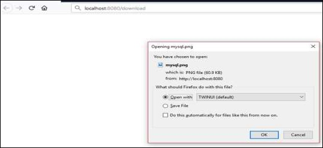

# Spring Boot - File Handling
In this chapter, you will learn how to upload and download the file by using web service.

## File Upload
For uploading a file, you can use **MultipartFile** as a Request Parameter and this API should consume Multi-Part form data value. Observe the code given below −

```
@RequestMapping(value = "/upload", method = RequestMethod.POST, consumes = MediaType.MULTIPART_FORM_DATA_VALUE)

public String fileUpload(@RequestParam("file") MultipartFile file) {
   return null;
}
```
The complete code for the same is given below −

```
package com.tutorialspoint.demo.controller;

import java.io.File;
import java.io.FileOutputStream;
import java.io.IOException;

import org.springframework.http.MediaType;
import org.springframework.web.bind.annotation.RequestMapping;
import org.springframework.web.bind.annotation.RequestMethod;
import org.springframework.web.bind.annotation.RequestParam;
import org.springframework.web.bind.annotation.RestController;
import org.springframework.web.multipart.MultipartFile;

@RestController
public class FileUploadController {
   @RequestMapping(value = "/upload", method = RequestMethod.POST, 
      consumes = MediaType.MULTIPART_FORM_DATA_VALUE)
   
   public String fileUpload(@RequestParam("file") MultipartFile file) throws IOException {
      File convertFile = new File("/var/tmp/"+file.getOriginalFilename());
      convertFile.createNewFile();
      FileOutputStream fout = new FileOutputStream(convertFile);
      fout.write(file.getBytes());
      fout.close();
      return "File is upload successfully";
   }
}
```
## File Download
For file download, you should use InputStreamResource for downloading a File. We need to set the HttpHeader **Content-Disposition** in Response and need to specify the response Media Type of the application.

**Note** − In the following example, file should be available on the specified path where the application is running.

```
@RequestMapping(value = "/download", method = RequestMethod.GET) 
public ResponseEntity<Object> downloadFile() throws IOException  {
   String filename = "/var/tmp/mysql.png";
   File file = new File(filename);
   InputStreamResource resource = new InputStreamResource(new FileInputStream(file));
   HttpHeaders headers = new HttpHeaders();
      
   headers.add("Content-Disposition", String.format("attachment; filename=\"%s\"", file.getName()));
   headers.add("Cache-Control", "no-cache, no-store, must-revalidate");
   headers.add("Pragma", "no-cache");
   headers.add("Expires", "0");
      
   ResponseEntity<Object> 
   responseEntity = ResponseEntity.ok().headers(headers).contentLength(file.length()).contentType(
      MediaType.parseMediaType("application/txt")).body(resource);
      
   return responseEntity;
}
```
The complete code for the same is given below −

```
package com.tutorialspoint.demo.controller;

import java.io.File;
import java.io.FileInputStream;
import java.io.IOException;

import org.springframework.core.io.InputStreamResource;
import org.springframework.http.HttpHeaders;
import org.springframework.http.MediaType;
import org.springframework.http.ResponseEntity;
import org.springframework.web.bind.annotation.RequestMapping;
import org.springframework.web.bind.annotation.RequestMethod;
import org.springframework.web.bind.annotation.RestController;

@RestController
public class FileDownloadController {
   @RequestMapping(value = "/download", method = RequestMethod.GET) 
   public ResponseEntity<Object> downloadFile() throws IOException  {
      String filename = "/var/tmp/mysql.png";
      File file = new File(filename);
      InputStreamResource resource = new InputStreamResource(new FileInputStream(file));
      HttpHeaders headers = new HttpHeaders();
      
      headers.add("Content-Disposition", String.format("attachment; filename=\"%s\"", file.getName()));
      headers.add("Cache-Control", "no-cache, no-store, must-revalidate");
      headers.add("Pragma", "no-cache");
      headers.add("Expires", "0");
      
      ResponseEntity<Object> 
      responseEntity = ResponseEntity.ok().headers(headers).contentLength(
         file.length()).contentType(MediaType.parseMediaType("application/txt")).body(resource);
      
      return responseEntity;
   }
}
```
The main Spring Boot application is given below −

```
package com.tutorialspoint.demo;

import org.springframework.boot.SpringApplication;
import org.springframework.boot.autoconfigure.SpringBootApplication;

@SpringBootApplication
public class DemoApplication {
   public static void main(String[] args) {
      SpringApplication.run(DemoApplication.class, args);
   }
}
```
The code for Maven build – pom.xml is given below −

```
<?xml version = "1.0" encoding = "UTF-8"?>
<project xmlns = "http://maven.apache.org/POM/4.0.0" 
   xmlns:xsi = "http://www.w3.org/2001/XMLSchema-instance"
   xsi:schemaLocation = "http://maven.apache.org/POM/4.0.0 
   http://maven.apache.org/xsd/maven-4.0.0.xsd"> 
   
   <modelVersion>4.0.0</modelVersion>
   <groupId>com.tutorialspoint</groupId>
   <artifactId>demo</artifactId>
   <version>0.0.1-SNAPSHOT</version>
   <packaging>jar</packaging>
   <name>demo</name>
   <description>Demo project for Spring Boot</description>

   <parent>
      <groupId>org.springframework.boot</groupId>
      <artifactId>spring-boot-starter-parent</artifactId>
      <version>1.5.8.RELEASE</version>
      <relativePath/> 
   </parent>

   <properties>
      <project.build.sourceEncoding>UTF-8</project.build.sourceEncoding>
      <project.reporting.outputEncoding>UTF-8</project.reporting.outputEncoding>
      <java.version>1.8</java.version>
   </properties>

   <dependencies>
      <dependency>
         <groupId>org.springframework.boot</groupId>
         <artifactId>spring-boot-starter-web</artifactId>
      </dependency>

      <dependency>
         <groupId>org.springframework.boot</groupId>
         <artifactId>spring-boot-starter-test</artifactId>
         <scope>test</scope>
      </dependency>
   </dependencies>

   <build>
      <plugins>
         <plugin>
            <groupId>org.springframework.boot</groupId>
            <artifactId>spring-boot-maven-plugin</artifactId>
         </plugin>
      </plugins>
   </build>
   
</project>
```
The code for Gradle Build – build.gradle is given below −

```
buildscript {
   ext {
      springBootVersion = '1.5.8.RELEASE'
   }
   repositories {
      mavenCentral()
   }
   dependencies {
      classpath("org.springframework.boot:spring-boot-gradle-plugin:${springBootVersion}")
   }
}

apply plugin: 'java'
apply plugin: 'eclipse'
apply plugin: 'org.springframework.boot'

group = 'com.tutorialspoint'
version = '0.0.1-SNAPSHOT'
sourceCompatibility = 1.8

repositories {
   mavenCentral()
}
dependencies {
   compile('org.springframework.boot:spring-boot-starter-web')
   testCompile('org.springframework.boot:spring-boot-starter-test')
}
```
Now you can create an executable JAR file, and run the Spring Boot application by using the Maven or Gradle commands given below −

For Maven, use the command given below −

```
mvn clean install
```
After “BUILD SUCCESS”, you can find the JAR file under target directory.

For Gradle, you ca use the command shown below −

```
sgradle clean build
```
After “BUILD SUCCESSFUL”, you can find the JAR file under build/libs directory.

Now, run the JAR file by using the following command −

```
java –jar <JARFILE>
```
This will start the application on the Tomcat port 8080 as shown below −


Now hit the below URL’s in POSTMAN application and you can see the output as shown below −

File upload − **http://localhost:8080/upload**



File download − **http://localhost:8080/upload**


[Previous Page](../spring_boot/spring_boot_rest_template.md) [Next Page](../spring_boot/spring_boot_service_components.md) 
