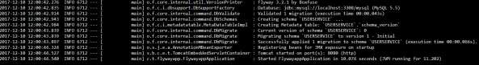
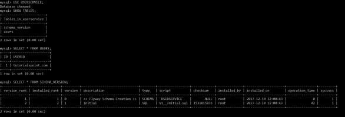

# Spring Boot - Flyway Database
Flyway is a version control application to evolve your Database schema easily and reliably across all your instances. To learn more about Flyway, you can use the link − [www.flywaydb.org](https://flywaydb.org/) 

Many software projects use relational databases. This requires the handling of database migrations, also often called schema migrations.

In this chapter, you are going to learn in detail about how to configure Flyway database in your Spring Boot application.

## Configuring Flyway Database
First, download the Spring Boot project from Spring Initializer page [www.start.spring.io](https://start.spring.io/)  and choose the following dependencies −

   * Spring Boot Starter Web
   * Flyway
   * MySQL
   * JDBC

Maven users can add the following dependencies in pom.xml file.

```
<dependency>
   <groupId>org.flywaydb</groupId>
   <artifactId>flyway-core</artifactId>
</dependency>

<dependency>
   <groupId>org.springframework.boot</groupId>
   <artifactId>spring-boot-starter-jdbc</artifactId>
</dependency>

<dependency>
   <groupId>org.springframework.boot</groupId>
   <artifactId>spring-boot-starter-web</artifactId>
</dependency>

<dependency>
   <groupId>mysql</groupId>
   <artifactId>mysql-connector-java</artifactId>
</dependency>

<dependency>
   <groupId>org.springframework.boot</groupId>
   <artifactId>spring-boot-starter-test</artifactId>
   <scope>test</scope>
</dependency>
```
Gradle users can add the following dependencies in build.gradle file.

```
compile('org.flywaydb:flyway-core')
compile('org.springframework.boot:spring-boot-starter-jdbc')
compile('org.springframework.boot:spring-boot-starter-web')
compile('mysql:mysql-connector-java')
```
In application properties, we need to configure the database properties for creating a DataSource and also flyway properties we need to configure in application properties.

For properties file users, add the below properties in the application.properties file.

```
spring.application.name = flywayapp  

spring.datasource.driverClassName = com.mysql.jdbc.Driver
spring.datasource.url = jdbc:mysql://localhost:3306/USERSERVICE?autoreconnect=true
spring.datasource.username = root
spring.datasource.password = root
spring.datasource.testOnBorrow = true
spring.datasource.testWhileIdle = true
spring.datasource.timeBetweenEvictionRunsMillis = 60000
spring.datasource.minEvictableIdleTimeMillis = 30000
spring.datasource.validationQuery = SELECT 1
spring.datasource.max-active = 15
spring.datasource.max-idle = 10
spring.datasource.max-wait = 8000

flyway.url = jdbc:mysql://localhost:3306/mysql
flyway.schemas = USERSERVICE
flyway.user = root
flyway.password = root
```
YAML users can add the following properties in application.yml file.

```
spring:
   application:
      name: flywayapp  
   datasource: 
      driverClassName: com.mysql.jdbc.Driver
      url: "jdbc:mysql://localhost:3306/USERSERVICE?autoreconnect=true"
      password: "root"
      username: "root"
      testOnBorrow: true
      testWhileIdle: true
      timeBetweenEvictionRunsMillis: 60000
      minEvictableIdleTimeMillis: 30000
      validationQuery: SELECT 1
      max-active: 15
      max-idle: 10
      max-wait: 8000
flyway:
   url: jdbc:mysql://localhost:3306/mysql
   schemas: USERSERVICE
   user: "root"
   password: "root"
```
Now, create a SQL file under the **src/main/resources/db/migration** directory. Name the SQL file as “V1__Initial.sql”

```
CREATE TABLE USERS (ID INT AUTO_INCREMENT PRIMARY KEY, USERID VARCHAR(45));
INSERT INTO USERS (ID, USERID) VALUES (1, 'tutorialspoint.com');
```
The main Spring Boot application class file code is given below −

```
package com.tutorialspoint.flywayapp;

import org.springframework.boot.SpringApplication;
import org.springframework.boot.autoconfigure.SpringBootApplication;

@SpringBootApplication
public class FlywayappApplication {
   public static void main(String[] args) {
      SpringApplication.run(FlywayappApplication.class, args);
   }
}
```
The complete build configuration file is given below.

**Maven – pom.xml**

```
<?xml version = "1.0" encoding = "UTF-8"?>
<project xmlns = "http://maven.apache.org/POM/4.0.0" 
   xmlns:xsi = "http://www.w3.org/2001/XMLSchema-instance"
   xsi:schemaLocation = "http://maven.apache.org/POM/4.0.0 
   http://maven.apache.org/xsd/maven-4.0.0.xsd">
   
   <modelVersion>4.0.0</modelVersion>
   <groupId>com.tutorialspoint</groupId>
   <artifactId>flywayapp</artifactId>
   <version>0.0.1-SNAPSHOT</version>
   <packaging>jar</packaging>
   <name>flywayapp</name>
   <description>Demo project for Spring Boot</description>

   <parent>
      <groupId>org.springframework.boot</groupId>
      <artifactId>spring-boot-starter-parent</artifactId>
      <version>1.5.9.RELEASE</version>
      <relativePath/> <!-- lookup parent from repository -->
   </parent>

   <properties>
      <project.build.sourceEncoding>UTF-8</project.build.sourceEncoding>
      <project.reporting.outputEncoding>UTF-8</project.reporting.outputEncoding>
      <java.version>1.8</java.version>
   </properties>

   <dependencies>
      <dependency>
         <groupId>org.flywaydb</groupId>
         <artifactId>flyway-core</artifactId>
      </dependency>
      
      <dependency>
         <groupId>org.springframework.boot</groupId>
         <artifactId>spring-boot-starter-jdbc</artifactId>
      </dependency>
      
      <dependency>
         <groupId>org.springframework.boot</groupId>
         <artifactId>spring-boot-starter-web</artifactId>
      </dependency>

      <dependency>
         <groupId>mysql</groupId>
         <artifactId>mysql-connector-java</artifactId>
      </dependency>
   </dependencies>

   <build>
      <plugins>
         <plugin>
            <groupId>org.springframework.boot</groupId>
            <artifactId>spring-boot-maven-plugin</artifactId>
         </plugin>
      </plugins>
   </build>
   
</project>
```
**Gradle – build.gradle**

```
buildscript {
   ext {
      springBootVersion = '1.5.9.RELEASE'
   }
   repositories {
      mavenCentral()
   }
   dependencies {
      classpath("org.springframework.boot:spring-boot-gradle-plugin:${springBootVersion}")
   }
}

apply plugin: 'java'
apply plugin: 'eclipse'
apply plugin: 'org.springframework.boot'

group = 'com.tutorialspoint'
version = '0.0.1-SNAPSHOT'
sourceCompatibility = 1.8

repositories {
   mavenCentral()
}
dependencies {
   compile('org.flywaydb:flyway-core')
   compile('org.springframework.boot:spring-boot-starter-jdbc')
   compile('org.springframework.boot:spring-boot-starter-web')
   compile('mysql:mysql-connector-java')
   testCompile('org.springframework.boot:spring-boot-starter-test')
}
```
You can create an executable JAR file, and run the Spring Boot application by using the Maven or Gradle commands given below −

For Maven, you can use the command shown here −

```
mvn clean install
```
After “BUILD SUCCESS”, you can find the JAR file under the target directory.

For Gradle, you can use the command shown here −

```
gradle clean build
```
After “BUILD SUCCESSFUL”, you can find the JAR file under the build/libs directory.

Now, run the JAR file by using the following command −

```
java –jar <JARFILE>
```
Now, Tomcat started on the port 8080 and in the console window you can see the flyway database logs as shown here.



You can now go to the database and do the select queries.




[Previous Page](../spring_boot/spring_boot_tracing_micro_service_logs.md) [Next Page](../spring_boot/spring_boot_sending_email.md) 
