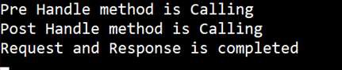

# Spring Boot - Interceptor
You can use the Interceptor in Spring Boot to perform operations under the following situations −

   * Before sending the request to the controller
   * Before sending the response to the client

For example, you can use an interceptor to add the request header before sending the request to the controller and add the response header before sending the response to the client.

To work with interceptor, you need to create **@Component** class that supports it and it should implement the **HandlerInterceptor** interface.

The following are the three methods you should know about while working on Interceptors −

   * **preHandle()** method − This is used to perform operations before sending the request to the controller. This method should return true to return the response to the client.
   * **postHandle()** method − This is used to perform operations before sending the response to the client.
   * **afterCompletion()** method − This is used to perform operations after completing the request and response.

Observe the following code for a better understanding −

```
@Component
public class ProductServiceInterceptor implements HandlerInterceptor {
   @Override
   public boolean preHandle(
      HttpServletRequest request, HttpServletResponse response, Object handler) throws Exception {
      
      return true;
   }
   @Override
   public void postHandle(
      HttpServletRequest request, HttpServletResponse response, Object handler, 
      ModelAndView modelAndView) throws Exception {}
   
   @Override
   public void afterCompletion(HttpServletRequest request, HttpServletResponse response, 
      Object handler, Exception exception) throws Exception {}
}
```
You will have to register this Interceptor with **InterceptorRegistry** by using **WebMvcConfigurerAdapter** as shown below −

```
@Component
public class ProductServiceInterceptorAppConfig extends WebMvcConfigurerAdapter {
   @Autowired
   ProductServiceInterceptor productServiceInterceptor;

   @Override
   public void addInterceptors(InterceptorRegistry registry) {
      registry.addInterceptor(productServiceInterceptor);
   }
}
```
In the example given below, we are going to hit the GET products API which gives the output as given under −

The code for the Interceptor class ProductServiceInterceptor.java is given below −

```
package com.tutorialspoint.demo.interceptor;

import javax.servlet.http.HttpServletRequest;
import javax.servlet.http.HttpServletResponse;

import org.springframework.stereotype.Component;
import org.springframework.web.servlet.HandlerInterceptor;
import org.springframework.web.servlet.ModelAndView;

@Component
public class ProductServiceInterceptor implements HandlerInterceptor {
   @Override
   public boolean preHandle
      (HttpServletRequest request, HttpServletResponse response, Object handler) 
      throws Exception {
      
      System.out.println("Pre Handle method is Calling");
      return true;
   }
   @Override
   public void postHandle(HttpServletRequest request, HttpServletResponse response, 
      Object handler, ModelAndView modelAndView) throws Exception {
      
      System.out.println("Post Handle method is Calling");
   }
   @Override
   public void afterCompletion
      (HttpServletRequest request, HttpServletResponse response, Object 
      handler, Exception exception) throws Exception {
      
      System.out.println("Request and Response is completed");
   }
}
```
The code for Application Configuration class file to register the Interceptor into Interceptor Registry – ProductServiceInterceptorAppConfig.java is given below −

```
package com.tutorialspoint.demo.interceptor;

import org.springframework.beans.factory.annotation.Autowired;
import org.springframework.stereotype.Component;
import org.springframework.web.servlet.config.annotation.InterceptorRegistry;
import org.springframework.web.servlet.config.annotation.WebMvcConfigurerAdapter;

@Component
public class ProductServiceInterceptorAppConfig extends WebMvcConfigurerAdapter {
   @Autowired
   ProductServiceInterceptor productServiceInterceptor;

   @Override
   public void addInterceptors(InterceptorRegistry registry) {
      registry.addInterceptor(productServiceInterceptor);
   }
}
```
The code for Controller class file ProductServiceController.java is given below −

```
package com.tutorialspoint.demo.controller;

import java.util.HashMap;
import java.util.Map;

import org.springframework.http.HttpStatus;
import org.springframework.http.ResponseEntity;
import org.springframework.web.bind.annotation.PathVariable;
import org.springframework.web.bind.annotation.RequestBody;
import org.springframework.web.bind.annotation.RequestMapping;
import org.springframework.web.bind.annotation.RequestMethod;
import org.springframework.web.bind.annotation.RestController;
import com.tutorialspoint.demo.exception.ProductNotfoundException;
import com.tutorialspoint.demo.model.Product;

@RestController
public class ProductServiceController {
   private static Map<String, Product> productRepo = new HashMap<>();   
   static {      
      Product honey = new Product();
      honey.setId("1");
      honey.setName("Honey");
      productRepo.put(honey.getId(), honey);      
      Product almond = new Product();
      almond.setId("2");
      almond.setName("Almond");
      productRepo.put(almond.getId(), almond);      
   }
   @RequestMapping(value = "/products")
   public ResponseEntity<Object> getProduct() {
      return new ResponseEntity<>(productRepo.values(), HttpStatus.OK);
   }
}
```
The code for POJO class for Product.java is given below −

```
package com.tutorialspoint.demo.model;

public class Product {
   private String id;
   private String name;

   public String getId() {
      return id;
   }
   public void setId(String id) {
      this.id = id;
   }
   public String getName() {
      return name;
   }
   public void setName(String name) {
      this.name = name;
   }
}
```
The code for main Spring Boot application class file **DemoApplication.java** is given below −

```
package com.tutorialspoint.demo;

import org.springframework.boot.SpringApplication;
import org.springframework.boot.autoconfigure.SpringBootApplication;

@SpringBootApplication
public class DemoApplication {
   public static void main(String[] args) {
      SpringApplication.run(DemoApplication.class, args);   
   }
}
```
The code for Maven build – **pom.xml** is shown here −

```
<?xml version = "1.0" encoding = "UTF-8"?>
<project xmlns = "http://maven.apache.org/POM/4.0.0" xmlns:xsi = "
   http://www.w3.org/2001/XMLSchema-instance"
   xsi:schemaLocation = "http://maven.apache.org/POM/4.0.0 
   http://maven.apache.org/xsd/maven-4.0.0.xsd">
   
   <modelVersion>4.0.0</modelVersion>
   <groupId>com.tutorialspoint</groupId>
   <artifactId>demo</artifactId>
   <version>0.0.1-SNAPSHOT</version>
   <packaging>jar</packaging>
   <name>demo</name>
   <description>Demo project for Spring Boot</description>

   <parent>
      <groupId>org.springframework.boot</groupId>
      <artifactId>spring-boot-starter-parent</artifactId>
      <version>1.5.8.RELEASE</version>
      <relativePath/> 
   </parent>

   <properties>
      <project.build.sourceEncoding>UTF-8</project.build.sourceEncoding>
      <project.reporting.outputEncoding>UTF-8</project.reporting.outputEncoding>
      <java.version>1.8</java.version>
   </properties>

   <dependencies>
      <dependency>
         <groupId>org.springframework.boot</groupId>
         <artifactId>spring-boot-starter-web</artifactId>
      </dependency>

      <dependency>
         <groupId>org.springframework.boot</groupId>
         <artifactId>spring-boot-starter-test</artifactId>
         <scope>test</scope>
      </dependency>
   </dependencies>

   <build>
      <plugins>
         <plugin>
            <groupId>org.springframework.boot</groupId>
            <artifactId>spring-boot-maven-plugin</artifactId>
         </plugin>
      </plugins>
   </build>
   
</project>
```
The code for Gradle Build **build.gradle** is shown here −

```
buildscript {
   ext {
      springBootVersion = '1.5.8.RELEASE'
   }
   repositories {
      mavenCentral()
   }
   dependencies {
      classpath("org.springframework.boot:spring-boot-gradle-plugin:${springBootVersion}")
   }
}
apply plugin: 'java'
apply plugin: 'eclipse'
apply plugin: 'org.springframework.boot'
group = 'com.tutorialspoint'
version = '0.0.1-SNAPSHOT'
sourceCompatibility = 1.8

repositories {
   mavenCentral()
}
dependencies {
   compile('org.springframework.boot:spring-boot-starter-web')
   testCompile('org.springframework.boot:spring-boot-starter-test')
}
```
You can create an executable JAR file, and run the Spring Boot application by using the below Maven or Gradle commands.

For Maven, use the command as shown below −

```
mvn clean install
```
After “BUILD SUCCESS”, you can find the JAR file under the target directory.

For Gradle, use the command as shown below −

```
gradle clean build
```
After “BUILD SUCCESSFUL”, you can find the JAR file under the build/libs directory.

You can run the JAR file by using the following command −

```
java –jar <JARFILE>
```
Now, the application has started on the Tomcat port 8080 as shown below −


Now hit the below URL in POSTMAN application and you can see the output as shown under −

GET API: **http://localhost:8080/products**


In the console window, you can see the System.out.println statements added in the Interceptor as shown in the screenshot given below −




[Previous Page](../spring_boot/spring_boot_exception_handling.md) [Next Page](../spring_boot/spring_boot_servlet_filter.md) 
