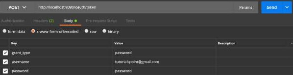
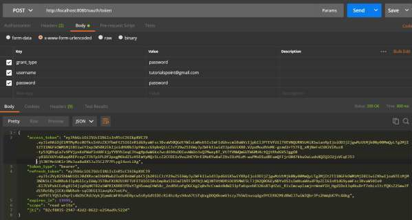
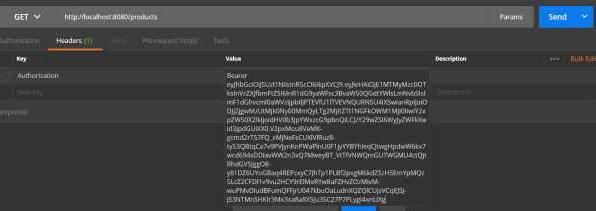
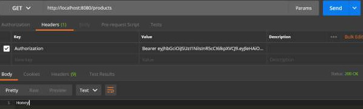

# Spring Boot - OAuth2 with JWT
In this chapter, you will learn in detail about Spring Boot Security mechanisms and OAuth2 with JWT.

## Authorization Server
Authorization Server is a supreme architectural component for Web API Security. The Authorization Server acts a centralization authorization point that allows your apps and HTTP endpoints to identify the features of your application.

## Resource Server
Resource Server is an application that provides the access token to the clients to access the Resource Server HTTP Endpoints. It is collection of libraries which contains the HTTP Endpoints, static resources, and Dynamic web pages.

## OAuth2
OAuth2 is an authorization framework that enables the application Web Security to access the resources from the client. To build an OAuth2 application, we need to focus on the Grant Type (Authorization code), Client ID and Client secret.

## JWT Token
JWT Token is a JSON Web Token, used to represent the claims secured between two parties. You can learn more about the JWT token&nbsp;at [www.jwt.io/](https://jwt.io/) .

Now, we are going to build an OAuth2 application that enables the use of Authorization Server, Resource Server with the help of a JWT Token.

You can use the following steps to implement the Spring Boot Security with JWT token by accessing the database.

First, we need to add the following dependencies in our build configuration file.

Maven users can add the following dependencies in your pom.xml file.

```
<dependency>
   <groupId>org.springframework.boot</groupId>
   <artifactId>spring-boot-starter-jdbc</artifactId>
</dependency>

<dependency>
   <groupId>org.springframework.boot</groupId>
   <artifactId>spring-boot-starter-security</artifactId>
</dependency>

<dependency>
   <groupId>org.springframework.boot</groupId>
   <artifactId>spring-boot-starter-web</artifactId>
</dependency>

<dependency>
   <groupId>org.springframework.security.oauth</groupId>
   <artifactId>spring-security-oauth2</artifactId>
</dependency>

<dependency>
   <groupId>org.springframework.security</groupId>
   <artifactId>spring-security-jwt</artifactId>
</dependency>

<dependency>
   <groupId>com.h2database</groupId>
   <artifactId>h2</artifactId>
</dependency>

<dependency>
   <groupId>org.springframework.boot</groupId>
   <artifactId>spring-boot-starter-test</artifactId>
   <scope>test</scope>
</dependency>

<dependency>
   <groupId>org.springframework.security</groupId>
   <artifactId>spring-security-test</artifactId>
   <scope>test</scope>
</dependency>
```
Gradle users can add the following dependencies in the build.gradle file.

```
compile('org.springframework.boot:spring-boot-starter-security')
compile('org.springframework.boot:spring-boot-starter-web')
testCompile('org.springframework.boot:spring-boot-starter-test')
testCompile('org.springframework.security:spring-security-test')

compile("org.springframework.security.oauth:spring-security-oauth2")
compile('org.springframework.security:spring-security-jwt')
compile("org.springframework.boot:spring-boot-starter-jdbc")
compile("com.h2database:h2:1.4.191")
```
where,

   * **Spring Boot Starter Security** − Implements the Spring Security
   * **Spring Security OAuth2** − Implements the OAUTH2 structure to enable the Authorization Server and Resource Server.
   * **Spring Security JWT** − Generates the JWT Token for Web security
   * **Spring Boot Starter JDBC** − Accesses the database to ensure the user is available or not.
   * **Spring Boot Starter Web** − Writes HTTP endpoints.
   * **H2 Database** − Stores the user information for authentication and authorization.

The complete build configuration file is given below.

```
<?xml version = "1.0" encoding = "UTF-8"?>
<project xmlns = "http://maven.apache.org/POM/4.0.0" 
   xmlns:xsi = "http://www.w3.org/2001/XMLSchema-instance"
   xsi:schemaLocation = "http://maven.apache.org/POM/4.0.0 
   http://maven.apache.org/xsd/maven-4.0.0.xsd">
   
   <modelVersion>4.0.0</modelVersion>
   <groupId>com.tutorialspoint</groupId>
   <artifactId>websecurityapp</artifactId>
   <version>0.0.1-SNAPSHOT</version>
   <packaging>jar</packaging>
   <name>websecurityapp</name>
   <description>Demo project for Spring Boot</description>

   <parent>
      <groupId>org.springframework.boot</groupId>
      <artifactId>spring-boot-starter-parent</artifactId>
      <version>1.5.9.RELEASE</version>
      <relativePath /> <!-- lookup parent from repository -->
   </parent>

   <properties>
      <project.build.sourceEncoding>UTF-8</project.build.sourceEncoding>
      <project.reporting.outputEncoding>UTF-8</project.reporting.outputEncoding>
      <java.version>1.8</java.version>
   </properties>

   <dependencies>
      <dependency>
         <groupId>org.springframework.boot</groupId>
         <artifactId>spring-boot-starter-jdbc</artifactId>
      </dependency>
      
      <dependency>
         <groupId>org.springframework.boot</groupId>
         <artifactId>spring-boot-starter-security</artifactId>
      </dependency>
      
      <dependency>
         <groupId>org.springframework.boot</groupId>
         <artifactId>spring-boot-starter-web</artifactId>
      </dependency>
      
      <dependency>
         <groupId>org.springframework.security.oauth</groupId>
         <artifactId>spring-security-oauth2</artifactId>
      </dependency>
      
      <dependency>
         <groupId>org.springframework.security</groupId>
         <artifactId>spring-security-jwt</artifactId>
      </dependency>
      
      <dependency>
         <groupId>com.h2database</groupId>
         <artifactId>h2</artifactId>
      </dependency>
      
      <dependency>
         <groupId>org.springframework.boot</groupId>
         <artifactId>spring-boot-starter-test</artifactId>
         <scope>test</scope>
      </dependency>
      
      <dependency>
         <groupId>org.springframework.security</groupId>
         <artifactId>spring-security-test</artifactId>
         <scope>test</scope>
      </dependency>
   </dependencies>

   <build>
      <plugins>
         <plugin>
            <groupId>org.springframework.boot</groupId>
            <artifactId>spring-boot-maven-plugin</artifactId>
         </plugin>
      </plugins>
   </build>
   
</project>
```
**Gradle – build.gradle**

```
buildscript {
   ext {
      springBootVersion = '1.5.9.RELEASE'
   }
   repositories {
      mavenCentral()
   }
   dependencies {
      classpath("org.springframework.boot:spring-boot-gradle-plugin:${springBootVersion}")
   }
}
apply plugin: 'java'
apply plugin: 'eclipse'
apply plugin: 'org.springframework.boot'

group = 'com.tutorialspoint'
version = '0.0.1-SNAPSHOT'
sourceCompatibility = 1.8

repositories {
   mavenCentral()
}

dependencies {
   compile('org.springframework.boot:spring-boot-starter-security')
   compile('org.springframework.boot:spring-boot-starter-web')
   testCompile('org.springframework.boot:spring-boot-starter-test')
   testCompile('org.springframework.security:spring-security-test')
   compile("org.springframework.security.oauth:spring-security-oauth2")
   compile('org.springframework.security:spring-security-jwt')
   compile("org.springframework.boot:spring-boot-starter-jdbc")
   compile("com.h2database:h2:1.4.191")  
}
```
Now, in the main Spring Boot application, add the @EnableAuthorizationServer and @EnableResourceServer annotation to act as an Auth server and Resource Server in the same application.

Also, you can use the following code to write a simple HTTP endpoint to access the API with Spring Security by using JWT Token.

```
package com.tutorialspoint.websecurityapp;

import org.springframework.boot.SpringApplication;
import org.springframework.boot.autoconfigure.SpringBootApplication;
import org.springframework.security.oauth2.config.annotation.web.configuration.EnableAuthorizationServer;
import org.springframework.security.oauth2.config.annotation.web.configuration.EnableResourceServer;
import org.springframework.web.bind.annotation.RequestMapping;
import org.springframework.web.bind.annotation.RestController;

@SpringBootApplication
@EnableAuthorizationServer
@EnableResourceServer
@RestController
public class WebsecurityappApplication {
   public static void main(String[] args) {
      SpringApplication.run(WebsecurityappApplication.class, args);
   }
   @RequestMapping(value = "/products")
   public String getProductName() {
      return "Honey";   
   }
}
```
Use the following code to define the POJO class to store the User information for authentication.

```
package com.tutorialspoint.websecurityapp;

import java.util.ArrayList;
import java.util.Collection;
import org.springframework.security.core.GrantedAuthority;

public class UserEntity {
   private String username;
   private String password;
   private Collection<GrantedAuthority> grantedAuthoritiesList = new ArrayList<>();
   
   public String getPassword() {
      return password;
   }
   public void setPassword(String password) {
      this.password = password;
   }
   public Collection<GrantedAuthority> getGrantedAuthoritiesList() {
      return grantedAuthoritiesList;
   }
   public void setGrantedAuthoritiesList(Collection<GrantedAuthority> grantedAuthoritiesList) {
      this.grantedAuthoritiesList = grantedAuthoritiesList;
   }
   public String getUsername() {
      return username;
   }
   public void setUsername(String username) {
      this.username = username;
   }
}
```
Now, use the following code and define the CustomUser class that extends the org.springframework.security.core.userdetails.User class for Spring Boot authentication.

```
package com.tutorialspoint.websecurityapp;

import org.springframework.security.core.userdetails.User;

public class CustomUser extends User {
   private static final long serialVersionUID = 1L;
   public CustomUser(UserEntity user) {
      super(user.getUsername(), user.getPassword(), user.getGrantedAuthoritiesList());
   }
}
```
You can create the @Repository class to read the User information from the database and send it to the Custom user service and also add the granted authority “ROLE_SYSTEMADMIN”.

```
package com.tutorialspoint.websecurityapp;

import java.sql.ResultSet;
import java.util.ArrayList;
import java.util.Collection;
import java.util.List;

import org.springframework.beans.factory.annotation.Autowired;
import org.springframework.jdbc.core.JdbcTemplate;
import org.springframework.security.core.GrantedAuthority;
import org.springframework.security.core.authority.SimpleGrantedAuthority;
import org.springframework.stereotype.Repository;

@Repository
public class OAuthDao {
   @Autowired
   private JdbcTemplate jdbcTemplate;

   public UserEntity getUserDetails(String username) {
      Collection<GrantedAuthority> grantedAuthoritiesList = new ArrayList<>();
      String userSQLQuery = "SELECT * FROM USERS WHERE USERNAME=?";
      List<UserEntity> list = jdbcTemplate.query(userSQLQuery, new String[] { username },
         (ResultSet rs, int rowNum) -> {
         
         UserEntity user = new UserEntity();
         user.setUsername(username);
         user.setPassword(rs.getString("PASSWORD"));
         return user;
      });
      if (list.size() > 0) {
         GrantedAuthority grantedAuthority = new SimpleGrantedAuthority("ROLE_SYSTEMADMIN");
         grantedAuthoritiesList.add(grantedAuthority);
         list.get(0).setGrantedAuthoritiesList(grantedAuthoritiesList);
         return list.get(0);
      }
      return null;
   }
}
```
You can create a Custom User detail service class that extends the org.springframework.security.core.userdetails.UserDetailsService to call the DAO repository class as shown.

```
package com.tutorialspoint.websecurityapp;

import org.springframework.beans.factory.annotation.Autowired;
import org.springframework.security.core.userdetails.UserDetailsService;
import org.springframework.security.core.userdetails.UsernameNotFoundException;
import org.springframework.stereotype.Service;

@Service
public class CustomDetailsService implements UserDetailsService {
   @Autowired
   OAuthDao oauthDao;

   @Override
   public CustomUser loadUserByUsername(final String username) throws UsernameNotFoundException {
      UserEntity userEntity = null;
      try {
         userEntity = oauthDao.getUserDetails(username);
         CustomUser customUser = new CustomUser(userEntity);
         return customUser;
      } catch (Exception e) {
         e.printStackTrace();
         throw new UsernameNotFoundException("User " + username + " was not found in the database");
      }
   }
}
```
Next, create a @configuration class to enable the Web Security, defining the Password encoder (BCryptPasswordEncoder), and defining the AuthenticationManager bean. The Security configuration class should extend WebSecurityConfigurerAdapter class.

```
package com.tutorialspoint.websecurityapp;

import org.springframework.beans.factory.annotation.Autowired;
import org.springframework.context.annotation.Bean;
import org.springframework.context.annotation.Configuration;

import org.springframework.security.authentication.AuthenticationManager;
import org.springframework.security.config.annotation.authentication.builders.AuthenticationManagerBuilder;
import org.springframework.security.config.annotation.method.configuration.EnableGlobalMethodSecurity;
import org.springframework.security.config.annotation.web.builders.HttpSecurity;
import org.springframework.security.config.annotation.web.builders.WebSecurity;
import org.springframework.security.config.annotation.web.configuration.EnableWebSecurity;
import org.springframework.security.config.annotation.web.configuration.WebSecurityConfigurerAdapter;
import org.springframework.security.config.http.SessionCreationPolicy;
import org.springframework.security.crypto.bcrypt.BCryptPasswordEncoder;
import org.springframework.security.crypto.password.PasswordEncoder;

@Configuration
@EnableWebSecurity
@EnableGlobalMethodSecurity(prePostEnabled = true)
public class SecurityConfiguration extends WebSecurityConfigurerAdapter {
   @Autowired
   private CustomDetailsService customDetailsService;

   @Bean
   public PasswordEncoder encoder() {
      return new BCryptPasswordEncoder();
   }
   @Override
   @Autowired
   protected void configure(AuthenticationManagerBuilder auth) throws Exception {
      auth.userDetailsService(customDetailsService).passwordEncoder(encoder());
   }
   @Override
   protected void configure(HttpSecurity http) throws Exception {
      http.authorizeRequests().anyRequest().authenticated().and().sessionManagement()
         .sessionCreationPolicy(SessionCreationPolicy.NEVER);
   }
   @Override
   public void configure(WebSecurity web) throws Exception {
      web.ignoring();
   }
   @Override
   @Bean
   public AuthenticationManager authenticationManagerBean() throws Exception {
      return super.authenticationManagerBean();
   }
}
```
Now, define the OAuth2 Configuration class to add the Client ID, Client Secret, Define the JwtAccessTokenConverter, Private key and Public key for token signer key and verifier key, and configure the ClientDetailsServiceConfigurer for the Token validity with scopes.

```
package com.tutorialspoint.websecurityapp;

import org.springframework.beans.factory.annotation.Autowired;
import org.springframework.beans.factory.annotation.Qualifier;
import org.springframework.context.annotation.Bean;
import org.springframework.context.annotation.Configuration;

import org.springframework.security.authentication.AuthenticationManager;
import org.springframework.security.oauth2.config.annotation.configurers.ClientDetailsServiceConfigurer;
import org.springframework.security.oauth2.config.annotation.web.configuration.AuthorizationServerConfigurerAdapter;
import org.springframework.security.oauth2.config.annotation.web.configurers.AuthorizationServerEndpointsConfigurer;
import org.springframework.security.oauth2.config.annotation.web.configurers.AuthorizationServerSecurityConfigurer;
import org.springframework.security.oauth2.provider.token.store.JwtAccessTokenConverter;
import org.springframework.security.oauth2.provider.token.store.JwtTokenStore;

@Configuration
public class OAuth2Config extends AuthorizationServerConfigurerAdapter {
   private String clientid = "tutorialspoint";
   private String clientSecret = "my-secret-key";
   private String privateKey = "private key";
   private String publicKey = "public key";

   @Autowired
   @Qualifier("authenticationManagerBean")
   private AuthenticationManager authenticationManager;
   
   @Bean
   public JwtAccessTokenConverter tokenEnhancer() {
      JwtAccessTokenConverter converter = new JwtAccessTokenConverter();
      converter.setSigningKey(privateKey);
      converter.setVerifierKey(publicKey);
      return converter;
   }
   @Bean
   public JwtTokenStore tokenStore() {
      return new JwtTokenStore(tokenEnhancer());
   }
   @Override
   public void configure(AuthorizationServerEndpointsConfigurer endpoints) throws Exception {
      endpoints.authenticationManager(authenticationManager).tokenStore(tokenStore())
      .accessTokenConverter(tokenEnhancer());
   }
   @Override
   public void configure(AuthorizationServerSecurityConfigurer security) throws Exception {
      security.tokenKeyAccess("permitAll()").checkTokenAccess("isAuthenticated()");
   }
   @Override
   public void configure(ClientDetailsServiceConfigurer clients) throws Exception {
      clients.inMemory().withClient(clientid).secret(clientSecret).scopes("read", "write")
         .authorizedGrantTypes("password", "refresh_token").accessTokenValiditySeconds(20000)
         .refreshTokenValiditySeconds(20000);

   }
}
```
Now, create a Private key and public key by using openssl.

You can use the following commands for generating private key.

```
openssl genrsa -out jwt.pem 2048
openssl rsa -in jwt.pem
```
You can use For public key generation use the below commands.

```
openssl rsa -in jwt.pem -pubout
```
For the version of Spring Boot latter than 1.5 release, add the below property in your application.properties file to define OAuth2 Resource filter order.

```
security.oauth2.resource.filter-order=3
```
YAML file users can add the below property in YAML file.

```
security:
   oauth2:
      resource:
         filter-order: 3
```
Now, create schema.sql and data.sql file under the classpath resources **src/main/resources/directory** to connect the application to H2 database.

The schema.sql file is as shown −

```
CREATE TABLE USERS (ID INT PRIMARY KEY, USERNAME VARCHAR(45), PASSWORD VARCHAR(60));
```
The data.sql file is as shown −

```
INSERT INTO USERS (ID, USERNAME,PASSWORD) VALUES (
   1, 'tutorialspoint@gmail.com','$2a$08$fL7u5xcvsZl78su29x1ti.dxI.9rYO8t0q5wk2ROJ.1cdR53bmaVG');

INSERT INTO USERS (ID, USERNAME,PASSWORD) VALUES (
   2, 'myemail@gmail.com','$2a$08$fL7u5xcvsZl78su29x1ti.dxI.9rYO8t0q5wk2ROJ.1cdR53bmaVG');
```
**Note** − Password should be stored in the format of Bcrypt Encoder in the database table.

You can create an executable JAR file, and run the Spring Boot application by using the following Maven or Gradle commands.

For Maven, you can use the command given below −

```
mvn clean install
```
After “BUILD SUCCESS”, you can find the JAR file under the target directory.

For Gradle, you can use the command as shown −

```
gradle clean build
```
After “BUILD SUCCESSFUL”, you can find the JAR file under the build/libs directory.

Now, run the JAR file by using the command shown here −

```
java –jar <JARFILE>
```
The application is started on the Tomcat port 8080.


Now hit the POST method URL via POSTMAN to get the OAUTH2 token.

**http://localhost:8080/oauth/token**

Now, add the Request Headers as follows −


Now, add the Request Parameters as follows −

   * grant_type = password
   * username = your username
   * password = your password



Now, hit the API and get the access_token as shown −



Now, Hit the Resource Server API with Bearer access token in Request Header as shown.



Then you can see the output as shown below −




[Previous Page](../spring_boot/spring_boot_securing_web_applications.md) [Next Page](../spring_boot/spring_boot_google_cloud_platform.md) 
