# Spring Boot - Quick Guide
# Spring Boot - Introduction
Spring Boot is an open source Java-based framework used to create a micro Service. It is developed by Pivotal Team and is used to build stand-alone and production ready spring applications. This chapter will give you an introduction to Spring Boot and familiarizes you with its basic concepts.

## What is Micro Service?
Micro Service is an architecture that allows the developers to develop and deploy services independently. Each service running has its own process and this achieves the lightweight model to support business applications.

### Advantages
Micro services offers the following advantages to its developers −

   * Easy deployment
   * Simple scalability
   * Compatible with Containers
   * Minimum configuration
   * Lesser production time

## What is Spring Boot?
Spring Boot provides a good platform for Java developers to develop a stand-alone and production-grade spring application that you can **just run**. You can get started with minimum configurations without the need for an entire Spring configuration setup.

### Advantages
Spring Boot offers the following advantages to its developers −

   * Easy to understand and develop spring applications
   * Increases productivity
   * Reduces the development time

### Goals
Spring Boot is designed with the following goals −

   * To avoid complex XML configuration in Spring
   * To develop a production ready Spring applications in an easier way
   * To reduce the development time and run the application independently
   * Offer an easier way of getting started with the application

## Why Spring Boot?
You can choose Spring Boot because of the features and benefits it offers as given here −

   * It provides a flexible way to configure Java Beans, XML configurations, and Database Transactions.
   * It provides a powerful batch processing and manages REST endpoints.
   * In Spring Boot, everything is auto configured; no manual configurations are needed.
   * It offers annotation-based spring application
   * Eases dependency management
   * It includes Embedded Servlet Container

## How does it work?
Spring Boot automatically configures your application based on the dependencies you have added to the project by using **@EnableAutoConfiguration** annotation. For example, if MySQL database is on your classpath, but you have not configured any database connection, then Spring Boot auto-configures an in-memory database.

The entry point of the spring boot application is the class contains **@SpringBootApplication** annotation and the main method.

Spring Boot automatically scans all the components included in the project by using **@ComponentScan** annotation.

## Spring Boot Starters
Handling dependency management is a difficult task for big projects. Spring Boot resolves this problem by providing a set of dependencies for developers convenience.

For example, if you want to use Spring and JPA for database access, it is sufficient if you include **spring-boot-starter-data-jpa** dependency in your project.

Note that all Spring Boot starters follow the same naming pattern **spring-boot-starter-** *, where * indicates that it is a type of the application.

### Examples
Look at the following Spring Boot starters explained below for a better understanding −

**Spring Boot Starter Actuator dependency** is used to monitor and manage your application. Its code is shown below −

```
<dependency>
   <groupId>org.springframework.boot</groupId>
   <artifactId>spring-boot-starter-actuator</artifactId>
</dependency>
```
**Spring Boot Starter Security dependency** is used for Spring Security. Its code is shown below −

```
<dependency>
   <groupId>org.springframework.boot</groupId>
   <artifactId>spring-boot-starter-security</artifactId>
</dependency>
```
**Spring Boot Starter web dependency** is used to write a Rest Endpoints. Its code is shown below −

```
<dependency>
   <groupId>org.springframework.boot</groupId>
   <artifactId>spring-boot-starter-web</artifactId>
</dependency>
```
**Spring Boot Starter Thyme Leaf dependency** is used to create a web application. Its code is shown below −

```
<dependency>
   <groupId>org.springframework.boot</groupId>
   <artifactId>spring-boot-starter-thymeleaf</artifactId>
</dependency>
```
**Spring Boot Starter Test dependency** is used for writing Test cases. Its code is shown below −

```
<dependency>
   <groupId>org.springframework.boot</groupId>
   <artifactId>spring-boot-starter-test<artifactId>
</dependency>
```
## Auto Configuration
Spring Boot Auto Configuration automatically configures your Spring application based on the JAR dependencies you added in the project. For example, if MySQL database is on your class path, but you have not configured any database connection, then Spring Boot auto configures an in-memory database.

For this purpose, you need to add **@EnableAutoConfiguration** annotation or **@SpringBootApplication** annotation to your main class file. Then, your Spring Boot application will be automatically configured.

Observe the following code for a better understanding −

```
import org.springframework.boot.SpringApplication;
import org.springframework.boot.autoconfigure.EnableAutoConfiguration;

@EnableAutoConfiguration
public class DemoApplication {
   public static void main(String[] args) {
      SpringApplication.run(DemoApplication.class, args);
   }
}
```
## Spring Boot Application
The entry point of the Spring Boot Application is the class contains **@SpringBootApplication** annotation. This class should have the main method to run the Spring Boot application. **@SpringBootApplication** annotation includes Auto- Configuration, Component Scan, and Spring Boot Configuration.

If you added **@SpringBootApplication** annotation to the class, you do not need to add the **@EnableAutoConfiguration, @ComponentScan** and **@SpringBootConfiguration** annotation. The **@SpringBootApplication** annotation includes all other annotations.

Observe the following code for a better understanding −

```
import org.springframework.boot.SpringApplication;
import org.springframework.boot.autoconfigure.SpringBootApplication;

@SpringBootApplication
public class DemoApplication {
   public static void main(String[] args) {
      SpringApplication.run(DemoApplication.class, args);
   }
}
```
## Component Scan
Spring Boot application scans all the beans and package declarations when the application initializes. You need to add the **@ComponentScan** annotation for your class file to scan your components added in your project.

Observe the following code for a better understanding −

```
import org.springframework.boot.SpringApplication;
import org.springframework.context.annotation.ComponentScan;

@ComponentScan
public class DemoApplication {
   public static void main(String[] args) {
      SpringApplication.run(DemoApplication.class, args);
   }
}
```
# Spring Boot - Quick Start
This chapter will teach you how to create a Spring Boot application using Maven and Gradle.

## Prerequisites
Your system need to have the following minimum requirements to create a Spring Boot application −

   * Java 7
   * Maven 3.2
   * Gradle 2.5

## Spring Boot CLI
The Spring Boot CLI is a command line tool and it allows us to run the Groovy scripts. This is the easiest way to create a Spring Boot application by using the Spring Boot Command Line Interface. You can create, run and test the application in command prompt itself.

This section explains you the steps involved in manual installation of Spring Boot CLI. For further help, you can use the following link: [https://docs.spring.io/springboot/ docs/current-SNAPSHOT/reference/htmlsingle/#getting-started-installing-springboot](https://docs.spring.io/spring-boot/docs/current-SNAPSHOT/reference/htmlsingle/#getting-started-installing-spring-boot)  

You can also download the Spring CLI distribution from the Spring Software repository at: [https://docs.spring.io/spring-boot/docs/current-SNAPSHOT/reference/htmlsingle/#getting-started-manual-cli-installation](https://docs.spring.io/spring-boot/docs/current-SNAPSHOT/reference/htmlsingle/#getting-started-manual-cli-installation) 

For manual installation, you need to use the following two folders −

   * **spring-boot-cli-2.0.0.BUILD-SNAPSHOT-bin.zip**
   * **spring-boot-cli-2.0.0.BUILD-SNAPSHOT-bin.tar.gz**

After the download, unpack the archive file and follow the steps given in the install.txt file. Not that it does not require any environment setup.

In Windows, go to the Spring Boot CLI **bin** directory in the command prompt and run the command **spring –-version** to make sure spring CLI is installed correctly. After executing the command, you can see the spring CLI version as shown below −

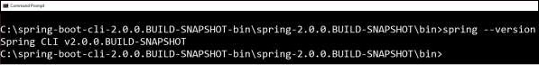

### Run Hello World with Groovy
Create a simple groovy file which contains the Rest Endpoint script and run the groovy file with spring boot CLI. Observe the code shown here for this purpose −

```
@Controller
class Example {
   @RequestMapping("/")
   @ResponseBody
   public String hello() {
      "Hello Spring Boot"
   }
}
```
Now, save the groovy file with the name **hello.groovy**. Note that in this example, we saved the groovy file inside the Spring Boot CLI **bin** directory. Now run the application by using the command **spring run hello.groovy** as shown in the screenshot given below −

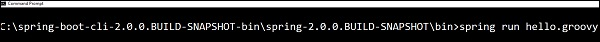

Once you run the groovy file, required dependencies will download automatically and it will start the application in Tomcat 8080 port as shown in the screenshot given below −

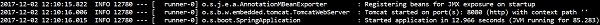

Once Tomcat starts, go to the web browser and hit the URL **http://localhost:8080/** and you can see the output as shown.

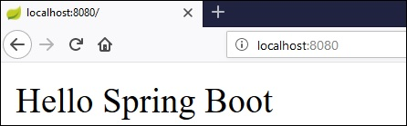

# Spring Boot - Bootstrapping
This chapter will explain you how to perform bootstrapping on a Spring Boot application.

## Spring Initializer
One of the ways to Bootstrapping a Spring Boot application is by using Spring Initializer. To do this, you will have to visit the Spring Initializer web page [www.start.spring.io](https://start.spring.io/)  and choose your Build, Spring Boot Version and platform. Also, you need to provide a Group, Artifact and required dependencies to run the application.

Observe the following screenshot that shows an example where we added the **spring-boot-starter-web** dependency to write REST Endpoints.

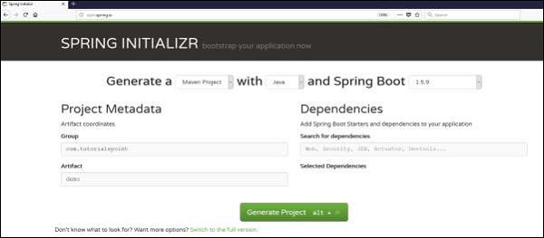

Once you provided the Group, Artifact, Dependencies, Build Project, Platform and Version, click **Generate Project** button. The zip file will download and the files will be extracted.

This section explains you the examples by using both Maven and Gradle.

## Maven
After you download the project, unzip the file. Now, your **pom.xml** file looks as shown below −

```
<?xml version = "1.0" encoding = "UTF-8"?>
<project xmlns = "http://maven.apache.org/POM/4.0.0" 
   xmlns:xsi = "http://www.w3.org/2001/XMLSchema-instance"
   xsi:schemaLocation = "http://maven.apache.org/POM/4.0.0 
   http://maven.apache.org/xsd/maven-4.0.0.xsd">
   
   <modelVersion>4.0.0</modelVersion>
   <groupId>com.tutorialspoint</groupId>
   <artifactId>demo</artifactId>
   <version>0.0.1-SNAPSHOT</version>
   <packaging>jar</packaging>

   <name>demo</name>
   <description>Demo project for Spring Boot</description>

   <parent>
      <groupId>org.springframework.boot</groupId>
      <artifactId>spring-boot-starter-parent</artifactId>
      <version>1.5.8.RELEASE</version>
      <relativePath/> <!-- lookup parent from repository -->
   </parent>

   <properties>
      <project.build.sourceEncoding>UTF-8</project.build.sourceEncoding>
      <project.reporting.outputEncoding>UTF-8</project.reporting.outputEncoding>
      <java.version>1.8</java.version>
   </properties>

   <dependencies>
      <dependency>
         <groupId>org.springframework.boot</groupId>
         <artifactId>spring-boot-starter-web</artifactId>
      </dependency>

      <dependency>
         <groupId>org.springframework.boot</groupId>
         <artifactId>spring-boot-starter-test</artifactId>
         <scope>test</scope>
      </dependency>
   </dependencies>
   
   <build>
      <plugins>
         <plugin>
            <groupId>org.springframework.boot</groupId>
            <artifactId>spring-boot-maven-plugin</artifactId>
         </plugin>
      </plugins>
   </build>
   
</project>
```
## Gradle
Once you download the project, unzip the file. Now your **build.gradle** file looks as shown below −

```
buildscript {
   ext {
      springBootVersion = '1.5.8.RELEASE'
   }
   repositories {
      mavenCentral()
   }
   dependencies {
      classpath("org.springframework.boot:spring-boot-gradle-plugin:${springBootVersion}")
   }
}
apply plugin: 'java'
apply plugin: 'eclipse'
apply plugin: 'org.springframework.boot'

group = 'com.tutorialspoint'
version = '0.0.1-SNAPSHOT'
sourceCompatibility = 1.8

repositories {
   mavenCentral()
}
dependencies {
   compile('org.springframework.boot:spring-boot-starter-web')
   testCompile('org.springframework.boot:spring-boot-starter-test')
}
```
## Class Path Dependencies
Spring Boot provides a number of **Starters** to add the jars in our class path. For example, for writing a Rest Endpoint, we need to add the **spring-boot-starter-web** dependency in our class path. Observe the codes shown below for a better understanding −

### Maven dependency
```
<dependencies>
   <dependency>
      <groupId>org.springframework.boot</groupId>
      <artifactId>spring-boot-starter-web</artifactId>
   </dependency>
</dependencies>
```
### Gradle dependency
```
dependencies {
   compile('org.springframework.boot:spring-boot-starter-web')
}
```
## Main Method
The main method should be writing the Spring Boot Application class. This class should be annotated with **@SpringBootApplication**. This is the entry point of the spring boot application to start. You can find the main class file under **src/java/main** directories with the default package.

In this example, the main class file is located at the **src/java/main** directories with the default package **com.tutorialspoint.demo**. Observe the code shown here for a better understanding −

```
package com.tutorialspoint.demo;

import org.springframework.boot.SpringApplication;
import org.springframework.boot.autoconfigure.SpringBootApplication;

@SpringBootApplication
public class DemoApplication {
   public static void main(String[] args) {
      SpringApplication.run(DemoApplication.class, args);
   }
}
```
## Write a Rest Endpoint
To write a simple Hello World Rest Endpoint in the Spring Boot Application main class file itself, follow the steps shown below −

   * Firstly, add the **@RestController** annotation at the top of the class.
   * Now, write a Request URI method with **@RequestMapping** annotation.
   * Then, the Request URI method should return the **Hello World** string.

Now, your main Spring Boot Application class file will look like as shown in the code given below −

```
package com.tutorialspoint.demo;

import org.springframework.boot.SpringApplication;
import org.springframework.boot.autoconfigure.SpringBootApplication;
import org.springframework.web.bind.annotation.RequestMapping;
import org.springframework.web.bind.annotation.RestController;

@SpringBootApplication
@RestController

public class DemoApplication {
   public static void main(String[] args) {
      SpringApplication.run(DemoApplication.class, args);
   }
   @RequestMapping(value = "/")
   public String hello() {
      return "Hello World";
   }
}
```
## Create an Executable JAR
Let us create an executable JAR file to run the Spring Boot application by using Maven and Gradle commands in the command prompt as shown below −

Use the Maven command mvn clean install as shown below −


After executing the command, you can see the **BUILD SUCCESS** message at the command prompt as shown below −


Use the Gradle command **gradle clean build** as shown below −

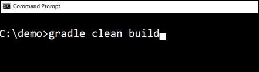

After executing the command, you can see the **BUILD SUCCESSFUL** message in the command prompt as shown below −


## Run Hello World with Java
Once you have created an executable JAR file, you can find it under the following directories.

For Maven, you can find the JAR file under the target directory as shown below −

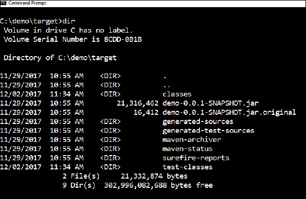

For Gradle, you can find the JAR file under the **build/libs** directory as shown below −

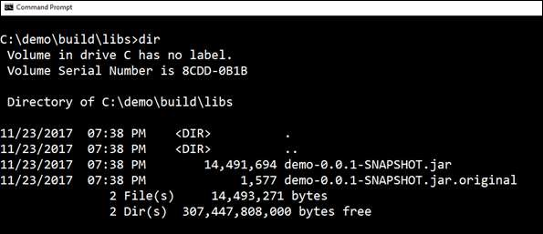

Now, run the JAR file by using the command **java –jar <JARFILE>**. Observe that in the above example, the JAR file is named **demo-0.0.1-SNAPSHOT.jar**


Once you run the jar file, you can see the output in the console window as shown below −


Now, look at the console, Tomcat started on port 8080 (http). Now, go to the web browser and hit the URL **http://localhost:8080/** and you can see the output as shown below −

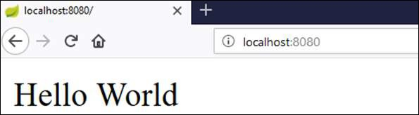

# Spring Boot - Tomcat Deployment
By using Spring Boot application, we can create a war file to deploy into the web server. In this chapter, you are going to learn how to create a WAR file and deploy the Spring Boot application in Tomcat web server.

## Spring Boot Servlet Initializer
The traditional way of deployment is making the Spring Boot Application **@SpringBootApplication** class extend the **SpringBootServletInitializer** class. Spring Boot Servlet Initializer class file allows you to configure the application when it is launched by using Servlet Container.

The code for Spring Boot Application class file for JAR file deployment is given below −

```
package com.tutorialspoint.demo;

import org.springframework.boot.SpringApplication;
import org.springframework.boot.autoconfigure.SpringBootApplication;

@SpringBootApplication
public class DemoApplication {
   public static void main(String[] args) {
      SpringApplication.run(DemoApplication.class, args);
   }
}
```
We need to extend the class **SpringBootServletInitializer** to support WAR file deployment. The code of Spring Boot Application class file is given below −

```
package com.tutorialspoint.demo;

import org.springframework.boot.SpringApplication;
import org.springframework.boot.autoconfigure.SpringBootApplication;
import org.springframework.boot.builder.SpringApplicationBuilder;
import org.springframework.boot.web.support.SpringBootServletInitializer;

@SpringBootApplication
public class DemoApplication  extends SpringBootServletInitializer {
   @Override
   protected SpringApplicationBuilder configure(SpringApplicationBuilder application) {
      return application.sources(DemoApplication.class);
   }
   public static void main(String[] args) {
      SpringApplication.run(DemoApplication.class, args);
   }
}
```
## Setting Main Class
In Spring Boot, we need to mention the main class that should start in the build file. For this purpose, you can use the following pieces of code −

For Maven, add the start class in **pom.xml** properties as shown below −

```
<start-class>com.tutorialspoint.demo.DemoApplication</start-class>
```
For Gradle, add the main class name in build.gradle as shown below −

```
mainClassName="com.tutorialspoint.demo.DemoApplication"
```
## Update packaging JAR into WAR
We have to update the packaging JAR into WAR using the following pieces of code −

For Maven, add the packaging as WAR in **pom.xml** as shown below −

```
<packaging>war</packaging>
```
For Gradle, add the application plugin and war plugin in the **build.gradle** as shown below −

```
apply plugin: ‘war’
apply plugin: ‘application’
```
Now, let us write a simple Rest Endpoint to return the string “Hello World from Tomcat”. To write a Rest Endpoint, we need to add the Spring Boot web starter dependency into our build file.

For Maven, add the Spring Boot starter dependency in pom.xml using the code as shown below −

```
<dependency>
   <groupId>org.springframework.boot</groupId>
   <artifactId>spring-boot-starter-web</artifactId>
</dependency>
```
For Gradle, add the Spring Boot starter dependency in **build.gradle** using the code as shown below −

```
dependencies {
   compile('org.springframework.boot:spring-boot-starter-web')
}
```
Now, write a simple Rest Endpoint in Spring Boot Application class file using the code as shown below −

```
package com.tutorialspoint.demo;

import org.springframework.boot.SpringApplication;
import org.springframework.boot.autoconfigure.SpringBootApplication;
import org.springframework.boot.builder.SpringApplicationBuilder;
import org.springframework.boot.web.support.SpringBootServletInitializer;
import org.springframework.web.bind.annotation.RequestMapping;
import org.springframework.web.bind.annotation.RestController;

@SpringBootApplication
@RestController
public class DemoApplication  extends SpringBootServletInitializer {
   @Override
   protected SpringApplicationBuilder configure(SpringApplicationBuilder application) {
      return application.sources(DemoApplication.class);
   }
   public static void main(String[] args) {
      SpringApplication.run(DemoApplication.class, args);
   }
   
   @RequestMapping(value = "/")
   public String hello() {
      return "Hello World from Tomcat";
   }
}
```
## Packaging your Application
Now, create a WAR file to deploy into the Tomcat server by using Maven and Gradle commands for packaging your application as given below −

For Maven, use the command **mvn package** for packaging your application. Then, the WAR file will be created and you can find it in the target directory as shown in the screenshots given below −


For Gradle, use the command **gradle clean build** for packaging your application. Then, your WAR file will be created and you can find it under **build/libs** directory. Observe the screenshots given here for a better understanding −


## Deploy into Tomcat
Now, run the Tomcat Server, and deploy the WAR file under the **webapps** directory. Observe the screenshots shown here for a better understanding −


After successful deployment, hit the URL in your web browser **http://localhost:8080/demo-0.0.1-SNAPSHOT/** and observe that the output will look as shown in the screenshot given below −


The full code for this purpose is given below.

**pom.xml**

```
<?xml version = "1.0" encoding = "UTF-8"?>
<project xmlns = "http://maven.apache.org/POM/4.0.0" 
   xmlns:xsi = "http://www.w3.org/2001/XMLSchema-instance"

xsi:schemaLocation = "http://maven.apache.org/POM/4.0.0 http://maven.apache.org/xsd/maven-4.0.0.xsd">
<modelVersion>4.0.0</modelVersion>

   <groupId>com.tutorialspoint</groupId>
   <artifactId>demo</artifactId>
   <version>0.0.1-SNAPSHOT</version>
   <packaging>war</packaging>
   <name>demo</name>
   <description>Demo project for Spring Boot</description>
   
   <parent>
      <groupId>org.springframework.boot</groupId>
      <artifactId>spring-boot-starter-parent</artifactId>
      <version>1.5.8.RELEASE</version>
      <relativePath/> <!-- lookup parent from repository -->
   </parent>

   <properties>
      <project.build.sourceEncoding>UTF-8</project.build.sourceEncoding>
      <project.reporting.outputEncoding>UTF-8</project.reporting.outputEncoding>
      <java.version>1.8</java.version>
      <start-class>com.tutorialspoint.demo.DemoApplication</start-class>
   </properties>

   <dependencies>
      <dependency>
         <groupId>org.springframework.boot</groupId>
         <artifactId>spring-boot-starter-web</artifactId>
      </dependency>
      <dependency>
         <groupId>org.springframework.boot</groupId>
         <artifactId>spring-boot-starter-test</artifactId>
         <scope>test</scope>
      </dependency>
   </dependencies>

   <build>
      <plugins>
         <plugin>
            <groupId>org.springframework.boot</groupId>
            <artifactId>spring-boot-maven-plugin</artifactId>
         </plugin>
      </plugins>
   </build>
   
</project>
```
**build.gradle**

```
buildscript {
   ext {
      springBootVersion = '1.5.8.RELEASE'
   }
   repositories {
      mavenCentral()
   }
dependencies {
      classpath("org.springframework.boot:spring-boot-gradle-plugin:${springBootVersion}")
   }
}

apply plugin: 'java'
apply plugin: 'eclipse'
apply plugin: 'org.springframework.boot'
apply plugin: 'war'
apply plugin: 'application'

group = 'com.tutorialspoint'
version = '0.0.1-SNAPSHOT'
sourceCompatibility = 1.8
mainClassName = "com.tutorialspoint.demo.DemoApplication"

repositories {
   mavenCentral()
}
dependencies {
   compile('org.springframework.boot:spring-boot-starter-web')
   testCompile('org.springframework.boot:spring-boot-starter-test')
}
```
The code for main Spring Boot application class file is given below −

```
package com.tutorialspoint.demo;

import org.springframework.boot.SpringApplication;
import org.springframework.boot.autoconfigure.SpringBootApplication;
import org.springframework.boot.builder.SpringApplicationBuilder;
import org.springframework.boot.web.support.SpringBootServletInitializer;
import org.springframework.web.bind.annotation.RequestMapping;
import org.springframework.web.bind.annotation.RestController;

@SpringBootApplication
@RestController
public class DemoApplication  extends SpringBootServletInitializer {
   @Override
   protected SpringApplicationBuilder configure(SpringApplicationBuilder application) {
      return application.sources(DemoApplication.class);
   }
   public static void main(String[] args) {
      SpringApplication.run(DemoApplication.class, args);
   }
   
   @RequestMapping(value = "/")
   public String hello() {
      return "Hello World from Tomcat";
   }
}
```
# Spring Boot - Build Systems
In Spring Boot, choosing a build system is an important task. We recommend Maven or Gradle as they provide a good support for dependency management. Spring does not support well other build systems.

## Dependency Management
Spring Boot team provides a list of dependencies to support the Spring Boot version for its every release. You do not need to provide a version for dependencies in the build configuration file. Spring Boot automatically configures the dependencies version based on the release. Remember that when you upgrade the Spring Boot version, dependencies also will upgrade automatically.

**Note** − If you want to specify the version for dependency, you can specify it in your configuration file. However, the Spring Boot team highly recommends that it is not needed to specify the version for dependency.

## Maven Dependency
For Maven configuration, we should inherit the Spring Boot Starter parent project to manage the Spring Boot Starters dependencies. For this, simply we can inherit the starter parent in our **pom.xml** file as shown below.

```
<parent>
   <groupId>org.springframework.boot</groupId>
   <artifactId>spring-boot-starter-parent</artifactId>
   <version>1.5.8.RELEASE</version>
</parent>
```
We should specify the version number for Spring Boot Parent Starter dependency. Then for other starter dependencies, we do not need to specify the Spring Boot version number. Observe the code given below −

```
<dependencies>
   <dependency>
      <groupId>org.springframework.boot</groupId>
      <artifactId>spring-boot-starter-web</artifactId>
   </dependency>
</dependencies>
```
## Gradle Dependency
We can import the Spring Boot Starters dependencies directly into **build.gradle** file. We do not need Spring Boot start Parent dependency like Maven for Gradle. Observe the code given below −

```
buildscript {
   ext {
      springBootVersion = '1.5.8.RELEASE'
   }
   repositories {
      mavenCentral()
   }
   dependencies {
      classpath("org.springframework.boot:spring-boot-gradle-plugin:${springBootVersion}")
   }
}
```
Similarly, in Gradle, we need not specify the Spring Boot version number for dependencies. Spring Boot automatically configures the dependency based on the version.

```
dependencies {
   compile('org.springframework.boot:spring-boot-starter-web')
}
```
# Spring Boot - Code Structure
Spring Boot does not have any code layout to work with. However, there are some best practices that will help us. This chapter talks about them in detail.

## Default package
A class that does not have any package declaration is considered as a **default package**. Note that generally a default package declaration is not recommended. Spring Boot will cause issues such as malfunctioning of Auto Configuration or Component Scan, when you use default package.

**Note** − Java's recommended naming convention for package declaration is reversed domain name. For example − **com.tutorialspoint.myproject**

## Typical Layout
The typical layout of Spring Boot application is shown in the image given below −


The Application.java file should declare the main method along with @SpringBootApplication. Observe the code given below for a better understanding −

```
package com.tutorialspoint.myproject;

import org.springframework.boot.SpringApplication;
import org.springframework.boot.autoconfigure.SpringBootApplication;

@SpringBootApplication
public class Application {
   public static void main(String[] args) {SpringApplication.run(Application.class, args);}
}
```
# Beans and Dependency Injection
In Spring Boot, we can use Spring Framework to define our beans and their dependency injection. The **@ComponentScan** annotation is used to find beans and the corresponding injected with **@Autowired** annotation.

If you followed the Spring Boot typical layout, no need to specify any arguments for **@ComponentScan** annotation. All component class files are automatically registered with Spring Beans.

The following example provides an idea about Auto wiring the Rest Template object and creating a Bean for the same −

```
@Bean
public RestTemplate getRestTemplate() {
   return new RestTemplate();
}
```
The following code shows the code for auto wired Rest Template object and Bean creation object in main Spring Boot Application class file −

```
package com.tutorialspoint.demo;

import org.springframework.beans.factory.annotation.Autowired;
import org.springframework.boot.SpringApplication;
import org.springframework.boot.autoconfigure.SpringBootApplication;
import org.springframework.context.annotation.Bean;
import org.springframework.web.client.RestTemplate;

@SpringBootApplication
public class DemoApplication {
@Autowired
   RestTemplate restTemplate;
   
   public static void main(String[] args) {
      SpringApplication.run(DemoApplication.class, args);
   }
   @Bean
   public RestTemplate getRestTemplate() {
      return new RestTemplate();   
   }
}
```
# Spring Boot - Runners
Application Runner and Command Line Runner interfaces lets you to execute the code after the Spring Boot application is started. You can use these interfaces to perform any actions immediately after the application has started. This chapter talks about them in detail.

## Application Runner
Application Runner is an interface used to execute the code after the Spring Boot application started. The example given below shows how to implement the Application Runner interface on the main class file.

```
package com.tutorialspoint.demo;

import org.springframework.boot.ApplicationArguments;
import org.springframework.boot.ApplicationRunner;
import org.springframework.boot.SpringApplication;
import org.springframework.boot.autoconfigure.SpringBootApplication;

@SpringBootApplication
public class DemoApplication implements ApplicationRunner {
   public static void main(String[] args) {
      SpringApplication.run(DemoApplication.class, args);
   }
   @Override
   public void run(ApplicationArguments arg0) throws Exception {
      System.out.println("Hello World from Application Runner");
   }
}
```
Now, if you observe the console window below **Hello World from Application Runner**, the println statement is executed after the Tomcat started. Is the following screenshot relevant?


## Command Line Runner
Command Line Runner is an interface. It is used to execute the code after the Spring Boot application started. The example given below shows how to implement the Command Line Runner interface on the main class file.

```
package com.tutorialspoint.demo;

import org.springframework.boot.CommandLineRunner;
import org.springframework.boot.SpringApplication;
import org.springframework.boot.autoconfigure.SpringBootApplication;

@SpringBootApplication
public class DemoApplication implements CommandLineRunner {
   public static void main(String[] args) {
      SpringApplication.run(DemoApplication.class, args);
   }
   @Override
   public void run(String... arg0) throws Exception {
      System.out.println("Hello world from Command Line Runner");
   }
}
```
Look at the console window below “Hello world from Command Line Runner” println statement is executed after the Tomcat started.


# Spring Boot - Application Properties
Application Properties support us to work in different environments. In this chapter, you are going to learn how to configure and specify the properties to a Spring Boot application.

## Command Line Properties
Spring Boot application converts the command line properties into Spring Boot Environment properties. Command line properties take precedence over the other property sources. By default, Spring Boot uses the 8080 port number to start the Tomcat. Let us learn how change the port number by using command line properties.

**Step 1** − After creating an executable JAR file, run it by using the command **java –jar <JARFILE>**.

**Step 2** − Use the command given in the screenshot given below to change the port number for Spring Boot application by using command line properties.

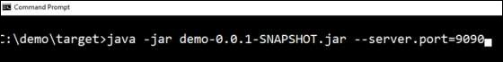

**Note** − You can provide more than one application properties by using the delimiter −.

## Properties File
Properties files are used to keep ‘N’ number of properties in a single file to run the application in a different environment. In Spring Boot, properties are kept in the **application.properties** file under the classpath.

The application.properties file is located in the **src/main/resources** directory. The code for sample **application.properties** file is given below −

```
server.port = 9090
spring.application.name = demoservice
```
Note that in the code shown above the Spring Boot application demoservice starts on the port 9090.

## YAML File
Spring Boot supports YAML based properties configurations to run the application. Instead of **application.properties**, we can use **application.yml** file. This YAML file also should be kept inside the classpath. The sample **application.yml** file is given below −

```
spring:
   application:
      name: demoservice
   server:
port: 9090
```
## Externalized Properties
Instead of keeping the properties file under classpath, we can keep the properties in different location or path. While running the JAR file, we can specify the properties file path. You can use the following command to specify the location of properties file while running the JAR −

```
-Dspring.config.location = C:\application.properties
```


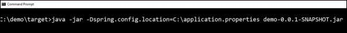

## Use of @Value Annotation
The @Value annotation is used to read the environment or application property value in Java code. The syntax to read the property value is shown below −

```
@Value("${property_key_name}")
```
Look at the following example that shows the syntax to read the **spring.application.name** property value in Java variable by using @Value annotation.

```
@Value("${spring.application.name}")
```
Observe the code given below for a better understanding −

```
import org.springframework.beans.factory.annotation.Value;
import org.springframework.boot.SpringApplication;
import org.springframework.boot.autoconfigure.SpringBootApplication;
import org.springframework.web.bind.annotation.RequestMapping;
import org.springframework.web.bind.annotation.RestController;

@SpringBootApplication
@RestController
public class DemoApplication {
   @Value("${spring.application.name}")
   private String name;
   public static void main(String[] args) {
      SpringApplication.run(DemoApplication.class, args);
   }
   @RequestMapping(value = "/")
   public String name() {
      return name;
   }
}
```
**Note** − If the property is not found while running the application, Spring Boot throws the Illegal Argument exception as **Could not resolve placeholder 'spring.application.name' in value "${spring.application.name}"**.

To resolve the placeholder issue, we can set the default value for the property using thr syntax given below −

```
@Value("${property_key_name:default_value}")

@Value("${spring.application.name:demoservice}")
```
## Spring Boot Active Profile
Spring Boot supports different properties based on the Spring active profile. For example, we can keep two separate files for development and production to run the Spring Boot application.

### Spring active profile in application.properties
Let us understand how to have Spring active profile in application.properties. By default, application. properties will be used to run the Spring Boot application. If you want to use profile based properties, we can keep separate properties file for each profile as shown below −

**application.properties**

```
server.port = 8080
spring.application.name = demoservice
```
**application-dev.properties**

```
server.port = 9090
spring.application.name = demoservice
```
**application-prod.properties**

```
server.port = 4431
spring.application.name = demoservice
```
While running the JAR file, we need to specify the spring active profile based on each properties file. By default, Spring Boot application uses the application.properties file. The command to set the spring active profile is shown below −


You can see active profile name on the console log as shown below −

```
2017-11-26 08:13:16.322  INFO 14028 --- [           
   main] com.tutorialspoint.demo.DemoApplication  :
   The following profiles are active: dev
```
Now, Tomcat has started on the port 9090 (http) as shown below −

```
2017-11-26 08:13:20.185  INFO 14028 --- [           
   main] s.b.c.e.t.TomcatEmbeddedServletContainer : 
   Tomcat started on port(s): 9090 (http)
```
You can set the Production active profile as shown below −

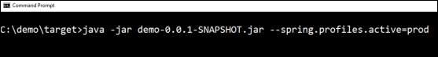

You can see active profile name on the console log as shown below −

```
2017-11-26 08:13:16.322  INFO 14028 --- [           
   main] com.tutorialspoint.demo.DemoApplication  :
   The following profiles are active: prod
```
Now, Tomcat started on the port 4431 (http) as shown below −

```
2017-11-26 08:13:20.185  INFO 14028 --- [          
   main] s.b.c.e.t.TomcatEmbeddedServletContainer :
   Tomcat started on port(s): 4431 (http)
```
### Spring active profile for application.yml
Let us understand how to keep Spring active profile for application.yml. We can keep the Spring active profile properties in the single **application.yml** file. No need to use the separate file like application.properties.

The following is an example code to keep the Spring active profiles in application.yml file. Note that the delimiter (---) is used to separate each profile in application.yml file.

```
spring:
   application:
      name: demoservice
server:
   port: 8080

---
spring:
   profiles: dev
   application:
      name: demoservice
server:
   port: 9090

---
spring: 
   profiles: prod
   application:
      name: demoservice
server: 
   port: 4431
```
To command to set development active profile is given below −


You can see active profile name on the console log as shown below −

```
2017-11-26 08:41:37.202  INFO 14104 --- [           
   main] com.tutorialspoint.demo.DemoApplication  : 
   The following profiles are active: dev
```
Now, Tomcat started on the port 9090 (http) as shown below −

```
2017-11-26 08:41:46.650  INFO 14104 --- [           
   main] s.b.c.e.t.TomcatEmbeddedServletContainer : 
   Tomcat started on port(s): 9090 (http)
```
The command to set Production active profile is given below −


You can see active profile name on the console log as shown below −

```
2017-11-26 08:43:10.743  INFO 13400 --- [    
   main] com.tutorialspoint.demo.DemoApplication  : 
   The following profiles are active: prod
```
This will start Tomcat on the port 4431 (http) as shown below:

```
2017-11-26 08:43:14.473  INFO 13400 --- [     
   main] s.b.c.e.t.TomcatEmbeddedServletContainer : 
   Tomcat started on port(s): 4431 (http)
```
# Spring Boot - Logging
Spring Boot uses Apache Commons logging for all internal logging. Spring Boot’s default configurations provides a support for the use of Java Util Logging, Log4j2, and Logback. Using these, we can configure the console logging as well as file logging.

If you are using Spring Boot Starters, Logback will provide a good support for logging. Besides, Logback also provides a use of good support for Common Logging, Util Logging, Log4J, and SLF4J.

## Log Format
The default Spring Boot Log format is shown in the screenshot given below.

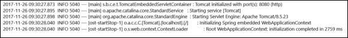

which gives you the following information −

   * **Date** and **Time** that gives the date and time of the log
   * **Log level** shows INFO, ERROR or WARN
   * **Process ID**
   * The --- which is a separator
   * **Thread name** is enclosed within the square brackets []
   * **Logger Name** that shows the Source class name
   * The Log message

## Console Log Output
The default log messages will print to the console window. By default, “INFO”, “ERROR” and “WARN” log messages will print in the log file.

If you have to enable the debug level log, add the debug flag on starting your application using the command shown below −

```
java –jar demo.jar --debug
```
You can also add the debug mode to your application.properties file as shown here −

```
debug = true
```
## File Log Output
By default, all logs will print on the console window and not in the files. If you want to print the logs in a file, you need to set the property **logging.file** or **logging.path** in the application.properties file.

You can specify the log file path using the property shown below. Note that the log file name is spring.log.

```
logging.path = /var/tmp/
```
You can specify the own log file name using the property shown below −

```
logging.file = /var/tmp/mylog.log
```
**Note** − files will rotate automatically after reaching the size 10 MB.

## Log Levels
Spring Boot supports all logger levels such as “TRACE”, “DEBUG”, “INFO”, “WARN”, “ERROR”, “FATAL”, “OFF”. You can define Root logger in the application.properties file as shown below −

```
logging.level.root = WARN
```
**Note** − Logback does not support “FATAL” level log. It is mapped to the “ERROR” level log.

## Configure Logback
Logback supports XML based configuration to handle Spring Boot Log configurations. Logging configuration details are configured in **logback.xml** file. The logback.xml file should be placed under the classpath.

You can configure the ROOT level log in Logback.xml file using the code given below −

```
<?xml version = "1.0" encoding = "UTF-8"?>
<configuration>
   <root level = "INFO">
   </root>
</configuration>
```
You can configure the console appender in Logback.xml file given below.

```
<?xml version = "1.0" encoding = "UTF-8"?>
<configuration>
   <appender name = "STDOUT" class = "ch.qos.logback.core.ConsoleAppender"></appender>
   <root level = "INFO">
      <appender-ref ref = "STDOUT"/> 
   </root>
</configuration>
```
You can configure the file appender in Logback.xml file using the code given below. Note that you need to specify the Log file path insider the file appender.

```
<?xml version = "1.0" encoding = "UTF-8"?>
<configuration>
   <appender name = "FILE" class = "ch.qos.logback.core.FileAppender">
      <File>/var/tmp/mylog.log</File>
   </appender>   
   <root level = "INFO">
      <appender-ref ref = "FILE"/>
   </root>
</configuration>
```
You can define the Log pattern in **logback.xml** file using the code given below. You can also define the set of supported log patterns inside the console or file log appender using the code given below −

```
<pattern>[%d{yyyy-MM-dd'T'HH:mm:ss.sss'Z'}] [%C] [%t] [%L] [%-5p] %m%n</pattern>
```
The code for complete logback.xml file is given below. You have to place this in the class path.

```
<?xml version = "1.0" encoding = "UTF-8"?>
<configuration>
   <appender name = "STDOUT" class = "ch.qos.logback.core.ConsoleAppender">
      <encoder>
         <pattern>[%d{yyyy-MM-dd'T'HH:mm:ss.sss'Z'}] [%C] [%t] [%L] [%-5p] %m%n</pattern>
      </encoder>
   </appender>
   
   <appender name = "FILE" class = "ch.qos.logback.core.FileAppender">
      <File>/var/tmp/mylog.log</File>
      <encoder>
         <pattern>[%d{yyyy-MM-dd'T'HH:mm:ss.sss'Z'}] [%C] [%t] [%L] [%-5p] %m%n</pattern>
      </encoder>
   </appender>
   
   <root level = "INFO">
      <appender-ref ref = "FILE"/>
      <appender-ref ref = "STDOUT"/> 
   </root>
</configuration>
```
The code given below shows how to add the slf4j logger in Spring Boot main class file.

```
package com.tutorialspoint.demo;

import org.slf4j.Logger;
import org.slf4j.LoggerFactory;
import org.springframework.boot.SpringApplication;
import org.springframework.boot.autoconfigure.SpringBootApplication;

@SpringBootApplication
public class DemoApplication {
   private static final Logger logger = LoggerFactory.getLogger(DemoApplication.class);
   
   public static void main(String[] args) {
      logger.info("this is a info message");
      logger.warn("this is a warn message");
      logger.error("this is a error message");
      SpringApplication.run(DemoApplication.class, args);
   }
}
```
The output that you can see in the console window is shown here −


The output that you can see in the log file is shown here −


# Spring Boot - Building RESTful Web Services
Spring Boot provides a very good support to building RESTful Web Services for enterprise applications. This chapter will explain in detail about building RESTful web services using Spring Boot.

**Note** − For building a RESTful Web Services, we need to add the Spring Boot Starter Web dependency into the build configuration file.

If you are a Maven user, use the following code to add the below dependency in your **pom.xml** file −

```
<dependency>
   <groupId>org.springframework.boot</groupId>
   <artifactId>spring-boot-starter-web</artifactId>    
</dependency>
```
If you are a Gradle user, use the following code to add the below dependency in your **build.gradle** file.

```
compile('org.springframework.boot:spring-boot-starter-web')
```
The code for complete build configuration file **Maven build – pom.xml** is given below −

```
<?xml version = "1.0" encoding = "UTF-8"?>
<project xmlns = "http://maven.apache.org/POM/4.0.0" 
   xmlns:xsi = "http://www.w3.org/2001/XMLSchema-instance"
   xsi:schemaLocation = "http://maven.apache.org/POM/4.0.0 
   http://maven.apache.org/xsd/maven-4.0.0.xsd">
   
   <modelVersion>4.0.0</modelVersion>
   <groupId>com.tutorialspoint</groupId>
   <artifactId>demo</artifactId>
   <version>0.0.1-SNAPSHOT</version>
   <packaging>jar</packaging>
   <name>demo</name>
   <description>Demo project for Spring Boot</description>
   
   <parent>
      <groupId>org.springframework.boot</groupId>
      <artifactId>spring-boot-starter-parent</artifactId>
      <version>1.5.8.RELEASE</version>
      <relativePath/> 
   </parent>
   
   <properties>
      <project.build.sourceEncoding>UTF-8</project.build.sourceEncoding>
      <project.reporting.outputEncoding>UTF-8</project.reporting.outputEncoding>
      <java.version>1.8</java.version>
   </properties>
   
   <dependencies>
      <dependency>
         <groupId>org.springframework.boot</groupId>
         <artifactId>spring-boot-starter-web</artifactId>
      </dependency>
      <dependency>
         <groupId>org.springframework.boot</groupId>
         <artifactId>spring-boot-starter-test</artifactId>
         <scope>test</scope>
      </dependency>
   </dependencies>
   
   <build>
      <plugins>
         <plugin>
            <groupId>org.springframework.boot</groupId>
            <artifactId>spring-boot-maven-plugin</artifactId>
         </plugin>
      </plugins>
   </build>
   
</project>
```
The code for complete build configuration file **Gradle Build – build.gradle** is given below −

```
buildscript {
   ext {
      springBootVersion = '1.5.8.RELEASE'
   }
   repositories {
      mavenCentral()
   }
   dependencies {
      classpath("org.springframework.boot:spring-boot-gradle-plugin:${springBootVersion}")
   }
}

apply plugin: 'java'
apply plugin: 'eclipse'
apply plugin: 'org.springframework.boot'

group = 'com.tutorialspoint'
version = '0.0.1-SNAPSHOT'
sourceCompatibility = 1.8

repositories {
   mavenCentral()
}
dependencies {
   compile('org.springframework.boot:spring-boot-starter-web')
   testCompile('org.springframework.boot:spring-boot-starter-test')
}
```
Before you proceed to build a RESTful web service, it is suggested that you have knowledge of the following annotations −

## Rest Controller
The @RestController annotation is used to define the RESTful web services. It serves JSON, XML and custom response. Its syntax is shown below −

```
@RestController
public class ProductServiceController { 
}
```
## Request Mapping
The @RequestMapping annotation is used to define the Request URI to access the REST Endpoints. We can define Request method to consume and produce object. The default request method is GET.

```
@RequestMapping(value = "/products")
public ResponseEntity<Object> getProducts() { }
```
## Request Body
The @RequestBody annotation is used to define the request body content type.

```
public ResponseEntity<Object> createProduct(@RequestBody Product product) {
}
```
## Path Variable
The @PathVariable annotation is used to define the custom or dynamic request URI. The Path variable in request URI is defined as curly braces {} as shown below −

```
public ResponseEntity<Object> updateProduct(@PathVariable("id") String id) {
}
```
## Request Parameter
The @RequestParam annotation is used to read the request parameters from the Request URL. By default, it is a required parameter. We can also set default value for request parameters as shown here −

```
public ResponseEntity<Object> getProduct(
   @RequestParam(value = "name", required = false, defaultValue = "honey") String name) {
}
```
## GET API
The default HTTP request method is GET. This method does not require any Request Body. You can send request parameters and path variables to define the custom or dynamic URL.

The sample code to define the HTTP GET request method is shown below. In this example, we used HashMap to store the Product. Note that we used a POJO class as the product to be stored.

Here, the request URI is **/products** and it will return the list of products from HashMap repository. The controller class file is given below that contains GET method REST Endpoint.

```
package com.tutorialspoint.demo.controller;

import java.util.HashMap;
import java.util.Map;

import org.springframework.http.HttpStatus;
import org.springframework.http.ResponseEntity;
import org.springframework.web.bind.annotation.RequestMapping;
import org.springframework.web.bind.annotation.RestController;

import com.tutorialspoint.demo.model.Product;

@RestController
public class ProductServiceController {
   private static Map<String, Product> productRepo = new HashMap<>();
   static {
      Product honey = new Product();
      honey.setId("1");
      honey.setName("Honey");
      productRepo.put(honey.getId(), honey);
      
      Product almond = new Product();
      almond.setId("2");
      almond.setName("Almond");
      productRepo.put(almond.getId(), almond);
   }
   @RequestMapping(value = "/products")
   public ResponseEntity<Object> getProduct() {
      return new ResponseEntity<>(productRepo.values(), HttpStatus.OK);
   }
}
```
## POST API
The HTTP POST request is used to create a resource. This method contains the Request Body. We can send request parameters and path variables to define the custom or dynamic URL.

The following example shows the sample code to define the HTTP POST request method. In this example, we used HashMap to store the Product, where the product is a POJO class.

Here, the request URI is **/products**, and it will return the String after storing the product into HashMap repository.

```
package com.tutorialspoint.demo.controller;

import java.util.HashMap;
import java.util.Map;

import org.springframework.http.HttpStatus;
import org.springframework.http.ResponseEntity;
import org.springframework.web.bind.annotation.RequestBody;
import org.springframework.web.bind.annotation.RequestMapping;
import org.springframework.web.bind.annotation.RequestMethod;
import org.springframework.web.bind.annotation.RestController;

import com.tutorialspoint.demo.model.Product;

@RestController
public class ProductServiceController {
   private static Map<String, Product> productRepo = new HashMap<>();
   
   @RequestMapping(value = "/products", method = RequestMethod.POST)
   public ResponseEntity<Object> createProduct(@RequestBody Product product) {
      productRepo.put(product.getId(), product);
      return new ResponseEntity<>("Product is created successfully", HttpStatus.CREATED);
   }
}
```
## PUT API
The HTTP PUT request is used to update the existing resource. This method contains a Request Body. We can send request parameters and path variables to define the custom or dynamic URL.

The example given below shows how to define the HTTP PUT request method. In this example, we used HashMap to update the existing Product, where the product is a POJO class.

Here the request URI is **/products/{id}** which will return the String after a the product into a HashMap repository. Note that we used the Path variable **{id}** which defines the products ID that needs to be updated.

```
package com.tutorialspoint.demo.controller;

import java.util.HashMap;
import java.util.Map;

import org.springframework.http.HttpStatus;
import org.springframework.http.ResponseEntity;
import org.springframework.web.bind.annotation.PathVariable;
import org.springframework.web.bind.annotation.RequestBody;
import org.springframework.web.bind.annotation.RequestMapping;
import org.springframework.web.bind.annotation.RequestMethod;
import org.springframework.web.bind.annotation.RestController;
import com.tutorialspoint.demo.model.Product;

@RestController
public class ProductServiceController {
   private static Map<String, Product> productRepo = new HashMap<>();
   
   @RequestMapping(value = "/products/{id}", method = RequestMethod.PUT)
   public ResponseEntity<Object> updateProduct(@PathVariable("id") String id, @RequestBody Product product) { 
      productRepo.remove(id);
      product.setId(id);
      productRepo.put(id, product);
      return new ResponseEntity<>("Product is updated successsfully", HttpStatus.OK);
   }   
}
```
## DELETE API
The HTTP Delete request is used to delete the existing resource. This method does not contain any Request Body. We can send request parameters and path variables to define the custom or dynamic URL.

The example given below shows how to define the HTTP DELETE request method. In this example, we used HashMap to remove the existing product, which is a POJO class.

The request URI is **/products/{id}** and it will return the String after deleting the product from HashMap repository. We used the Path variable **{id}** which defines the products ID that needs to be deleted.

```
package com.tutorialspoint.demo.controller;

import java.util.HashMap;
import java.util.Map;

import org.springframework.http.HttpStatus;
import org.springframework.http.ResponseEntity;
import org.springframework.web.bind.annotation.PathVariable;
import org.springframework.web.bind.annotation.RequestBody;
import org.springframework.web.bind.annotation.RequestMapping;
import org.springframework.web.bind.annotation.RequestMethod;
import org.springframework.web.bind.annotation.RestController;

import com.tutorialspoint.demo.model.Product;

@RestController
public class ProductServiceController {
   private static Map<String, Product> productRepo = new HashMap<>();
   
   @RequestMapping(value = "/products/{id}", method = RequestMethod.DELETE)
   public ResponseEntity<Object> delete(@PathVariable("id") String id) { 
      productRepo.remove(id);
      return new ResponseEntity<>("Product is deleted successsfully", HttpStatus.OK);
   }
}
```
This section gives you the complete set of source code. Observe the following codes for their respective functionalities −

**The Spring Boot main application class – DemoApplication.java**

```
package com.tutorialspoint.demo;

import org.springframework.boot.SpringApplication;
import org.springframework.boot.autoconfigure.SpringBootApplication;

@SpringBootApplication
public class DemoApplication {
   public static void main(String[] args) {
      SpringApplication.run(DemoApplication.class, args);
   }
}
```
**The POJO class – Product.java**

```
package com.tutorialspoint.demo.model;

public class Product {
   private String id;
   private String name;

   public String getId() {
      return id;
   }
   public void setId(String id) {
      this.id = id;
   }
   public String getName() {
      return name;
   }
   public void setName(String name) {
      this.name = name;
   }
}
```
**The Rest Controller class – ProductServiceController.java**

```
package com.tutorialspoint.demo.controller;

import java.util.HashMap;
import java.util.Map;

import org.springframework.http.HttpStatus;
import org.springframework.http.ResponseEntity;
import org.springframework.web.bind.annotation.PathVariable;
import org.springframework.web.bind.annotation.RequestBody;
import org.springframework.web.bind.annotation.RequestMapping;
import org.springframework.web.bind.annotation.RequestMethod;
import org.springframework.web.bind.annotation.RestController;

import com.tutorialspoint.demo.model.Product;

@RestController
public class ProductServiceController {
   private static Map<String, Product> productRepo = new HashMap<>();
   static {
      Product honey = new Product();
      honey.setId("1");
      honey.setName("Honey");
      productRepo.put(honey.getId(), honey);
      
      Product almond = new Product();
      almond.setId("2");
      almond.setName("Almond");
      productRepo.put(almond.getId(), almond);
   }
   
   @RequestMapping(value = "/products/{id}", method = RequestMethod.DELETE)
   public ResponseEntity<Object> delete(@PathVariable("id") String id) { 
      productRepo.remove(id);
      return new ResponseEntity<>("Product is deleted successsfully", HttpStatus.OK);
   }
   
   @RequestMapping(value = "/products/{id}", method = RequestMethod.PUT)
   public ResponseEntity<Object> updateProduct(@PathVariable("id") String id, @RequestBody Product product) { 
      productRepo.remove(id);
      product.setId(id);
      productRepo.put(id, product);
      return new ResponseEntity<>("Product is updated successsfully", HttpStatus.OK);
   }
   
   @RequestMapping(value = "/products", method = RequestMethod.POST)
   public ResponseEntity<Object> createProduct(@RequestBody Product product) {
      productRepo.put(product.getId(), product);
      return new ResponseEntity<>("Product is created successfully", HttpStatus.CREATED);
   }
   
   @RequestMapping(value = "/products")
   public ResponseEntity<Object> getProduct() {
      return new ResponseEntity<>(productRepo.values(), HttpStatus.OK);
   }
}
```
You can create an executable JAR file, and run the spring boot application by using the below Maven or Gradle commands as shown −

For Maven, use the command shown below −

```
mvn clean install
```
After “BUILD SUCCESS”, you can find the JAR file under the target directory.

For Gradle, use the command shown below −

```
gradle clean build
```
After “BUILD SUCCESSFUL”, you can find the JAR file under the build/libs directory.

You can run the JAR file by using the command shown below −

```
java –jar <JARFILE>
```
This will start the application on the Tomcat port 8080 as shown below −


Now hit the URL shown below in POSTMAN application and see the output.

GET API URL is: **http://localhost:8080/products**


POST API URL is: **http://localhost:8080/products**


PUT API URL is: **http://localhost:8080/products/3**


DELETE API URL is: **http://localhost:8080/products/3**


# Spring Boot - Exception Handling
Handling exceptions and errors in APIs and sending the proper response to the client is good for enterprise applications. In this chapter, we will learn how to handle exceptions in Spring Boot.

Before proceeding with exception handling, let us gain an understanding on the following annotations.

## Controller Advice
The @ControllerAdvice is an annotation, to handle the exceptions globally.

## Exception Handler
The @ExceptionHandler is an annotation used to handle the specific exceptions and sending the custom responses to the client.

You can use the following code to create @ControllerAdvice class to handle the exceptions globally −

```
package com.tutorialspoint.demo.exception;

import org.springframework.web.bind.annotation.ControllerAdvice;

@ControllerAdvice
   public class ProductExceptionController {
}
```
Define a class that extends the RuntimeException class.

```
package com.tutorialspoint.demo.exception;

public class ProductNotfoundException extends RuntimeException {
   private static final long serialVersionUID = 1L;
}
```
You can define the @ExceptionHandler method to handle the exceptions as shown. This method should be used for writing the Controller Advice class file.

```
@ExceptionHandler(value = ProductNotfoundException.class)

public ResponseEntity<Object> exception(ProductNotfoundException exception) {
}
```
Now, use the code given below to throw the exception from the API.

```
@RequestMapping(value = "/products/{id}", method = RequestMethod.PUT)
public ResponseEntity<Object> updateProduct() { 
   throw new ProductNotfoundException();
}
```
The complete code to handle the exception is given below. In this example, we used the PUT API to update the product. Here, while updating the product, if the product is not found, then return the response error message as “Product not found”. Note that the **ProductNotFoundException** exception class should extend the **RuntimeException**.

```
package com.tutorialspoint.demo.exception;
public class ProductNotfoundException extends RuntimeException {
   private static final long serialVersionUID = 1L;
}
```
The Controller Advice class to handle the exception globally is given below. We can define any Exception Handler methods in this class file.

```
package com.tutorialspoint.demo.exception;

import org.springframework.http.HttpStatus;
import org.springframework.http.ResponseEntity;
import org.springframework.web.bind.annotation.ControllerAdvice;
import org.springframework.web.bind.annotation.ExceptionHandler;

@ControllerAdvice
public class ProductExceptionController {
   @ExceptionHandler(value = ProductNotfoundException.class)
   public ResponseEntity<Object> exception(ProductNotfoundException exception) {
      return new ResponseEntity<>("Product not found", HttpStatus.NOT_FOUND);
   }
}
```
The Product Service API controller file is given below to update the Product. If the Product is not found, then it throws the **ProductNotFoundException** class.

```
package com.tutorialspoint.demo.controller;

import java.util.HashMap;
import java.util.Map;

import org.springframework.http.HttpStatus;
import org.springframework.http.ResponseEntity;
import org.springframework.web.bind.annotation.PathVariable;
import org.springframework.web.bind.annotation.RequestBody;
import org.springframework.web.bind.annotation.RequestMapping;
import org.springframework.web.bind.annotation.RequestMethod;
import org.springframework.web.bind.annotation.RestController;

import com.tutorialspoint.demo.exception.ProductNotfoundException;
import com.tutorialspoint.demo.model.Product;

@RestController
public class ProductServiceController {
   private static Map<String, Product> productRepo = new HashMap<>();
   static {
      Product honey = new Product();
      honey.setId("1");
      honey.setName("Honey");
      productRepo.put(honey.getId(), honey);
      
      Product almond = new Product();
      almond.setId("2");
      almond.setName("Almond");
      productRepo.put(almond.getId(), almond);
   }
   
   @RequestMapping(value = "/products/{id}", method = RequestMethod.PUT)
   public ResponseEntity<Object> updateProduct(@PathVariable("id") String id, @RequestBody Product product) { 
      if(!productRepo.containsKey(id))throw new ProductNotfoundException();
      productRepo.remove(id);
      product.setId(id);
      productRepo.put(id, product);
      return new ResponseEntity<>("Product is updated successfully", HttpStatus.OK);
   }
}
```
The code for main Spring Boot application class file is given below −

```
package com.tutorialspoint.demo;

import org.springframework.boot.SpringApplication;
import org.springframework.boot.autoconfigure.SpringBootApplication;

@SpringBootApplication
public class DemoApplication {
   public static void main(String[] args) {
      SpringApplication.run(DemoApplication.class, args);
   }
}
```
The code for **POJO class** for Product is given below −

```
package com.tutorialspoint.demo.model;
public class Product {
   private String id;
   private String name;

   public String getId() {
      return id;
   }
   public void setId(String id) {
      this.id = id;
   }
   public String getName() {
      return name;
   }
   public void setName(String name) {
      this.name = name;
   }
}
```
The code for **Maven build – pom.xml** is shown below −

```
<?xml version = "1.0" encoding = "UTF-8"?>
<project xmlns = "http://maven.apache.org/POM/4.0.0" 
   xmlns:xsi = "http://www.w3.org/2001/XMLSchema-instance"
   xsi:schemaLocation = "http://maven.apache.org/POM/4.0.0 
   http://maven.apache.org/xsd/maven-4.0.0.xsd">
   
   <modelVersion>4.0.0</modelVersion>
   <groupId>com.tutorialspoint</groupId>
   <artifactId>demo</artifactId>
   <version>0.0.1-SNAPSHOT</version>
   <packaging>jar</packaging>
   <name>demo</name>
   <description>Demo project for Spring Boot</description>

   <parent>
      <groupId>org.springframework.boot</groupId>
      <artifactId>spring-boot-starter-parent</artifactId>
      <version>1.5.8.RELEASE</version>
      <relativePath/> 
   </parent>

   <properties>
      <project.build.sourceEncoding>UTF-8</project.build.sourceEncoding>
      <project.reporting.outputEncoding>UTF-8</project.reporting.outputEncoding>
      <java.version>1.8</java.version>
   </properties>

   <dependencies>
      <dependency>
         <groupId>org.springframework.boot</groupId>
         <artifactId>spring-boot-starter-web</artifactId>
      </dependency>
      <dependency>
         <groupId>org.springframework.boot</groupId>
         <artifactId>spring-boot-starter-test</artifactId>
         <scope>test</scope>
      </dependency>
   </dependencies>

   <build>
      <plugins>
         <plugin>
            <groupId>org.springframework.boot</groupId>
            <artifactId>spring-boot-maven-plugin</artifactId>
         </plugin>
      </plugins>
   </build>
   
</project>
```
The code for **Gradle Build – build.gradle** is given below −

```
buildscript {
   ext {
      springBootVersion = '1.5.8.RELEASE'
   }
   repositories {
      mavenCentral()
   }
   dependencies {
      classpath("org.springframework.boot:spring-boot-gradle-plugin:${springBootVersion}")
   }
}
apply plugin: 'java'
apply plugin: 'eclipse'
apply plugin: 'org.springframework.boot'

group = 'com.tutorialspoint'
version = '0.0.1-SNAPSHOT'
sourceCompatibility = 1.8

repositories {
   mavenCentral()
}
dependencies {
   compile('org.springframework.boot:spring-boot-starter-web')
   testCompile('org.springframework.boot:spring-boot-starter-test')
}
```
You can create an executable JAR file, and run the Spring Boot application by using the Maven or Gradle commands −

For Maven, you can use the following command −

```
mvn clean install
```
After “BUILD SUCCESS”, you can find the JAR file under the target directory.

For Gradle, you can use the following command −

```
gradle clean build
```
After “BUILD SUCCESSFUL”, you can find the JAR file under the build/libs directory.

You can run the JAR file by using the following command −

```
java –jar <JARFILE>
```
This will start the application on the Tomcat port 8080 as shown below −


Now hit the below URL in POSTMAN application and you can see the output as shown below −

Update URL: http://localhost:8080/products/3

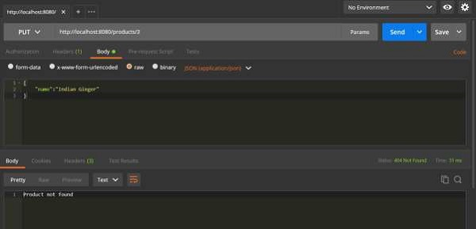

# Spring Boot - Interceptor
You can use the Interceptor in Spring Boot to perform operations under the following situations −

   * Before sending the request to the controller
   * Before sending the response to the client

For example, you can use an interceptor to add the request header before sending the request to the controller and add the response header before sending the response to the client.

To work with interceptor, you need to create **@Component** class that supports it and it should implement the **HandlerInterceptor** interface.

The following are the three methods you should know about while working on Interceptors −

   * **preHandle()** method − This is used to perform operations before sending the request to the controller. This method should return true to return the response to the client.
   * **postHandle()** method − This is used to perform operations before sending the response to the client.
   * **afterCompletion()** method − This is used to perform operations after completing the request and response.

Observe the following code for a better understanding −

```
@Component
public class ProductServiceInterceptor implements HandlerInterceptor {
   @Override
   public boolean preHandle(
      HttpServletRequest request, HttpServletResponse response, Object handler) throws Exception {
      
      return true;
   }
   @Override
   public void postHandle(
      HttpServletRequest request, HttpServletResponse response, Object handler, 
      ModelAndView modelAndView) throws Exception {}
   
   @Override
   public void afterCompletion(HttpServletRequest request, HttpServletResponse response, 
      Object handler, Exception exception) throws Exception {}
}
```
You will have to register this Interceptor with **InterceptorRegistry** by using **WebMvcConfigurerAdapter** as shown below −

```
@Component
public class ProductServiceInterceptorAppConfig extends WebMvcConfigurerAdapter {
   @Autowired
   ProductServiceInterceptor productServiceInterceptor;

   @Override
   public void addInterceptors(InterceptorRegistry registry) {
      registry.addInterceptor(productServiceInterceptor);
   }
}
```
In the example given below, we are going to hit the GET products API which gives the output as given under −

The code for the Interceptor class ProductServiceInterceptor.java is given below −

```
package com.tutorialspoint.demo.interceptor;

import javax.servlet.http.HttpServletRequest;
import javax.servlet.http.HttpServletResponse;

import org.springframework.stereotype.Component;
import org.springframework.web.servlet.HandlerInterceptor;
import org.springframework.web.servlet.ModelAndView;

@Component
public class ProductServiceInterceptor implements HandlerInterceptor {
   @Override
   public boolean preHandle
      (HttpServletRequest request, HttpServletResponse response, Object handler) 
      throws Exception {
      
      System.out.println("Pre Handle method is Calling");
      return true;
   }
   @Override
   public void postHandle(HttpServletRequest request, HttpServletResponse response, 
      Object handler, ModelAndView modelAndView) throws Exception {
      
      System.out.println("Post Handle method is Calling");
   }
   @Override
   public void afterCompletion
      (HttpServletRequest request, HttpServletResponse response, Object 
      handler, Exception exception) throws Exception {
      
      System.out.println("Request and Response is completed");
   }
}
```
The code for Application Configuration class file to register the Interceptor into Interceptor Registry – ProductServiceInterceptorAppConfig.java is given below −

```
package com.tutorialspoint.demo.interceptor;

import org.springframework.beans.factory.annotation.Autowired;
import org.springframework.stereotype.Component;
import org.springframework.web.servlet.config.annotation.InterceptorRegistry;
import org.springframework.web.servlet.config.annotation.WebMvcConfigurerAdapter;

@Component
public class ProductServiceInterceptorAppConfig extends WebMvcConfigurerAdapter {
   @Autowired
   ProductServiceInterceptor productServiceInterceptor;

   @Override
   public void addInterceptors(InterceptorRegistry registry) {
      registry.addInterceptor(productServiceInterceptor);
   }
}
```
The code for Controller class file ProductServiceController.java is given below −

```
package com.tutorialspoint.demo.controller;

import java.util.HashMap;
import java.util.Map;

import org.springframework.http.HttpStatus;
import org.springframework.http.ResponseEntity;
import org.springframework.web.bind.annotation.PathVariable;
import org.springframework.web.bind.annotation.RequestBody;
import org.springframework.web.bind.annotation.RequestMapping;
import org.springframework.web.bind.annotation.RequestMethod;
import org.springframework.web.bind.annotation.RestController;
import com.tutorialspoint.demo.exception.ProductNotfoundException;
import com.tutorialspoint.demo.model.Product;

@RestController
public class ProductServiceController {
   private static Map<String, Product> productRepo = new HashMap<>();   
   static {      
      Product honey = new Product();
      honey.setId("1");
      honey.setName("Honey");
      productRepo.put(honey.getId(), honey);      
      Product almond = new Product();
      almond.setId("2");
      almond.setName("Almond");
      productRepo.put(almond.getId(), almond);      
   }
   @RequestMapping(value = "/products")
   public ResponseEntity<Object> getProduct() {
      return new ResponseEntity<>(productRepo.values(), HttpStatus.OK);
   }
}
```
The code for POJO class for Product.java is given below −

```
package com.tutorialspoint.demo.model;

public class Product {
   private String id;
   private String name;

   public String getId() {
      return id;
   }
   public void setId(String id) {
      this.id = id;
   }
   public String getName() {
      return name;
   }
   public void setName(String name) {
      this.name = name;
   }
}
```
The code for main Spring Boot application class file **DemoApplication.java** is given below −

```
package com.tutorialspoint.demo;

import org.springframework.boot.SpringApplication;
import org.springframework.boot.autoconfigure.SpringBootApplication;

@SpringBootApplication
public class DemoApplication {
   public static void main(String[] args) {
      SpringApplication.run(DemoApplication.class, args);   
   }
}
```
The code for Maven build – **pom.xml** is shown here −

```
<?xml version = "1.0" encoding = "UTF-8"?>
<project xmlns = "http://maven.apache.org/POM/4.0.0" xmlns:xsi = "
   http://www.w3.org/2001/XMLSchema-instance"
   xsi:schemaLocation = "http://maven.apache.org/POM/4.0.0 
   http://maven.apache.org/xsd/maven-4.0.0.xsd">
   
   <modelVersion>4.0.0</modelVersion>
   <groupId>com.tutorialspoint</groupId>
   <artifactId>demo</artifactId>
   <version>0.0.1-SNAPSHOT</version>
   <packaging>jar</packaging>
   <name>demo</name>
   <description>Demo project for Spring Boot</description>

   <parent>
      <groupId>org.springframework.boot</groupId>
      <artifactId>spring-boot-starter-parent</artifactId>
      <version>1.5.8.RELEASE</version>
      <relativePath/> 
   </parent>

   <properties>
      <project.build.sourceEncoding>UTF-8</project.build.sourceEncoding>
      <project.reporting.outputEncoding>UTF-8</project.reporting.outputEncoding>
      <java.version>1.8</java.version>
   </properties>

   <dependencies>
      <dependency>
         <groupId>org.springframework.boot</groupId>
         <artifactId>spring-boot-starter-web</artifactId>
      </dependency>

      <dependency>
         <groupId>org.springframework.boot</groupId>
         <artifactId>spring-boot-starter-test</artifactId>
         <scope>test</scope>
      </dependency>
   </dependencies>

   <build>
      <plugins>
         <plugin>
            <groupId>org.springframework.boot</groupId>
            <artifactId>spring-boot-maven-plugin</artifactId>
         </plugin>
      </plugins>
   </build>
   
</project>
```
The code for Gradle Build **build.gradle** is shown here −

```
buildscript {
   ext {
      springBootVersion = '1.5.8.RELEASE'
   }
   repositories {
      mavenCentral()
   }
   dependencies {
      classpath("org.springframework.boot:spring-boot-gradle-plugin:${springBootVersion}")
   }
}
apply plugin: 'java'
apply plugin: 'eclipse'
apply plugin: 'org.springframework.boot'
group = 'com.tutorialspoint'
version = '0.0.1-SNAPSHOT'
sourceCompatibility = 1.8

repositories {
   mavenCentral()
}
dependencies {
   compile('org.springframework.boot:spring-boot-starter-web')
   testCompile('org.springframework.boot:spring-boot-starter-test')
}
```
You can create an executable JAR file, and run the Spring Boot application by using the below Maven or Gradle commands.

For Maven, use the command as shown below −

```
mvn clean install
```
After “BUILD SUCCESS”, you can find the JAR file under the target directory.

For Gradle, use the command as shown below −

```
gradle clean build
```
After “BUILD SUCCESSFUL”, you can find the JAR file under the build/libs directory.

You can run the JAR file by using the following command −

```
java –jar <JARFILE>
```
Now, the application has started on the Tomcat port 8080 as shown below −


Now hit the below URL in POSTMAN application and you can see the output as shown under −

GET API: **http://localhost:8080/products**


In the console window, you can see the System.out.println statements added in the Interceptor as shown in the screenshot given below −


# Spring Boot - Servlet Filter
A filter is an object used to intercept the HTTP requests and responses of your application. By using filter, we can perform two operations at two instances −

   * Before sending the request to the controller
   * Before sending a response to the client.

The following code shows the sample code for a Servlet Filter implementation class with @Component annotation.

```
@Component
public class SimpleFilter implements Filter {
   @Override
   public void destroy() {}

   @Override
   public void doFilter
      (ServletRequest request, ServletResponse response, FilterChain filterchain) 
      throws IOException, ServletException {}

   @Override
   public void init(FilterConfig filterconfig) throws ServletException {}
}
```
The following example shows the code for reading the remote host and remote address from the ServletRequest object before sending the request to the controller.

In doFilter() method, we have added the System.out.println statements to print the remote host and remote address.

```
package com.tutorialspoint.demo;

import java.io.IOException;

import javax.servlet.Filter;
import javax.servlet.FilterChain;
import javax.servlet.FilterConfig;
import javax.servlet.ServletException;
import javax.servlet.ServletRequest;
import javax.servlet.ServletResponse;

import org.springframework.stereotype.Component;

@Component
public class SimpleFilter implements Filter {
   @Override
   public void destroy() {}

   @Override
   public void doFilter(ServletRequest request, ServletResponse response, FilterChain filterchain) 
      throws IOException, ServletException {
      
      System.out.println("Remote Host:"+request.getRemoteHost());
      System.out.println("Remote Address:"+request.getRemoteAddr());
      filterchain.doFilter(request, response);
   }

   @Override
   public void init(FilterConfig filterconfig) throws ServletException {}
}
```
In the Spring Boot main application class file, we have added the simple REST endpoint that returns the “Hello World” string.

```
package com.tutorialspoint.demo;

import org.springframework.boot.SpringApplication;
import org.springframework.boot.autoconfigure.SpringBootApplication;
import org.springframework.web.bind.annotation.RequestMapping;
import org.springframework.web.bind.annotation.RestController;

@SpringBootApplication
@RestController
public class DemoApplication {
   public static void main(String[] args) {
      SpringApplication.run(DemoApplication.class, args);
   }
   @RequestMapping(value = "/")
   public String hello() {
      return "Hello World";
   }
}
```
The code for Maven build – **pom.xml** is given below −

```
<?xml version = "1.0" encoding = "UTF-8"?>
<project xmlns = "http://maven.apache.org/POM/4.0.0" xmlns:xsi = "
   http://www.w3.org/2001/XMLSchema-instance"
   xsi:schemaLocation = "http://maven.apache.org/POM/4.0.0 
   http://maven.apache.org/xsd/maven-4.0.0.xsd">
   
   <modelVersion>4.0.0</modelVersion>
   <groupId>com.tutorialspoint</groupId>
   <artifactId>demo</artifactId>
   <version>0.0.1-SNAPSHOT</version>
   <packaging>jar</packaging>
   <name>demo</name>
   <description>Demo project for Spring Boot</description>

   <parent>
      <groupId>org.springframework.boot</groupId>
      <artifactId>spring-boot-starter-parent</artifactId>
      <version>1.5.8.RELEASE</version>
      <relativePath/> 
   </parent>

   <properties>
      <project.build.sourceEncoding>UTF-8</project.build.sourceEncoding>
      <project.reporting.outputEncoding>UTF-8</project.reporting.outputEncoding>
      <java.version>1.8</java.version>
   </properties>

   <dependencies>
      <dependency>
         <groupId>org.springframework.boot</groupId>
         <artifactId>spring-boot-starter-web</artifactId>
      </dependency>

      <dependency>
         <groupId>org.springframework.boot</groupId>
         <artifactId>spring-boot-starter-test</artifactId>
         <scope>test</scope>
      </dependency>
   </dependencies>

   <build>
      <plugins>
         <plugin>
            <groupId>org.springframework.boot</groupId>
            <artifactId>spring-boot-maven-plugin</artifactId>
         </plugin>
      </plugins>
   </build>
   
</project>
```
The code for Gradle Build – build.gradle is given below −

```
buildscript {
   ext {
      springBootVersion = '1.5.8.RELEASE'
   }
   repositories {
      mavenCentral()
   }
   dependencies {
      classpath("org.springframework.boot:spring-boot-gradle-plugin:${springBootVersion}")
   }
}

apply plugin: 'java'
apply plugin: 'eclipse'
apply plugin: 'org.springframework.boot'

group = 'com.tutorialspoint'
version = '0.0.1-SNAPSHOT'
sourceCompatibility = 1.8

repositories {
   mavenCentral()
}
dependencies {
   compile('org.springframework.boot:spring-boot-starter-web')
   testCompile('org.springframework.boot:spring-boot-starter-test')
}
```
You can create an executable JAR file, and run the Spring Boot application by using the Maven or Gradle commands shown below −

For Maven, use the command as shown below −

```
mvn clean install
```
After BUILD SUCCESS, you can find the JAR file under the target directory.

For Gradle, use the command as shown below −

```
gradle clean build
```
After BUILD SUCCESSFUL, you can find the JAR file under the build/libs directory.

Now, run the JAR file by using the following command

```
java –jar <JARFILE>
```
You can see the application has started on the Tomcat port 8080.

Now hit the URL **http://localhost:8080/** and see the output Hello World. It should look as shown below −


Then, you can see the Remote host and Remote address on the console log as shown below −


# Spring Boot - Tomcat Port Number
Spring Boot lets you to run the same application more than once on a different port number. In this chapter, you will learn about this in detail. Note that the default port number 8080.

## Custom Port
In the **application.properties** file, we can set custom port number for the property server.port

```
server.port = 9090
```
In the **application.yml** file, you can find as follows −

```
server: 
   port: 9090
```
## Random Port
In the **application.properties** file, we can set random port number for the property server.port

```
server.port = 0
```
In the **application.yml** file, you can find as follows −

```
server: 
   port: 0
```
**Note** − If the **server.port** number is 0 while starting the Spring Boot application, Tomcat uses the random port number.

# Spring Boot - Rest Template
Rest Template is used to create applications that consume RESTful Web Services. You can use the **exchange()** method to consume the web services for all HTTP methods. The code given below shows how to create Bean for Rest Template to auto wiring the Rest Template object.

```
package com.tutorialspoint.demo;

import org.springframework.boot.SpringApplication;
import org.springframework.boot.autoconfigure.SpringBootApplication;
import org.springframework.context.annotation.Bean;
import org.springframework.web.client.RestTemplate;

@SpringBootApplication
public class DemoApplication {
   public static void main(String[] args) {
      SpringApplication.run(DemoApplication.class, args);
   }
   @Bean
   public RestTemplate getRestTemplate() {
      return new RestTemplate();
   }
}
```
## GET
**Consuming the GET API by using RestTemplate - exchange() method**

Assume this URL **http://localhost:8080/products** returns the following JSON and we are going to consume this API response by using Rest Template using the following code −

```
[
   {
      "id": "1",
      "name": "Honey"
   },
   {
      "id": "2",
      "name": "Almond"
   }
]
```
You will have to follow the given points to consume the API −

   * Autowired the Rest Template Object.
   * Use HttpHeaders to set the Request Headers.
   * Use HttpEntity to wrap the request object.
   * Provide the URL, HttpMethod, and Return type for Exchange() method.

```
@RestController
public class ConsumeWebService {
   @Autowired
   RestTemplate restTemplate;

   @RequestMapping(value = "/template/products")
   public String getProductList() {
      HttpHeaders headers = new HttpHeaders();
      headers.setAccept(Arrays.asList(MediaType.APPLICATION_JSON));
      HttpEntity <String> entity = new HttpEntity<String>(headers);
      
      return restTemplate.exchange("
         http://localhost:8080/products", HttpMethod.GET, entity, String.class).getBody();
   }
}
```
## POST
**Consuming POST API by using RestTemplate - exchange() method**

Assume this URL **http://localhost:8080/products** returns the response shown below, we are going to consume this API response by using the Rest Template.

The code given below is the Request body −

```
{
   "id":"3",
   "name":"Ginger"
}
```
The code given below is the Response body −

```
Product is created successfully
```
You will have to follow the points given below to consume the API −

   * Autowired the Rest Template Object.
   * Use the HttpHeaders to set the Request Headers.
   * Use the HttpEntity to wrap the request object. Here, we wrap the Product object to send it to the request body.
   * Provide the URL, HttpMethod, and Return type for exchange() method.

```
@RestController
public class ConsumeWebService {
   @Autowired
   RestTemplate restTemplate;

   @RequestMapping(value = "/template/products", method = RequestMethod.POST)
   public String createProducts(@RequestBody Product product) {
      HttpHeaders headers = new HttpHeaders();
      headers.setAccept(Arrays.asList(MediaType.APPLICATION_JSON));
      HttpEntity<Product> entity = new HttpEntity<Product>(product,headers);
      
      return restTemplate.exchange(
         "http://localhost:8080/products", HttpMethod.POST, entity, String.class).getBody();
   }
}
```
## PUT
**Consuming PUT API by using RestTemplate - exchange() method**

Assume this URL **http://localhost:8080/products/3** returns the below response and we are going to consume this API response by using Rest Template.

The code given below is Request body −

```
{
   "name":"Indian Ginger"
}
```
The code given below is the Response body −

```
Product is updated successfully
```
You will have to follow the points given below to consume the API −

   * Autowired the Rest Template Object.
   * Use HttpHeaders to set the Request Headers.
   * Use HttpEntity to wrap the request object. Here, we wrap the Product object to send it to the request body.
   * Provide the URL, HttpMethod, and Return type for exchange() method.

```
@RestController
public class ConsumeWebService {
   @Autowired
   RestTemplate restTemplate;

   @RequestMapping(value = "/template/products/{id}", method = RequestMethod.PUT)
   public String updateProduct(@PathVariable("id") String id, @RequestBody Product product) {
      HttpHeaders headers = new HttpHeaders();
      headers.setAccept(Arrays.asList(MediaType.APPLICATION_JSON));
      HttpEntity<Product> entity = new HttpEntity<Product>(product,headers);
      
      return restTemplate.exchange(
         "http://localhost:8080/products/"+id, HttpMethod.PUT, entity, String.class).getBody();
   }
}
```
## DELETE
**Consuming DELETE API by using RestTemplate - exchange() method**

Assume this URL **http://localhost:8080/products/3** returns the response given below and we are going to consume this API response by using Rest Template.

This line of code shown below is the Response body −

```
Product is deleted successfully
```
You will have to follow the points shown below to consume the API −

   * Autowired the Rest Template Object.
   * Use HttpHeaders to set the Request Headers.
   * Use HttpEntity to wrap the request object.
   * Provide the URL, HttpMethod, and Return type for exchange() method.

```
@RestController
public class ConsumeWebService {
   @Autowired
   RestTemplate restTemplate;

   @RequestMapping(value = "/template/products/{id}", method = RequestMethod.DELETE)
   public String deleteProduct(@PathVariable("id") String id) {
      HttpHeaders headers = new HttpHeaders();
      headers.setAccept(Arrays.asList(MediaType.APPLICATION_JSON));
      HttpEntity<Product> entity = new HttpEntity<Product>(headers);
      
      return restTemplate.exchange(
         "http://localhost:8080/products/"+id, HttpMethod.DELETE, entity, String.class).getBody();
   }
}
```
The complete Rest Template Controller class file is given below −

```
package com.tutorialspoint.demo.controller;

import java.util.Arrays;

import org.springframework.beans.factory.annotation.Autowired;
import org.springframework.http.HttpEntity;
import org.springframework.http.HttpHeaders;
import org.springframework.http.HttpMethod;
import org.springframework.http.MediaType;

import org.springframework.web.bind.annotation.PathVariable;
import org.springframework.web.bind.annotation.RequestBody;
import org.springframework.web.bind.annotation.RequestMapping;
import org.springframework.web.bind.annotation.RequestMethod;
import org.springframework.web.bind.annotation.RestController;
import org.springframework.web.client.RestTemplate;

import com.tutorialspoint.demo.model.Product;

@RestController
public class ConsumeWebService {
   @Autowired
   RestTemplate restTemplate;

   @RequestMapping(value = "/template/products")
   public String getProductList() {
      HttpHeaders headers = new HttpHeaders();
      headers.setAccept(Arrays.asList(MediaType.APPLICATION_JSON));
      HttpEntity<String> entity = new HttpEntity<String>(headers);
      
      return restTemplate.exchange(
         "http://localhost:8080/products", HttpMethod.GET, entity, String.class).getBody();
   }
   @RequestMapping(value = "/template/products", method = RequestMethod.POST)
   public String createProducts(@RequestBody Product product) {
      HttpHeaders headers = new HttpHeaders();
      headers.setAccept(Arrays.asList(MediaType.APPLICATION_JSON));
      HttpEntity<Product> entity = new HttpEntity<Product>(product,headers);
      
      return restTemplate.exchange(
         "http://localhost:8080/products", HttpMethod.POST, entity, String.class).getBody();
   }
   @RequestMapping(value = "/template/products/{id}", method = RequestMethod.PUT)
   public String updateProduct(@PathVariable("id") String id, @RequestBody Product product) {
      HttpHeaders headers = new HttpHeaders();
      headers.setAccept(Arrays.asList(MediaType.APPLICATION_JSON));
      HttpEntity<Product> entity = new HttpEntity<Product>(product,headers);
      
      return restTemplate.exchange(
         "http://localhost:8080/products/"+id, HttpMethod.PUT, entity, String.class).getBody();
   }
   @RequestMapping(value = "/template/products/{id}", method = RequestMethod.DELETE)
   public String deleteProduct(@PathVariable("id") String id) {
      HttpHeaders headers = new HttpHeaders();
      headers.setAccept(Arrays.asList(MediaType.APPLICATION_JSON));
      HttpEntity<Product> entity = new HttpEntity<Product>(headers);
      
      return restTemplate.exchange(
         "http://localhost:8080/products/"+id, HttpMethod.DELETE, entity, String.class).getBody();
   }
}
```
The code for Spring Boot Application Class – DemoApplication.java is given below −

```
package com.tutorialspoint.demo;

import org.springframework.boot.SpringApplication;
import org.springframework.boot.autoconfigure.SpringBootApplication;

@SpringBootApplication
public class DemoApplication {
   public static void main(String[] args) {
      SpringApplication.run(DemoApplication.class, args);
   }
}
```
The code for Maven build – pom.xml is given below −

```
<?xml version = "1.0" encoding = "UTF-8"?>
<project xmlns = "http://maven.apache.org/POM/4.0.0" 
   xmlns:xsi = "http://www.w3.org/2001/XMLSchema-instance"
   xsi:schemaLocation = "http://maven.apache.org/POM/4.0.0 
   http://maven.apache.org/xsd/maven-4.0.0.xsd">
   
   <modelVersion>4.0.0</modelVersion>
   <groupId>com.tutorialspoint</groupId>
   <artifactId>demo</artifactId>
   <version>0.0.1-SNAPSHOT</version>
   <packaging>jar</packaging>
   <name>demo</name>
   <description>Demo project for Spring Boot</description>

   <parent>
      <groupId>org.springframework.boot</groupId>
      <artifactId>spring-boot-starter-parent</artifactId>
      <version>1.5.8.RELEASE</version>
      <relativePath/> 
   </parent>

   <properties>
      <project.build.sourceEncoding>UTF-8</project.build.sourceEncoding>
      <project.reporting.outputEncoding>UTF-8</project.reporting.outputEncoding>
      <java.version>1.8</java.version>
   </properties>

   <dependencies>
      <dependency>
         <groupId>org.springframework.boot</groupId>
         <artifactId>spring-boot-starter-web</artifactId>
      </dependency>

      <dependency>
         <groupId>org.springframework.boot</groupId>
         <artifactId>spring-boot-starter-test</artifactId>
         <scope>test</scope>
      </dependency>
   </dependencies>

   <build>
      <plugins>
         <plugin>
            <groupId>org.springframework.boot</groupId>
            <artifactId>spring-boot-maven-plugin</artifactId>
         </plugin>
      </plugins>
   </build>
   
</project>
```
The code for Gradle Build – build.gradle is given below −

```
buildscript {
   ext {
      springBootVersion = '1.5.8.RELEASE'
   }
   repositories {
      mavenCentral()
   }
   dependencies {
      classpath("org.springframework.boot:spring-boot-gradle-plugin:${springBootVersion}")
   }
}

apply plugin: 'java'
apply plugin: 'eclipse'
apply plugin: 'org.springframework.boot'

group = 'com.tutorialspoint'
version = '0.0.1-SNAPSHOT'
sourceCompatibility = 1.8

repositories {
   mavenCentral()
}
dependencies {
   compile('org.springframework.boot:spring-boot-starter-web')
   testCompile('org.springframework.boot:spring-boot-starter-test')
}
```
You can create an executable JAR file, and run the Spring Boot application by using the following Maven or Gradle commands −

For Maven, you can use the command given below −

```
mvn clean install
```
After “BUILD SUCCESS”, you can find the JAR file under the target directory.

For Gradle, you can use the command shown below −

```
gradle clean build
```
After “BUILD SUCCESSFUL”, you can find the JAR file under build/libs directory.

Now, run the JAR file by using the following command −

```
java –jar <JARFILE>
```
Now, the application has started on the Tomcat port 8080.


Now hit the below URL’s in POSTMAN application and you can see the output.

GET Products by Rest Template − **http://localhost:8080/template/products**

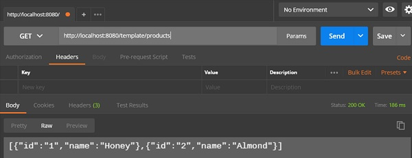

Create Products POST − **http://localhost:8080/template/products**

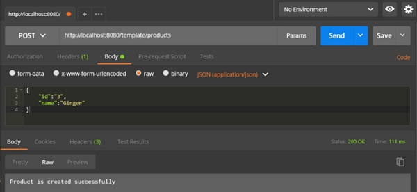

Update Product PUT − **http://localhost:8080/template/products/3**

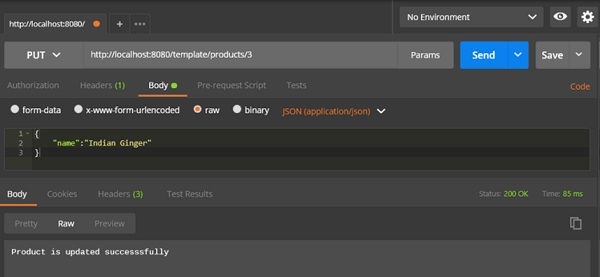

Delete Product − **http://localhost:8080/template/products/3**

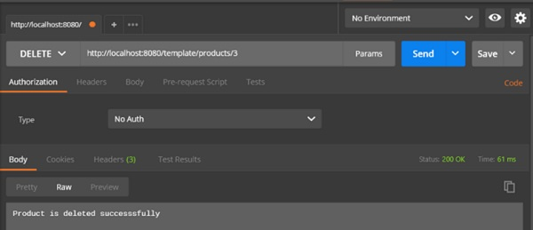

# Spring Boot - File Handling
In this chapter, you will learn how to upload and download the file by using web service.

## File Upload
For uploading a file, you can use **MultipartFile** as a Request Parameter and this API should consume Multi-Part form data value. Observe the code given below −

```
@RequestMapping(value = "/upload", method = RequestMethod.POST, consumes = MediaType.MULTIPART_FORM_DATA_VALUE)

public String fileUpload(@RequestParam("file") MultipartFile file) {
   return null;
}
```
The complete code for the same is given below −

```
package com.tutorialspoint.demo.controller;

import java.io.File;
import java.io.FileOutputStream;
import java.io.IOException;

import org.springframework.http.MediaType;
import org.springframework.web.bind.annotation.RequestMapping;
import org.springframework.web.bind.annotation.RequestMethod;
import org.springframework.web.bind.annotation.RequestParam;
import org.springframework.web.bind.annotation.RestController;
import org.springframework.web.multipart.MultipartFile;

@RestController
public class FileUploadController {
   @RequestMapping(value = "/upload", method = RequestMethod.POST, 
      consumes = MediaType.MULTIPART_FORM_DATA_VALUE)
   
   public String fileUpload(@RequestParam("file") MultipartFile file) throws IOException {
      File convertFile = new File("/var/tmp/"+file.getOriginalFilename());
      convertFile.createNewFile();
      FileOutputStream fout = new FileOutputStream(convertFile);
      fout.write(file.getBytes());
      fout.close();
      return "File is upload successfully";
   }
}
```
## File Download
For file download, you should use InputStreamResource for downloading a File. We need to set the HttpHeader **Content-Disposition** in Response and need to specify the response Media Type of the application.

**Note** − In the following example, file should be available on the specified path where the application is running.

```
@RequestMapping(value = "/download", method = RequestMethod.GET) 
public ResponseEntity<Object> downloadFile() throws IOException  {
   String filename = "/var/tmp/mysql.png";
   File file = new File(filename);
   InputStreamResource resource = new InputStreamResource(new FileInputStream(file));
   HttpHeaders headers = new HttpHeaders();
      
   headers.add("Content-Disposition", String.format("attachment; filename=\"%s\"", file.getName()));
   headers.add("Cache-Control", "no-cache, no-store, must-revalidate");
   headers.add("Pragma", "no-cache");
   headers.add("Expires", "0");
      
   ResponseEntity<Object> 
   responseEntity = ResponseEntity.ok().headers(headers).contentLength(file.length()).contentType(
      MediaType.parseMediaType("application/txt")).body(resource);
      
   return responseEntity;
}
```
The complete code for the same is given below −

```
package com.tutorialspoint.demo.controller;

import java.io.File;
import java.io.FileInputStream;
import java.io.IOException;

import org.springframework.core.io.InputStreamResource;
import org.springframework.http.HttpHeaders;
import org.springframework.http.MediaType;
import org.springframework.http.ResponseEntity;
import org.springframework.web.bind.annotation.RequestMapping;
import org.springframework.web.bind.annotation.RequestMethod;
import org.springframework.web.bind.annotation.RestController;

@RestController
public class FileDownloadController {
   @RequestMapping(value = "/download", method = RequestMethod.GET) 
   public ResponseEntity<Object> downloadFile() throws IOException  {
      String filename = "/var/tmp/mysql.png";
      File file = new File(filename);
      InputStreamResource resource = new InputStreamResource(new FileInputStream(file));
      HttpHeaders headers = new HttpHeaders();
      
      headers.add("Content-Disposition", String.format("attachment; filename=\"%s\"", file.getName()));
      headers.add("Cache-Control", "no-cache, no-store, must-revalidate");
      headers.add("Pragma", "no-cache");
      headers.add("Expires", "0");
      
      ResponseEntity<Object> 
      responseEntity = ResponseEntity.ok().headers(headers).contentLength(
         file.length()).contentType(MediaType.parseMediaType("application/txt")).body(resource);
      
      return responseEntity;
   }
}
```
The main Spring Boot application is given below −

```
package com.tutorialspoint.demo;

import org.springframework.boot.SpringApplication;
import org.springframework.boot.autoconfigure.SpringBootApplication;

@SpringBootApplication
public class DemoApplication {
   public static void main(String[] args) {
      SpringApplication.run(DemoApplication.class, args);
   }
}
```
The code for Maven build – pom.xml is given below −

```
<?xml version = "1.0" encoding = "UTF-8"?>
<project xmlns = "http://maven.apache.org/POM/4.0.0" 
   xmlns:xsi = "http://www.w3.org/2001/XMLSchema-instance"
   xsi:schemaLocation = "http://maven.apache.org/POM/4.0.0 
   http://maven.apache.org/xsd/maven-4.0.0.xsd"> 
   
   <modelVersion>4.0.0</modelVersion>
   <groupId>com.tutorialspoint</groupId>
   <artifactId>demo</artifactId>
   <version>0.0.1-SNAPSHOT</version>
   <packaging>jar</packaging>
   <name>demo</name>
   <description>Demo project for Spring Boot</description>

   <parent>
      <groupId>org.springframework.boot</groupId>
      <artifactId>spring-boot-starter-parent</artifactId>
      <version>1.5.8.RELEASE</version>
      <relativePath/> 
   </parent>

   <properties>
      <project.build.sourceEncoding>UTF-8</project.build.sourceEncoding>
      <project.reporting.outputEncoding>UTF-8</project.reporting.outputEncoding>
      <java.version>1.8</java.version>
   </properties>

   <dependencies>
      <dependency>
         <groupId>org.springframework.boot</groupId>
         <artifactId>spring-boot-starter-web</artifactId>
      </dependency>

      <dependency>
         <groupId>org.springframework.boot</groupId>
         <artifactId>spring-boot-starter-test</artifactId>
         <scope>test</scope>
      </dependency>
   </dependencies>

   <build>
      <plugins>
         <plugin>
            <groupId>org.springframework.boot</groupId>
            <artifactId>spring-boot-maven-plugin</artifactId>
         </plugin>
      </plugins>
   </build>
   
</project>
```
The code for Gradle Build – build.gradle is given below −

```
buildscript {
   ext {
      springBootVersion = '1.5.8.RELEASE'
   }
   repositories {
      mavenCentral()
   }
   dependencies {
      classpath("org.springframework.boot:spring-boot-gradle-plugin:${springBootVersion}")
   }
}

apply plugin: 'java'
apply plugin: 'eclipse'
apply plugin: 'org.springframework.boot'

group = 'com.tutorialspoint'
version = '0.0.1-SNAPSHOT'
sourceCompatibility = 1.8

repositories {
   mavenCentral()
}
dependencies {
   compile('org.springframework.boot:spring-boot-starter-web')
   testCompile('org.springframework.boot:spring-boot-starter-test')
}
```
Now you can create an executable JAR file, and run the Spring Boot application by using the Maven or Gradle commands given below −

For Maven, use the command given below −

```
mvn clean install
```
After “BUILD SUCCESS”, you can find the JAR file under target directory.

For Gradle, you ca use the command shown below −

```
sgradle clean build
```
After “BUILD SUCCESSFUL”, you can find the JAR file under build/libs directory.

Now, run the JAR file by using the following command −

```
java –jar <JARFILE>
```
This will start the application on the Tomcat port 8080 as shown below −


Now hit the below URL’s in POSTMAN application and you can see the output as shown below −

File upload − **http://localhost:8080/upload**


File download − **http://localhost:8080/upload**

# Spring Boot - Service Components
Service Components are the class file which contains @Service annotation. These class files are used to write business logic in a different layer, separated from @RestController class file. The logic for creating a service component class file is shown here −

```
public interface ProductService {
}
```
The class that implements the Interface with @Service annotation is as shown −

```
@Service
public class ProductServiceImpl implements ProductService {
}
```
Observe that in this tutorial, we are using **Product Service API(s)** to store, retrieve, update and delete the products. We wrote the business logic in @RestController class file itself. Now, we are going to move the business logic code from controller to service component.

You can create an Interface which contains add, edit, get and delete methods using the code as shown below −

```
package com.tutorialspoint.demo.service;

import java.util.Collection;
import com.tutorialspoint.demo.model.Product;

public interface ProductService {
   public abstract void createProduct(Product product);
   public abstract void updateProduct(String id, Product product);
   public abstract void deleteProduct(String id);
   public abstract Collection<Product> getProducts();
}
```
The following code will let you to create a class which implements the ProductService interface with @Service annotation and write the business logic to store, retrieve, delete and updates the product.

```
package com.tutorialspoint.demo.service;

import java.util.Collection;
import java.util.HashMap;
import java.util.Map;
import org.springframework.stereotype.Service;
import com.tutorialspoint.demo.model.Product;

@Service
public class ProductServiceImpl implements ProductService {
   private static Map<String, Product> productRepo = new HashMap<>();
   static {
      Product honey = new Product();
      honey.setId("1");
      honey.setName("Honey");
      productRepo.put(honey.getId(), honey);

      Product almond = new Product();
      almond.setId("2");
      almond.setName("Almond");
      productRepo.put(almond.getId(), almond);
   }
   @Override
   public void createProduct(Product product) {
      productRepo.put(product.getId(), product);
   }
   @Override
   public void updateProduct(String id, Product product) {
      productRepo.remove(id);
      product.setId(id);
      productRepo.put(id, product);
   }
   @Override
   public void deleteProduct(String id) {
      productRepo.remove(id);

   }
   @Override
   public Collection<Product> getProducts() {
      return productRepo.values();
   }
}
```
The code here show the Rest Controller class file, here we @Autowired the ProductService interface and called the methods.

```
package com.tutorialspoint.demo.controller;

import org.springframework.beans.factory.annotation.Autowired;
import org.springframework.http.HttpStatus;
import org.springframework.http.ResponseEntity;
import org.springframework.web.bind.annotation.PathVariable;
import org.springframework.web.bind.annotation.RequestBody;
import org.springframework.web.bind.annotation.RequestMapping;
import org.springframework.web.bind.annotation.RequestMethod;
import org.springframework.web.bind.annotation.RestController;

import com.tutorialspoint.demo.model.Product;
import com.tutorialspoint.demo.service.ProductService;

@RestController
public class ProductServiceController {
   @Autowired
   ProductService productService;

   @RequestMapping(value = "/products")
   public ResponseEntity<Object> getProduct() {
      return new ResponseEntity<>(productService.getProducts(), HttpStatus.OK);
   }
   @RequestMapping(value = "/products/{id}", method = RequestMethod.PUT)
   public ResponseEntity<Object> 
      updateProduct(@PathVariable("id") String id, @RequestBody Product product) {
      
      productService.updateProduct(id, product);
      return new ResponseEntity<>("Product is updated successsfully", HttpStatus.OK);
   }
   @RequestMapping(value = "/products/{id}", method = RequestMethod.DELETE)
   public ResponseEntity<Object> delete(@PathVariable("id") String id) {
      productService.deleteProduct(id);
      return new ResponseEntity<>("Product is deleted successsfully", HttpStatus.OK);
   }
   @RequestMapping(value = "/products", method = RequestMethod.POST)
   public ResponseEntity<Object> createProduct(@RequestBody Product product) {
      productService.createProduct(product);
      return new ResponseEntity<>("Product is created successfully", HttpStatus.CREATED);
   }
}
```
The code for POJO class – Product.java is shown here −

```
package com.tutorialspoint.demo.model;

public class Product {
   private String id;
   private String name;

   public String getId() {
      return id;
   }
   public void setId(String id) {
      this.id = id;
   }
   public String getName() {
      return name;
   }
   public void setName(String name) {
      this.name = name;
   }
}
```
A main Spring Boot application is given below −

```
package com.tutorialspoint.demo;

import org.springframework.boot.SpringApplication;
import org.springframework.boot.autoconfigure.SpringBootApplication;

@SpringBootApplication
public class DemoApplication {
   public static void main(String[] args) {
      SpringApplication.run(DemoApplication.class, args);
   }
}
```
The code for Maven build – pom.xml is shown below −

```
<?xml version = "1.0" encoding = "UTF-8"?>
<project xmlns = "http://maven.apache.org/POM/4.0.0" 
   xmlns:xsi = "http://www.w3.org/2001/XMLSchema-instance"
   xsi:schemaLocation = "http://maven.apache.org/POM/4.0.0 
   http://maven.apache.org/xsd/maven-4.0.0.xsd">
   
   <modelVersion>4.0.0</modelVersion>
   <groupId>com.tutorialspoint</groupId>
   <artifactId>demo</artifactId>
   <version>0.0.1-SNAPSHOT</version>
   <packaging>jar</packaging>
   <name>demo</name>
   <description>Demo project for Spring Boot</description>

   <parent>
      <groupId>org.springframework.boot</groupId>
      <artifactId>spring-boot-starter-parent</artifactId>
      <version>1.5.8.RELEASE</version>
      <relativePath/> 
   </parent>

   <properties>
      <project.build.sourceEncoding>UTF-8</project.build.sourceEncoding>
      <project.reporting.outputEncoding>UTF-8</project.reporting.outputEncoding>
      <java.version>1.8</java.version>
   </properties>

   <dependencies>
      <dependency>
         <groupId>org.springframework.boot</groupId>
         <artifactId>spring-boot-starter-web</artifactId>
      </dependency>

      <dependency>
         <groupId>org.springframework.boot</groupId>
         <artifactId>spring-boot-starter-test</artifactId>
         <scope>test</scope>
      </dependency>
   </dependencies>

   <build>
      <plugins>
         <plugin>
            <groupId>org.springframework.boot</groupId>
            <artifactId>spring-boot-maven-plugin</artifactId>
         </plugin>
      </plugins>
   </build>

</project>
```
The code for Gradle Build – build.gradle is shown below −

```
buildscript {
   ext {
      springBootVersion = '1.5.8.RELEASE'
   }
   repositories {
      mavenCentral()
   }
   dependencies {
      classpath("org.springframework.boot:spring-boot-gradle-plugin:${springBootVersion}")
   }
}

apply plugin: 'java'
apply plugin: 'eclipse'
apply plugin: 'org.springframework.boot'

group = 'com.tutorialspoint'
version = '0.0.1-SNAPSHOT'
sourceCompatibility = 1.8

repositories {
   mavenCentral()
}
dependencies {
   compile('org.springframework.boot:spring-boot-starter-web')
   testCompile('org.springframework.boot:spring-boot-starter-test')
}
```
You can create an executable JAR file, and run the Spring Boot application by using the Maven or Gradle commands given below −

For Maven, use the command as shown below −

```
mvn clean install
```
After “BUILD SUCCESS”, you can find the JAR file under the target directory.

For Gradle, you can use the command as shown below −

```
gradle clean build
```
After “BUILD SUCCESSFUL”, you can find the JAR file under build/libs directory.

Run the JAR file by using the command given below −

```
java –jar <JARFILE>
```
Now, the application has started on the Tomcat port 8080 as shown in the image given below −


Now hit the below URL’s in POSTMAN application and you can see the output as shown below −

GET API URL is − **http://localhost:8080/products**


POST API URL is − **http://localhost:8080/products**


PUT API URL is − **http://localhost:8080/products/3**


DELETE API URL is − **http://localhost:8080/products/3**


# Spring Boot - Thymeleaf
Thymeleaf is a Java-based library used to create a web application. It provides a good support for serving a XHTML/HTML5 in web applications. In this chapter, you will learn in detail about Thymeleaf.

## Thymeleaf Templates
Thymeleaf converts your files into well-formed XML files. It contains 6 types of templates as given below −

   * XML
   * Valid XML
   * XHTML
   * Valid XHTML
   * HTML5
   * Legacy HTML5

All templates, except Legacy HTML5, are referring to well-formed valid XML files. Legacy HTML5 allows us to render the HTML5 tags in web page including not closed tags.

## Web Application
You can use Thymeleaf templates to create a web application in Spring Boot. You will have to follow the below steps to create a web application in Spring Boot by using Thymeleaf.

Use the following code to create a @Controller class file to redirect the Request URI to HTML file −

```
package com.tutorialspoint.demo.controller;

import org.springframework.stereotype.Controller;
import org.springframework.web.bind.annotation.RequestMapping;

@Controller
public class WebController {
   @RequestMapping(value = "/index")
   public String index() {
      return "index";
   }
}
```
In the above example, the request URI is **/index**, and the control is redirected into the index.html file. Note that the index.html file should be placed under the templates directory and all JS and CSS files should be placed under the static directory in classpath. In the example shown, we used CSS file to change the color of the text.

You can use the following code and created a CSS file in separate folder **css** and name the file as styles.css −

```
h4 {
   color: red;
}
```
The code for index.html file is given below −

```
<!DOCTYPE html>
<html>
   <head>
      <meta charset = "ISO-8859-1" />
      <link href = "css/styles.css" rel = "stylesheet"/>
      <title>Spring Boot Application</title>
   </head>
   <body>
      <h4>Welcome to Thymeleaf Spring Boot web application</h4>
   </body>
</html>
```
The project explorer is shown in the screenshot given below −

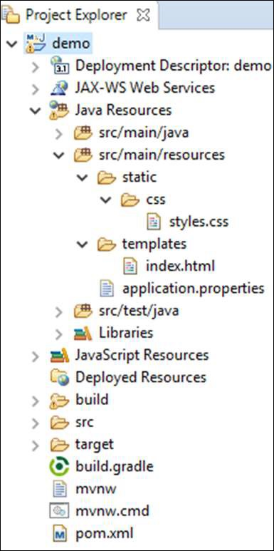

Now, we need to add the Spring Boot Starter Thymeleaf dependency in our build configuration file.

Maven users can add the following dependency into the pom.xml file −

```
<dependency>
   <groupId>org.springframework.boot</groupId>
   <artifactId>spring-boot-starter-thymeleaf</artifactId>
</dependency>
```
Gradle users can add the following dependency in the build.gradle file −

```
compile group: 'org.springframework.boot', name: 'spring-boot-starter-thymeleaf'
```
The code for main Spring Boot application class file is given below −

```
package com.tutorialspoint.demo;

import org.springframework.boot.SpringApplication;
import org.springframework.boot.autoconfigure.SpringBootApplication;

@SpringBootApplication
public class DemoApplication {
   public static void main(String[] args) {
      SpringApplication.run(DemoApplication.class, args);
   }
}
```
The code for Maven – pom.xml is given below −

```
<?xml version = "1.0" encoding = "UTF-8"?>
<project xmlns = "http://maven.apache.org/POM/4.0.0" 
   xmlns:xsi = "http://www.w3.org/2001/XMLSchema-instance"
   xsi:schemaLocation = "http://maven.apache.org/POM/4.0.0 
   http://maven.apache.org/xsd/maven-4.0.0.xsd">
   
   <modelVersion>4.0.0</modelVersion>
   <groupId>com.tutorialspoint</groupId>
   <artifactId>demo</artifactId>
   <version>0.0.1-SNAPSHOT</version>
   <packaging>jar</packaging>
   <name>demo</name>
   <description>Demo project for Spring Boot</description>

   <parent>
      <groupId>org.springframework.boot</groupId>
      <artifactId>spring-boot-starter-parent</artifactId>
      <version>1.5.8.RELEASE</version>
      <relativePath />
   </parent>

   <properties>
      <project.build.sourceEncoding>UTF-8</project.build.sourceEncoding>
      <project.reporting.outputEncoding>UTF-8</project.reporting.outputEncoding>
      <java.version>1.8</java.version>
   </properties>

   <dependencies>
      <dependency>
         <groupId>org.springframework.boot</groupId>
         <artifactId>spring-boot-starter-web</artifactId>
      </dependency>

      <dependency>
         <groupId>org.springframework.boot</groupId>
         <artifactId>spring-boot-starter-test</artifactId>
         <scope>test</scope>
      </dependency>

      <dependency>
         <groupId>org.springframework.boot</groupId>
         <artifactId>spring-boot-starter-thymeleaf</artifactId>
      </dependency>
   </dependencies>

   <build>
      <plugins>
         <plugin>
            <groupId>org.springframework.boot</groupId>
            <artifactId>spring-boot-maven-plugin</artifactId>
         </plugin>
      </plugins>
   </build>
   
</project>
```
The code for Gradle – build.gradle is given below −

```
buildscript {
   ext {
      springBootVersion = '1.5.8.RELEASE'
   }
   repositories {
      mavenCentral()
   }
   dependencies {
      classpath("org.springframework.boot:spring-boot-gradle-plugin:${springBootVersion}")
   }
}

apply plugin: 'java'
apply plugin: 'eclipse'
apply plugin: 'org.springframework.boot'

group = 'com.tutorialspoint'
version = '0.0.1-SNAPSHOT'
sourceCompatibility = 1.8

repositories {
   mavenCentral()
}
dependencies {
   compile('org.springframework.boot:spring-boot-starter-web')
   compile group: 'org.springframework.boot', name: 'spring-boot-starter-thymeleaf'
   testCompile('org.springframework.boot:spring-boot-starter-test')
}
```
You can create an executable JAR file, and run the spring boot application by using the following Maven or Gradle commands −

For Maven, use the command as shown below −

```
mvn clean install
```
After “BUILD SUCCESS”, you can find the JAR file under the target directory.

For Gradle, use the command as shown below −

```
gradle clean build
```
After “BUILD SUCCESSFUL”, you can find the JAR file under the build/libs directory.

Run the JAR file by using the command given here −

```
java –jar <JARFILE>
```
Now, the application has started on the Tomcat port 8080 as shown below −


Now hit the URL in your web browser and you can see the output as shown −

**http://localhost:8080/index**


# Consuming RESTful Web Services
This chapter will discuss in detail about consuming a RESTful Web Services by using jQuery AJAX.

Create a simple Spring Boot web application and write a controller class files which is used to redirects into the HTML file to consumes the RESTful web services.

We need to add the Spring Boot starter Thymeleaf and Web dependency in our build configuration file.

For Maven users, add the below dependencies in your pom.xml file.

```
<dependency>
   <groupId>org.springframework.boot</groupId>
   <artifactId>spring-boot-starter-thymeleaf</artifactId>
</dependency>

<dependency>
   <groupId>org.springframework.boot</groupId>
   <artifactId>spring-boot-starter-web</artifactId>
</dependency>
```
For Gradle users, add the below dependencies into your build.gradle file −

```
compile group: ‘org.springframework.boot’, name: ‘spring-boot-starter-thymeleaf’
compile(‘org.springframework.boot:spring-boot-starter-web’)
```
The code for @Controller class file is given below −

```
@Controller
public class ViewController {
}
```
You can define the Request URI methods to redirects into the HTML file as shown below −

```
@RequestMapping(“/view-products”)
public String viewProducts() {
   return “view-products”;
}
@RequestMapping(“/add-products”)
public String addProducts() {
   return “add-products”;
}
```
This API **http://localhost:9090/products** should return the below JSON in response as shown below −

```
[
   {
      "id": "1",
      "name": "Honey"
   },
   {
      "id": "2",
      "name": "Almond"
   }
]
```
Now, create a view-products.html file under the templates directory in the classpath.

In the HTML file, we added the jQuery library and written the code to consume the RESTful web service on page load.

```
<script src = "https://ajax.googleapis.com/ajax/libs/jquery/3.2.1/jquery.min.js"></script>

<script>
$(document).ready(function(){
   $.getJSON("http://localhost:9090/products", function(result){
      $.each(result, function(key,value) {
         $("#productsJson").append(value.id+" "+value.name+" ");
      }); 
   });
});
</script>
```
The POST method and this URL **http://localhost:9090/products** should contains the below Request Body and Response body.

The code for Request body is given below −

```
{
   "id":"3",
   "name":"Ginger"
}
```
The code for Response body is given below −

```
Product is created successfully
```
Now, create the add-products.html file under the templates directory in the classpath.

In the HTML file, we added the jQuery library and written the code that submits the form to RESTful web service on clicking the button.

```
<script src = "https://ajax.googleapis.com/ajax/libs/jquery/3.2.1/jquery.min.js"></script>
<script>
   $(document).ready(function() {
      $("button").click(function() {
         var productmodel = {
            id : "3",
            name : "Ginger"
         };
         var requestJSON = JSON.stringify(productmodel);
         $.ajax({
            type : "POST",
            url : "http://localhost:9090/products",
            headers : {
               "Content-Type" : "application/json"
            },
            data : requestJSON,
            success : function(data) {
               alert(data);
            },
            error : function(data) {
            }
         });
      });
   });
</script>
```
The complete code is given below.

Maven – pom.xml file

```
<?xml version = "1.0" encoding = "UTF-8"?>
<project xmlns = "http://maven.apache.org/POM/4.0.0" 
   xmlns:xsi = "http://www.w3.org/2001/XMLSchema-instance"
   xsi:schemaLocation = "http://maven.apache.org/POM/4.0.0 
   http://maven.apache.org/xsd/maven-4.0.0.xsd">
   
   <modelVersion>4.0.0</modelVersion>
   <groupId>com.tutorialspoint</groupId>
   <artifactId>demo</artifactId>
   <version>0.0.1-SNAPSHOT</version>
   <packaging>jar</packaging>
   <name>demo</name>
   <description>Demo project for Spring Boot</description>

   <parent>
      <groupId>org.springframework.boot</groupId>
      <artifactId>spring-boot-starter-parent</artifactId>
      <version>1.5.8.RELEASE</version>
      <relativePath />
   </parent>

   <properties>
      <project.build.sourceEncoding>UTF-8</project.build.sourceEncoding>
      <project.reporting.outputEncoding>UTF-8</project.reporting.outputEncoding>
      <java.version>1.8</java.version>
   </properties>

   <dependencies>
      <dependency>
         <groupId>org.springframework.boot</groupId>
         <artifactId>spring-boot-starter-web</artifactId>
      </dependency>

      <dependency>
         <groupId>org.springframework.boot</groupId>
         <artifactId>spring-boot-starter-test</artifactId>
         <scope>test</scope>
      </dependency>

      <dependency>
         <groupId>org.springframework.boot</groupId>
         <artifactId>spring-boot-starter-thymeleaf</artifactId>
      </dependency>
   </dependencies>

   <build>
      <plugins>
         <plugin>
            <groupId>org.springframework.boot</groupId>
            <artifactId>spring-boot-maven-plugin</artifactId>
         </plugin>
      </plugins>
   </build>
   
</project>
```
The code for Gradle – build.gradle is given below −

```
buildscript {
   ext {
      springBootVersion = ‘1.5.8.RELEASE’
   }
   repositories {
      mavenCentral()
   }
   dependencies {
      classpath("org.springframework.boot:spring-boot-gradle-plugin:${springBootVersion}")
   }
}

apply plugin: ‘java’
apply plugin: ‘eclipse’
apply plugin: ‘org.springframework.boot’

group = ‘com.tutorialspoint’
version = ‘0.0.1-SNAPSHOT’
sourceCompatibility = 1.8

repositories {
   mavenCentral()
}

dependencies {
   compile(‘org.springframework.boot:spring-boot-starter-web’)
   compile group: ‘org.springframework.boot’, name: ‘spring-boot-starter-thymeleaf’
   testCompile(‘org.springframework.boot:spring-boot-starter-test’)
}
```
The controller class file given below – ViewController.java is given below −

```
package com.tutorialspoint.demo.controller;

import org.springframework.stereotype.Controller;
import org.springframework.web.bind.annotation.RequestMapping;

@Controller
public class ViewController {
   @RequestMapping(“/view-products”)
   public String viewProducts() {
      return “view-products”;
   }
   @RequestMapping(“/add-products”)
   public String addProducts() {
      return “add-products”;   
   }   
}
```
The view-products.html file is given below −

```
<!DOCTYPE html>
<html>
   <head>
      <meta charset = "ISO-8859-1"/>
      <title>View Products</title>
      <script src = "https://ajax.googleapis.com/ajax/libs/jquery/3.2.1/jquery.min.js"></script>
      
      <script>
         $(document).ready(function(){
            $.getJSON("http://localhost:9090/products", function(result){
               $.each(result, function(key,value) {
                  $("#productsJson").append(value.id+" "+value.name+" ");
               }); 
            });
         });
      </script>
   </head>
   
   <body>
      <div id = "productsJson"> </div>
   </body>
</html>
```
The add-products.html file is given below −

```
<!DOCTYPE html>
<html>
   <head>
      <meta charset = "ISO-8859-1" />
      <title>Add Products</title>
      <script src = "https://ajax.googleapis.com/ajax/libs/jquery/3.2.1/jquery.min.js"></script>
      
      <script>
         $(document).ready(function() {
            $("button").click(function() {
               var productmodel = {
                  id : "3",
                  name : "Ginger"
               };
               var requestJSON = JSON.stringify(productmodel);
               $.ajax({
                  type : "POST",
                  url : "http://localhost:9090/products",
                  headers : {
                     "Content-Type" : "application/json"
                  },
                  data : requestJSON,
                  success : function(data) {
                     alert(data);
                  },
                  error : function(data) {
                  }
               });
            });
         });
      </script>
   </head>
   
   <body>
      <button>Click here to submit the form</button>
   </body>
</html>
```
The main Spring Boot Application class file is given below −

```
package com.tutorialspoint.demo;

import org.springframework.boot.SpringApplication;
import org.springframework.boot.autoconfigure.SpringBootApplication;

@SpringBootApplication
public class DemoApplication {
   public static void main(String[] args) {
      SpringApplication.run(DemoApplication.class, args);
   }
}
```
Now, you can create an executable JAR file, and run the Spring Boot application by using the following Maven or Gradle commands.

For Maven, use the command as given below −

```
mvn clean install
```
After “BUILD SUCCESS”, you can find the JAR file under the target directory.

For Gradle, use the command as given below −

```
gradle clean build
```
After “BUILD SUCCESSFUL”, you can find the JAR file under the build/libs directory.

Run the JAR file by using the following command −

```
java –jar <JARFILE>
```
Now, the application has started on the Tomcat port 8080.


Now hit the URL in your web browser and you can see the output as shown −

http://localhost:8080/view-products 


http://localhost:8080/add-products 


Now, click the button **Click here to submit the form** and you can see the result as shown −


Now, hit the view products URL and see the created product.

**http://localhost:8080/view-products**


## Angular JS
To consume the APIs by using Angular JS, you can use the examples given below −

Use the following code to create the Angular JS Controller to consume the GET API - **http://localhost:9090/products** −

```
angular.module('demo', [])
.controller('Hello', function($scope, $http) {
   $http.get('http://localhost:9090/products').
   then(function(response) {
      $scope.products = response.data;
   });
});
```
Use the following code to create the Angular JS Controller to consume the POST API - **http://localhost:9090/products** −

```
angular.module('demo', [])
.controller('Hello', function($scope, $http) {
   $http.post('http://localhost:9090/products',data).
   then(function(response) {
      console.log("Product created successfully");
   });
});
```
**Note** − The Post method data represents the Request body in JSON format to create a product.

# Spring Boot - CORS Support
Cross-Origin Resource Sharing (CORS) is a security concept that allows restricting the resources implemented in web browsers. It prevents the JavaScript code producing or consuming the requests against different origin.

For example, your web application is running on 8080 port and by using JavaScript you are trying to consuming RESTful web services from 9090 port. Under such situations, you will face the Cross-Origin Resource Sharing security issue on your web browsers.

Two requirements are needed to handle this issue −

   * RESTful web services should support the Cross-Origin Resource Sharing.
   * RESTful web service application should allow accessing the API(s) from the 8080 port.

In this chapter, we are going to learn in detail about How to Enable Cross-Origin Requests for a RESTful Web Service application.

## Enable CORS in Controller Method
We need to set the origins for RESTful web service by using **@CrossOrigin** annotation for the controller method. This @CrossOrigin annotation supports specific REST API, and not for the entire application.

```
@RequestMapping(value = "/products")
@CrossOrigin(origins = "http://localhost:8080")

public ResponseEntity<Object> getProduct() {
   return null;
}
```
## Global CORS Configuration
We need to define the shown @Bean configuration to set the CORS configuration support globally to your Spring Boot application.

```
@Bean
public WebMvcConfigurer corsConfigurer() {
   return new WebMvcConfigurerAdapter() {
      @Override
      public void addCorsMappings(CorsRegistry registry) {
         registry.addMapping("/products").allowedOrigins("http://localhost:9000");
      }    
   };
}
```
To code to set the CORS configuration globally in main Spring Boot application is given below.

```
package com.tutorialspoint.demo;

import org.springframework.boot.SpringApplication;
import org.springframework.boot.autoconfigure.SpringBootApplication;
import org.springframework.context.annotation.Bean;
import org.springframework.web.servlet.config.annotation.CorsRegistry;
import org.springframework.web.servlet.config.annotation.WebMvcConfigurer;
import org.springframework.web.servlet.config.annotation.WebMvcConfigurerAdapter;

@SpringBootApplication
public class DemoApplication {
   public static void main(String[] args) {
      SpringApplication.run(DemoApplication.class, args);
   }
   @Bean
   public WebMvcConfigurer corsConfigurer() {
      return new WebMvcConfigurerAdapter() {
         @Override
         public void addCorsMappings(CorsRegistry registry) {
            registry.addMapping("/products").allowedOrigins("http://localhost:8080");
         }
      };
   }
}
```
Now, you can create a Spring Boot web application that runs on 8080 port and your RESTful web service application that can run on the 9090 port. For further details about implementation about RESTful Web Service, you can refer to the chapter titled **Consuming RESTful Web Services** of this tutorial.

# Spring Boot - Internationalization
Internationalization is a process that makes your application adaptable to different languages and regions without engineering changes on the source code. In ither words, Internationalization is a readiness of Localization.

In this chapter, we are going to learn in detail about How to implement the Internationalization in Spring Boot.

## Dependencies
We need the Spring Boot Starter Web and Spring Boot Starter Thymeleaf dependency to develop a web application in Spring Boot.

### Maven
```
<dependency>
   <groupId>org.springframework.boot</groupId>
   <artifactId>spring-boot-starter-web</artifactId>
</dependency>

<dependency>
   <groupId>org.springframework.boot</groupId>
   <artifactId>spring-boot-starter-thymeleaf</artifactId>
</dependency>
```
### Gradle
```
compile('org.springframework.boot:spring-boot-starter-web')
compile group: 'org.springframework.boot', name: 'spring-boot-starter-thymeleaf'
```
## LocaleResolver
We need to determine default Locale of your application. We need to add the LocaleResolver bean in our Spring Boot application.

```
@Bean
public LocaleResolver localeResolver() {
   SessionLocaleResolver sessionLocaleResolver = new SessionLocaleResolver();
   sessionLocaleResolver.setDefaultLocale(Locale.US);
   return sessionLocaleResolver;
}
```
## LocaleChangeInterceptor
LocaleChangeInterceptor is a used to change the new Locale based on the value of the language parameter added to a request.

```
@Bean
public LocaleChangeInterceptor localeChangeInterceptor() {
   LocaleChangeInterceptor localeChangeInterceptor = new LocaleChangeInterceptor();
   localeChangeInterceptor.setParamName("language");
   return localeChangeInterceptor;
}
```
To take this effect, we need to add the LocaleChangeInterceptor into the application’s registry interceptor. The configuration class should extend the WebMvcConfigurerAdapter class and override the addInterceptors() method.

```
@Override
public void addInterceptors(InterceptorRegistry registry) {
   registry.addInterceptor(localeChangeInterceptor());
}
```
## Messages Sources
Spring Boot application by default takes the message sources from **src/main/resources** folder under the classpath. The default locale message file name should be **message.properties** and files for each locale should name as **messages_XX.properties**. The “XX” represents the locale code.

All the message properties should be used as key pair values. If any properties are not found on the locale, the application uses the default property from messages.properties file.

The default messages.properties will be as shown −

```
welcome.text=Hi Welcome to Everyone
```
The French language messages_fr.properties will be as shown −

```
welcome.text=Salut Bienvenue à tous
```
**Note** − Messages source file should be saved as “UTF-8” file format.

## HTML file
In the HTML file, use the syntax **#{key}** to display the messages from the properties file.

```
<h1 th:text = "#{welcome.text}"></h1>
```
The complete code is given below

### Maven – pom.xml
```
<?xml version = "1.0" encoding = "UTF-8"?>
<project xmlns = "http://maven.apache.org/POM/4.0.0" 
   xmlns:xsi = "http://www.w3.org/2001/XMLSchema-instance"
   xsi:schemaLocation = "http://maven.apache.org/POM/4.0.0 
   http://maven.apache.org/xsd/maven-4.0.0.xsd">
   
   <modelVersion>4.0.0</modelVersion>
   <groupId>com.tutorialspoint</groupId>
   <artifactId>demo</artifactId>
   <version>0.0.1-SNAPSHOT</version>
   <packaging>jar</packaging>
   <name>demo</name>
   <description>Demo project for Spring Boot</description>

   <parent>
      <groupId>org.springframework.boot</groupId>
      <artifactId>spring-boot-starter-parent</artifactId>
      <version>1.5.8.RELEASE</version>
      <relativePath />
   </parent>

   <properties>
      <project.build.sourceEncoding>UTF-8</project.build.sourceEncoding>
      <project.reporting.outputEncoding>UTF-8</project.reporting.outputEncoding>
      <java.version>1.8</java.version>
   </properties>

   <dependencies>
      <dependency>
         <groupId>org.springframework.boot</groupId>
         <artifactId>spring-boot-starter-web</artifactId>
      </dependency>

      <dependency>
         <groupId>org.springframework.boot</groupId>
         <artifactId>spring-boot-starter-test</artifactId>
         <scope>test</scope>
      </dependency>

      <dependency>
         <groupId>org.springframework.boot</groupId>
         <artifactId>spring-boot-starter-thymeleaf</artifactId>
      </dependency>
   </dependencies>

   <build>
      <plugins>
         <plugin>
            <groupId>org.springframework.boot</groupId>
            <artifactId>spring-boot-maven-plugin</artifactId>
         </plugin>
      </plugins>
   </build>
</project>
```
### Gradle – build.gradle
```
buildscript {
   ext {
      springBootVersion = '1.5.8.RELEASE'
   }
   repositories {
      mavenCentral()
   }
   dependencies {
      classpath("org.springframework.boot:spring-boot-gradle-plugin:${springBootVersion}")
   }
}
apply plugin: 'java'
apply plugin: 'eclipse'
apply plugin: 'org.springframework.boot'

group = 'com.tutorialspoint'
version = '0.0.1-SNAPSHOT'
sourceCompatibility = 1.8

repositories {
   mavenCentral()
}
dependencies {
   compile('org.springframework.boot:spring-boot-starter-web')
   compile group: 'org.springframework.boot', name: 'spring-boot-starter-thymeleaf'
   testCompile('org.springframework.boot:spring-boot-starter-test')
}
```
The main Spring Boot application class file is given below −

```
package com.tutorialspoint.demo;

import org.springframework.boot.SpringApplication;
import org.springframework.boot.autoconfigure.SpringBootApplication;

@SpringBootApplication
public class DemoApplication {
   public static void main(String[] args) {
      SpringApplication.run(DemoApplication.class, args);
   }
}
```
The controller class file is given below −

```
package com.tutorialspoint.demo.controller;

import org.springframework.stereotype.Controller;
import org.springframework.web.bind.annotation.RequestMapping;

@Controller
public class ViewController {
   @RequestMapping("/locale")
   public String locale() {
      return "locale";
   }
}
```
Configuration class to support the Internationalization

```
package com.tutorialspoint.demo;

import java.util.Locale;

import org.springframework.context.annotation.Bean;
import org.springframework.context.annotation.Configuration;
import org.springframework.web.servlet.LocaleResolver;
import org.springframework.web.servlet.config.annotation.InterceptorRegistry;
import org.springframework.web.servlet.config.annotation.WebMvcConfigurerAdapter;
import org.springframework.web.servlet.i18n.LocaleChangeInterceptor;
import org.springframework.web.servlet.i18n.SessionLocaleResolver;

@Configuration
public class Internationalization extends WebMvcConfigurerAdapter {
   @Bean
   public LocaleResolver localeResolver() {
      SessionLocaleResolver sessionLocaleResolver = new SessionLocaleResolver();
      sessionLocaleResolver.setDefaultLocale(Locale.US);
      return sessionLocaleResolver;
   }
   @Bean
   public LocaleChangeInterceptor localeChangeInterceptor() {
      LocaleChangeInterceptor localeChangeInterceptor = new LocaleChangeInterceptor();
      localeChangeInterceptor.setParamName("language");
      return localeChangeInterceptor;
   }
   @Override
   public void addInterceptors(InterceptorRegistry registry) {
      registry.addInterceptor(localeChangeInterceptor());
   }
}
```
The Message sources – messages.properties is as shown −

```
welcome.text = Hi Welcome to Everyone
```
The Message sources – message_fr.properties is as shown −

```
welcome.text = Salut Bienvenue à tous
```
The HTML file locale.html should be placed under the templates directory on the classpath as shown −

```
<!DOCTYPE html>
<html>
   <head>
      <meta charset = "ISO-8859-1"/>
      <title>Internationalization</title>
   </head>
   <body>
      <h1 th:text = "#{welcome.text}"></h1>
   </body>
</html>
```
You can create an executable JAR file, and run the Spring boot application by using the following Maven or Gradle commands −

For Maven, use the following command −

```
mvn clean install
```
After “BUILD SUCCESS”, you can find the JAR file under the target directory.

For Gradle, use the following command −

```
gradle clean build
```
After “BUILD SUCCESSFUL”, you can find the JAR file under the build/libs directory.

Now, run the JAR file by using the command as shown −

```
java –jar <JARFILE>
```
You will find that the application has started on the Tomcat port 8080.


Now hit the URL **http://localhost:8080/locale** in your web browser and you can see the following output −


The URL **http://localhost:8080/locale?language=fr** will give you the output as shown −


# Spring Boot - Scheduling
Scheduling is a process of executing the tasks for the specific time period. Spring Boot provides a good support to write a scheduler on the Spring applications.

## Java Cron Expression
Java Cron expressions are used to configure the instances of CronTrigger, a subclass of org.quartz.Trigger. For more information about Java cron expression you can refer to this link −

[https://docs.oracle.com/cd/E12058_01/doc/doc.1014/e12030/cron_expressions.htm](https://docs.oracle.com/cd/E12058_01/doc/doc.1014/e12030/cron_expressions.htm) 

The @EnableScheduling annotation is used to enable the scheduler for your application. This annotation should be added into the main Spring Boot application class file.

```
@SpringBootApplication
@EnableScheduling

public class DemoApplication {
   public static void main(String[] args) {
      SpringApplication.run(DemoApplication.class, args);
   }
}
```
The @Scheduled annotation is used to trigger the scheduler for a specific time period.

```
@Scheduled(cron = "0 * 9 * * ?")
public void cronJobSch() throws Exception {
}
```
The following is a sample code that shows how to execute the task every minute starting at 9:00 AM and ending at 9:59 AM, every day

```
package com.tutorialspoint.demo.scheduler;

import java.text.SimpleDateFormat;
import java.util.Date;
import org.springframework.scheduling.annotation.Scheduled;
import org.springframework.stereotype.Component;

@Component
public class Scheduler {
   @Scheduled(cron = "0 * 9 * * ?")
   public void cronJobSch() {
      SimpleDateFormat sdf = new SimpleDateFormat("yyyy-MM-dd HH:mm:ss.SSS");
      Date now = new Date();
      String strDate = sdf.format(now);
      System.out.println("Java cron job expression:: " + strDate);
   }
}
```
The following screenshot shows how the application has started at 09:03:23 and for every one minute from that time the cron job scheduler task has executed.

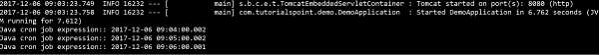

## Fixed Rate
Fixed Rate scheduler is used to execute the tasks at the specific time. It does not wait for the completion of previous task. The values should be in milliseconds. The sample code is shown here −

```
@Scheduled(fixedRate = 1000)
public void fixedRateSch() { 
}
```
A sample code for executing a task on every second from the application startup is shown here −

```
package com.tutorialspoint.demo.scheduler;

import java.text.SimpleDateFormat;
import java.util.Date;
import org.springframework.scheduling.annotation.Scheduled;
import org.springframework.stereotype.Component;

@Component
public class Scheduler {
   @Scheduled(fixedRate = 1000)
   public void fixedRateSch() {
      SimpleDateFormat sdf = new SimpleDateFormat("yyyy-MM-dd HH:mm:ss.SSS");

      Date now = new Date();
      String strDate = sdf.format(now);
      System.out.println("Fixed Rate scheduler:: " + strDate);
   }
}
```
Observe the following screenshot that shows the application that has started at 09:12:00 and after that every second fixed rate scheduler task has executed.

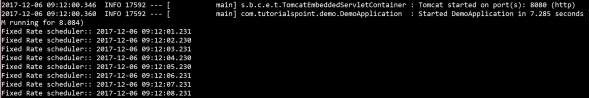

## Fixed Delay
Fixed Delay scheduler is used to execute the tasks at a specific time. It should wait for the previous task completion. The values should be in milliseconds. A sample code is shown here −

```
@Scheduled(fixedDelay = 1000, initialDelay = 1000)
public void fixedDelaySch() {
}
```
Here, the initialDelay is the time after which the task will be executed the first time after the initial delay value.

An example to execute the task for every second after 3 seconds from the application startup has been completed is shown below −

```
package com.tutorialspoint.demo.scheduler;

import java.text.SimpleDateFormat;
import java.util.Date;
import org.springframework.scheduling.annotation.Scheduled;
import org.springframework.stereotype.Component;

@Component
public class Scheduler {
   @Scheduled(fixedDelay = 1000, initialDelay = 3000)
   public void fixedDelaySch() {
      SimpleDateFormat sdf = new SimpleDateFormat("yyyy-MM-dd HH:mm:ss.SSS");
      Date now = new Date();
      String strDate = sdf.format(now);
      System.out.println("Fixed Delay scheduler:: " + strDate);
   }
}
```
Observe the following screenshot which shows the application that has started at 09:18:39 and after every 3 seconds, the fixed delay scheduler task has executed on every second.

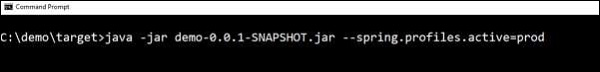

# Spring Boot - Enabling HTTPS
By default, Spring Boot application uses HTTP 8080 port when the application starts up.


You need to follow the steps given below to configure the HTTPS and the port 443 in Spring Boot application −

   * Obtain the SSL certificate – Create a self-signed certificate or get one from a Certificate Authority
   * Enable HTTPS and 443 port

## Self-Signed Certificate
To create a self-signed certificate, Java Run Time environment comes bundled with certificate management utility key tool. This utility tool is used to create a Self-Signed certificate. It is shown in the code given here −

```
keytool -genkey -alias tomcat -storetype PKCS12 -keyalg RSA -keysize 2048 -keystore keystore.p12 -validity 3650
Enter keystore password:
   Re-enter new password:
   What is your first and last name?
   [Unknown]:
   What is the name of your organizational unit?
   [Unknown]:
   What is the name of your organization?
   [Unknown]:
   What is the name of your City or Locality?
   [Unknown]:
   What is the name of your State or Province?
   [Unknown]:
   What is the two-letter country code for this unit?
   [Unknown]:
   Is CN = Unknown, OU=Unknown, O = Unknown, L = Unknown, ST = Unknown, C = Unknown correct?
   [no]: yes
```
This code will generate a PKCS12 keystore file named as keystore.p12 and the certificate alias name is tomcat.

## Configure HTTPS
We need to provide the server port as 443, key-store file path, key-store-password, key-store-type and key alias name into the application.properties file. Observe the code given here −

```
server.port: 443
server.ssl.key-store: keystore.p12
server.ssl.key-store-password: springboot
server.ssl.keyStoreType: PKCS12
server.ssl.keyAlias: tomcat
```
You can use the following code if you are using YAML properties use below application.yml −

```
server:
   port: 443
   ssl:
      key-store: keystore.p12
      key-store-password: springboot
      keyStoreType: PKCS12
      keyAlias: tomcat
```
You can create an executable JAR file, and run the spring boot application by using the following Maven or Gradle commands.

For Maven, you can use the following command −

```
mvn clean install
```
After “BUILD SUCCESS”, you can find the JAR file under the target directory.

For Gradle, you can use the command

```
gradle clean build
```
After “BUILD SUCCESSFUL”, you can find the JAR file under the build/libs directory.

Now, run the JAR file by using the following command −

```
java –jar <JARFILE>
```
Now, the application has started on the Tomcat port 443 with https as shown −


# Spring Boot - Eureka Server
Eureka Server is an application that holds the information about all client-service applications. Every Micro service will register into the Eureka server and Eureka server knows all the client applications running on each port and IP address. Eureka Server is also known as Discovery Server.

In this chapter, we will learn in detail about How to build a Eureka server.

## Building a Eureka Server
Eureka Server comes with the bundle of Spring Cloud. For this, we need to develop the Eureka server and run it on the default port 8761.

Visit the Spring Initializer homepage [https://start.spring.io/](https://start.spring.io/)  and download the Spring Boot project with Eureka server dependency. It is shown in the screenshot below −

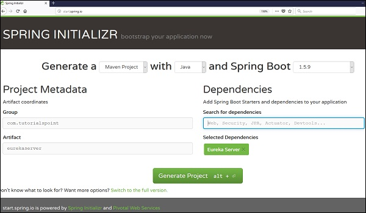

After downloading the project in main Spring Boot Application class file, we need to add @EnableEurekaServer annotation. The @EnableEurekaServer annotation is used to make your Spring Boot application acts as a Eureka Server.

The code for main Spring Boot application class file is as shown below −

```
package com.tutorialspoint.eurekaserver;

import org.springframework.boot.SpringApplication;
import org.springframework.boot.autoconfigure.SpringBootApplication;
import org.springframework.cloud.netflix.eureka.server.EnableEurekaServer;

@SpringBootApplication
@EnableEurekaServer
public class EurekaserverApplication {
   public static void main(String[] args) {
      SpringApplication.run(EurekaserverApplication.class, args);
   }
}
```
Make sure Spring cloud Eureka server dependency is added in your build configuration file.

The code for Maven user dependency is shown below −

```
<dependency>
<groupId>org.springframework.cloud</groupId>
   <artifactId>spring-cloud-starter-eureka-server</artifactId>
</dependency>
```
The code for Gradle user dependency is given below −

```
compile('org.springframework.cloud:spring-cloud-starter-eureka-server')
```
The complete build configuration file is given below −

**Maven pom.xml**

```
<?xml version = "1.0" encoding = "UTF-8"?>
<project xmlns = "http://maven.apache.org/POM/4.0.0" 
   xmlns:xsi = "http://www.w3.org/2001/XMLSchema-instance" 
   xsi:schemaLocation = "http://maven.apache.org/POM/4.0.0 
   http://maven.apache.org/xsd/maven-4.0.0.xsd">
   
   <modelVersion>4.0.0</modelVersion>
   <groupId>com.tutorialspoint</groupId>
   <artifactId>eurekaserver</artifactId>
   <version>0.0.1-SNAPSHOT</version>
   <packaging>jar</packaging>
   <name>eurekaserver</name>
   <description>Demo project for Spring Boot</description>

   <parent>
      <groupId>org.springframework.boot</groupId>
      <artifactId>spring-boot-starter-parent</artifactId>
      <version>1.5.9.RELEASE</version>
      <relativePath/> <!-- lookup parent from repository -->
   </parent>

   <properties>
      <project.build.sourceEncoding>UTF-8</project.build.sourceEncoding>
      <project.reporting.outputEncoding>UTF-8</project.reporting.outputEncoding>
      <java.version>1.8</java.version>
      <spring-cloud.version>Edgware.RELEASE</spring-cloud.version>
   </properties>

   <dependencies>
      <dependency>
         <groupId>org.springframework.cloud</groupId>
         <artifactId>spring-cloud-starter-eureka-server</artifactId>
      </dependency>

      <dependency>
         <groupId>org.springframework.boot</groupId>
         <artifactId>spring-boot-starter-test</artifactId>
         <scope>test</scope>
      </dependency>
   </dependencies>

   <dependencyManagement>
      <dependencies>
         <dependency>
            <groupId>org.springframework.cloud</groupId>
            <artifactId>spring-cloud-dependencies</artifactId>
            <version>${spring-cloud.version}</version>
            <type>pom</type>
            <scope>import</scope>
         </dependency>
      </dependencies>
   </dependencyManagement>

   <build>
      <plugins>
         <plugin>
            <groupId>org.springframework.boot</groupId>
            <artifactId>spring-boot-maven-plugin</artifactId>
         </plugin>
      </plugins>
   </build>
   
</project>
```
**Gradle – build.gradle**

```
buildscript {
   ext {
      springBootVersion = '1.5.9.RELEASE'
   }
   repositories {
      mavenCentral()
   }
   dependencies {
      classpath("org.springframework.boot:spring-boot-gradle-plugin:${springBootVersion}")
   }
}

apply plugin: 'java'
apply plugin: 'eclipse'
apply plugin: 'org.springframework.boot'

group = 'com.tutorialspoint'
version = '0.0.1-SNAPSHOT'
sourceCompatibility = 1.8

repositories {
   mavenCentral()
}
ext {
   springCloudVersion = 'Edgware.RELEASE'
}
dependencies {
   compile('org.springframework.cloud:spring-cloud-starter-eureka-server')
   testCompile('org.springframework.boot:spring-boot-starter-test')
}
dependencyManagement {
   imports {
      mavenBom "org.springframework.cloud:spring-cloud-dependencies:${springCloudVersion}"
   }
}
```
By default, the Eureka Server registers itself into the discovery. You should add the below given configuration into your application.properties file or application.yml file.

application.properties file is given below −

```
eureka.client.registerWithEureka = false
eureka.client.fetchRegistry = false
server.port = 8761
```
The application.yml file is given below −

```
eureka:
   client:
      registerWithEureka: false
      fetchRegistry: false
server:
   port: 8761
```
Now, you can create an executable JAR file, and run the Spring Boot application by using the Maven or Gradle commands shown below −

For Maven, use the command as shown below −

```
mvn clean install
```
After “BUILD SUCCESS”, you can find the JAR file under the target directory.

For Gradle, you can use the command shown below −

```
gradle clean build
```
After “BUILD SUCCESSFUL”, you can find the JAR file under the build/libs directory.

Now, run the JAR file by using the following command −

```
java –jar <JARFILE>
```
You can find that the application has started on the Tomcat port 8761 as shown below −

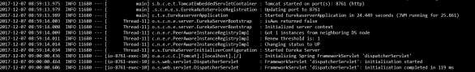

Now, hit the URL **http://localhost:8761/** in your web browser and you can find the Eureka Server running on the port 8761 as shown below −

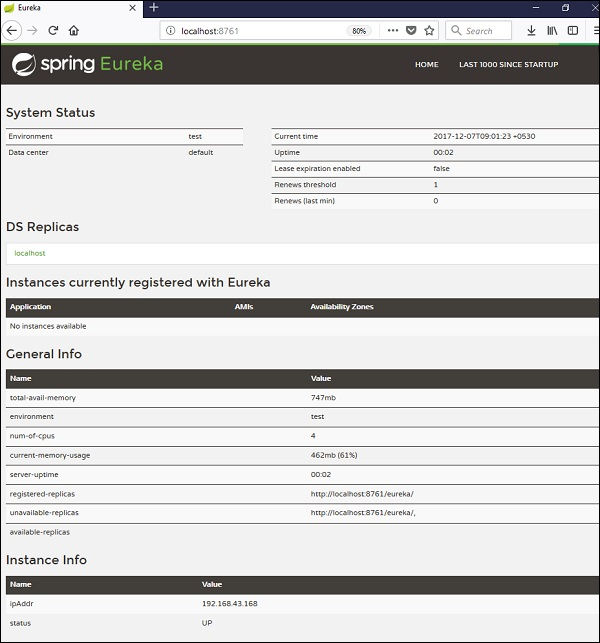

# Service Registration with Eureka
In this chapter, you are going to learn in detail about How to register the Spring Boot Micro service application into the Eureka Server. Before registering the application, please make sure Eureka Server is running on the port 8761 or first build the Eureka Server and run it. For further information on building the Eureka server, you can refer to the previous chapter.

First, you need to add the following dependencies in our build configuration file to register the microservice with the Eureka server.

Maven users can add the following dependencies into the **pom.xml** file −

```
<dependency>
   <groupId>org.springframework.cloud</groupId>
   <artifactId>spring-cloud-starter-eureka</artifactId>
</dependency>
```
Gradle users can add the following dependencies into the **build.gradle** file −

```
compile('org.springframework.cloud:spring-cloud-starter-eureka')
```
Now, we need to add the @EnableEurekaClient annotation in the main Spring Boot application class file. The @EnableEurekaClient annotation makes your Spring Boot application act as a Eureka client.

The main Spring Boot application is as given below −

```
package com.tutorialspoint.eurekaclient;

import org.springframework.boot.SpringApplication;
import org.springframework.boot.autoconfigure.SpringBootApplication;
import org.springframework.cloud.netflix.eureka.EnableEurekaClient;

@SpringBootApplication
@EnableEurekaClient
public class EurekaclientApplication {
   public static void main(String[] args) {
      SpringApplication.run(EurekaclientApplication.class, args);
   }
}
```
To register the Spring Boot application into Eureka Server we need to add the following configuration in our application.properties file or application.yml file and specify the Eureka Server URL in our configuration.

The code for application.yml file is given below −

```
eureka:
   client:
      serviceUrl:
         defaultZone: http://localhost:8761/eureka
      instance:
      preferIpAddress: true
spring:
   application:
      name: eurekaclient
```
The code for application.properties file is given below −

```
eureka.client.serviceUrl.defaultZone  = http://localhost:8761/eureka
eureka.client.instance.preferIpAddress = true
spring.application.name = eurekaclient
```
Now, add the Rest Endpoint to return String in the main Spring Boot application and the Spring Boot Starter web dependency in build configuration file. Observe the code given below −

```
package com.tutorialspoint.eurekaclient;

import org.springframework.boot.SpringApplication;
import org.springframework.boot.autoconfigure.SpringBootApplication;
import org.springframework.cloud.netflix.eureka.EnableEurekaClient;
import org.springframework.web.bind.annotation.RequestMapping;
import org.springframework.web.bind.annotation.RestController;

@SpringBootApplication
@EnableEurekaClient
@RestController
public class EurekaclientApplication {
   public static void main(String[] args) {
      SpringApplication.run(EurekaclientApplication.class, args);
   }
   @RequestMapping(value = "/")
   public String home() {
      return "Eureka Client application";
   }
}
```
The entire configuration file is given below.

**For Maven user - pom.xml**

```
<?xml version = "1.0" encoding = "UTF-8"?>
<project xmlns = "http://maven.apache.org/POM/4.0.0" 
   xmlns:xsi = "http://www.w3.org/2001/XMLSchema-instance"
   xsi:schemaLocation = "http://maven.apache.org/POM/4.0.0 
   http://maven.apache.org/xsd/maven-4.0.0.xsd">
   
   <modelVersion>4.0.0</modelVersion>
   <groupId>com.tutorialspoint</groupId>
   <artifactId>eurekaclient</artifactId>
   <version>0.0.1-SNAPSHOT</version>
   <packaging>jar</packaging>

   <name>eurekaclient</name>
   <description>Demo project for Spring Boot</description>

   <parent>
      <groupId>org.springframework.boot</groupId>
      <artifactId>spring-boot-starter-parent</artifactId>
      <version>1.5.9.RELEASE</version>
      <relativePath/> <!-- lookup parent from repository -->
   </parent>

   <properties>
      <project.build.sourceEncoding>UTF-8</project.build.sourceEncoding>
      <project.reporting.outputEncoding>UTF-8</project.reporting.outputEncoding>
      <java.version>1.8</java.version>
      <spring-cloud.version>Edgware.RELEASE</spring-cloud.version>
   </properties>

   <dependencies>
      <dependency>
         <groupId>org.springframework.cloud</groupId>
         <artifactId>spring-cloud-starter-eureka</artifactId>
      </dependency>
      <dependency>
         <groupId>org.springframework.boot</groupId>
         <artifactId>spring-boot-starter-web</artifactId>
      </dependency>
      <dependency>
         <groupId>org.springframework.boot</groupId>
         <artifactId>spring-boot-starter-test</artifactId>
         <scope>test</scope>
      </dependency>
   </dependencies>
   
   <dependencyManagement>
      <dependencies>
         <dependency>
            <groupId>org.springframework.cloud</groupId>
            <artifactId>spring-cloud-dependencies</artifactId>
            <version>${spring-cloud.version}</version>
            <type>pom</type>
            <scope>import</scope>
         </dependency>
      </dependencies>
   </dependencyManagement>
   
   <build>
      <plugins>
         <plugin>
            <groupId>org.springframework.boot</groupId>
            <artifactId>spring-boot-maven-plugin</artifactId>
         </plugin>
      </plugins>   
   </build>
   
</projecta>
```
**For Gradle user – build.gradle**

```
buildscript {
   ext {
      springBootVersion = '1.5.9.RELEASE'
   }
   repositories {
      mavenCentral()
   }
   dependencies {
      classpath("org.springframework.boot:spring-boot-gradle-plugin:${springBootVersion}")
   }
}

apply plugin: 'java'
apply plugin: 'eclipse'
apply plugin: 'org.springframework.boot'

group = 'com.tutorialspoint'
version = '0.0.1-SNAPSHOT'
sourceCompatibility = 1.8

repositories {
   mavenCentral()
}
ext {
   springCloudVersion = 'Edgware.RELEASE'
}
dependencies {
   compile('org.springframework.cloud:spring-cloud-starter-eureka')
   testCompile('org.springframework.boot:spring-boot-starter-test')
   compile('org.springframework.boot:spring-boot-starter-web')   
}
dependencyManagement {
   imports {
      mavenBom "org.springframework.cloud:spring-cloud-dependencies:${springCloudVersion}"
   }
}
```
You can create an executable JAR file, and run the Spring Boot application by using the following Maven or Gradle commands −

For Maven, you can use the following command −

```
mvn clean install
```
After “BUILD SUCCESS”, you can find the JAR file under the target directory.

For Gradle, you can use the following command −

```
gradle clean build
```
After “BUILD SUCCESSFUL”, you can find the JAR file under the build/libs directory.

Now, run the JAR file by using the command as shown −

```
java –jar <JARFILE>
```
Now, the application has started on the Tomcat port 8080 and Eureka Client application is registered with the Eureka Server as shown below −


Hit the URL http://localhost:8761/ in your web browser and you can see the Eureka Client application is registered with Eureka Server.

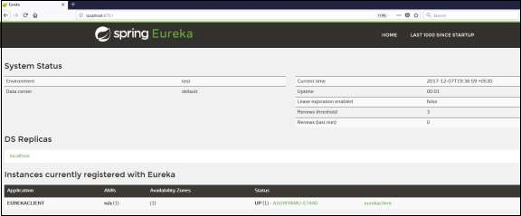

Now hit the URL **http://localhost:8080/** in your web browser and see the Rest Endpoint output.

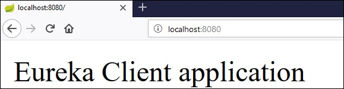

# Spring Boot - Zuul Proxy Server and Routing
Zuul Server is a gateway application that handles all the requests and does the dynamic routing of microservice applications. The Zuul Server is also known as Edge Server.

For Example, **/api/user** is mapped to the user service and /api/products is mapped to the product service and Zuul Server dynamically routes the requests to the respective backend application.

In this chapter, we are going to see in detail how to create Zuul Server application in Spring Boot.

## Creating Zuul Server Application
The Zuul Server is bundled with Spring Cloud dependency. You can download the Spring Boot project from Spring Initializer page [https://start.spring.io/](https://start.spring.io/)  and choose the Zuul Server dependency.

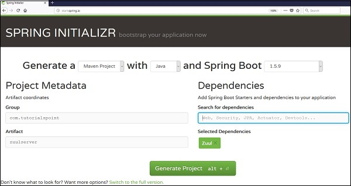

Add the @EnableZuulProxy annotation on your main Spring Boot application. The @EnableZuulProxy annotation is used to make your Spring Boot application act as a Zuul Proxy server.

```
package com.tutorialspoint.zuulserver;

import org.springframework.boot.SpringApplication;
import org.springframework.boot.autoconfigure.SpringBootApplication;
import org.springframework.cloud.netflix.zuul.EnableZuulProxy;

@SpringBootApplication
@EnableZuulProxy
public class ZuulserverApplication {
   public static void main(String[] args) {
      SpringApplication.run(ZuulserverApplication.class, args);
   }
}
```
You will have to add the Spring Cloud Starter Zuul dependency in our build configuration file.

Maven users will have to add the following dependency in your **pom.xml** file −

```
<dependency>
   <groupId>org.springframework.cloud</groupId>
   <artifactId>spring-cloud-starter-zuul</artifactId>
</dependency>
```
For Gradle users, add the below dependency in your build.gradle file

```
compile('org.springframework.cloud:spring-cloud-starter-zuul')
```
For Zuul routing, add the below properties in your application.properties file or application.yml file.

```
spring.application.name = zuulserver
zuul.routes.products.path = /api/demo/**
zuul.routes.products.url = http://localhost:8080/
server.port = 8111
```
This means that http calls to **/api/demo/** get forwarded to the products service. For example, **/api/demo/products** is forwarded to **/products**.

yaml file users can use the application.yml file shown below −

```
server:
   port: 8111
spring:
   application:  
      name: zuulserver
zuul:

routes:
   products:
      path: /api/demo/**
      url: http://localhost:8080/
```
**Note** − The **http://localhost:8080/** application should already be running before routing via Zuul Proxy.

The complete build configuration file is given below.

Maven users can use the pom.xml file given below −

```
<?xml version = "1.0" encoding = "UTF-8"?>
<project xmlns = "http://maven.apache.org/POM/4.0.0" 
   xmlns:xsi = "http://www.w3.org/2001/XMLSchema-instance"
   xsi:schemaLocation = "http://maven.apache.org/POM/4.0.0 
   http://maven.apache.org/xsd/maven-4.0.0.xsd">
   
   <modelVersion>4.0.0</modelVersion>
   <groupId>com.tutorialspoint</groupId>
   <artifactId>zuulserver</artifactId>
   <version>0.0.1-SNAPSHOT</version>
   <packaging>jar</packaging>

   <name>zuulserver</name>
   <description>Demo project for Spring Boot</description>

   <parent>
      <groupId>org.springframework.boot</groupId>
      <artifactId>spring-boot-starter-parent</artifactId>
      <version>1.5.9.RELEASE</version>
      <relativePath/> <!-- lookup parent from repository -->
   </parent>

   <properties>
      <project.build.sourceEncoding>UTF-8</project.build.sourceEncoding>
      <project.reporting.outputEncoding>UTF-8</project.reporting.outputEncoding>
      <java.version>1.8</java.version>
      <spring-cloud.version>Edgware.RELEASE</spring-cloud.version>
   </properties>

   <dependencies>
      <dependency>
         <groupId>org.springframework.cloud</groupId>
         <artifactId>spring-cloud-starter-zuul</artifactId>
      </dependency>

      <dependency>
         <groupId>org.springframework.boot</groupId>
         <artifactId>spring-boot-starter-test</artifactId>
         <scope>test</scope>
      </dependency>
   </dependencies>

   <dependencyManagement>
      <dependencies>
         <dependency>
            <groupId>org.springframework.cloud</groupId>
            <artifactId>spring-cloud-dependencies</artifactId>
            <version>${spring-cloud.version}</version>
            <type>pom</type>
            <scope>import</scope>
         </dependency>
      </dependencies>
   </dependencyManagement>

   <build>
      <plugins>
         <plugin>
            <groupId>org.springframework.boot</groupId>
            <artifactId>spring-boot-maven-plugin</artifactId>
         </plugin>
      </plugins>
   </build>
</project>
```
Gradle users can use the build.gradle file given below −

```
buildscript {
   ext {
      springBootVersion = '1.5.9.RELEASE'
   }
   repositories {
      mavenCentral()
   }
   dependencies {
      classpath("org.springframework.boot:spring-boot-gradle-plugin:${springBootVersion}")
   }
}

apply plugin: 'java'
apply plugin: 'eclipse'
apply plugin: 'org.springframework.boot'

group = 'com.tutorialspoint'
version = '0.0.1-SNAPSHOT'
sourceCompatibility = 1.8

repositories {
   mavenCentral()
}
ext {
   springCloudVersion = 'Edgware.RELEASE'
}
dependencies {
   compile('org.springframework.cloud:spring-cloud-starter-zuul')
   testCompile('org.springframework.boot:spring-boot-starter-test')
}
dependencyManagement {
   imports {
      mavenBom "org.springframework.cloud:spring-cloud-dependencies:${springCloudVersion}"
   }
}
```
You can create an executable JAR file, and run the Spring Boot application by using the Maven or Gradle commands given below −

For Maven, you can use the command given below −

```
mvn clean install
```
After “BUILD SUCCESS”, you can find the JAR file under the target directory.

For Gradle, you can use the command given below −

```
gradle clean build
```
After “BUILD SUCCESSFUL”, you can find the JAR file under the build/libs directory.

Now, run the JAR file by using the command shown below −

```
java –jar <JARFILE>
```
You can find the application has started on the Tomcat port 8111 as shown here.

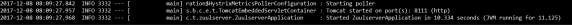

Now, hit the URL **http://localhost:8111/api/demo/products** in your web browser and you can see the output of **/products** REST Endpoint as shown below −

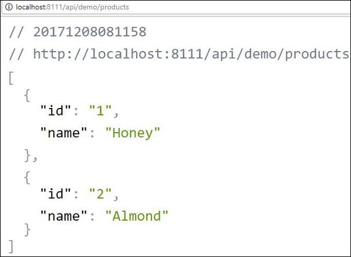

# Spring Boot - Cloud Configuration Server
Spring Cloud Configuration Server is a centralized application that manages all the application related configuration properties. In this chapter, you will learn in detail about how to create Spring Cloud Configuration server.

## Creating Spring Cloud Configuration Server
First, download the Spring Boot project from the Spring Initializer page and choose the Spring Cloud Config Server dependency. Observe the screenshot given below −


Now, add the Spring Cloud Config server dependency in your build configuration file as explained below −

Maven users can add the below dependency into the pom.xml file.

```
<dependency>
   <groupId>org.springframework.cloud</groupId>
   <artifactId>spring-cloud-config-server</artifactId>
</dependency>
```
Gradle users can add the below dependency in your build.gradle file.

```
compile('org.springframework.cloud:spring-cloud-config-server')
```
Now, add the @EnableConfigServer annotation in your main Spring Boot application class file. The @EnableConfigServer annotation makes your Spring Boot application act as a Configuration Server.

The main Spring Boot application class file is given below −

```
package com.tutorialspoint.configserver;

import org.springframework.boot.SpringApplication;
import org.springframework.boot.autoconfigure.SpringBootApplication;
import org.springframework.cloud.config.server.EnableConfigServer;

@SpringBootApplication
@EnableConfigServer
public class ConfigserverApplication {
   public static void main(String[] args) {
      SpringApplication.run(ConfigserverApplication.class, args);
   }
}
```
Now, add the below configuration to your properties file and replace the application.properties file into bootstrap.properties file. Observe the code given below −

```
server.port = 8888
spring.cloud.config.server.native.searchLocations=file:///C:/configprop/
SPRING_PROFILES_ACTIVE=native
```
Configuration Server runs on the Tomcat port 8888 and application configuration properties are loaded from native search locations.

Now, in **file:///C:/configprop/**, place your client application - application.properties file. For example, your client application name is **config-client**, then rename your application.properties file as **config-client.properties** and place the properties file on the path **file:///C:/configprop/**.

The code for config-client properties file is given below −

```
welcome.message = Welcome to Spring cloud config server
```
The complete build configuration file is given below −

Maven users can use **pom.xml** given below −

```
<?xml version = "1.0" encoding = "UTF-8"?>
<project xmlns = "http://maven.apache.org/POM/4.0.0" 
   xmlns:xsi = "http://www.w3.org/2001/XMLSchema-instance"
   xsi:schemaLocation = "http://maven.apache.org/POM/4.0.0 
   http://maven.apache.org/xsd/maven-4.0.0.xsd">
   
   <modelVersion>4.0.0</modelVersion>
   <groupId>com.tutorialspoint</groupId>
   <artifactId>configserver</artifactId>
   <version>0.0.1-SNAPSHOT</version>
   <packaging>jar</packaging>

   <name>configserver</name>
   <description>Demo project for Spring Boot</description>
   <parent>
      <groupId>org.springframework.boot</groupId>
      <artifactId>spring-boot-starter-parent</artifactId>
      <version>1.5.9.RELEASE</version>
      <relativePath/> <!-- lookup parent from repository -->
   </parent>

   <properties>
      <project.build.sourceEncoding>UTF-8</project.build.sourceEncoding>
      <project.reporting.outputEncoding>UTF-8</project.reporting.outputEncoding>
      <java.version>1.8</java.version>
      <spring-cloud.version>Edgware.RELEASE</spring-cloud.version>
   </properties>

   <dependencies>
      <dependency>
         <groupId>org.springframework.cloud</groupId>
         <artifactId>spring-cloud-config-server</artifactId>
      </dependency>
      <dependency>
         <groupId>org.springframework.boot</groupId>
         <artifactId>spring-boot-starter-test</artifactId>
         <scope>test</scope>
      </dependency>
   </dependencies>

   <dependencyManagement>
      <dependencies>
         <dependency>
            <groupId>org.springframework.cloud</groupId>
            <artifactId>spring-cloud-dependencies</artifactId>
            <version>${spring-cloud.version}</version>
            <type>pom</type>
            <scope>import</scope>
         </dependency>
      </dependencies>
   </dependencyManagement>

   <build>
      <plugins>
         <plugin>
            <groupId>org.springframework.boot</groupId>
            <artifactId>spring-boot-maven-plugin</artifactId>
         </plugin>
      </plugins>
   </build>
   
</project>
```
Gradle users can use the build.gradle file given below −

```
<scope>import</scope>
</dependency>
</dependencies>
buildscript {
   ext {
      springBootVersion = '1.5.9.RELEASE'
   }
   repositories {
      mavenCentral()
   }
   dependencies {
      classpath("org.springframework.boot:spring-boot-gradle-plugin:${springBootVersion}")
   }
}
apply plugin: 'java'
apply plugin: 'eclipse'
apply plugin: 'org.springframework.boot'

group = 'com.tutorialspoint'
version = '0.0.1-SNAPSHOT'
sourceCompatibility = 1.8

repositories {
   mavenCentral()
}
ext {
   springCloudVersion = 'Edgware.RELEASE'
}
dependencies {
   compile('org.springframework.cloud:spring-cloud-config-server')
   testCompile('org.springframework.boot:spring-boot-starter-test')
}
dependencyManagement {
   imports {
      mavenBom "org.springframework.cloud:spring-cloud-dependencies:${springCloudVersion}"
   }
}
```
Now, create an executable JAR file, and run the Spring Boot application by using the following Maven or Gradle commands −

For Maven, use the command given below −

```
mvn clean install
```
After “BUILD SUCCESS”, you can find the JAR file under the target directory.

For Gradle, use the command given below −

```
gradle clean build
```
After “BUILD SUCCESSFUL”, you can find the JAR file under the build/libs directory.

Run the JAR file by using the following command −

```
java –jar <JARFILE>
```
Now, the application has started on the Tomcat port 8888 as shown here −


Now hit the URL **http://localhost:8888/config-client/default/master** on your web browser and you can see your config-client application configuration properties as shown here.


# Spring Boot - Cloud Configuration Client
Some applications may need configuration properties that may need a change and developers may need to take them down or restart the application to perform this. However, this might be lead to downtime in production and the need of restarting the application. Spring Cloud Configuration Server lets developers to load the new configuration properties without restarting the application and without any downtime.

## Working with Spring Cloud Configuration Server
First, download the Spring Boot project from [https://start.spring.io/](https://start.spring.io/)  and choose the Spring Cloud Config Client dependency. Now, add the Spring Cloud Starter Config dependency in your build configuration file.

Maven users can add the following dependency into the pom.xml file.

```
<dependency>
   <groupId>org.springframework.cloud</groupId>
   <artifactId>spring-cloud-starter-config</artifactId>
</dependency>
```
Gradle users can add the following dependency into the **build.gradle** file.

```
compile('org.springframework.cloud:spring-cloud-starter-config')
```
Now, you need to add the @RefreshScope annotation to your main Spring Boot application. The @RefreshScope annotation is used to load the configuration properties value from the Config server.

```
package com.example.configclient;

import org.springframework.boot.SpringApplication;
import org.springframework.boot.autoconfigure.SpringBootApplication;
import org.springframework.cloud.context.config.annotation.RefreshScope;

@SpringBootApplication
@RefreshScope
public class ConfigclientApplication {
   public static void main(String[] args) {
      SpringApplication.run(ConfigclientApplication.class, args);
   }
}
```
Now, add the config server URL in your application.properties file and provide your application name.

**Note** − http://localhost:8888 config server should be run before starting the config client application.

```
spring.application.name = config-client
spring.cloud.config.uri = http://localhost:8888
```
The code for writing a simple REST Endpoint to read the welcome message from the configuration server is given below −

```
package com.example.configclient;

import org.springframework.beans.factory.annotation.Value;
import org.springframework.boot.SpringApplication;
import org.springframework.boot.autoconfigure.SpringBootApplication;
import org.springframework.cloud.context.config.annotation.RefreshScope;
import org.springframework.web.bind.annotation.RequestMapping;
import org.springframework.web.bind.annotation.RestController;

@SpringBootApplication
@RefreshScope
@RestController
public class ConfigclientApplication {
   @Value("${welcome.message}")
   String welcomeText;
   
   public static void main(String[] args) {
      SpringApplication.run(ConfigclientApplication.class, args);
   }
   @RequestMapping(value = "/")
   public String welcomeText() {
      return welcomeText;
   }
}
```
You can create an executable JAR file, and run the Spring Boot application by using the following Maven or Gradle commands −

For Maven, you can use the command shown below −

```
mvn clean install
```
After “BUILD SUCCESS”, you can find the JAR file under the target directory.

For Gradle, you can use the command shown below −

```
gradle clean build
```
After “BUILD SUCCESSFUL”, you can find the JAR file under the build/libs directory.

Now, run the JAR file by using the command shown here: 

```
java –jar <JARFILE>
```
Now, the application has started on the Tomcat port 8080 as shown here −


You can see the log in console window; config-client application is fetching the configuration from the **https://localhost:8888**

```
2017-12-08 12:41:57.682  INFO 1104 --- [           
   main] c.c.c.ConfigServicePropertySourceLocator : 
   Fetching config from server at: http://localhost:8888
```
Now hit the URL, **http://localhost:8080/** welcome message is loaded from the Configuration server.

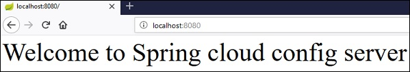

Now, go and change the property value on the Configuration server and hit the actuator Endpoint POST URL **http://localhost:8080/refresh** and see the new configuration property value in the URL **http://localhost:8080/**

# Spring Boot - Actuator
Spring Boot Actuator provides secured endpoints for monitoring and managing your Spring Boot application. By default, all actuator endpoints are secured. In this chapter, you will learn in detail about how to enable Spring Boot actuator to your application.

## Enabling Spring Boot Actuator
To enable Spring Boot actuator endpoints to your Spring Boot application, we need to add the Spring Boot Starter actuator dependency in our build configuration file.

Maven users can add the below dependency in your pom.xml file.

```
<dependency>
   <groupId>org.springframework.boot</groupId>
   <artifactId>spring-boot-starter-actuator</artifactId>
</dependency>
```
Gradle users can add the below dependency in your build.gradle file.

```
compile group: 'org.springframework.boot', name: 'spring-boot-starter-actuator'
```
In the application.properties file, we need to disable the security for actuator endpoints.

```
management.security.enabled = false
```
YAML file users can add the following property in your application.yml file.

```
management:
   security:
      enabled: false
```
If you want to use the separate port number for accessing the Spring boot actutator endpoints add the management port number in application.properties file.

```
management.port = 9000
```
YAML file users can add the following property in your application.yml file.

```
management:
   port: 9000
```
Now, you can create an executable JAR file, and run the Spring Boot application by using the following Maven or Gradle commands.

For Maven, you can use the following command −

```
mvn clean install
```
After “BUILD SUCCESS”, you can find the JAR file under the target directory.

For Gradle, you can use the following command −

```
gradle clean build
```
After “BUILD SUCCESSFUL”, you can find the JAR file under the build/libs directory.

Now, you can run the JAR file by using the following command −

```
java –jar <JARFILE>
```
Now, the application has started on the Tomcat port 8080. Note that if you specified the management port number, then same application is running on two different port numbers.


Some important Spring Boot Actuator endpoints are given below. You can enter them in your web browser and monitor your application behavior.

# Spring Boot - Admin Server
Monitoring your application by using Spring Boot Actuator Endpoint is slightly difficult. Because, if you have ‘n’ number of applications, every application has separate actuator endpoints, thus making monitoring difficult. Spring Boot Admin Server is an application used to manage and monitor your Microservice application.

To handle such situations, CodeCentric Team provides a Spring Boot Admin UI to manage and monitor all your Spring Boot application Actuator endpoints at one place.

For building a Spring Boot Admin Server we need to add the below dependencies in your build configuration file.

Maven users can add the below dependencies in your pom.xml file −

```
<dependency>
   <groupId>de.codecentric</groupId>
   <artifactId>spring-boot-admin-server</artifactId>
   <version>1.5.5</version>
</dependency>
<dependency>
   <groupId>de.codecentric</groupId>
   <artifactId>spring-boot-admin-server-ui</artifactId>
   <version>1.5.5</version>
</dependency>
```
Gradle users can add the below dependencies in your build.gradle file −

```
compile group: 'de.codecentric', name: 'spring-boot-admin-server', version: '1.5.5'
compile group: 'de.codecentric', name: 'spring-boot-admin-server-ui', version: '1.5.5'
```
Add the @EnableAdminServer annotation in your main Spring Boot application class file. The @EnableAdminServer annotation is used to make your as Admin Server to monitor all other microservices.

```
package com.tutorialspoint.adminserver;

import org.springframework.boot.SpringApplication;
import org.springframework.boot.autoconfigure.SpringBootApplication;
import de.codecentric.boot.admin.config.EnableAdminServer;

@SpringBootApplication
@EnableAdminServer
public class AdminserverApplication {   
   public static void main(String[] args) {
      SpringApplication.run(AdminserverApplication.class, args);
   }
}
```
Now, define the server.port and application name in application.properties file a shown −

```
server.port = 9090
spring.application.name = adminserver
```
For YAML users, use the following properties to define the port number and application name in application.yml file.

```
server:
   port: 9090
spring:
   application:
      name: adminserver
```
The build configuration file is given below.

**For Maven users – pom.xml**

```
<?xml version = "1.0" encoding = "UTF-8"?>
<project xmlns = "http://maven.apache.org/POM/4.0.0" 
   xmlns:xsi = "http://www.w3.org/2001/XMLSchema-instance"
   xsi:schemaLocation = "http://maven.apache.org/POM/4.0.0 
   http://maven.apache.org/xsd/maven-4.0.0.xsd">
   
   <modelVersion>4.0.0</modelVersion>
   <groupId>com.tutorialspoint</groupId>
   <artifactId>adminserver</artifactId>
   <version>0.0.1-SNAPSHOT</version>
   <packaging>jar</packaging>

   <name>adminserver</name>
   <description>Demo project for Spring Boot</description>

   <parent>
      <groupId>org.springframework.boot</groupId>
      <artifactId>spring-boot-starter-parent</artifactId>
      <version>1.5.9.RELEASE</version>
      <relativePath /> <!-- lookup parent from repository -->
   </parent>

   <properties>
      <project.build.sourceEncoding>UTF-8</project.build.sourceEncoding>
      <project.reporting.outputEncoding>UTF-8</project.reporting.outputEncoding>
      <java.version>1.8</java.version>
   </properties>

   <dependencies>
      <dependency>
         <groupId>org.springframework.boot</groupId>
         <artifactId>spring-boot-starter</artifactId>
      </dependency>

      <dependency>
         <groupId>de.codecentric</groupId>
         <artifactId>spring-boot-admin-server</artifactId>
         <version>1.5.5</version>
      </dependency>
      
      <dependency>
         <groupId>de.codecentric</groupId>
         <artifactId>spring-boot-admin-server-ui</artifactId>
         <version>1.5.5</version>
      </dependency>

      <dependency>
         <groupId>org.springframework.boot</groupId>
         <artifactId>spring-boot-starter-test</artifactId>
         <scope>test</scope>
      </dependency>
   </dependencies>

   <build>
      <plugins>
         <plugin>
            <groupId>org.springframework.boot</groupId>
            <artifactId>spring-boot-maven-plugin</artifactId>
         </plugin>
      </plugins>
   </build>
   
</project>
```
**For Gradle users – build.gradle file**

```
buildscript {
   ext {
      springBootVersion = '1.5.9.RELEASE'
   }
   repositories {
      mavenCentral()
   }
   dependencies {
      classpath("org.springframework.boot:spring-boot-gradle-plugin:${springBootVersion}")
   }
}

apply plugin: 'java'
apply plugin: 'eclipse'
apply plugin: 'org.springframework.boot'

group = 'com.tutorialspoint'
version = '0.0.1-SNAPSHOT'
sourceCompatibility = 1.8
repositories {   
   mavenCentral()
}
dependencies {
   compile('org.springframework.boot:spring-boot-starter')
   compile group: 'de.codecentric', name: 'spring-boot-admin-server', version: '1.5.5'
   compile group: 'de.codecentric', name: 'spring-boot-admin-server-ui', version: '1.5.5'   
   testCompile('org.springframework.boot:spring-boot-starter-test')
}
```
You can create an executable JAR file, and run the Spring Boot application by using the following Maven or Gradle commands −

For Maven, use the command shown here −

```
mvn clean install
```
After “BUILD SUCCESS”, you can find the JAR file under target directory.

For Gradle, use the command shown here −

```
gradle clean build
```
After “BUILD SUCCESSFUL”, you can find the JAR file under build/libs directory.

Now, run the JAR file by using the command given below −

```
java –jar <JARFILE>
```
Now, the application has started on the Tomcat port 9090 as shown here −


Now hit the below URL from your web browser and see the Admin Server UI.

**http://localhost:9090/**

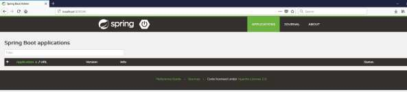

# Spring Boot - Admin Client
For monitoring and managing your microservice application via Spring Boot Admin Server, you should add the Spring Boot Admin starter client dependency and point out the Admin Server URI into the application properties file.

**Note** − For monitoring an application, you should enable the Spring Boot Actuator Endpoints for your Microservice application.

First, add the following Spring Boot Admin starter client dependency and Spring Boot starter actuator dependency in your build configuration file.

Maven users can add the following dependencies in your pom.xml file −

```
<dependency>
   <groupId>de.codecentric</groupId>
   <artifactId>spring-boot-admin-starter-client</artifactId>
   <version>1.5.5</version>
</dependency>
<dependency>
   <groupId>org.springframework.boot</groupId>
   <artifactId>spring-boot-starter-actuator</artifactId>
</dependency>
```
Gradle users can add the following dependencies in your build.gradle file.

```
compile group: 'de.codecentric', name: 'spring-boot-admin-starter-client', version: '1.5.5'
compile('org.springframework.boot:spring-boot-starter-actuator')
```
Now, add the Spring Boot Admin Server URL into your application properties file.

For properties file users, add the following properties in the application.properties file.

```
spring.boot.admin.url = http://localhost:9090/
```
For YAML users, add the following property in application.yml file.

```
spring:
   boot:
      admin:
         url: http://localhost:9000/
```
Now, create an executable JAR file, and run the Spring Boot application by using the following Maven or Gradle commands.

For Maven, you can use the command as shown −

```
mvn clean install
```
After “BUILD SUCCESS”, you can find the JAR file under the target directory.

For Gradle, you can use the command as shown −

```
gradle clean build
```
After “BUILD SUCCESSFUL”, you can find the JAR file under the build/libs directory.

Now, run the JAR file by using the command shown −

```
java –jar <JARFILE>
```
Now, the application has started on the Tomcat port 9090 as shown −


Now hit the following URL from your web browser and see your spring Boot application is registered with Spring Boot Admin Server.

**http://localhost:9090/**


Now, click the **Details** button and the see the actuator endpoints in Admin Server UI.


# Spring Boot - Enabling Swagger2
Swagger2 is an open source project used to generate the REST API documents for RESTful web services. It provides a user interface to access our RESTful web services via the web browser.

To enable the Swagger2 in Spring Boot application, you need to add the following dependencies in our build configurations file.

```
<dependency>
   <groupId>io.springfox</groupId>
   <artifactId>springfox-swagger2</artifactId>
   <version>2.7.0</version>
</dependency>
<dependency>
   <groupId>io.springfox</groupId>
   <artifactId>springfox-swagger-ui</artifactId>
   <version>2.7.0</version>
</dependency>
```
For Gradle users, add the following dependencies in your build.gradle file.

```
compile group: 'io.springfox', name: 'springfox-swagger2', version: '2.7.0'
compile group: 'io.springfox', name: 'springfox-swagger-ui', version: '2.7.0'
```
Now, add the @EnableSwagger2 annotation in your main Spring Boot application. The @EnableSwagger2 annotation is used to enable the Swagger2 for your Spring Boot application.

The code for main Spring Boot application is shown below −

```
package com.tutorialspoint.swaggerdemo;

import org.springframework.boot.SpringApplication;
import org.springframework.boot.autoconfigure.SpringBootApplication;
import springfox.documentation.swagger2.annotations.EnableSwagger2;

@SpringBootApplication
@EnableSwagger2
public class SwaggerDemoApplication {
   public static void main(String[] args) {
      SpringApplication.run(SwaggerDemoApplication.class, args);
   }
}
```
Next, create Docket Bean to configure Swagger2 for your Spring Boot application. We need to define the base package to configure REST API(s) for Swagger2.

```
@Bean
   public Docket productApi() {
      return new Docket(DocumentationType.SWAGGER_2).select()
         .apis(RequestHandlerSelectors.basePackage("com.tutorialspoint.swaggerdemo")).build();
   }
```
Now, add this bean in main Spring Boot application class file itself and your main Spring Boot application class will look as shown below −

```
package com.tutorialspoint.swaggerdemo;

import org.springframework.boot.SpringApplication;
import org.springframework.boot.autoconfigure.SpringBootApplication;
import org.springframework.context.annotation.Bean;

import springfox.documentation.builders.RequestHandlerSelectors;
import springfox.documentation.spi.DocumentationType;
import springfox.documentation.spring.web.plugins.Docket;
import springfox.documentation.swagger2.annotations.EnableSwagger2;

@SpringBootApplication
@EnableSwagger2
public class SwaggerDemoApplication {
   public static void main(String[] args) {
      SpringApplication.run(SwaggerDemoApplication.class, args);
   }
   @Bean
   public Docket productApi() {
      return new Docket(DocumentationType.SWAGGER_2).select()
         .apis(RequestHandlerSelectors.basePackage("com.tutorialspoint.swaggerdemo")).build();
   }
}
```
Now, add the below Spring Boot Starter Web dependency in your build configuration file to write a REST Endpoints as shown below −

Maven users can add the following dependency in your pom.xml file −

```
<dependency>
   <groupId>org.springframework.boot</groupId>
   <artifactId>spring-boot-starter-web</artifactId>
</dependency>
```
Gradle users can add the following dependency in build.gradle file −

```
compile('org.springframework.boot:spring-boot-starter-web')
```
Now, the code to build two simple RESTful web services GET and POST in Rest Controller file is shown here −

```
package com.tutorialspoint.swaggerdemo;

import java.util.ArrayList;
import java.util.List;

import org.springframework.web.bind.annotation.RequestMapping;
import org.springframework.web.bind.annotation.RequestMethod;
import org.springframework.web.bind.annotation.RestController;

@RestController
public class SwaggerAPIController {
   @RequestMapping(value = "/products", method = RequestMethod.GET)
   public List<String> getProducts() {
      List<String> productsList = new ArrayList<>();
      productsList.add("Honey");
      productsList.add("Almond");
      return productsList;
   }
   @RequestMapping(value = "/products", method = RequestMethod.POST)
   public String createProduct() {
      return "Product is saved successfully";
   }
}
```
The complete build configuration file is given below −

**Maven – pom.xml**

```
<?xml version = "1.0" encoding = "UTF-8"?>
<project xmlns = "http://maven.apache.org/POM/4.0.0" 
   xmlns:xsi = "http://www.w3.org/2001/XMLSchema-instance"
   xsi:schemaLocation = "http://maven.apache.org/POM/4.0.0 
   http://maven.apache.org/xsd/maven-4.0.0.xsd">
   <modelVersion>4.0.0</modelVersion>

   <groupId>com.tutorialspoint</groupId>
   <artifactId>swagger-demo</artifactId>
   <version>0.0.1-SNAPSHOT</version>
   <packaging>jar</packaging>
   <name>swagger-demo</name>
   <description>Demo project for Spring Boot</description>

   <parent>
      <groupId>org.springframework.boot</groupId>
      <artifactId>spring-boot-starter-parent</artifactId>
      <version>1.5.9.RELEASE</version>
      <relativePath /> <!-- lookup parent from repository -->
   </parent>

   <properties>
      <project.build.sourceEncoding>UTF-8</project.build.sourceEncoding>
      <project.reporting.outputEncoding>UTF-8</project.reporting.outputEncoding>
      <java.version>1.8</java.version>
   </properties>

   <dependencies>
      <dependency>
         <groupId>org.springframework.boot</groupId>
         <artifactId>spring-boot-starter-web</artifactId>
      </dependency>
      
      <dependency>
         <groupId>org.springframework.boot</groupId>
         <artifactId>spring-boot-starter-test</artifactId>
         <scope>test</scope>
      </dependency>
      
      <dependency>
         <groupId>io.springfox</groupId>
         <artifactId>springfox-swagger2</artifactId>
         <version>2.7.0</version>
      </dependency>

      <dependency>
         <groupId>io.springfox</groupId>
         <artifactId>springfox-swagger-ui</artifactId>
         <version>2.7.0</version>
      </dependency>
   </dependencies>

   <build>
      <plugins>
         <plugin>
            <groupId>org.springframework.boot</groupId>
            <artifactId>spring-boot-maven-plugin</artifactId>
         </plugin>
      </plugins>
   </build>
   
</project>
```
**Gradle – build.gradle**

```
buildscript {
   ext {
      springBootVersion = '1.5.9.RELEASE'
   }
   repositories {
      mavenCentral()
   }
   dependencies {
      classpath("org.springframework.boot:spring-boot-gradle-plugin:${springBootVersion}")
   }
}
apply plugin: 'java'
apply plugin: 'eclipse'
apply plugin: 'org.springframework.boot'

group = 'com.tutorialspoint'
version = '0.0.1-SNAPSHOT'
sourceCompatibility = 1.8

repositories {
   mavenCentral()
} dependencies {
   compile('org.springframework.boot:spring-boot-starter-web')
   testCompile('org.springframework.boot:spring-boot-starter-test')
   compile group: 'io.springfox', name: 'springfox-swagger2', version: '2.7.0'
   compile group: 'io.springfox', name: 'springfox-swagger-ui', version: '2.7.0'
}
```
You can create an executable JAR file, and run the Spring Boot application by using the following Maven or Gradle commands.

For Maven, you can use the command shown here −

```
mvn clean install
```
After “BUILD SUCCESS”, you can find the JAR file under the target directory.

For Gradle, you can use the command as shown here −

```
gradle clean build
```
After “BUILD SUCCESSFUL”, you can find the JAR file under the build/libs directory.

Now, run the JAR file by using the command shown here −

```
java –jar <JARFILE>
```
Now, the application will start on the Tomcat port 8080 as shown −


Now, hit the URL in your web browser and see the Swagger API functionalities.

**http://localhost:8080/swagger-ui.html**

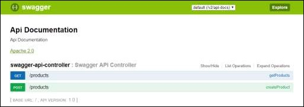

# Spring Boot - Creating Docker Image
Docker is a container management service that eases building and deployment. If you are a beginner to Docker, you can learn about is in detail at this link − [https://www.tutorialspoint.com/docker/index.htm](/docker/index.htm) 

In this chapter, we are going to see How to create a Docker image by using Maven and Gradle dependencies for your Spring Boot application.

## Create Dockerfile
First, create a file with the name **Dockerfile** under the directories **src/main/docker** with the contents shown below. Note that this file is important to create a Docker image.

```
FROM java:8
VOLUME /tmp
ADD dockerapp-0.0.1-SNAPSHOT.jar app.jar
RUN bash -c 'touch /app.jar'
ENTRYPOINT ["java","-Djava.security.egd=file:/dev/./urandom","-jar","/app.jar"]
```
## Maven
For Maven, add the Docker Maven plugin into your build configuration file **pom.xml**

```
<properties>
   <docker.image.prefix>spring-boot-tutorialspoint</docker.image.prefix>
</properties>

<build>
   <plugins>
      <plugin>
         <groupId>com.spotify</groupId>
         <artifactId>docker-maven-plugin</artifactId>
         <version>1.0.0</version>
         
         <configuration>
            <imageName>${docker.image.prefix}/${project.artifactId}</imageName>
            <dockerDirectory>src/main/docker</dockerDirectory>
            <resources>
               <resource>
                  <directory>${project.build.directory}</directory>
                  <include>${project.build.finalName}.jar</include>
               </resource>
            </resources>
         </configuration>
      </plugin>
      
      <plugin>
         <groupId>org.springframework.boot</groupId>
         <artifactId>spring-boot-maven-plugin</artifactId>
      </plugin>
   </plugins>
   
</build>
```
The complete pom.xml file is given below −

```
<?xml version = "1.0" encoding = "UTF-8"?>
<project xmlns = "http://maven.apache.org/POM/4.0.0" 
   xmlns:xsi = "http://www.w3.org/2001/XMLSchema-instance"
   xsi:schemaLocation = "http://maven.apache.org/POM/4.0.0 
   http://maven.apache.org/xsd/maven-4.0.0.xsd">
   
   <modelVersion>4.0.0</modelVersion>
   <groupId>com.tutorialspoint</groupId>
   <artifactId>dockerapp</artifactId>
   <version>0.0.1-SNAPSHOT</version>
   <packaging>jar</packaging>
   <name>dockerapp</name>
   <description>Demo project for Spring Boot</description>

   <parent>
      <groupId>org.springframework.boot</groupId>
      <artifactId>spring-boot-starter-parent</artifactId>
      <version>1.5.9.RELEASE</version>
      <relativePath /> <!-- lookup parent from repository -->
   </parent>

   <properties>
      <project.build.sourceEncoding>UTF-8</project.build.sourceEncoding>
      <project.reporting.outputEncoding>UTF-8</project.reporting.outputEncoding>
      <java.version>1.8</java.version>
      <docker.image.prefix>spring-boot-tutorialspoint</docker.image.prefix>
   </properties>

   <dependencies>
      <dependency>
         <groupId>org.springframework.boot</groupId>
         <artifactId>spring-boot-starter-web</artifactId>
      </dependency>
      <dependency>
         <groupId>org.springframework.boot</groupId>
         <artifactId>spring-boot-starter-test</artifactId>
         <scope>test</scope>
      </dependency>
   </dependencies>

   <build>
      <plugins>
         <plugin>
            <groupId>com.spotify</groupId>
            <artifactId>docker-maven-plugin</artifactId>
            <version>1.0.0</version>
            
            <configuration>
               <imageName>${docker.image.prefix}/${project.artifactId}</imageName>
               <dockerDirectory>src/main/docker</dockerDirectory>
               <resources>
                  <resource>
                     <directory>${project.build.directory}</directory>
                     <include>${project.build.finalName}.jar</include>
                  </resource>
               </resources>
            </configuration>
         </plugin>
         
         <plugin>
            <groupId>org.springframework.boot</groupId>
            <artifactId>spring-boot-maven-plugin</artifactId>
         </plugin>
      </plugins>
   </build>
   
</project>
```
Now, you can run your application by using the Maven command **mvn package docker:build**

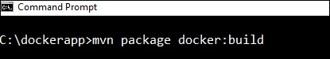

**Note** − Enable the Expose daemon on **tcp://localhost:2375** without TLS.

After build success, you can see the output on the console as shown below −


Now, see the Docker images by the command using docker images and see the image info on the console.

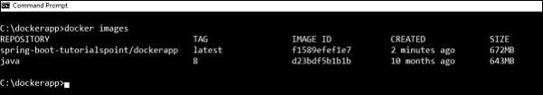

## Gradle
To build a Docker image by using Gradle build configuration, we need to add the **docker** plugin and need to write a task **buildDocker** to create a Docker image.

The code for Gradle Docker configuration is given below.

```
buildscript {
   .....
   dependencies {
      .....
      classpath('se.transmode.gradle:gradle-docker:1.2')
   }
}

group = 'spring-boot-tutorialspoint'

.....
apply plugin: 'docker'

task buildDocker(type: Docker, dependsOn: build) {
   applicationName = jar.baseName
   dockerfile = file('src/main/docker/Dockerfile')
   doFirst {
      copy {
         from jar
         into stageDir
      }
   }
}
```
The complete build.gradle file is given below.

```
buildscript {
   ext {
      springBootVersion = '1.5.9.RELEASE'
   }
   repositories {
      mavenCentral()
   }
   dependencies {
      classpath("org.springframework.boot:spring-boot-gradle-plugin:${springBootVersion}")
      classpath('se.transmode.gradle:gradle-docker:1.2')
   }
}

group = 'spring-boot-tutorialspoint'

apply plugin: 'java'
apply plugin: 'eclipse'
apply plugin: 'org.springframework.boot'
apply plugin: 'docker'

group = 'com.tutorialspoint'
version = '0.0.1-SNAPSHOT'
sourceCompatibility = 1.8

repositories {
   mavenCentral()
}
dependencies {
   compile('org.springframework.boot:spring-boot-starter-web')
   testCompile('org.springframework.boot:spring-boot-starter-test')
}
task buildDocker(type: Docker, dependsOn: build) {
   applicationName = jar.baseName
   dockerfile = file('src/main/docker/Dockerfile')
   doFirst {
      copy {
         from jar
         into stageDir
      }
   }
}
```
Now, create a Docker image by using the command shown below −

```
gradle build buildDocker
```


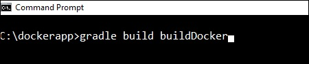

After executing the command, you can see the BUILD SUCCESSFUL log on the console window.

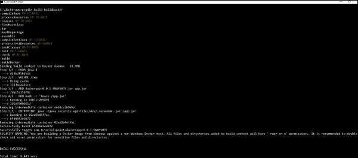

Now, see the Docker images by the command using **docker images** and see the image’s info on the console.

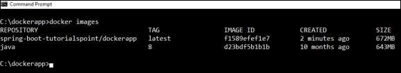

# Spring Boot - Tracing Micro Service Logs
Most developers face difficulty of tracing logs if any issue occurred. This can be solved by Spring Cloud Sleuth and ZipKin server for Spring Boot application.

## Spring Cloud Sleuth
Spring cloud Sleuth logs are printed in the following format −

```
[application-name,traceid,spanid,zipkin-export]
```
Where,

   * Application-name = Name of the application
   * Traceid = each request and response traceid is same when calling same service or one service to another service.
   * Spanid = Span Id is printed along with Trace Id. Span Id is different every request and response calling one service to another service.
   * Zipkin-export = By default it is false. If it is true, logs will be exported to the Zipkin server.

Now, add the Spring Cloud Starter Sleuth dependency in your build configuration file as follows −

Maven users can add the following dependency in your pom.xml file −

```
<dependency>
   <groupId>org.springframework.cloud</groupId>
   <artifactId>spring-cloud-starter-sleuth</artifactId>
</dependency>
```
Gradle users can add the following dependency in your build.gradle file −

```
compile('org.springframework.cloud:spring-cloud-starter-sleuth')
```
Now, add the Logs into your Spring Boot application Rest Controller class file as shown here −

```
package com.tutorialspoint.sleuthapp;

import java.util.logging.Level;
import java.util.logging.Logger;

import org.springframework.boot.SpringApplication;
import org.springframework.boot.autoconfigure.SpringBootApplication;
import org.springframework.web.bind.annotation.RequestMapping;
import org.springframework.web.bind.annotation.RestController;

@SpringBootApplication
@RestController
public class SleuthappApplication {
   private static final Logger LOG = Logger.getLogger(SleuthappApplication.class.getName());
   public static void main(String[] args) {
      SpringApplication.run(SleuthappApplication.class, args);
   }
   @RequestMapping("/")
   public String index() {
      LOG.log(Level.INFO, "Index API is calling");
      return "Welcome Sleuth!";
   }
}
```
Now, add the application name in application.properties file as shown −

```
spring.application.name = tracinglogs
```
The complete code for build configuration file is given below −

**Maven – pom.xml**

```
<?xml version = "1.0" encoding = "UTF-8"?>
<project xmlns = "http://maven.apache.org/POM/4.0.0" 
   xmlns:xsi = "http://www.w3.org/2001/XMLSchema-instance"
   xsi:schemaLocation = "http://maven.apache.org/POM/4.0.0 
   http://maven.apache.org/xsd/maven-4.0.0.xsd">
   
   <modelVersion>4.0.0</modelVersion>
   <groupId>com.tutorialspoint</groupId>
   <artifactId>sleuthapp</artifactId>
   <version>0.0.1-SNAPSHOT</version>
   <packaging>jar</packaging>

   <name>sleuthapp</name>
   <description>Demo project for Spring Boot</description>

   <parent>
      <groupId>org.springframework.boot</groupId>
      <artifactId>spring-boot-starter-parent</artifactId>
      <version>1.5.9.RELEASE</version>
      <relativePath/> <!-- lookup parent from repository -->
   </parent>

   <properties>
      <project.build.sourceEncoding>UTF-8</project.build.sourceEncoding>
      <project.reporting.outputEncoding>UTF-8</project.reporting.outputEncoding>
      <java.version>1.8</java.version>
      <spring-cloud.version>Edgware.RELEASE</spring-cloud.version>
   </properties>

   <dependencies>
      <dependency>
         <groupId>org.springframework.cloud</groupId>
         <artifactId>spring-cloud-starter-sleuth</artifactId>
      </dependency>
      <dependency>
         <groupId>org.springframework.boot</groupId>
         <artifactId>spring-boot-starter-web</artifactId>
      </dependency>
      <dependency>
         <groupId>org.springframework.boot</groupId>
         <artifactId>spring-boot-starter-test</artifactId>
         <scope>test</scope>
      </dependency>
   </dependencies>

   <dependencyManagement>
      <dependencies>
         <dependency>
            <groupId>org.springframework.cloud</groupId>
            <artifactId>spring-cloud-dependencies</artifactId>
            <version>${spring-cloud.version}</version>
            <type>pom</type>
            <scope>import</scope>
         </dependency>
      </dependencies>
   </dependencyManagement>

   <build>
      <plugins>
         <plugin>
            <groupId>org.springframework.boot</groupId>
            <artifactId>spring-boot-maven-plugin</artifactId>
         </plugin>
      </plugins>
   </build>
   
</project>
```
**Gradle – build.gradle**

```
buildscript {
   ext {
      springBootVersion = '1.5.9.RELEASE'
   }
   repositories {
      mavenCentral()
   }
   dependencies {
      classpath("org.springframework.boot:spring-boot-gradle-plugin:${springBootVersion}")
   }
}

apply plugin: 'java'
apply plugin: 'eclipse'
apply plugin: 'org.springframework.boot'

group = 'com.tutorialspoint'
version = '0.0.1-SNAPSHOT'
sourceCompatibility = 1.8

repositories {
   mavenCentral()
}
ext {
   springCloudVersion = 'Edgware.RELEASE'
}
dependencies {
   compile('org.springframework.cloud:spring-cloud-starter-sleuth')
   compile('org.springframework.boot:spring-boot-starter-web')
   testCompile('org.springframework.boot:spring-boot-starter-test')
}
dependencyManagement {
   imports {
      mavenBom "org.springframework.cloud:spring-cloud-dependencies:${springCloudVersion}"
   }
}
```
You can create an executable JAR file, and run the Spring Boot application by using the following Maven or Gradle commands.

For Maven, you can use the following command −

```
mvn clean install
```
After “BUILD SUCCESS”, you can find the JAR file under the target directory.

For Gradle, you can use the following command −

```
gradle clean build
```
After “BUILD SUCCESSFUL”, you can find the JAR file under the build/libs directory.

Now, run the JAR file by using the command shown here −

```
java –jar <JARFILE>
```
Now, the application has started on the Tomcat port 8080.


Now, hit the URL in your web browser and see the output in console log.

**http://localhost:8080/**


You can see the following logs in the console window. Observe that log is printed in the following format [application-name, traceid, spanid, zipkin-export]


## Zipkin Server
Zipkin is an application that monitors and manages the Spring Cloud Sleuth logs of your Spring Boot application. To build a Zipkin server, we need to add the Zipkin UI and Zipkin Server dependencies in our build configuration file.

Maven users can add the following dependency in your pom.xml file −

```
<dependency>
   <groupId>io.zipkin.java</groupId>
   <artifactId>zipkin-server</artifactId>
</dependency>
<dependency>
   <groupId>io.zipkin.java</groupId>
   <artifactId>zipkin-autoconfigure-ui</artifactId>
</dependency>
```
Gradle users can add the below dependency in your build.gradle file −

```
compile('io.zipkin.java:zipkin-autoconfigure-ui')
compile('io.zipkin.java:zipkin-server')
```
Now, configure the server.port = 9411 in application properties file.

For properties file users, add the below property in application.properties file.

```
server.port = 9411
```
For YAML users, add the below property in application.yml file.

```
server:
   port: 9411
```
Add the @EnableZipkinServer annotation in your main Spring Boot application class fie. The @EnableZipkinServer annotation is used to enable your application act as a Zipkin server.

```
package com.tutorialspoint.zipkinapp;

import org.springframework.boot.SpringApplication;
import org.springframework.boot.autoconfigure.SpringBootApplication;
import zipkin.server.EnableZipkinServer;

@SpringBootApplication
@EnableZipkinServer
public class ZipkinappApplication {
   public static void main(String[] args) {
      SpringApplication.run(ZipkinappApplication.class, args);
   }
}
```
The code for complete build configuration file is given below.

**Maven – pom.xml**

```
<?xml version = "1.0" encoding = "UTF-8"?>
<project xmlns = "http://maven.apache.org/POM/4.0.0" 
   xmlns:xsi = "http://www.w3.org/2001/XMLSchema-instance"
   xsi:schemaLocation = "http://maven.apache.org/POM/4.0.0 
   http://maven.apache.org/xsd/maven-4.0.0.xsd">
   
   <modelVersion>4.0.0</modelVersion>
   <groupId>com.tutorialspoint</groupId>
   <artifactId>zipkinapp</artifactId>
   <version>0.0.1-SNAPSHOT</version>
   <packaging>jar</packaging>
   <name>zipkinapp</name>
   <description>Demo project for Spring Boot</description>

   <parent>
      <groupId>org.springframework.boot</groupId>
      <artifactId>spring-boot-starter-parent</artifactId>
      <version>1.5.9.RELEASE</version>
      <relativePath /> <!-- lookup parent from repository -->
   </parent>

   <properties>
      <project.build.sourceEncoding>UTF-8</project.build.sourceEncoding>
      <project.reporting.outputEncoding>UTF-8</project.reporting.outputEncoding>
      <java.version>1.8</java.version>
      <spring-cloud.version>Edgware.RELEASE</spring-cloud.version>
   </properties>

   <dependencies>
      <dependency>
         <groupId>io.zipkin.java</groupId>
         <artifactId>zipkin-server</artifactId>
      </dependency>
      <dependency>
         <groupId>io.zipkin.java</groupId>
         <artifactId>zipkin-autoconfigure-ui</artifactId>
      </dependency>
      <dependency>
         <groupId>org.springframework.boot</groupId>
         <artifactId>spring-boot-starter-test</artifactId>
         <scope>test</scope>
      </dependency>
   </dependencies>

   <dependencyManagement>
      <dependencies>
         <dependency>
            <groupId>org.springframework.cloud</groupId>
            <artifactId>spring-cloud-dependencies</artifactId>
            <version>${spring-cloud.version}</version>
            <type>pom</type>
            <scope>import</scope>
         </dependency>
      </dependencies>
   </dependencyManagement>

   <build>
      <plugins>
         <plugin>
            <groupId>org.springframework.boot</groupId>
            <artifactId>spring-boot-maven-plugin</artifactId>
         </plugin>
      </plugins>
   </build>
   
</project>
```
**Gradle – build.gradle**

```
buildscript {
   ext {
      springBootVersion = '1.5.9.RELEASE'
   }
   repositories {
      mavenCentral()
   }
   dependencies {
      classpath("org.springframework.boot:spring-boot-gradle-plugin:${springBootVersion}")
   }
}
apply plugin: 'java'
apply plugin: 'eclipse'
apply plugin: 'org.springframework.boot'

group = 'com.tutorialspoint'
version = '0.0.1-SNAPSHOT'
sourceCompatibility = 1.8

repositories {
   mavenCentral()
}
ext {
   springCloudVersion = 'Edgware.RELEASE'
}
dependencies {
   compile('io.zipkin.java:zipkin-autoconfigure-ui')
   compile('io.zipkin.java:zipkin-server')
   testCompile('org.springframework.boot:spring-boot-starter-test')
}
dependencyManagement {
   imports {
      mavenBom "org.springframework.cloud:spring-cloud-dependencies:${springCloudVersion}"
   }
}
```
You can create an executable JAR file, and run the Spring Boot application by using the below Maven or Gradle commands −

For Maven, use the command given below −

```
mvn clean install
```
After “BUILD SUCCESS”, you can find the JAR file under the target directory.

For Gradle, use the command given below −

```
gradle clean build
```
After “BUILD SUCCESSFUL”, you can find the JAR file under the build/libs directory.

Run the JAR file by using the command shown −

```
java –jar <JARFILE>
```
Now, the application has started on the Tomcat port 9411 as shown below −


Now, hit the below URL and see the Zipkin server UI.

**http://localhost:9411/zipkin/**


Then, add the following dependency in your client service application and point out the Zipkin Server URL to trace the microservice logs via Zipkin UI.

Now, add the Spring Cloud Starter Zipkin dependency in your build configuration file as shown −

Maven users can add the following dependency in pom.xml file −

```
<dependency>
   <groupId>org.springframework.cloud</groupId>
   <artifactId>spring-cloud-sleuth-zipkin</artifactId>
</dependency>
```
Gradle users can add the below dependency in build.gradle file −

```
compile('org.springframework.cloud:spring-cloud-sleuth-zipkin')
```
Now, add the **Always Sampler Bean** in your Spring Boot application to export the logs into Zipkin server.

```
@Bean
public AlwaysSampler defaultSampler() {
   return new AlwaysSampler();
}
```
If you add the AlwaysSampler Bean, then automatically Spring Sleuth Zipkin Export option will change from false to true.

Next, configure your Zipkin Server base URL in client service application.properties file.

```
spring.zipkin.baseUrl = http://localhost:9411/zipkin/
```
Then, provide the trace id and find the traces in Zipkin UI.

**http://localhost:9411/zipkin/traces/{traceid}/**

# Spring Boot - Flyway Database
Flyway is a version control application to evolve your Database schema easily and reliably across all your instances. To learn more about Flyway, you can use the link − [www.flywaydb.org](https://flywaydb.org/) 

Many software projects use relational databases. This requires the handling of database migrations, also often called schema migrations.

In this chapter, you are going to learn in detail about how to configure Flyway database in your Spring Boot application.

## Configuring Flyway Database
First, download the Spring Boot project from Spring Initializer page [www.start.spring.io](https://start.spring.io/)  and choose the following dependencies −

   * Spring Boot Starter Web
   * Flyway
   * MySQL
   * JDBC

Maven users can add the following dependencies in pom.xml file.

```
<dependency>
   <groupId>org.flywaydb</groupId>
   <artifactId>flyway-core</artifactId>
</dependency>

<dependency>
   <groupId>org.springframework.boot</groupId>
   <artifactId>spring-boot-starter-jdbc</artifactId>
</dependency>

<dependency>
   <groupId>org.springframework.boot</groupId>
   <artifactId>spring-boot-starter-web</artifactId>
</dependency>

<dependency>
   <groupId>mysql</groupId>
   <artifactId>mysql-connector-java</artifactId>
</dependency>

<dependency>
   <groupId>org.springframework.boot</groupId>
   <artifactId>spring-boot-starter-test</artifactId>
   <scope>test</scope>
</dependency>
```
Gradle users can add the following dependencies in build.gradle file.

```
compile('org.flywaydb:flyway-core')
compile('org.springframework.boot:spring-boot-starter-jdbc')
compile('org.springframework.boot:spring-boot-starter-web')
compile('mysql:mysql-connector-java')
```
In application properties, we need to configure the database properties for creating a DataSource and also flyway properties we need to configure in application properties.

For properties file users, add the below properties in the application.properties file.

```
spring.application.name = flywayapp  

spring.datasource.driverClassName = com.mysql.jdbc.Driver
spring.datasource.url = jdbc:mysql://localhost:3306/USERSERVICE?autoreconnect=true
spring.datasource.username = root
spring.datasource.password = root
spring.datasource.testOnBorrow = true
spring.datasource.testWhileIdle = true
spring.datasource.timeBetweenEvictionRunsMillis = 60000
spring.datasource.minEvictableIdleTimeMillis = 30000
spring.datasource.validationQuery = SELECT 1
spring.datasource.max-active = 15
spring.datasource.max-idle = 10
spring.datasource.max-wait = 8000

flyway.url = jdbc:mysql://localhost:3306/mysql
flyway.schemas = USERSERVICE
flyway.user = root
flyway.password = root
```
YAML users can add the following properties in application.yml file.

```
spring:
   application:
      name: flywayapp  
   datasource: 
      driverClassName: com.mysql.jdbc.Driver
      url: "jdbc:mysql://localhost:3306/USERSERVICE?autoreconnect=true"
      password: "root"
      username: "root"
      testOnBorrow: true
      testWhileIdle: true
      timeBetweenEvictionRunsMillis: 60000
      minEvictableIdleTimeMillis: 30000
      validationQuery: SELECT 1
      max-active: 15
      max-idle: 10
      max-wait: 8000
flyway:
   url: jdbc:mysql://localhost:3306/mysql
   schemas: USERSERVICE
   user: "root"
   password: "root"
```
Now, create a SQL file under the **src/main/resources/db/migration** directory. Name the SQL file as “V1__Initial.sql”

```
CREATE TABLE USERS (ID INT AUTO_INCREMENT PRIMARY KEY, USERID VARCHAR(45));
INSERT INTO USERS (ID, USERID) VALUES (1, 'tutorialspoint.com');
```
The main Spring Boot application class file code is given below −

```
package com.tutorialspoint.flywayapp;

import org.springframework.boot.SpringApplication;
import org.springframework.boot.autoconfigure.SpringBootApplication;

@SpringBootApplication
public class FlywayappApplication {
   public static void main(String[] args) {
      SpringApplication.run(FlywayappApplication.class, args);
   }
}
```
The complete build configuration file is given below.

**Maven – pom.xml**

```
<?xml version = "1.0" encoding = "UTF-8"?>
<project xmlns = "http://maven.apache.org/POM/4.0.0" 
   xmlns:xsi = "http://www.w3.org/2001/XMLSchema-instance"
   xsi:schemaLocation = "http://maven.apache.org/POM/4.0.0 
   http://maven.apache.org/xsd/maven-4.0.0.xsd">
   
   <modelVersion>4.0.0</modelVersion>
   <groupId>com.tutorialspoint</groupId>
   <artifactId>flywayapp</artifactId>
   <version>0.0.1-SNAPSHOT</version>
   <packaging>jar</packaging>
   <name>flywayapp</name>
   <description>Demo project for Spring Boot</description>

   <parent>
      <groupId>org.springframework.boot</groupId>
      <artifactId>spring-boot-starter-parent</artifactId>
      <version>1.5.9.RELEASE</version>
      <relativePath/> <!-- lookup parent from repository -->
   </parent>

   <properties>
      <project.build.sourceEncoding>UTF-8</project.build.sourceEncoding>
      <project.reporting.outputEncoding>UTF-8</project.reporting.outputEncoding>
      <java.version>1.8</java.version>
   </properties>

   <dependencies>
      <dependency>
         <groupId>org.flywaydb</groupId>
         <artifactId>flyway-core</artifactId>
      </dependency>
      
      <dependency>
         <groupId>org.springframework.boot</groupId>
         <artifactId>spring-boot-starter-jdbc</artifactId>
      </dependency>
      
      <dependency>
         <groupId>org.springframework.boot</groupId>
         <artifactId>spring-boot-starter-web</artifactId>
      </dependency>

      <dependency>
         <groupId>mysql</groupId>
         <artifactId>mysql-connector-java</artifactId>
      </dependency>
   </dependencies>

   <build>
      <plugins>
         <plugin>
            <groupId>org.springframework.boot</groupId>
            <artifactId>spring-boot-maven-plugin</artifactId>
         </plugin>
      </plugins>
   </build>
   
</project>
```
**Gradle – build.gradle**

```
buildscript {
   ext {
      springBootVersion = '1.5.9.RELEASE'
   }
   repositories {
      mavenCentral()
   }
   dependencies {
      classpath("org.springframework.boot:spring-boot-gradle-plugin:${springBootVersion}")
   }
}

apply plugin: 'java'
apply plugin: 'eclipse'
apply plugin: 'org.springframework.boot'

group = 'com.tutorialspoint'
version = '0.0.1-SNAPSHOT'
sourceCompatibility = 1.8

repositories {
   mavenCentral()
}
dependencies {
   compile('org.flywaydb:flyway-core')
   compile('org.springframework.boot:spring-boot-starter-jdbc')
   compile('org.springframework.boot:spring-boot-starter-web')
   compile('mysql:mysql-connector-java')
   testCompile('org.springframework.boot:spring-boot-starter-test')
}
```
You can create an executable JAR file, and run the Spring Boot application by using the Maven or Gradle commands given below −

For Maven, you can use the command shown here −

```
mvn clean install
```
After “BUILD SUCCESS”, you can find the JAR file under the target directory.

For Gradle, you can use the command shown here −

```
gradle clean build
```
After “BUILD SUCCESSFUL”, you can find the JAR file under the build/libs directory.

Now, run the JAR file by using the following command −

```
java –jar <JARFILE>
```
Now, Tomcat started on the port 8080 and in the console window you can see the flyway database logs as shown here.


You can now go to the database and do the select queries.


# Spring Boot - Sending Email
By using Spring Boot RESTful web service, you can send an email with Gmail Transport Layer Security. In this chapter, let us understand in detail how to use this feature.

First, we need to add the Spring Boot Starter Mail dependency in your build configuration file.

Maven users can add the following dependency into the pom.xml file.

```
<dependency>
   <groupId>org.springframework.boot</groupId>
   <artifactId>spring-boot-starter-mail</artifactId>
</dependency>
```
Gradle users can add the following dependency in your build.gradle file.

```
compile('org.springframework.boot:spring-boot-starter-mail')
```
The code of main Spring Boot application class file is given below −

```
package com.tutorialspoint.emailapp;

import org.springframework.boot.SpringApplication;
import org.springframework.boot.autoconfigure.SpringBootApplication;

@SpringBootApplication
public class EmailappApplication {
   public static void main(String[] args) {
      SpringApplication.run(EmailappApplication.class, args);
   }
}
```
You can write a simple Rest API to send to email in Rest Controller class file as shown.

```
package com.tutorialspoint.emailapp;

import org.springframework.web.bind.annotation.RequestMapping;
import org.springframework.web.bind.annotation.RestController;

@RestController
public class EmailController {
   @RequestMapping(value = "/sendemail")
   public String sendEmail() {
      return "Email sent successfully";
   }   
}
```
You can write a method to send the email with Attachment. Define the mail.smtp properties and used PasswordAuthentication.

```
private void sendmail() throws AddressException, MessagingException, IOException {
   Properties props = new Properties();
   props.put("mail.smtp.auth", "true");
   props.put("mail.smtp.starttls.enable", "true");
   props.put("mail.smtp.host", "smtp.gmail.com");
   props.put("mail.smtp.port", "587");
   
   Session session = Session.getInstance(props, new javax.mail.Authenticator() {
      protected PasswordAuthentication getPasswordAuthentication() {
         return new PasswordAuthentication("tutorialspoint@gmail.com", "<your password>");
      }
   });
   Message msg = new MimeMessage(session);
   msg.setFrom(new InternetAddress("tutorialspoint@gmail.com", false));

   msg.setRecipients(Message.RecipientType.TO, InternetAddress.parse("tutorialspoint@gmail.com"));
   msg.setSubject("Tutorials point email");
   msg.setContent("Tutorials point email", "text/html");
   msg.setSentDate(new Date());

   MimeBodyPart messageBodyPart = new MimeBodyPart();
   messageBodyPart.setContent("Tutorials point email", "text/html");

   Multipart multipart = new MimeMultipart();
   multipart.addBodyPart(messageBodyPart);
   MimeBodyPart attachPart = new MimeBodyPart();

   attachPart.attachFile("/var/tmp/image19.png");
   multipart.addBodyPart(attachPart);
   msg.setContent(multipart);
   Transport.send(msg);   
}
```
Now, call the above sendmail() method from the Rest API as shown −

```
@RequestMapping(value = "/sendemail")
public String sendEmail() throws AddressException, MessagingException, IOException {
   sendmail();
   return "Email sent successfully";   
}
```
**Note** − Please switch ON allow less secure apps in your Gmail account settings before sending an email.

The complete build configuration file is given below.

**Maven – pom.xml**

```
<?xml version = "1.0" encoding = "UTF-8"?>
<project xmlns = "http://maven.apache.org/POM/4.0.0" 
   xmlns:xsi = "http://www.w3.org/2001/XMLSchema-instance"
   xsi:schemaLocation = "http://maven.apache.org/POM/4.0.0 
   http://maven.apache.org/xsd/maven-4.0.0.xsd">
   
   <modelVersion>4.0.0</modelVersion>
   <groupId>com.tutorialspoint</groupId>
   <artifactId>emailapp</artifactId>
   <version>0.0.1-SNAPSHOT</version>
   <packaging>jar</packaging>
   <name>emailapp</name>
   <description>Demo project for Spring Boot</description>
   
   <parent>
      <groupId>org.springframework.boot</groupId>
      <artifactId>spring-boot-starter-parent</artifactId>
      <version>1.5.9.RELEASE</version>
      <relativePath/> <!-- lookup parent from repository -->
   </parent>
   
   <properties>
      <project.build.sourceEncoding>UTF-8</project.build.sourceEncoding>
      <project.reporting.outputEncoding>UTF-8</project.reporting.outputEncoding>
   <java.version>1.8</java.version>
   </properties>
   
   <dependencies>
      <dependency>
         <groupId>org.springframework.boot</groupId>
         <artifactId>spring-boot-starter-web</artifactId>
      </dependency>
      
      <dependency>
         <groupId>org.springframework.boot</groupId>
         <artifactId>spring-boot-starter-mail</artifactId>
      </dependency>
      
      <dependency>
         <groupId>org.springframework.boot</groupId>
         <artifactId>spring-boot-starter</artifactId>
      </dependency>
      
      <dependency>
         <groupId>org.springframework.boot</groupId>
         <artifactId>spring-boot-starter-test</artifactId>
         <scope>test</scope>
      </dependency>
   </dependencies>
   
   <build>
      <plugins>
         <plugin>
            <groupId>org.springframework.boot</groupId>
            <artifactId>spring-boot-maven-plugin</artifactId>
         </plugin>
      </plugins>
   </build> 
   
</project>
```
**Gradle – build.gradle**

```
buildscript {
   ext {
      springBootVersion = '1.5.9.RELEASE'
   }
   repositories {
      mavenCentral()
   }
   dependencies {
      classpath("org.springframework.boot:spring-boot-gradle-plugin:${springBootVersion}")
   }
}

apply plugin: 'java'
apply plugin: 'eclipse'
apply plugin: 'org.springframework.boot'

group = 'com.tutorialspoint'
version = '0.0.1-SNAPSHOT'
sourceCompatibility = 1.8

repositories {
   mavenCentral()
}
dependencies {
   compile('org.springframework.boot:spring-boot-starter-web')
   compile('org.springframework.boot:spring-boot-starter-mail')
   testCompile('org.springframework.boot:spring-boot-starter-test')
}
```
Now, you can create an executable JAR file, and run the Spring Boot application by using the Maven or Gradle commands shown below −

For Maven, you can use the command as shown −

```
mvn clean install
```
After “BUILD SUCCESS”, you can find the JAR file under the target directory.

For Gradle, you can use the command as shown −

```
gradle clean build
```
After “BUILD SUCCESSFUL”, you can find the JAR file under the build/libs directory.

Now, run the JAR file by using the command given below −

```
java –jar <JARFILE>
```
You can see that the application has started on the Tomcat port 8080.


Now hit the following URL from your web browser and you will receive an email.

**http://localhost:8080/sendemail**

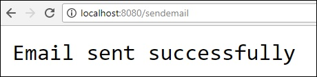


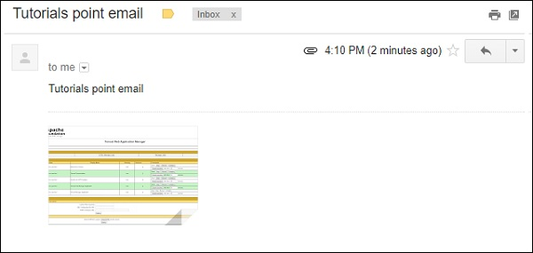

# Spring Boot - Hystrix
Hystrix is a library from Netflix. Hystrix isolates the points of access between the services, stops cascading failures across them and provides the fallback options.

For example, when you are calling a 3 party application, it takes more time to send the response. So at that time, the control goes to the fallback method and returns the custom response to your application.

In this chapter you are going to see How to implement the Hystrix in a Spring Boot application.

First, we need to add the Spring Cloud Starter Hystrix dependency in our build configuration file.

Maven users can add the following dependency in the pom.xml file −

```
<dependency>
   <groupId>org.springframework.cloud</groupId>
   <artifactId>spring-cloud-starter-hystrix</artifactId>
</dependency>
```
Gradle users can add the following dependency in the build.gradle file −

```
compile('org.springframework.cloud:spring-cloud-starter-hystrix')
```
Now, add the @EnableHystrix annotation into your main Spring Boot application class file. The @EnableHystrix annotation is used to enable the Hystrix functionalities into your Spring Boot application.

The main Spring Boot application class file code is given below −

```
package com.tutorialspoint.hystrixapp;

import org.springframework.boot.SpringApplication;
import org.springframework.boot.autoconfigure.SpringBootApplication;
import org.springframework.cloud.netflix.hystrix.EnableHystrix;

@SpringBootApplication
@EnableHystrix
public class HystrixappApplication {
   public static void main(String[] args) {
      SpringApplication.run(HystrixappApplication.class, args);
   }
}
```
Now write a simple Rest Controller such that it returns the String after 3 seconds from the requested time.

```
@RequestMapping(value = "/")
public String hello() throws InterruptedException {
   Thread.sleep(3000);
   return "Welcome Hystrix";
}
```
Now, add the @Hystrix command and @HystrixProperty for the Rest API and define the timeout in milliseconds value.

```
@HystrixCommand(fallbackMethod = "fallback_hello", commandProperties = {
   @HystrixProperty(name = "execution.isolation.thread.timeoutInMilliseconds", value = "1000")
})
```
Next, define the fallback method fallback_hello() if the request takes a long time to respond.

```
private String fallback_hello() {
   return "Request fails. It takes long time to response";
}
```
The complete Rest Controller class file that contains REST API and Hystrix properties is shown here −

```
@RequestMapping(value = "/")
@HystrixCommand(fallbackMethod = "fallback_hello", commandProperties = {
   @HystrixProperty(name = "execution.isolation.thread.timeoutInMilliseconds", value = "1000")
})
public String hello() throws InterruptedException {
   Thread.sleep(3000);
   return "Welcome Hystrix";
}
private String fallback_hello() {
   return "Request fails. It takes long time to response";
}
```
In this example, REST API written in main Spring Boot application class file itself.

```
package com.tutorialspoint.hystrixapp;

import org.springframework.boot.SpringApplication;
import com.netflix.hystrix.contrib.javanica.annotation.HystrixProperty;
import org.springframework.boot.autoconfigure.SpringBootApplication;
import org.springframework.cloud.netflix.hystrix.EnableHystrix;
import org.springframework.web.bind.annotation.RequestMapping;
import org.springframework.web.bind.annotation.RestController;

import com.netflix.hystrix.contrib.javanica.annotation.HystrixCommand;

@SpringBootApplication
@EnableHystrix
@RestController
public class HystrixappApplication {
   public static void main(String[] args) {
      SpringApplication.run(HystrixappApplication.class, args);
   }
   @RequestMapping(value = "/")
   @HystrixCommand(fallbackMethod = "fallback_hello", commandProperties = {
      @HystrixProperty(name = "execution.isolation.thread.timeoutInMilliseconds", value = "1000")
   })
   public String hello() throws InterruptedException {
      Thread.sleep(3000);
      return "Welcome Hystrix";
   }
   private String fallback_hello() {
      return "Request fails. It takes long time to response";
   }
}
```
The complete build configuration file is given below.

**Maven – pom.xml file**

```
<?xml version = "1.0" encoding = "UTF-8"?>
<project xmlns = "http://maven.apache.org/POM/4.0.0" 
   xmlns:xsi = "http://www.w3.org/2001/XMLSchema-instance"
   xsi:schemaLocation = "http://maven.apache.org/POM/4.0.0 
   http://maven.apache.org/xsd/maven-4.0.0.xsd">
   
   <modelVersion>4.0.0</modelVersion>
   <groupId>com.tutorialspoint</groupId>
   <artifactId>hystrixapp</artifactId>
   <version>0.0.1-SNAPSHOT</version>
   <packaging>jar</packaging>
   <name>hystrixapp</name>
   <description>Demo project for Spring Boot</description>

   <parent>
      <groupId>org.springframework.boot</groupId>
      <artifactId>spring-boot-starter-parent</artifactId>
      <version>1.5.9.RELEASE</version>
      <relativePath/> <!-- lookup parent from repository -->
   </parent>

   <properties>
      <project.build.sourceEncoding>UTF-8</project.build.sourceEncoding>
      <project.reporting.outputEncoding>UTF-8</project.reporting.outputEncoding>
      <java.version>1.8</java.version>
      <spring-cloud.version>Edgware.RELEASE</spring-cloud.version>
   </properties>

   <dependencies>
      <dependency>
         <groupId>org.springframework.cloud</groupId>
         <artifactId>spring-cloud-starter-hystrix</artifactId>
      </dependency>
      <dependency>
         <groupId>org.springframework.boot</groupId>
         <artifactId>spring-boot-starter-web</artifactId>
      </dependency>
      <dependency>
         <groupId>org.springframework.boot</groupId>
         <artifactId>spring-boot-starter-test</artifactId>
         <scope>test</scope>
      </dependency>
   </dependencies>

   <dependencyManagement>
      <dependencies>
         <dependency>
            <groupId>org.springframework.cloud</groupId>
            <artifactId>spring-cloud-dependencies</artifactId>
            <version>${spring-cloud.version}</version>
            <type>pom</type>
            <scope>import</scope>
         </dependency>
      </dependencies>
   </dependencyManagement>

   <build>
      <plugins>
         <plugin>
            <groupId>org.springframework.boot</groupId>
            <artifactId>spring-boot-maven-plugin</artifactId>
         </plugin>
      </plugins>
   </build>
   
</project>
```
**Gradle – build.gradle**

```
buildscript {
   ext {
      springBootVersion = '1.5.9.RELEASE'
   }
   repositories {
      mavenCentral()
   }
   dependencies {
      classpath("org.springframework.boot:spring-boot-gradle-plugin:${springBootVersion}")
   }
}
apply plugin: 'java'
apply plugin: 'eclipse'
apply plugin: 'org.springframework.boot'

group = 'com.tutorialspoint'
version = '0.0.1-SNAPSHOT'
sourceCompatibility = 1.8

repositories {
   mavenCentral()
}
ext {
   springCloudVersion = 'Edgware.RELEASE'
}
dependencies {
   compile('org.springframework.cloud:spring-cloud-starter-hystrix')
   compile('org.springframework.boot:spring-boot-starter-web')
   testCompile('org.springframework.boot:spring-boot-starter-test')
}
dependencyManagement {
   imports {
      mavenBom "org.springframework.cloud:spring-cloud-dependencies:${springCloudVersion}"
   }
}
```
You can create an executable JAR file, and run the Spring Boot application by using the following Maven or Gradle commands −

For Maven, use the command as shown −

```
mvn clean install
```
After “BUILD SUCCESS”, you can find the JAR file under the target directory.

For Gradle, use the command as shown −

```
gradle clean build
```
After “BUILD SUCCESSFUL”, you can find the JAR file under the build/libs directory.

Now, run the JAR file by using the command given below −

```
java –jar <JARFILE>
```
This will start the application on the Tomcat port 8080 as shown below −

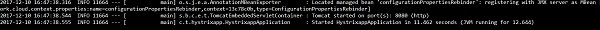

Now, hit the URL **http://localhost:8080/** from your web browser, and see the Hystrix response. The API takes 3 seconds to respond, but Hystrix timeout is 1 second.


# Spring Boot - Web Socket
In this chapter, let us understand how to build an interactive web application by using Spring Boot with Web sockets.

To build an interactive web application in Spring Boot with Web socket, you need to add the following dependencies.

Maven users should add the following dependencies in the pom.xml file.

```
<dependency>
   <groupId>org.springframework.boot</groupId>
   <artifactId>spring-boot-starter-websocket</artifactId>
</dependency>
<dependency>
   <groupId>org.webjars</groupId>
   <artifactId>webjars-locator</artifactId>
</dependency>
<dependency>
   <groupId>org.webjars</groupId>
   <artifactId>sockjs-client</artifactId>
   <version>1.0.2</version>
</dependency>

<dependency>
   <groupId>org.webjars</groupId>
   <artifactId>stomp-websocket</artifactId>
   <version>2.3.3</version>
</dependency>
<dependency>
   <groupId>org.webjars</groupId>
   <artifactId>bootstrap</artifactId>
   <version>3.3.7</version>        </dependency>
<dependency>
   <groupId>org.webjars</groupId>
   <artifactId>jquery</artifactId>
   <version>3.1.0</version>
</dependency>
```
Gradle users can add the following dependencies in your build.gradle file −

```
compile("org.springframework.boot:spring-boot-starter-websocket")
compile("org.webjars:webjars-locator")
compile("org.webjars:sockjs-client:1.0.2")
compile("org.webjars:stomp-websocket:2.3.3")
compile("org.webjars:bootstrap:3.3.7")
compile("org.webjars:jquery:3.1.0")
```
Let us create a Message handling controller to work with STOMP messaging. STOMP messages can be routed to @Controller class file. For example, GreetingController is mapped to handle the messages to destination “/hello”.

```
package com.tutorialspoint.websocketapp;

import org.springframework.messaging.handler.annotation.MessageMapping;
import org.springframework.messaging.handler.annotation.SendTo;
import org.springframework.stereotype.Controller;

@Controller
public class GreetingController {
   @MessageMapping("/hello")
   @SendTo("/topic/greetings")
   public Greeting greeting(HelloMessage message) throws Exception {
      Thread.sleep(1000); // simulated delay
      return new Greeting("Hello, " + message.getName() + "!");
   }
}
```
Now, configure Spring for STOMP messaging. Write a WebSocketConfig class file that extends the AbstractWebSocketMessageBrokerConfigurer class as shown below.

```
package com.tutorialspoint.websocketapp;

import org.springframework.context.annotation.Configuration;
import org.springframework.messaging.simp.config.MessageBrokerRegistry;
import org.springframework.web.socket.config.annotation.AbstractWebSocketMessageBrokerConfigurer;
import org.springframework.web.socket.config.annotation.EnableWebSocketMessageBroker;
import org.springframework.web.socket.config.annotation.StompEndpointRegistry;

@Configuration
@EnableWebSocketMessageBroker
public class WebSocketConfig extends AbstractWebSocketMessageBrokerConfigurer {
   @Override
   public void configureMessageBroker(MessageBrokerRegistry config) {
      config.enableSimpleBroker("/topic");
      config.setApplicationDestinationPrefixes("/app");
   }
   @Override
   public void registerStompEndpoints(StompEndpointRegistry registry) {
      registry.addEndpoint("/tutorialspoint-websocket").withSockJS();
   }
}
```
The @EnableWebSocketMessageBroker annotation is used to configure the Web socket message broker to create STOMP endpoints.

You can create a browser client file under the src/main/resources/static/index.html as shown −

```
<!DOCTYPE html>
<html>
   <head>
      <title>Hello WebSocket</title>
      <link href = "/webjars/bootstrap/css/bootstrap.min.css" rel = "stylesheet">
      <link href = "/main.css" rel = "stylesheet">
      <script src = "/webjars/jquery/jquery.min.js"></script>
      <script src = "/webjars/sockjs-client/sockjs.min.js"></script>
      <script src = "/webjars/stomp-websocket/stomp.min.js"></script>
      <script src = "/app.js"></script>
   </head>
   
   <body>
      <noscript>
         <h2 style = "color: #ff0000">
            Seems your browser doesn't support Javascript! Websocket relies on Javascript being
            enabled. Please enable Javascript and reload this page!
         </h2>
      </noscript>
      <div id = "main-content" class = "container">
         <div class = "row">
            <div class = "col-md-6">
               <form class = "form-inline">
                  <div class = "form-group">
                     <label for = "connect">WebSocket connection:</label>
                     <button id = "connect" class = "btn btn-default" type = "submit">Connect</button>
                     <button id = "disconnect" class = "btn btn-default" type = "submit" disabled = "disabled">Disconnect
                     </button>
                  </div>
               </form>
            </div>
            
            <div class = "col-md-6">
               <form class = "form-inline">
                  <div class = "form-group">
                     <label for = "name">What is your name?</label>
                     <input type = "text" id = "name" class = "form-control" placeholder = "Your name here...">
                  </div>
                  <button id = "send" class = "btn btn-default" type = "submit">Send</button>
               </form>
            </div>
         </div>
         
         <div class  =  "row">
            <div class  =  "col-md-12">
               <table id  =  "conversation" class = "table table-striped">
                  <thead>
                     <tr>
                        <th>Greetings</th>
                     </tr>
                  </thead>
                  <tbody id  =  "greetings"></tbody>
               </table>
            </div>
         </div>
      </div>
   </body>
</html>
```
Let us create an app.js file to consume and produce the messages by using STOMP.

```
var stompClient = null;

function setConnected(connected) {
   $("#connect").prop("disabled", connected);
   $("#disconnect").prop("disabled", !connected);
   
   if (connected) {
      $("#conversation").show();
   } else {
      $("#conversation").hide();
   }
   $("#greetings").html("");
}

function connect() {
   var socket = new SockJS('/tutorialspoint-websocket');
   stompClient = Stomp.over(socket);
   stompClient.connect({}, function (frame) {
      setConnected(true);
      console.log('Connected: ' + frame);
      stompClient.subscribe('/topic/greetings', function (greeting) {
         showGreeting(JSON.parse(greeting.body).content);
      });
   });
}
function disconnect() {
   if (stompClient !== null) {
      stompClient.disconnect();
   }
   setConnected(false);
   console.log("Disconnected");
}
function sendName() {
   stompClient.send("/app/hello", {}, JSON.stringify({'name': $("#name").val()}));
}
function showGreeting(message) {
   $("#greetings").append("<tr><td>" + message + "</td></tr>");
}
$(function () {
   $( "form" ).on('submit', function (e) {e.preventDefault();});
   $( "#connect" ).click(function() { connect(); });
   $( "#disconnect" ).click(function() { disconnect(); });
   $( "#send" ).click(function() { sendName(); });
});
```
The code for main Spring Boot application is shown below.

```
package com.tutorialspoint.websocketapp;

import org.springframework.boot.SpringApplication;
import org.springframework.boot.autoconfigure.SpringBootApplication;

@SpringBootApplication
public class WebsocketappApplication {
   public static void main(String[] args) {
      SpringApplication.run(WebsocketappApplication.class, args);
   }  
}
```
The complete build configuration file is given below.

**Maven – pom.xml**

```
<?xml version = "1.0" encoding = "UTF-8"?>
<project xmlns = "http://maven.apache.org/POM/4.0.0" 
   xmlns:xsi = "http://www.w3.org/2001/XMLSchema-instance"
   xsi:schemaLocation = "http://maven.apache.org/POM/4.0.0 
   http://maven.apache.org/xsd/maven-4.0.0.xsd">
   
   <modelVersion>4.0.0</modelVersion>
   <groupId>com.tutorialspoint</groupId>
   <artifactId>websocketapp</artifactId>
   <version>0.0.1-SNAPSHOT</version>
   <packaging>jar</packaging>
   <name>websocketapp</name>
   <description>Demo project for Spring Boot</description>

   <parent>
      <groupId>org.springframework.boot</groupId>
      <artifactId>spring-boot-starter-parent</artifactId>
      <version>1.5.9.RELEASE</version>
   </parent>

   <dependencies>
      <dependency>
         <groupId>org.springframework.boot</groupId>
         <artifactId>spring-boot-starter-websocket</artifactId>
      </dependency>
      <dependency>
         <groupId>org.webjars</groupId>
         <artifactId>webjars-locator</artifactId>
      </dependency>
      <dependency>
         <groupId>org.webjars</groupId>
         <artifactId>sockjs-client</artifactId>
         <version>1.0.2</version>
      </dependency>
      
      <dependency>
         <groupId>org.webjars</groupId>
         <artifactId>stomp-websocket</artifactId>
         <version>2.3.3</version>
      </dependency>
      <dependency>
         <groupId>org.webjars</groupId>
         <artifactId>bootstrap</artifactId>
         <version>3.3.7</version>
      </dependency>
      
      <dependency>
         <groupId>org.webjars</groupId>
         <artifactId>jquery</artifactId>
         <version>3.1.0</version>
      </dependency>
      <dependency>
         <groupId>org.springframework.boot</groupId>
         <artifactId>spring-boot-starter-test</artifactId>
         <scope>test</scope>
      </dependency>
   </dependencies>
   
   <properties>
      <java.version>1.8</java.version>
   </properties>
   
   <build>
      <plugins>
         <plugin>
            <groupId>org.springframework.boot</groupId>
            <artifactId>spring-boot-maven-plugin</artifactId>
         </plugin>
      </plugins>
   </build>
   
</project>
```
**Gradle – build.gradle**

```
buildscript {
   repositories {
      mavenCentral()
   }
   dependencies {
      classpath("org.springframework.boot:spring-boot-gradle-plugin:1.5.9.RELEASE")
   }
}
apply plugin: 'java'
apply plugin: 'eclipse'
apply plugin: 'org.springframework.boot'

jar {
   baseName = 'websocketapp'
   version =  '0.1.0'
}
sourceCompatibility = 1.8
targetCompatibility = 1.8

repositories {
   mavenCentral()
}
dependencies {
   compile("org.springframework.boot:spring-boot-starter-websocket")
   compile("org.webjars:webjars-locator")
   compile("org.webjars:sockjs-client:1.0.2")
   compile("org.webjars:stomp-websocket:2.3.3")
   compile("org.webjars:bootstrap:3.3.7")
   compile("org.webjars:jquery:3.1.0")

   testCompile("org.springframework.boot:spring-boot-starter-test")
}
```
# Spring Boot - Batch Service
You can create an executable JAR file, and run the Spring Boot application by using the Maven or Gradle commands as shown below −

For Maven, you can use the command given below −

```
mvn clean install
```
After “BUILD SUCCESS”, you can find the JAR file under the target directory.

For Gradle, you can use the command as shown −

```
gradle clean build
```
After “BUILD SUCCESSFUL”, you can find the JAR file under the build/libs directory.

Run the JAR file by using the command given here −

```
java –jar <JARFILE>
```
Now, the application has started on the Tomcat port 8080 as shown.

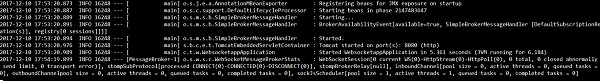

Now, hit the URL **http://localhost:8080/** in your web browser and connect the web socket and send the greeting and receive the message.

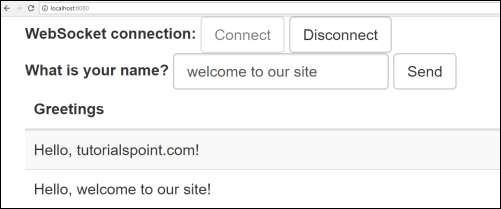

Batch Service is a process to execute more than one command in a single task. In this chapter, you are going to learn how to create batch service in a Spring Boot application.

Let us consider an example where we are going to save the CSV file content into HSQLDB.

To create a Batch Service program, we need to add the Spring Boot Starter Batch dependency and HSQLDB dependency in our build configuration file.

Maven users can add the following dependencies in pom.xml file.

```
<dependency>
   <groupId>org.springframework.boot</groupId>
   <artifactId>spring-boot-starter-batch</artifactId>
</dependency>
<dependency>
   <groupId>org.hsqldb</groupId>
   <artifactId>hsqldb</artifactId>
</dependency>
```
Gradle users can add the following dependencies in build.gradle file.

```
compile("org.springframework.boot:spring-boot-starter-batch")
compile("org.hsqldb:hsqldb")
```
Now, add the simple CSV data file under classpath resources – src/main/resources and name the file as file.csv as shown −

```
William,John
Mike, Sebastian
Lawarance, Lime
```
Next, write a SQL script for HSQLDB – under the classpath resource directory – **request_fail_hystrix_timeout**

```
DROP TABLE USERS IF EXISTS;
CREATE TABLE USERS  (
   user_id BIGINT IDENTITY NOT NULL PRIMARY KEY,
   first_name VARCHAR(20),
   last_name VARCHAR(20)
);
```
Create a POJO class for USERS model as shown −

```
package com.tutorialspoint.batchservicedemo;
public class User {
   private String lastName;
   private String firstName;

   public User() {
   }
   public User(String firstName, String lastName) {
      this.firstName = firstName;
      this.lastName = lastName;
   }
   public void setFirstName(String firstName) {
      this.firstName = firstName;
   }
   public String getFirstName() {
      return firstName;
   }
   public String getLastName() {
      return lastName;
   }
   public void setLastName(String lastName) {
      this.lastName = lastName;
   }

   @Override
   public String toString() {
      return "firstName: " + firstName + ", lastName: " + lastName;
   }   
}
```
Now, create an intermediate processor to do the operations after the reading the data from the CSV file and before writing the data into SQL.

```
package com.tutorialspoint.batchservicedemo;

import org.slf4j.Logger;
import org.slf4j.LoggerFactory;
import org.springframework.batch.item.ItemProcessor;

public class UserItemProcessor implements ItemProcessor<User, User> {
   private static final Logger log = LoggerFactory.getLogger(UserItemProcessor.class);

   @Override
   public User process(final User user) throws Exception {
      final String firstName = user.getFirstName().toUpperCase();
      final String lastName = user.getLastName().toUpperCase();
      final User transformedPerson = new User(firstName, lastName);

      log.info("Converting (" + user + ") into (" + transformedPerson + ")");
      return transformedPerson;
   }
}
```
Let us create a Batch configuration file, to read the data from CSV and write into the SQL file as shown below. We need to add the @EnableBatchProcessing annotation in the configuration class file. The @EnableBatchProcessing annotation is used to enable the batch operations for your Spring Boot application.

```
package com.tutorialspoint.batchservicedemo;

import javax.sql.DataSource;
import org.springframework.batch.core.Job;
import org.springframework.batch.core.Step;

import org.springframework.batch.core.configuration.annotation.EnableBatchProcessing;
import org.springframework.batch.core.configuration.annotation.JobBuilderFactory;
import org.springframework.batch.core.configuration.annotation.StepBuilderFactory;
import org.springframework.batch.core.launch.support.RunIdIncrementer;
import org.springframework.batch.item.database.BeanPropertyItemSqlParameterSourceProvider;
import org.springframework.batch.item.database.JdbcBatchItemWriter;
import org.springframework.batch.item.file.FlatFileItemReader;
import org.springframework.batch.item.file.mapping.BeanWrapperFieldSetMapper;
import org.springframework.batch.item.file.mapping.DefaultLineMapper;
import org.springframework.batch.item.file.transform.DelimitedLineTokenizer;
import org.springframework.beans.factory.annotation.Autowired;
import org.springframework.context.annotation.Bean;
import org.springframework.context.annotation.Configuration;
import org.springframework.core.io.ClassPathResource;

@Configuration
@EnableBatchProcessing
public class BatchConfiguration {
   @Autowired
   public JobBuilderFactory jobBuilderFactory;

   @Autowired
   public StepBuilderFactory stepBuilderFactory;

   @Autowired
   public DataSource dataSource;

   @Bean
   public FlatFileItemReader<User> reader() {
      FlatFileItemReader<User> reader = new FlatFileItemReader<User>();
      reader.setResource(new ClassPathResource("file.csv"));
      reader.setLineMapper(new DefaultLineMapper<User>() {
         {
            setLineTokenizer(new DelimitedLineTokenizer() {
               {
                  setNames(new String[] { "firstName", "lastName" });
               }
            });
            setFieldSetMapper(new BeanWrapperFieldSetMapper<User>() {
               {
                  setTargetType(User.class);
               }
            });
         }
      });
      return reader;
   }
   @Bean
   public UserItemProcessor processor() {
      return new UserItemProcessor();
   }
   @Bean
   public JdbcBatchItemWriter<User> writer() {
      JdbcBatchItemWriter<User> writer = new JdbcBatchItemWriter<User>();
      writer.setItemSqlParameterSourceProvider(new BeanPropertyItemSqlParameterSourceProvider<User>());
      writer.setSql("INSERT INTO USERS (first_name, last_name) VALUES (:firstName, :lastName)");
      writer.setDataSource(dataSource);
      return writer;
   }
   @Bean
   public Job importUserJob(JobCompletionNotificationListener listener) {
      return jobBuilderFactory.get("importUserJob").incrementer(
         new RunIdIncrementer()).listener(listener).flow(step1()).end().build();
   }
   @Bean
   public Step step1() {
      return stepBuilderFactory.get("step1").<User, User>chunk(10).reader(reader()).processor(processor()).writer(writer()).build();
   }
}
```
The **reader()** method is used to read the data from the CSV file and writer() method is used to write a data into the SQL.

Next, we will have to write a Job Completion Notification Listener class – used to notify after the Job completion.

```
package com.tutorialspoint.batchservicedemo;

import java.sql.ResultSet;
import java.sql.SQLException;
import java.util.List;

import org.slf4j.Logger;
import org.slf4j.LoggerFactory;

import org.springframework.batch.core.BatchStatus;
import org.springframework.batch.core.JobExecution;
import org.springframework.batch.core.listener.JobExecutionListenerSupport;
import org.springframework.beans.factory.annotation.Autowired;
import org.springframework.jdbc.core.JdbcTemplate;
import org.springframework.jdbc.core.RowMapper;
import org.springframework.stereotype.Component;

@Component
public class JobCompletionNotificationListener extends JobExecutionListenerSupport {
   private static final Logger log = LoggerFactory.getLogger(JobCompletionNotificationListener.class);
   private final JdbcTemplate jdbcTemplate;

   @Autowired
   public JobCompletionNotificationListener(JdbcTemplate jdbcTemplate) {
      this.jdbcTemplate = jdbcTemplate;
   }
   @Override
   public void afterJob(JobExecution jobExecution) {
      if (jobExecution.getStatus() == BatchStatus.COMPLETED) {
         log.info("!!! JOB FINISHED !! It's time to verify the results!!");

         List<User> results = jdbcTemplate.query(
            "SELECT first_name, last_name FROM USERS", new RowMapper<User>() {
            
            @Override
            public User mapRow(ResultSet rs, int row) throws SQLException {
               return new User(rs.getString(1), rs.getString(2));
            }
         });

         for (User person : results) {
            log.info("Found <" + person + "> in the database.");
         }
      }
   }
}
```
Now, create an executable JAR file, and run the Spring Boot application by using the following Maven or Gradle commands.

For Maven, use the command as shown −

```
mvn clean install
```
After “BUILD SUCCESS”, you can find the JAR file under the target directory.

For Gradle, you can use the command as shown −

```
gradle clean build
```
After “BUILD SUCCESSFUL”, you can find the JAR file under the build/libs directory.

Run the JAR file by using the command given here −

```
java –jar <JARFILE>
```
You can see the output in console window as shown −

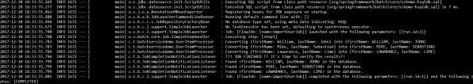

# Spring Boot - Apache Kafka
Apache Kafka is an open source project used to publish and subscribe the messages based on the fault-tolerant messaging system. It is fast, scalable and distributed by design. If you are a beginner to Kafka, or want to gain a better understanding on it, please refer to this link − [www.tutorialspoint.com/apache_kafka/](/apache_kafka/index.htm) 

In this chapter, we are going to see how to implement the Apache Kafka in Spring Boot application.

First, we need to add the Spring Kafka dependency in our build configuration file. 

Maven users can add the following dependency in the pom.xml file.

```
<dependency>
   <groupId>org.springframework.kafka</groupId>
   <artifactId>spring-kafka</artifactId>
   <version>2.1.0.RELEASE</version>
</dependency>
```
Gradle users can add the following dependency in the build.gradle file.

```
compile group: 'org.springframework.kafka', name: 'spring-kafka', version: '2.1.0.RELEASE'
```
## Producing Messages
To produce messages into Apache Kafka, we need to define the Configuration class for Producer configuration as shown −

```
package com.tutorialspoint.kafkademo;

import java.util.HashMap;
import java.util.Map;

import org.apache.kafka.clients.producer.ProducerConfig;
import org.apache.kafka.common.serialization.StringSerializer;
import org.springframework.context.annotation.Bean;
import org.springframework.context.annotation.Configuration;
import org.springframework.kafka.core.DefaultKafkaProducerFactory;
import org.springframework.kafka.core.KafkaTemplate;
import org.springframework.kafka.core.ProducerFactory;

@Configuration
public class KafkaProducerConfig {
   @Bean
   public ProducerFactory<String, String> producerFactory() {
      Map<String, Object> configProps = new HashMap<>();
      configProps.put(ProducerConfig.BOOTSTRAP_SERVERS_CONFIG, "localhost:9092");
      configProps.put(ProducerConfig.KEY_SERIALIZER_CLASS_CONFIG, StringSerializer.class);
      configProps.put(ProducerConfig.VALUE_SERIALIZER_CLASS_CONFIG, StringSerializer.class);
      return new DefaultKafkaProducerFactory<>(configProps);
   }
   @Bean
   public KafkaTemplate<String, String> kafkaTemplate() {
      return new KafkaTemplate<>(producerFactory());
   }
}
```
To publish a message, auto wire the Kafka Template object and produce the message as shown.

```
@Autowired
private KafkaTemplate<String, String> kafkaTemplate;
 
public void sendMessage(String msg) {
   kafkaTemplate.send(topicName, msg);
}
```
## Consuming a Message
To consume messages, we need to write a Consumer configuration class file as shown below.

```
package com.tutorialspoint.kafkademo;

import java.util.HashMap;
import java.util.Map;

import org.apache.kafka.clients.consumer.ConsumerConfig;
import org.apache.kafka.common.serialization.StringDeserializer;
import org.springframework.context.annotation.Bean;
import org.springframework.context.annotation.Configuration;
import org.springframework.kafka.annotation.EnableKafka;
import org.springframework.kafka.config.ConcurrentKafkaListenerContainerFactory;
import org.springframework.kafka.core.ConsumerFactory;
import org.springframework.kafka.core.DefaultKafkaConsumerFactory;

@EnableKafka
@Configuration
public class KafkaConsumerConfig {
   @Bean
   public ConsumerFactory<String, String> consumerFactory() {
      Map<String, Object> props = new HashMap<>();
      props.put(ConsumerConfig.BOOTSTRAP_SERVERS_CONFIG, "localhost:2181");
      props.put(ConsumerConfig.GROUP_ID_CONFIG, "group-id");
      props.put(ConsumerConfig.KEY_DESERIALIZER_CLASS_CONFIG, StringDeserializer.class);
      props.put(ConsumerConfig.VALUE_DESERIALIZER_CLASS_CONFIG, StringDeserializer.class);
      return new DefaultKafkaConsumerFactory<>(props);
   }
   @Bean
   public ConcurrentKafkaListenerContainerFactory<String, String> kafkaListenerContainerFactory() {
      ConcurrentKafkaListenerContainerFactory<String, String> 
      factory = new ConcurrentKafkaListenerContainerFactory<>();
      factory.setConsumerFactory(consumerFactory());
      return factory;
   }
}
```
Next, write a Listener to listen to the messages.

```
@KafkaListener(topics = "tutorialspoint", groupId = "group-id")
public void listen(String message) {
   System.out.println("Received Messasge in group - group-id: " + message);
}
```
Let us call the sendMessage() method from ApplicationRunner class run method from the main Spring Boot application class file and consume the message from the same class file.

Your main Spring Boot application class file code is given below −

```
package com.tutorialspoint.kafkademo;

import org.springframework.beans.factory.annotation.Autowired;
import org.springframework.boot.ApplicationArguments;
import org.springframework.boot.ApplicationRunner;
import org.springframework.boot.SpringApplication;
import org.springframework.boot.autoconfigure.SpringBootApplication;
import org.springframework.kafka.annotation.KafkaListener;
import org.springframework.kafka.core.KafkaTemplate;

@SpringBootApplication
public class KafkaDemoApplication implements ApplicationRunner {
   @Autowired
   private KafkaTemplate<String, String> kafkaTemplate;

   public void sendMessage(String msg) {
      kafkaTemplate.send("tutorialspoint", msg);
   }
   public static void main(String[] args) {
      SpringApplication.run(KafkaDemoApplication.class, args);
   }
   @KafkaListener(topics = "tutorialspoint", groupId = "group-id")
   public void listen(String message) {
      System.out.println("Received Messasge in group - group-id: " + message);
   }
   @Override
   public void run(ApplicationArguments args) throws Exception {
      sendMessage("Hi Welcome to Spring For Apache Kafka");
   }
}
```
The code for complete build configuration file is given below.

**Maven – pom.xml**

```
<?xml version = "1.0" encoding = "UTF-8"?>
<project xmlns = "http://maven.apache.org/POM/4.0.0" 
   xmlns:xsi = "http://www.w3.org/2001/XMLSchema-instance"
   xsi:schemaLocation = "http://maven.apache.org/POM/4.0.0 
   http://maven.apache.org/xsd/maven-4.0.0.xsd">
   
   <modelVersion>4.0.0</modelVersion>
   <groupId>com.tutorialspoint</groupId>
   <artifactId>kafka-demo</artifactId>
   <version>0.0.1-SNAPSHOT</version>
   <packaging>jar</packaging>
   <name>kafka-demo</name>
   <description>Demo project for Spring Boot</description>

   <parent>
      <groupId>org.springframework.boot</groupId>
      <artifactId>spring-boot-starter-parent</artifactId>
      <version>1.5.9.RELEASE</version>
      <relativePath /> <!-- lookup parent from repository -->
   </parent>

   <properties>
      <project.build.sourceEncoding>UTF-8</project.build.sourceEncoding>
      <project.reporting.outputEncoding>UTF-8</project.reporting.outputEncoding>
      <java.version>1.8</java.version>
   </properties>

   <dependencies>
      <dependency>
         <groupId>org.springframework.boot</groupId>
         <artifactId>spring-boot-starter</artifactId>
      </dependency>
      <dependency>
         <groupId>org.springframework.kafka</groupId>
         <artifactId>spring-kafka</artifactId>
         <version>2.1.0.RELEASE</version>
      </dependency>
      <dependency>
         <groupId>org.springframework.boot</groupId>
         <artifactId>spring-boot-starter-test</artifactId>
         <scope>test</scope>
      </dependency>
   </dependencies>

   <build>
      <plugins>
         <plugin>
            <groupId>org.springframework.boot</groupId>
            <artifactId>spring-boot-maven-plugin</artifactId>
         </plugin>
      </plugins>
   </build>
   
</project>
```
**Gradle – build.gradle**

```
buildscript {
   ext {
      springBootVersion = '1.5.9.RELEASE'
   }
   repositories {
      mavenCentral()
   }
   dependencies {
      classpath("org.springframework.boot:spring-boot-gradle-plugin:${springBootVersion}")
   }
}

apply plugin: 'java'
apply plugin: 'eclipse'
apply plugin: 'org.springframework.boot'

group = 'com.tutorialspoint'
version = '0.0.1-SNAPSHOT'
sourceCompatibility = 1.8

repositories {
   mavenCentral()
}
dependencies {
   compile('org.springframework.boot:spring-boot-starter')
   compile group: 'org.springframework.kafka', name: 'spring-kafka', version: '2.1.0.RELEASE'
   testCompile('org.springframework.boot:spring-boot-starter-test')
}
```
Now, create an executable JAR file, and run the Spring Boot application by using the below Maven or Gradle commands as shown −

For Maven, use the command as shown −

```
mvn clean install
```
After “BUILD SUCCESS”, you can find the JAR file under the target directory.

For Gradle, use the command as shown −

```
gradle clean build
```
After “BUILD SUCCESSFUL”, you can find the JAR file under the build/libs directory.

Run the JAR file by using the command given here −

```
java –jar <JARFILE>
```
You can see the output in console window.

# Spring Boot - Twilio
Twilio is a 3 party application used to send SMS and make voice calls from our application. It allows us to send the SMS and make voice calls programmatically.

In this chapter, you are going to learn how to implement the SMS sending and making voice calls by using Spring Boot with Twilio.

**Note** − We used the Trail account in Twilio to send the SMS and making voice calls. You can learn more about Twilio at [www.twilio.com](https://www.twilio.com/) .

First, we need to add the Twilio dependency in our build configuration file.

Maven users can add the following dependency in the pom.xml file.

```
<dependency>
   <groupId>com.twilio.sdk</groupId>
   <artifactId>twilio</artifactId>
   <version>7.16.1</version>
</dependency>
```
Gradle users can add the following dependency in the build.gradle file.

```
compile group: "com.twilio.sdk", name:"twilio", version: "7.16.1"
```
Now, initialize the Twilio account with ACCOUNT_SID and AUTH_ID in static block as shown −

```
static {
   Twilio.init(ACCOUNT_SID, AUTH_ID);
}
```
## Sending SMS
To send the SMS, we need to provide a from-number and to-number to the Message.create() method. Message body content also we need to provide for the method Message.creator()as shown −

```
Message.creator(new PhoneNumber("to-number"), new PhoneNumber("from-number"),
   "Message from Spring Boot Application").create();
```
The main Spring Boot application class file looks below.

```
package com.tutorialspoint.smsdemo;

import org.springframework.boot.ApplicationArguments;
import org.springframework.boot.ApplicationRunner;
import org.springframework.boot.SpringApplication;
import org.springframework.boot.autoconfigure.SpringBootApplication;

import com.twilio.Twilio;
import com.twilio.rest.api.v2010.account.Message;
import com.twilio.type.PhoneNumber;

@SpringBootApplication
public class SmsdemoApplication implements ApplicationRunner {
   private final static String ACCOUNT_SID = "<your-account-sid>";
   private final static String AUTH_ID = "<your-auth-id>";

   static {
      Twilio.init(ACCOUNT_SID, AUTH_ID);
   }
   public static void main(String[] args) {
      SpringApplication.run(SmsdemoApplication.class, args);
   }
   @Override
   public void run(ApplicationArguments arg0) throws Exception {
      Message.creator(new PhoneNumber("to-number"), new PhoneNumber("from-number"),
         "Message from Spring Boot Application").create();
   }
}
```
The complete code to build configuration file is given below −

**Maven – pom.xml**

```
<?xml version = "1.0" encoding = "UTF-8"?>
<project xmlns = "http://maven.apache.org/POM/4.0.0" 
   xmlns:xsi = "http://www.w3.org/2001/XMLSchema-instance"
   xsi:schemaLocation = "http://maven.apache.org/POM/4.0.0 
   http://maven.apache.org/xsd/maven-4.0.0.xsd">
   
   <modelVersion>4.0.0</modelVersion>
   <groupId>com.tutorialspoint</groupId>
   <artifactId>smsdemo</artifactId>
   <version>0.0.1-SNAPSHOT</version>
   <packaging>jar</packaging>
   <name>smsdemo</name>
   <description>Demo project for Spring Boot</description>

   <parent>
      <groupId>org.springframework.boot</groupId>
      <artifactId>spring-boot-starter-parent</artifactId>
      <version>1.5.9.RELEASE</version>
      <relativePath /> <!-- lookup parent from repository -->
   </parent>

   <properties>
      <project.build.sourceEncoding>UTF-8</project.build.sourceEncoding>
      <project.reporting.outputEncoding>UTF-8</project.reporting.outputEncoding>
      <java.version>1.8</java.version>
   </properties>

   <dependencies>
      <dependency>
         <groupId>org.springframework.boot</groupId>
         <artifactId>spring-boot-starter</artifactId>
      </dependency>
      <dependency>
         <groupId>org.springframework.boot</groupId>
         <artifactId>spring-boot-starter-test</artifactId>
         <scope>test</scope>
      </dependency>
      <dependency>
         <groupId>com.twilio.sdk</groupId>
         <artifactId>twilio</artifactId>
         <version>7.16.1</version>
      </dependency>
   </dependencies>

   <build>
      <plugins>
         <plugin>
            <groupId>org.springframework.boot</groupId>
            <artifactId>spring-boot-maven-plugin</artifactId>
         </plugin>
      </plugins>
   </build>
   
</project>
```
**Gradle – build.gradle**

```
buildscript {
   ext {
      springBootVersion = '1.5.9.RELEASE'
   }
   repositories {
      mavenCentral()
   }
   dependencies {
      classpath("org.springframework.boot:spring-boot-gradle-plugin:${springBootVersion}")
   }
}
apply plugin: 'java'
apply plugin: 'eclipse'
apply plugin: 'org.springframework.boot'

group = 'com.tutorialspoint'
version = '0.0.1-SNAPSHOT'
sourceCompatibility = 1.8

repositories {
   mavenCentral()
}
dependencies {
   compile('org.springframework.boot:spring-boot-starter')
   testCompile('org.springframework.boot:spring-boot-starter-test')
   compile group: "com.twilio.sdk", name:"twilio", version: "7.11.+"   
}
```
You can create an executable JAR file, and run the spring boot application by using the following Maven or Gradle commands −

For Maven, use the command as shown −

```
mvn clean install
```
After “BUILD SUCCESS”, you can find the JAR file under the target directory.

For Gradle, use the command as shown −

```
gradle clean build
```
After “BUILD SUCCESSFUL”, you can find the JAR file under the build/libs directory.

Run the JAR file by using the command as given below −

```
java –jar <JARFILE>
```
Now, you will receive the SMS to your “to-number”.

Message received to “to-number”.

```
Sent from your Twilio trail account
- Message from Spring Boot Application
```
**Note** − In this example, we used the Trail account. So, you should verify the numbers before sending the SMS.

## Voice Calls
To make voice calls by using Twilio, we need to call the Call.creator() method. For this method, we need to provide a to-number, from-number, and voice-note as shown here.

```
Call.creator(new PhoneNumber("<to-number>"), new PhoneNumber("<from-number>"),
   new URI("http://demo.twilio.com/docs/voice.xml")).create();
```
The code for main Spring Boot application class file is given below.

```
package com.tutorialspoint.smsdemo; 

import java.net.URI;

import org.springframework.boot.ApplicationArguments;
import org.springframework.boot.ApplicationRunner;
import org.springframework.boot.SpringApplication;
import org.springframework.boot.autoconfigure.SpringBootApplication;

import com.twilio.Twilio;
import com.twilio.rest.api.v2010.account.Call;
import com.twilio.type.PhoneNumber;

@SpringBootApplication
public class SmsdemoApplication implements ApplicationRunner {
   private final static String ACCOUNT_SID = "<ACCOUNT-SID>";
   private final static String AUTH_ID = "AUTH-ID";

   static {
      Twilio.init(ACCOUNT_SID, AUTH_ID);
   }
   public static void main(String[] args) {
      SpringApplication.run(SmsdemoApplication.class, args);
   }
   @Override
   public void run(ApplicationArguments arg0) throws Exception {
      Call.creator(new PhoneNumber("<to-number>"), new PhoneNumber("<from-number>"),
         new URI("http://demo.twilio.com/docs/voice.xml")).create();
   }
}
```
The code for complete build configuration file is given below −

**Maven – pom.xml**

```
<?xml version = "1.0" encoding = "UTF-8"?>
<project xmlns = "http://maven.apache.org/POM/4.0.0" 
   xmlns:xsi = "http://www.w3.org/2001/XMLSchema-instance"
   xsi:schemaLocation = "http://maven.apache.org/POM/4.0.0 
   http://maven.apache.org/xsd/maven-4.0.0.xsd">
   
   <modelVersion>4.0.0</modelVersion>
   <groupId>com.tutorialspoint</groupId>
   <artifactId>smsdemo</artifactId>
   <version>0.0.1-SNAPSHOT</version>
   <packaging>jar</packaging>
   <name>smsdemo</name>
   <description>Demo project for Spring Boot</description>

   <parent>
      <groupId>org.springframework.boot</groupId>
      <artifactId>spring-boot-starter-parent</artifactId>
      <version>1.5.9.RELEASE</version>
      <relativePath /> <!-- lookup parent from repository -->
   </parent>

   <properties>
      <project.build.sourceEncoding>UTF-8</project.build.sourceEncoding>
      <project.reporting.outputEncoding>UTF-8</project.reporting.outputEncoding>
      <java.version>1.8</java.version>
   </properties>

   <dependencies>
      <dependency>
         <groupId>org.springframework.boot</groupId>
         <artifactId>spring-boot-starter</artifactId>
      </dependency>
      <dependency>
         <groupId>org.springframework.boot</groupId>
         <artifactId>spring-boot-starter-test</artifactId>
         <scope>test</scope>
      </dependency>
      <dependency>
         <groupId>com.twilio.sdk</groupId>
         <artifactId>twilio</artifactId>
         <version>7.16.1</version>
      </dependency>
   </dependencies>

   <build>
      <plugins>
         <plugin>
            <groupId>org.springframework.boot</groupId>
            <artifactId>spring-boot-maven-plugin</artifactId>
         </plugin>
      </plugins>
   </build>
   
</project>
```
**Gradle – build.gradle**

```
buildscript {
   ext {
      springBootVersion = '1.5.9.RELEASE'
   }
   repositories {
      mavenCentral()
   }
   dependencies {
      classpath("org.springframework.boot:spring-boot-gradle-plugin:${springBootVersion}")
   }
}

apply plugin: 'java'
apply plugin: 'eclipse'
apply plugin: 'org.springframework.boot'

group = 'com.tutorialspoint'
version = '0.0.1-SNAPSHOT'
sourceCompatibility = 1.8

repositories {
   mavenCentral()
}
dependencies {
   compile('org.springframework.boot:spring-boot-starter')
   testCompile('org.springframework.boot:spring-boot-starter-test')
   compile group: "com.twilio.sdk", name:"twilio", version: "7.11.+"   
}
```
You can create an executable JAR file, and run the Spring Boot application by using the following Maven or Gradle commands.

For Maven, use the command as shown −

```
mvn clean install
```
After “BUILD SUCCESS”, you can find the JAR file under the target directory.

For Gradle, use the command as shown −

```
gradle clean build
```
After “BUILD SUCCESSFUL”, you can find the JAR file under the build/libs directory.

Now, run the JAR file by using the command given here −

```
java –jar <JARFILE>
```
Now, you will receive call to your “to-number” from Twilio.

Press any key after attending the call, you will hear the voice note from [https://demo.twilio.com/docs/voice.xml](https://demo.twilio.com/docs/voice.xml) 

**Note** − In this example, we used the Trail account. So, you should verify the numbers before making calls.

# Spring Boot - Unit Test Cases
Unit Testing is a one of the testing done by the developers to make sure individual unit or component functionalities are working fine.

In this tutorial, we are going to see how to write a unit test case by using Mockito and Web Controller.

## Mockito
For injecting Mockito Mocks into Spring Beans, we need to add the Mockito-core dependency in our build configuration file.

Maven users can add the following dependency in your pom.xml file.

```
<dependency>
   <groupId>org.mockito</groupId>
   <artifactId>mockito-core</artifactId>
   <version>2.13.0</version>
</dependency>
<dependency>
   <groupId>org.springframework.boot</groupId>
   <artifactId>spring-boot-starter-test</artifactId>
   <scope>test</scope>
</dependency>
```
Gradle users can add the following dependency in the build.gradle file.

```
compile group: 'org.mockito', name: 'mockito-core', version: '2.13.0'
testCompile('org.springframework.boot:spring-boot-starter-test')
```
The code to write a Service class which contains a method that returns the String value is given here.

```
package com.tutorialspoint.mockitodemo;

import org.springframework.stereotype.Service;

@Service
public class ProductService {
   public String getProductName() {
      return "Honey";
   } 
}
```
Now, inject the ProductService class into another Service class file as shown.

```
package com.tutorialspoint.mockitodemo;

import org.springframework.beans.factory.annotation.Autowired;
import org.springframework.stereotype.Service;

@Service
public class OrderService {
   @Autowired
   ProductService productService;

   public OrderService(ProductService productService) {
      this.productService = productService;
   }
   public String getProductName() {
      return productService.getProductName();
   }
}
```
The main Spring Boot application class file is given below −

```
package com.tutorialspoint.mockitodemo;

import org.springframework.boot.SpringApplication;
import org.springframework.boot.autoconfigure.SpringBootApplication;

@SpringBootApplication
public class MockitoDemoApplication {
   public static void main(String[] args) {
      SpringApplication.run(MockitoDemoApplication.class, args);
   }
}
```
Then, configure the Application context for the tests. The @Profile(“test”) annotation is used to configure the class when the Test cases are running.

```
package com.tutorialspoint.mockitodemo;

import org.mockito.Mockito;
import org.springframework.context.annotation.Bean;
import org.springframework.context.annotation.Configuration;
import org.springframework.context.annotation.Primary;
import org.springframework.context.annotation.Profile;

@Profile("test")
@Configuration
public class ProductServiceTestConfiguration {
   @Bean
   @Primary
   public ProductService productService() {
      return Mockito.mock(ProductService.class);
   }
}
```
Now, you can write a Unit Test case for Order Service under the **src/test/resources** package.

```
package com.tutorialspoint.mockitodemo;

import org.junit.Assert;
import org.junit.Test;
import org.junit.runner.RunWith;
import org.mockito.Mockito;
import org.springframework.beans.factory.annotation.Autowired;
import org.springframework.boot.test.context.SpringBootTest;
import org.springframework.test.context.ActiveProfiles;
import org.springframework.test.context.junit4.SpringJUnit4ClassRunner;

@SpringBootTest
@ActiveProfiles("test")
@RunWith(SpringJUnit4ClassRunner.class)
public class MockitoDemoApplicationTests {
   @Autowired
   private OrderService orderService;
   
   @Autowired
   private ProductService productService;

   @Test
   public void whenUserIdIsProvided_thenRetrievedNameIsCorrect() {
      Mockito.when(productService.getProductName()).thenReturn("Mock Product Name");
      String testName = orderService.getProductName();
      Assert.assertEquals("Mock Product Name", testName);
   }
}
```
The complete code for build configuration file is given below.

**Maven – pom.xml**

```
<?xml version = "1.0" encoding = "UTF-8"?>
<project xmlns = "http://maven.apache.org/POM/4.0.0" 
   xmlns:xsi = "http://www.w3.org/2001/XMLSchema-instance"
   xsi:schemaLocation = "http://maven.apache.org/POM/4.0.0 
   http://maven.apache.org/xsd/maven-4.0.0.xsd">
   
   <modelVersion>4.0.0</modelVersion>
   <groupId>com.tutorialspoint</groupId>
   <artifactId>mockito-demo</artifactId>
   <version>0.0.1-SNAPSHOT</version>
   <packaging>jar</packaging>

   <name>mockito-demo</name>
   <description>Demo project for Spring Boot</description>

   <parent>
      <groupId>org.springframework.boot</groupId>
      <artifactId>spring-boot-starter-parent</artifactId>
      <version>1.5.9.RELEASE</version>
      <relativePath /> <!-- lookup parent from repository -->
   </parent>

   <properties>
      <project.build.sourceEncoding>UTF-8</project.build.sourceEncoding>
      <project.reporting.outputEncoding>UTF-8</project.reporting.outputEncoding>
      <java.version>1.8</java.version>
   </properties>

   <dependencies>
      <dependency>
         <groupId>org.springframework.boot</groupId>
         <artifactId>spring-boot-starter</artifactId>
      </dependency>
      <dependency>
         <groupId>org.mockito</groupId>
         <artifactId>mockito-core</artifactId>
         <version>2.13.0</version>
      </dependency>
      <dependency>
         <groupId>org.springframework.boot</groupId>
         <artifactId>spring-boot-starter-test</artifactId>
         <scope>test</scope>
      </dependency>
   </dependencies>

   <build>
      <plugins>
         <plugin>
            <groupId>org.springframework.boot</groupId>
            <artifactId>spring-boot-maven-plugin</artifactId>
         </plugin>
      </plugins>
   </build>
   
</project>
```
**Gradle – build.gradle**

```
buildscript {
   ext {
      springBootVersion = '1.5.9.RELEASE'
   }
   repositories {
      mavenCentral()
   }
   dependencies {
      classpath("org.springframework.boot:spring-boot-gradle-plugin:${springBootVersion}")
   }
}

apply plugin: 'java'
apply plugin: 'eclipse'
apply plugin: 'org.springframework.boot'

group = 'com.tutorialspoint'
version = '0.0.1-SNAPSHOT'
sourceCompatibility = 1.8

repositories {
   mavenCentral()
}
dependencies {
   compile('org.springframework.boot:spring-boot-starter')
   compile group: 'org.mockito', name: 'mockito-core', version: '2.13.0'
   testCompile('org.springframework.boot:spring-boot-starter-test')
}
```
You can create an executable JAR file, and run the Spring Boot application by using the following Maven or Gradle1 commands.

For Maven, you can use the command as shown −

```
mvn clean install
```
You can see the test results in console window.


For Gradle, you can use the command as shown −

```
gradle clean build
```
You can see the rest results in console window.


# Spring Boot - Rest Controller Unit Test
Spring Boot provides an easy way to write a Unit Test for Rest Controller file. With the help of SpringJUnit4ClassRunner and MockMvc, we can create a web application context to write Unit Test for Rest Controller file.

Unit Tests should be written under the **src/test/java** directory and classpath resources for writing a test should be placed under the **src/test/resources** directory.

For Writing a Unit Test, we need to add the Spring Boot Starter Test dependency in your build configuration file as shown below.

```
<dependency>
   <groupId>org.springframework.boot</groupId>
   <artifactId>spring-boot-starter-test</artifactId>
   <scope>test</scope>
</dependency>
```
Gradle users can add the following dependency in your build.gradle file.

```
testCompile('org.springframework.boot:spring-boot-starter-test')
```
Before writing a Test case, we should first build RESTful web services. For further information on building RESTful web services, please refer to the chapter on the same given in this tutorial.

## Writing a Unit Test for REST Controller
In this section, let us see how to write a Unit Test for the REST Controller.

First, we need to create Abstract class file used to create web application context by using MockMvc and define the mapToJson() and mapFromJson() methods to convert the Java object into JSON string and convert the JSON string into Java object.

```
package com.tutorialspoint.demo;

import java.io.IOException;
import org.junit.runner.RunWith;
import org.springframework.beans.factory.annotation.Autowired;
import org.springframework.boot.test.context.SpringBootTest;
import org.springframework.test.context.junit4.SpringJUnit4ClassRunner;
import org.springframework.test.context.web.WebAppConfiguration;
import org.springframework.test.web.servlet.MockMvc;
import org.springframework.test.web.servlet.setup.MockMvcBuilders;
import org.springframework.web.context.WebApplicationContext;

import com.fasterxml.jackson.core.JsonParseException;
import com.fasterxml.jackson.core.JsonProcessingException;
import com.fasterxml.jackson.databind.JsonMappingException;
import com.fasterxml.jackson.databind.ObjectMapper;

@RunWith(SpringJUnit4ClassRunner.class)
@SpringBootTest(classes = DemoApplication.class)
@WebAppConfiguration
public abstract class AbstractTest {
   protected MockMvc mvc;
   @Autowired
   WebApplicationContext webApplicationContext;

   protected void setUp() {
      mvc = MockMvcBuilders.webAppContextSetup(webApplicationContext).build();
   }
   protected String mapToJson(Object obj) throws JsonProcessingException {
      ObjectMapper objectMapper = new ObjectMapper();
      return objectMapper.writeValueAsString(obj);
   }
   protected <T> T mapFromJson(String json, Class<T> clazz)
      throws JsonParseException, JsonMappingException, IOException {
      
      ObjectMapper objectMapper = new ObjectMapper();
      return objectMapper.readValue(json, clazz);
   }
}
```
Next, write a class file that extends the AbstractTest class and write a Unit Test for each method such GET, POST, PUT and DELETE.

The code for GET API Test case is given below. This API is to view the list of products.

```
@Test
public void getProductsList() throws Exception {
   String uri = "/products";
   MvcResult mvcResult = mvc.perform(MockMvcRequestBuilders.get(uri)
      .accept(MediaType.APPLICATION_JSON_VALUE)).andReturn();
   
   int status = mvcResult.getResponse().getStatus();
   assertEquals(200, status);
   String content = mvcResult.getResponse().getContentAsString();
   Product[] productlist = super.mapFromJson(content, Product[].class);
   assertTrue(productlist.length > 0);
}
```
The code for POST API test case is given below. This API is to create a product.

```
@Test
public void createProduct() throws Exception {
   String uri = "/products";
   Product product = new Product();
   product.setId("3");
   product.setName("Ginger");
   
   String inputJson = super.mapToJson(product);
   MvcResult mvcResult = mvc.perform(MockMvcRequestBuilders.post(uri)
      .contentType(MediaType.APPLICATION_JSON_VALUE).content(inputJson)).andReturn();
   
   int status = mvcResult.getResponse().getStatus();
   assertEquals(201, status);
   String content = mvcResult.getResponse().getContentAsString();
   assertEquals(content, "Product is created successfully");
}
```
The code for PUT API Test case is given below. This API is to update the existing product.

```
@Test
public void updateProduct() throws Exception {
   String uri = "/products/2";
   Product product = new Product();
   product.setName("Lemon");
   
   String inputJson = super.mapToJson(product);
   MvcResult mvcResult = mvc.perform(MockMvcRequestBuilders.put(uri)
      .contentType(MediaType.APPLICATION_JSON_VALUE).content(inputJson)).andReturn();
   
   int status = mvcResult.getResponse().getStatus();
   assertEquals(200, status);
   String content = mvcResult.getResponse().getContentAsString();
   assertEquals(content, "Product is updated successsfully");
}
```
The code for Delete API Test case is given below. This API will delete the existing product.

```
@Test
public void deleteProduct() throws Exception {
   String uri = "/products/2";
   MvcResult mvcResult = mvc.perform(MockMvcRequestBuilders.delete(uri)).andReturn();
   int status = mvcResult.getResponse().getStatus();
   assertEquals(200, status);
   String content = mvcResult.getResponse().getContentAsString();
   assertEquals(content, "Product is deleted successsfully");
}
```
The full Controller Test class file is given below −

```
package com.tutorialspoint.demo;

import static org.junit.Assert.assertEquals;
import static org.junit.Assert.assertTrue;

import org.junit.Before;
import org.junit.Test;
import org.springframework.http.MediaType;
import org.springframework.test.web.servlet.MvcResult;
import org.springframework.test.web.servlet.request.MockMvcRequestBuilders;

import com.tutorialspoint.demo.model.Product;

public class ProductServiceControllerTest extends AbstractTest {
   @Override
   @Before
   public void setUp() {
      super.setUp();
   }
   @Test
   public void getProductsList() throws Exception {
      String uri = "/products";
      MvcResult mvcResult = mvc.perform(MockMvcRequestBuilders.get(uri)
         .accept(MediaType.APPLICATION_JSON_VALUE)).andReturn();
      
      int status = mvcResult.getResponse().getStatus();
      assertEquals(200, status);
      String content = mvcResult.getResponse().getContentAsString();
      Product[] productlist = super.mapFromJson(content, Product[].class);
      assertTrue(productlist.length > 0);
   }
   @Test
   public void createProduct() throws Exception {
      String uri = "/products";
      Product product = new Product();
      product.setId("3");
      product.setName("Ginger");
      String inputJson = super.mapToJson(product);
      MvcResult mvcResult = mvc.perform(MockMvcRequestBuilders.post(uri)
         .contentType(MediaType.APPLICATION_JSON_VALUE)
         .content(inputJson)).andReturn();
      
      int status = mvcResult.getResponse().getStatus();
      assertEquals(201, status);
      String content = mvcResult.getResponse().getContentAsString();
      assertEquals(content, "Product is created successfully");
   }
   @Test
   public void updateProduct() throws Exception {
      String uri = "/products/2";
      Product product = new Product();
      product.setName("Lemon");
      String inputJson = super.mapToJson(product);
      MvcResult mvcResult = mvc.perform(MockMvcRequestBuilders.put(uri)
         .contentType(MediaType.APPLICATION_JSON_VALUE)
         .content(inputJson)).andReturn();
      
      int status = mvcResult.getResponse().getStatus();
      assertEquals(200, status);
      String content = mvcResult.getResponse().getContentAsString();
      assertEquals(content, "Product is updated successsfully");
   }
   @Test
   public void deleteProduct() throws Exception {
      String uri = "/products/2";
      MvcResult mvcResult = mvc.perform(MockMvcRequestBuilders.delete(uri)).andReturn();
      int status = mvcResult.getResponse().getStatus();
      assertEquals(200, status);
      String content = mvcResult.getResponse().getContentAsString();
      assertEquals(content, "Product is deleted successsfully");
   }
}
```
You can create an executable JAR file, and run the Spring Boot application by using the Maven or Gradle commands given below −

For Maven, you can use the command given below −

```
mvn clean install
```
Now, you can see the test results in console window.


For Gradle, you can use the command as shown below −

```
gradle clean build
```
You can see the rest results in console window as shown below.


# Spring Boot - Database Handling
Spring Boot provides a very good support to create a DataSource for Database. We need not write any extra code to create a DataSource in Spring Boot. Just adding the dependencies&nbsp;and doing the configuration details is enough to create a DataSource and connect the Database.

In this chapter, we are going to use Spring Boot JDBC driver connection to connect the database.

First, we need to add the Spring Boot Starter JDBC dependency in our build configuration file.

Maven users can add the following dependencies in the pom.xml file.

```
<dependency>
   <groupId>org.springframework.boot</groupId>
   <artifactId>spring-boot-starter-jdbc</artifactId>
</dependency>
```
Gradle users can add the following dependencies in the build.gradle file.

```
compile('org.springframework.boot:spring-boot-starter-jdbc')
```
## Connect to H2 database
To connect the H2 database, we need to add the H2 database dependency in our build configuration file.

For Maven users, add the below dependency in your pom.xml file.

```
<dependency>
   <groupId>com.h2database</groupId>
   <artifactId>h2</artifactId>
</dependency>
```
For Gradle users, add the below dependency in your build.gradle file.

```
compile('com.h2database:h2')
```
We need to create the schema.sql file and data.sql file under the classpath src/main/resources directory to connect the H2 database.

The schema.sql file is given below.

```
CREATE TABLE PRODUCT (ID INT PRIMARY KEY, PRODUCT_NAME VARCHAR(25));
```
The data.sql file is given below.

```
INSERT INTO PRODUCT (ID,PRODUCT_NAME) VALUES (1,'Honey');
INSERT INTO PRODUCT (ID,PRODUCT_NAME) VALUES (2,'Almond');
```
## Connect MySQL
To connect the MySQL database, we need to add the MySQL dependency into our build configuration file.

For Maven users, add the following dependency in your pom.xml file.

```
<dependency>
   <groupId>mysql</groupId>
   <artifactId>mysql-connector-java</artifactId>
</dependency>
```
For Gradle users, add the following dependency in your build.gradle file.

```
compile('mysql:mysql-connector-java')
```
Now, create database and tables in MySQL as shown −


For properties file users, add the following properties in the application.properties file.

```
spring.datasource.driverClassName = com.mysql.jdbc.Driver
spring.datasource.url = jdbc:mysql://localhost:3306/PRODUCTSERVICE?autoreconnect = true
spring.datasource.username = root
spring.datasource.password = root
spring.datasource.testOnBorrow = true
spring.datasource.testWhileIdle = true
spring.datasource.timeBetweenEvictionRunsMillis = 60000
spring.datasource.minEvictableIdleTimeMillis = 30000
spring.datasource.validationQuery = SELECT 1
spring.datasource.max-active = 15
spring.datasource.max-idle = 10
spring.datasource.max-wait = 8000
```
For YAML users, add the following properties in the application.yml file.

```
spring:
   datasource: 
      driverClassName: com.mysql.jdbc.Driver
      url: "jdbc:mysql://localhost:3306/PRODUCTSERVICE?autoreconnect=true"
      username: "root"
      password: "root"
      testOnBorrow: true
      testWhileIdle: true
      timeBetweenEvictionRunsMillis: 60000
      minEvictableIdleTimeMillis: 30000
      validationQuery: SELECT 1
      max-active: 15
      max-idle: 10
      max-wait: 8000
```
## Connect Redis
Redis is an open source database used to store the in-memory data structure. To connect the Redis database in Spring Boot application, we need to add the Redis dependency in our build configuration file.

Maven users should add the following dependency in your pom.xml file.

```
<dependency>
   <groupId>org.springframework.boot</groupId>
   <artifactId>spring-boot-starter-redis</artifactId>
</dependency>
```
Gradle users should add the following dependency in your build.gradle file.

```
compile('org.springframework.boot:spring-boot-starter-data-redis')
```
For Redis connection, we need to use RedisTemplate. For RedisTemplate we need to provide the JedisConnectionFactory details.

```
@Bean
JedisConnectionFactory jedisConnectionFactory() {
   JedisConnectionFactory jedisConFactory = new JedisConnectionFactory();
   jedisConFactory.setHostName("localhost");
   jedisConFactory.setPort(6000);
   jedisConFactory.setUsePool(true);
   return jedisConFactory;
}
@Bean
public RedisTemplate<String, Object> redisTemplate() {
   RedisTemplate<String, Object> template = new RedisTemplate<>();
   template.setConnectionFactory(jedisConnectionFactory());
   template.setKeySerializer(new StringRedisSerializer());
   template.setHashKeySerializer(new StringRedisSerializer());
   template.setHashValueSerializer(new StringRedisSerializer());
   template.setValueSerializer(new StringRedisSerializer());
   return template;
}
```
Now auto wire the RedisTemplate class and access the data from Redis database.

```
@Autowired

RedisTemplate<String, Object> redis;
Map<Object,Object> datalist = redis.opsForHash().entries(“Redis_code_index_key”);
```
## JDBCTemplate
To access the Relational Database by using JdbcTemplate in Spring Boot application, we need to add the Spring Boot Starter JDBC dependency in our build configuration file.

Then, if you @Autowired the JdbcTemplate class, Spring Boot automatically connects the Database and sets the Datasource for the JdbcTemplate object.

```
@Autowired
JdbcTemplate jdbcTemplate;
Collection<Map<String, Object>> rows = jdbc.queryForList("SELECT QUERY");
```
The @Repository annotation should be added into the class file. The @Repository annotation is used to create database repository for your Spring Boot application.

```
@Repository
public class ProductServiceDAO {
}
```
## Multiple DataSource
We can keep ‘n’ number Datasources in a single Spring Boot application. The example given here shows how to create more than 1 data source in Spring Boot application. Now, add the two data source configuration details in the application properties file.

For properties file users, add the following properties into your application.properties file.

```
spring.dbProductService.driverClassName = com.mysql.jdbc.Driver
spring.dbProductService.url = jdbc:mysql://localhost:3306/PRODUCTSERVICE?autoreconnect = true
spring.dbProductService.username = root
spring.dbProductService.password = root
spring.dbProductService.testOnBorrow = true
spring.dbProductService.testWhileIdle = true
spring.dbProductService.timeBetweenEvictionRunsMillis = 60000
spring.dbProductService.minEvictableIdleTimeMillis = 30000
spring.dbProductService.validationQuery = SELECT 1
spring.dbProductService.max-active = 15
spring.dbProductService.max-idle = 10
spring.dbProductService.max-wait = 8000

spring.dbUserService.driverClassName = com.mysql.jdbc.Driver
spring.dbUserService.url = jdbc:mysql://localhost:3306/USERSERVICE?autoreconnect = true
spring.dbUserService.username = root
spring.dbUserService.password = root
spring.dbUserService.testOnBorrow = true
spring.dbUserService.testWhileIdle = true
spring.dbUserService.timeBetweenEvictionRunsMillis = 60000
spring.dbUserService.minEvictableIdleTimeMillis = 30000
spring.dbUserService.validationQuery = SELECT 1
spring.dbUserService.max-active = 15
spring.dbUserService.max-idle = 10
spring.dbUserService.max-wait = 8000
```
Yaml users should add the following properties in your application.yml file.

```
spring:
   dbProductService: 
      driverClassName: com.mysql.jdbc.Driver
      url: "jdbc:mysql://localhost:3306/PRODUCTSERVICE?autoreconnect=true"
      password: "root"
      username: "root"
      testOnBorrow: true
      testWhileIdle: true
      timeBetweenEvictionRunsMillis: 60000
      minEvictableIdleTimeMillis: 30000
      validationQuery: SELECT 1
      max-active: 15
      max-idle: 10
      max-wait: 8000
   dbUserService: 
      driverClassName: com.mysql.jdbc.Driver
      url: "jdbc:mysql://localhost:3306/USERSERVICE?autoreconnect=true"
      password: "root"
      username: "root"
      testOnBorrow: true
      testWhileIdle: true
      timeBetweenEvictionRunsMillis: 60000
      minEvictableIdleTimeMillis: 30000
      validationQuery: SELECT 1    
      max-active: 15
      max-idle: 10
      max-wait: 8000
```
Now, create a Configuration class to create a DataSource and JdbcTemplate for multiple data sources.

```
import javax.sql.DataSource;

import org.springframework.beans.factory.annotation.Autowired;
import org.springframework.beans.factory.annotation.Qualifier;
import org.springframework.boot.autoconfigure.jdbc.DataSourceBuilder;
import org.springframework.boot.context.properties.ConfigurationProperties;
import org.springframework.context.annotation.Bean;
import org.springframework.context.annotation.Configuration;
import org.springframework.context.annotation.Primary;
import org.springframework.jdbc.core.JdbcTemplate;

@Configuration
public class DatabaseConfig {
   @Bean(name = "dbProductService")
   @ConfigurationProperties(prefix = "spring.dbProductService")
   @Primary
   public DataSource createProductServiceDataSource() {
      return DataSourceBuilder.create().build();
   }
   @Bean(name = "dbUserService")
   @ConfigurationProperties(prefix = "spring.dbUserService")
   public DataSource createUserServiceDataSource() {
      return DataSourceBuilder.create().build();
   }
   @Bean(name = "jdbcProductService")
   @Autowired
   public JdbcTemplate createJdbcTemplate_ProductService(@Qualifier("dbProductService") DataSource productServiceDS) {
      return new JdbcTemplate(productServiceDS);
   }
   @Bean(name = "jdbcUserService")
   @Autowired
   public JdbcTemplate createJdbcTemplate_UserService(@Qualifier("dbUserService") DataSource userServiceDS) {
      return new JdbcTemplate(userServiceDS);
   }
}
```
Then, auto wire the JDBCTemplate object by using @Qualifier annotation.

```
@Qualifier("jdbcProductService")
@Autowired
JdbcTemplate jdbcTemplate;

@Qualifier("jdbcUserService")
@Autowired
JdbcTemplate jdbcTemplate;
```
# Spring Boot - Securing Web Applications
If a Spring Boot Security dependency is added on the classpath, Spring Boot application automatically requires the Basic Authentication for all HTTP Endpoints. The Endpoint “/” and “/home” does not require any authentication. All other Endpoints require authentication.

For adding a Spring Boot Security to your Spring Boot application, we need to add the Spring Boot Starter Security dependency in our build configuration file.

Maven users can add the following dependency in the pom.xml file.

```
<dependency>
   <groupId>org.springframework.boot</groupId>
   <artifactId>spring-boot-starter-security</artifactId>
</dependency>
```
Gradle users can add the following dependency in the build.gradle file.

```
compile("org.springframework.boot:spring-boot-starter-security")
```
## Securing a Web application
First, create an unsecure web application by using Thymeleaf templates.

Then, create a home.html file under **src/main/resources/templates** directory.

```
<!DOCTYPE html>
<html xmlns = "http://www.w3.org/1999/xhtml" 
   xmlns:th = "http://www.thymeleaf.org" 
   xmlns:sec = "http://www.thymeleaf.org/thymeleaf-extras-springsecurity3">
   
   <head>
      <title>Spring Security Example</title>
   </head>
   <body>
      <h1>Welcome!</h1>
      <p>Click <a th:href = "@{/hello}">here</a> to see a greeting.</p>
   </body>
   
</html>
```
The simple view **/hello** defined in the HTML file by using Thymeleaf templates.

Now, create a hello.html under **src/main/resources/templates** directory.

```
<!DOCTYPE html>
<html xmlns = "http://www.w3.org/1999/xhtml" 
   xmlns:th = "http://www.thymeleaf.org" 
   xmlns:sec = "http://www.thymeleaf.org/thymeleaf-extras-springsecurity3">
   
   <head>
      <title>Hello World!</title>
   </head>
   <body>
      <h1>Hello world!</h1>
   </body>
   
</html>
```
Now, we need to setup the Spring MVC – View controller for home and hello views.

For this, create a MVC configuration file that extends WebMvcConfigurerAdapter.

```
package com.tutorialspoint.websecuritydemo;

import org.springframework.context.annotation.Configuration;
import org.springframework.web.servlet.config.annotation.ViewControllerRegistry;
import org.springframework.web.servlet.config.annotation.WebMvcConfigurerAdapter;

@Configuration
public class MvcConfig extends WebMvcConfigurerAdapter {
   @Override
   public void addViewControllers(ViewControllerRegistry registry) {
      registry.addViewController("/home").setViewName("home");
      registry.addViewController("/").setViewName("home");
      registry.addViewController("/hello").setViewName("hello");
      registry.addViewController("/login").setViewName("login");
   }
}
```
Now, add the Spring Boot Starter security dependency to your build configuration file.

Maven users can add the following dependency in your pom.xml file.

```
<dependency>
   <groupId>org.springframework.boot</groupId>
   <artifactId>spring-boot-starter-security</artifactId>
</dependency>
```
Gradle users can add the following dependency in the build.gradle file.

```
compile("org.springframework.boot:spring-boot-starter-security")
```
Now, create a Web Security Configuration file, that is used to secure your application to access the HTTP Endpoints by using basic authentication.

```
package com.tutorialspoint.websecuritydemo;

import org.springframework.beans.factory.annotation.Autowired;
import org.springframework.context.annotation.Configuration;
import org.springframework.security.config.annotation.authentication.builders.AuthenticationManagerBuilder;
import org.springframework.security.config.annotation.web.builders.HttpSecurity;
import org.springframework.security.config.annotation.web.configuration.WebSecurityConfigurerAdapter;
import org.springframework.security.config.annotation.web.configuration.EnableWebSecurity;

@Configuration
@EnableWebSecurity
public class WebSecurityConfig extends WebSecurityConfigurerAdapter {
   @Override
   protected void configure(HttpSecurity http) throws Exception {
      http
         .authorizeRequests()
            .antMatchers("/", "/home").permitAll()
            .anyRequest().authenticated()
            .and()
         .formLogin()
            .loginPage("/login")
            .permitAll()
            .and()
            .logout()
            .permitAll();
   }
   @Autowired
   public void configureGlobal(AuthenticationManagerBuilder auth) throws Exception {
      auth
         .inMemoryAuthentication()
         .withUser("user").password("password").roles("USER");
   }
}
```
Now, create a login.html file under the **src/main/resources** directory to allow the user to access the HTTP Endpoint via login screen.

```
<!DOCTYPE html>
<html xmlns = "http://www.w3.org/1999/xhtml" xmlns:th = "http://www.thymeleaf.org"
   xmlns:sec = "http://www.thymeleaf.org/thymeleaf-extras-springsecurity3">
   
   <head>
      <title>Spring Security Example </title>
   </head>
   <body>
      <div th:if = "${param.error}">
         Invalid username and password.
      </div>
      <div th:if = "${param.logout}">
         You have been logged out.
      </div>
      
      <form th:action = "@{/login}" method = "post">
         <div>
            <label> User Name : <input type = "text" name = "username"/> </label>
         </div>
         <div>
            <label> Password: <input type = "password" name = "password"/> </label>
         </div>
         <div>
            <input type = "submit" value = "Sign In"/>
         </div>
      </form>
      
   </body>
</html>
```
Finally, update the hello.html file – to allow the user to Sign-out from the application and display the current username as shown below −

```
<!DOCTYPE html>
<html xmlns = "http://www.w3.org/1999/xhtml" xmlns:th = "http://www.thymeleaf.org" 
   xmlns:sec = "http://www.thymeleaf.org/thymeleaf-extras-springsecurity3">
   
   <head>
      <title>Hello World!</title>
   </head>
   <body>
      <h1 th:inline = "text">Hello [[${#httpServletRequest.remoteUser}]]!</h1>
      <form th:action = "@{/logout}" method = "post">
         <input type = "submit" value = "Sign Out"/>
      </form>
   </body>
   
</html>
```
The code for main Spring Boot application is given below −

```
package com.tutorialspoint.websecuritydemo;

import org.springframework.boot.SpringApplication;
import org.springframework.boot.autoconfigure.SpringBootApplication;

@SpringBootApplication
public class WebsecurityDemoApplication {
   public static void main(String[] args) {
      SpringApplication.run(WebsecurityDemoApplication.class, args);
   }
}
```
The complete code for build configuration file is given below.

**Maven – pom.xml**

```
<?xml version  =  "1.0" encoding  =  "UTF-8"?>
<project xmlns = "http://maven.apache.org/POM/4.0.0" 
   xmlns:xsi = "http://www.w3.org/2001/XMLSchema-instance"
   xsi:schemaLocation = "http://maven.apache.org/POM/4.0.0 
   http://maven.apache.org/xsd/maven-4.0.0.xsd">
   
   <modelVersion>4.0.0</modelVersion>
   <groupId>com.tutorialspoint</groupId>
   <artifactId>websecurity-demo</artifactId>
   <version>0.0.1-SNAPSHOT</version>
   <packaging>jar</packaging>
   <name>websecurity-demo</name>
   <description>Demo project for Spring Boot</description>

   <parent>
      <groupId>org.springframework.boot</groupId>
      <artifactId>spring-boot-starter-parent</artifactId>
      <version>1.5.9.RELEASE</version>
      <relativePath/> <!-- lookup parent from repository -->
   </parent>

   <properties>
      <project.build.sourceEncoding>UTF-8</project.build.sourceEncoding>
      <project.reporting.outputEncoding>UTF-8</project.reporting.outputEncoding>
      <java.version>1.8</java.version>
   </properties>

   <dependencies>
      <dependency>
         <groupId>org.springframework.boot</groupId>
         <artifactId>spring-boot-starter-security</artifactId>
      </dependency>
      
      <dependency>
         <groupId>org.springframework.boot</groupId>
         <artifactId>spring-boot-starter-thymeleaf</artifactId>
      </dependency>
      
      <dependency>
         <groupId>org.springframework.boot</groupId>
         <artifactId>spring-boot-starter-web</artifactId>
      </dependency>

      <dependency>
         <groupId>org.springframework.boot</groupId>
         <artifactId>spring-boot-starter-test</artifactId>
         <scope>test</scope>
      </dependency>
      
      <dependency>
         <groupId>org.springframework.security</groupId>
         <artifactId>spring-security-test</artifactId>
         <scope>test</scope>
      </dependency>
   </dependencies>

   <build>
      <plugins>
         <plugin>
            <groupId>org.springframework.boot</groupId>
            <artifactId>spring-boot-maven-plugin</artifactId>
         </plugin>
      </plugins>
   </build>
   
</project>
```
**Gradle – build.gradle**

```
buildscript {
   ext {
      springBootVersion = '1.5.9.RELEASE'
   }
   repositories {
      mavenCentral()
   }
   dependencies {
      classpath("org.springframework.boot:spring-boot-gradle-plugin:${springBootVersion}")
   }
}

apply plugin: 'java'
apply plugin: 'eclipse'
apply plugin: 'org.springframework.boot'

group = 'com.tutorialspoint'
version = '0.0.1-SNAPSHOT'
sourceCompatibility = 1.8

repositories {
   mavenCentral()
}
dependencies {
   compile('org.springframework.boot:spring-boot-starter-security')
   compile('org.springframework.boot:spring-boot-starter-thymeleaf')
   compile('org.springframework.boot:spring-boot-starter-web')
   
   testCompile('org.springframework.boot:spring-boot-starter-test')
   testCompile('org.springframework.security:spring-security-test')
}
```
Now, create an executable JAR file, and run the Spring Boot application by using the following Maven or Gradle commands.

Maven users can use the command as given below −

```
mvn clean install
```
After “BUILD SUCCESS”, you can find the JAR file under target directory.

Gradle users can use the command as shown −

```
gradle clean build
```
After “BUILD SUCCESSFUL”, you can find the JAR file under the build/libs directory.

Now, run the JAR file by using the command shown below −

```
java –jar <JARFILE>
```
Hit the URL **http://localhost:8080/** in your web browser. You can see the output as shown.


# Spring Boot - OAuth2 with JWT
In this chapter, you will learn in detail about Spring Boot Security mechanisms and OAuth2 with JWT.

## Authorization Server
Authorization Server is a supreme architectural component for Web API Security. The Authorization Server acts a centralization authorization point that allows your apps and HTTP endpoints to identify the features of your application.

## Resource Server
Resource Server is an application that provides the access token to the clients to access the Resource Server HTTP Endpoints. It is collection of libraries which contains the HTTP Endpoints, static resources, and Dynamic web pages.

## OAuth2
OAuth2 is an authorization framework that enables the application Web Security to access the resources from the client. To build an OAuth2 application, we need to focus on the Grant Type (Authorization code), Client ID and Client secret.

## JWT Token
JWT Token is a JSON Web Token, used to represent the claims secured between two parties. You can learn more about the JWT token&nbsp;at [www.jwt.io/](https://jwt.io/) .

Now, we are going to build an OAuth2 application that enables the use of Authorization Server, Resource Server with the help of a JWT Token.

You can use the following steps to implement the Spring Boot Security with JWT token by accessing the database.

First, we need to add the following dependencies in our build configuration file.

Maven users can add the following dependencies in your pom.xml file.

```
<dependency>
   <groupId>org.springframework.boot</groupId>
   <artifactId>spring-boot-starter-jdbc</artifactId>
</dependency>

<dependency>
   <groupId>org.springframework.boot</groupId>
   <artifactId>spring-boot-starter-security</artifactId>
</dependency>

<dependency>
   <groupId>org.springframework.boot</groupId>
   <artifactId>spring-boot-starter-web</artifactId>
</dependency>

<dependency>
   <groupId>org.springframework.security.oauth</groupId>
   <artifactId>spring-security-oauth2</artifactId>
</dependency>

<dependency>
   <groupId>org.springframework.security</groupId>
   <artifactId>spring-security-jwt</artifactId>
</dependency>

<dependency>
   <groupId>com.h2database</groupId>
   <artifactId>h2</artifactId>
</dependency>

<dependency>
   <groupId>org.springframework.boot</groupId>
   <artifactId>spring-boot-starter-test</artifactId>
   <scope>test</scope>
</dependency>

<dependency>
   <groupId>org.springframework.security</groupId>
   <artifactId>spring-security-test</artifactId>
   <scope>test</scope>
</dependency>
```
Gradle users can add the following dependencies in the build.gradle file.

```
compile('org.springframework.boot:spring-boot-starter-security')
compile('org.springframework.boot:spring-boot-starter-web')
testCompile('org.springframework.boot:spring-boot-starter-test')
testCompile('org.springframework.security:spring-security-test')

compile("org.springframework.security.oauth:spring-security-oauth2")
compile('org.springframework.security:spring-security-jwt')
compile("org.springframework.boot:spring-boot-starter-jdbc")
compile("com.h2database:h2:1.4.191")
```
where,

   * **Spring Boot Starter Security** − Implements the Spring Security
   * **Spring Security OAuth2** − Implements the OAUTH2 structure to enable the Authorization Server and Resource Server.
   * **Spring Security JWT** − Generates the JWT Token for Web security
   * **Spring Boot Starter JDBC** − Accesses the database to ensure the user is available or not.
   * **Spring Boot Starter Web** − Writes HTTP endpoints.
   * **H2 Database** − Stores the user information for authentication and authorization.

The complete build configuration file is given below.

```
<?xml version = "1.0" encoding = "UTF-8"?>
<project xmlns = "http://maven.apache.org/POM/4.0.0" 
   xmlns:xsi = "http://www.w3.org/2001/XMLSchema-instance"
   xsi:schemaLocation = "http://maven.apache.org/POM/4.0.0 
   http://maven.apache.org/xsd/maven-4.0.0.xsd">
   
   <modelVersion>4.0.0</modelVersion>
   <groupId>com.tutorialspoint</groupId>
   <artifactId>websecurityapp</artifactId>
   <version>0.0.1-SNAPSHOT</version>
   <packaging>jar</packaging>
   <name>websecurityapp</name>
   <description>Demo project for Spring Boot</description>

   <parent>
      <groupId>org.springframework.boot</groupId>
      <artifactId>spring-boot-starter-parent</artifactId>
      <version>1.5.9.RELEASE</version>
      <relativePath /> <!-- lookup parent from repository -->
   </parent>

   <properties>
      <project.build.sourceEncoding>UTF-8</project.build.sourceEncoding>
      <project.reporting.outputEncoding>UTF-8</project.reporting.outputEncoding>
      <java.version>1.8</java.version>
   </properties>

   <dependencies>
      <dependency>
         <groupId>org.springframework.boot</groupId>
         <artifactId>spring-boot-starter-jdbc</artifactId>
      </dependency>
      
      <dependency>
         <groupId>org.springframework.boot</groupId>
         <artifactId>spring-boot-starter-security</artifactId>
      </dependency>
      
      <dependency>
         <groupId>org.springframework.boot</groupId>
         <artifactId>spring-boot-starter-web</artifactId>
      </dependency>
      
      <dependency>
         <groupId>org.springframework.security.oauth</groupId>
         <artifactId>spring-security-oauth2</artifactId>
      </dependency>
      
      <dependency>
         <groupId>org.springframework.security</groupId>
         <artifactId>spring-security-jwt</artifactId>
      </dependency>
      
      <dependency>
         <groupId>com.h2database</groupId>
         <artifactId>h2</artifactId>
      </dependency>
      
      <dependency>
         <groupId>org.springframework.boot</groupId>
         <artifactId>spring-boot-starter-test</artifactId>
         <scope>test</scope>
      </dependency>
      
      <dependency>
         <groupId>org.springframework.security</groupId>
         <artifactId>spring-security-test</artifactId>
         <scope>test</scope>
      </dependency>
   </dependencies>

   <build>
      <plugins>
         <plugin>
            <groupId>org.springframework.boot</groupId>
            <artifactId>spring-boot-maven-plugin</artifactId>
         </plugin>
      </plugins>
   </build>
   
</project>
```
**Gradle – build.gradle**

```
buildscript {
   ext {
      springBootVersion = '1.5.9.RELEASE'
   }
   repositories {
      mavenCentral()
   }
   dependencies {
      classpath("org.springframework.boot:spring-boot-gradle-plugin:${springBootVersion}")
   }
}
apply plugin: 'java'
apply plugin: 'eclipse'
apply plugin: 'org.springframework.boot'

group = 'com.tutorialspoint'
version = '0.0.1-SNAPSHOT'
sourceCompatibility = 1.8

repositories {
   mavenCentral()
}

dependencies {
   compile('org.springframework.boot:spring-boot-starter-security')
   compile('org.springframework.boot:spring-boot-starter-web')
   testCompile('org.springframework.boot:spring-boot-starter-test')
   testCompile('org.springframework.security:spring-security-test')
   compile("org.springframework.security.oauth:spring-security-oauth2")
   compile('org.springframework.security:spring-security-jwt')
   compile("org.springframework.boot:spring-boot-starter-jdbc")
   compile("com.h2database:h2:1.4.191")  
}
```
Now, in the main Spring Boot application, add the @EnableAuthorizationServer and @EnableResourceServer annotation to act as an Auth server and Resource Server in the same application.

Also, you can use the following code to write a simple HTTP endpoint to access the API with Spring Security by using JWT Token.

```
package com.tutorialspoint.websecurityapp;

import org.springframework.boot.SpringApplication;
import org.springframework.boot.autoconfigure.SpringBootApplication;
import org.springframework.security.oauth2.config.annotation.web.configuration.EnableAuthorizationServer;
import org.springframework.security.oauth2.config.annotation.web.configuration.EnableResourceServer;
import org.springframework.web.bind.annotation.RequestMapping;
import org.springframework.web.bind.annotation.RestController;

@SpringBootApplication
@EnableAuthorizationServer
@EnableResourceServer
@RestController
public class WebsecurityappApplication {
   public static void main(String[] args) {
      SpringApplication.run(WebsecurityappApplication.class, args);
   }
   @RequestMapping(value = "/products")
   public String getProductName() {
      return "Honey";   
   }
}
```
Use the following code to define the POJO class to store the User information for authentication.

```
package com.tutorialspoint.websecurityapp;

import java.util.ArrayList;
import java.util.Collection;
import org.springframework.security.core.GrantedAuthority;

public class UserEntity {
   private String username;
   private String password;
   private Collection<GrantedAuthority> grantedAuthoritiesList = new ArrayList<>();
   
   public String getPassword() {
      return password;
   }
   public void setPassword(String password) {
      this.password = password;
   }
   public Collection<GrantedAuthority> getGrantedAuthoritiesList() {
      return grantedAuthoritiesList;
   }
   public void setGrantedAuthoritiesList(Collection<GrantedAuthority> grantedAuthoritiesList) {
      this.grantedAuthoritiesList = grantedAuthoritiesList;
   }
   public String getUsername() {
      return username;
   }
   public void setUsername(String username) {
      this.username = username;
   }
}
```
Now, use the following code and define the CustomUser class that extends the org.springframework.security.core.userdetails.User class for Spring Boot authentication.

```
package com.tutorialspoint.websecurityapp;

import org.springframework.security.core.userdetails.User;

public class CustomUser extends User {
   private static final long serialVersionUID = 1L;
   public CustomUser(UserEntity user) {
      super(user.getUsername(), user.getPassword(), user.getGrantedAuthoritiesList());
   }
}
```
You can create the @Repository class to read the User information from the database and send it to the Custom user service and also add the granted authority “ROLE_SYSTEMADMIN”.

```
package com.tutorialspoint.websecurityapp;

import java.sql.ResultSet;
import java.util.ArrayList;
import java.util.Collection;
import java.util.List;

import org.springframework.beans.factory.annotation.Autowired;
import org.springframework.jdbc.core.JdbcTemplate;
import org.springframework.security.core.GrantedAuthority;
import org.springframework.security.core.authority.SimpleGrantedAuthority;
import org.springframework.stereotype.Repository;

@Repository
public class OAuthDao {
   @Autowired
   private JdbcTemplate jdbcTemplate;

   public UserEntity getUserDetails(String username) {
      Collection<GrantedAuthority> grantedAuthoritiesList = new ArrayList<>();
      String userSQLQuery = "SELECT * FROM USERS WHERE USERNAME=?";
      List<UserEntity> list = jdbcTemplate.query(userSQLQuery, new String[] { username },
         (ResultSet rs, int rowNum) -> {
         
         UserEntity user = new UserEntity();
         user.setUsername(username);
         user.setPassword(rs.getString("PASSWORD"));
         return user;
      });
      if (list.size() > 0) {
         GrantedAuthority grantedAuthority = new SimpleGrantedAuthority("ROLE_SYSTEMADMIN");
         grantedAuthoritiesList.add(grantedAuthority);
         list.get(0).setGrantedAuthoritiesList(grantedAuthoritiesList);
         return list.get(0);
      }
      return null;
   }
}
```
You can create a Custom User detail service class that extends the org.springframework.security.core.userdetails.UserDetailsService to call the DAO repository class as shown.

```
package com.tutorialspoint.websecurityapp;

import org.springframework.beans.factory.annotation.Autowired;
import org.springframework.security.core.userdetails.UserDetailsService;
import org.springframework.security.core.userdetails.UsernameNotFoundException;
import org.springframework.stereotype.Service;

@Service
public class CustomDetailsService implements UserDetailsService {
   @Autowired
   OAuthDao oauthDao;

   @Override
   public CustomUser loadUserByUsername(final String username) throws UsernameNotFoundException {
      UserEntity userEntity = null;
      try {
         userEntity = oauthDao.getUserDetails(username);
         CustomUser customUser = new CustomUser(userEntity);
         return customUser;
      } catch (Exception e) {
         e.printStackTrace();
         throw new UsernameNotFoundException("User " + username + " was not found in the database");
      }
   }
}
```
Next, create a @configuration class to enable the Web Security, defining the Password encoder (BCryptPasswordEncoder), and defining the AuthenticationManager bean. The Security configuration class should extend WebSecurityConfigurerAdapter class.

```
package com.tutorialspoint.websecurityapp;

import org.springframework.beans.factory.annotation.Autowired;
import org.springframework.context.annotation.Bean;
import org.springframework.context.annotation.Configuration;

import org.springframework.security.authentication.AuthenticationManager;
import org.springframework.security.config.annotation.authentication.builders.AuthenticationManagerBuilder;
import org.springframework.security.config.annotation.method.configuration.EnableGlobalMethodSecurity;
import org.springframework.security.config.annotation.web.builders.HttpSecurity;
import org.springframework.security.config.annotation.web.builders.WebSecurity;
import org.springframework.security.config.annotation.web.configuration.EnableWebSecurity;
import org.springframework.security.config.annotation.web.configuration.WebSecurityConfigurerAdapter;
import org.springframework.security.config.http.SessionCreationPolicy;
import org.springframework.security.crypto.bcrypt.BCryptPasswordEncoder;
import org.springframework.security.crypto.password.PasswordEncoder;

@Configuration
@EnableWebSecurity
@EnableGlobalMethodSecurity(prePostEnabled = true)
public class SecurityConfiguration extends WebSecurityConfigurerAdapter {
   @Autowired
   private CustomDetailsService customDetailsService;

   @Bean
   public PasswordEncoder encoder() {
      return new BCryptPasswordEncoder();
   }
   @Override
   @Autowired
   protected void configure(AuthenticationManagerBuilder auth) throws Exception {
      auth.userDetailsService(customDetailsService).passwordEncoder(encoder());
   }
   @Override
   protected void configure(HttpSecurity http) throws Exception {
      http.authorizeRequests().anyRequest().authenticated().and().sessionManagement()
         .sessionCreationPolicy(SessionCreationPolicy.NEVER);
   }
   @Override
   public void configure(WebSecurity web) throws Exception {
      web.ignoring();
   }
   @Override
   @Bean
   public AuthenticationManager authenticationManagerBean() throws Exception {
      return super.authenticationManagerBean();
   }
}
```
Now, define the OAuth2 Configuration class to add the Client ID, Client Secret, Define the JwtAccessTokenConverter, Private key and Public key for token signer key and verifier key, and configure the ClientDetailsServiceConfigurer for the Token validity with scopes.

```
package com.tutorialspoint.websecurityapp;

import org.springframework.beans.factory.annotation.Autowired;
import org.springframework.beans.factory.annotation.Qualifier;
import org.springframework.context.annotation.Bean;
import org.springframework.context.annotation.Configuration;

import org.springframework.security.authentication.AuthenticationManager;
import org.springframework.security.oauth2.config.annotation.configurers.ClientDetailsServiceConfigurer;
import org.springframework.security.oauth2.config.annotation.web.configuration.AuthorizationServerConfigurerAdapter;
import org.springframework.security.oauth2.config.annotation.web.configurers.AuthorizationServerEndpointsConfigurer;
import org.springframework.security.oauth2.config.annotation.web.configurers.AuthorizationServerSecurityConfigurer;
import org.springframework.security.oauth2.provider.token.store.JwtAccessTokenConverter;
import org.springframework.security.oauth2.provider.token.store.JwtTokenStore;

@Configuration
public class OAuth2Config extends AuthorizationServerConfigurerAdapter {
   private String clientid = "tutorialspoint";
   private String clientSecret = "my-secret-key";
   private String privateKey = "private key";
   private String publicKey = "public key";

   @Autowired
   @Qualifier("authenticationManagerBean")
   private AuthenticationManager authenticationManager;
   
   @Bean
   public JwtAccessTokenConverter tokenEnhancer() {
      JwtAccessTokenConverter converter = new JwtAccessTokenConverter();
      converter.setSigningKey(privateKey);
      converter.setVerifierKey(publicKey);
      return converter;
   }
   @Bean
   public JwtTokenStore tokenStore() {
      return new JwtTokenStore(tokenEnhancer());
   }
   @Override
   public void configure(AuthorizationServerEndpointsConfigurer endpoints) throws Exception {
      endpoints.authenticationManager(authenticationManager).tokenStore(tokenStore())
      .accessTokenConverter(tokenEnhancer());
   }
   @Override
   public void configure(AuthorizationServerSecurityConfigurer security) throws Exception {
      security.tokenKeyAccess("permitAll()").checkTokenAccess("isAuthenticated()");
   }
   @Override
   public void configure(ClientDetailsServiceConfigurer clients) throws Exception {
      clients.inMemory().withClient(clientid).secret(clientSecret).scopes("read", "write")
         .authorizedGrantTypes("password", "refresh_token").accessTokenValiditySeconds(20000)
         .refreshTokenValiditySeconds(20000);

   }
}
```
Now, create a Private key and public key by using openssl.

You can use the following commands for generating private key.

```
openssl genrsa -out jwt.pem 2048
openssl rsa -in jwt.pem
```
You can use For public key generation use the below commands.

```
openssl rsa -in jwt.pem -pubout
```
For the version of Spring Boot latter than 1.5 release, add the below property in your application.properties file to define OAuth2 Resource filter order.

```
security.oauth2.resource.filter-order=3
```
YAML file users can add the below property in YAML file.

```
security:
   oauth2:
      resource:
         filter-order: 3
```
Now, create schema.sql and data.sql file under the classpath resources **src/main/resources/directory** to connect the application to H2 database.

The schema.sql file is as shown −

```
CREATE TABLE USERS (ID INT PRIMARY KEY, USERNAME VARCHAR(45), PASSWORD VARCHAR(60));
```
The data.sql file is as shown −

```
INSERT INTO USERS (ID, USERNAME,PASSWORD) VALUES (
   1, 'tutorialspoint@gmail.com','$2a$08$fL7u5xcvsZl78su29x1ti.dxI.9rYO8t0q5wk2ROJ.1cdR53bmaVG');

INSERT INTO USERS (ID, USERNAME,PASSWORD) VALUES (
   2, 'myemail@gmail.com','$2a$08$fL7u5xcvsZl78su29x1ti.dxI.9rYO8t0q5wk2ROJ.1cdR53bmaVG');
```
**Note** − Password should be stored in the format of Bcrypt Encoder in the database table.

You can create an executable JAR file, and run the Spring Boot application by using the following Maven or Gradle commands.

For Maven, you can use the command given below −

```
mvn clean install
```
After “BUILD SUCCESS”, you can find the JAR file under the target directory.

For Gradle, you can use the command as shown −

```
gradle clean build
```
After “BUILD SUCCESSFUL”, you can find the JAR file under the build/libs directory.

Now, run the JAR file by using the command shown here −

```
java –jar <JARFILE>
```
The application is started on the Tomcat port 8080.


Now hit the POST method URL via POSTMAN to get the OAUTH2 token.

**http://localhost:8080/oauth/token**

Now, add the Request Headers as follows −


Now, add the Request Parameters as follows −

   * grant_type = password
   * username = your username
   * password = your password


Now, hit the API and get the access_token as shown −


Now, Hit the Resource Server API with Bearer access token in Request Header as shown.


Then you can see the output as shown below −


# Spring Boot - Google Cloud Platform
Google Cloud Platform provides a cloud computing services that run the Spring Boot application in the cloud environment. In this chapter, we are going to see how to deploy the Spring Boot application in GCP app engine platform.

First, download the Gradle build Spring Boot application from Spring Initializer page [www.start.spring.io](https://start.spring.io/) . Observe the following screenshot.

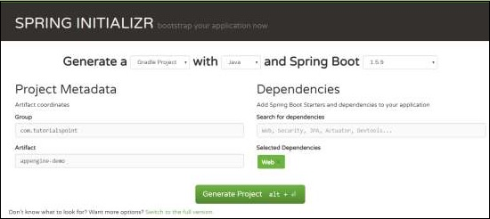

Now, in build.gradle file, add the Google Cloud appengine plugin and appengine classpath dependency.

The code for build.gradle file is given below −

```
buildscript {
   ext {
      springBootVersion = '1.5.9.RELEASE'
   }
   repositories {
      mavenCentral()
   }
   dependencies {
      classpath("org.springframework.boot:spring-boot-gradle-plugin:${springBootVersion}")
      classpath 'com.google.cloud.tools:appengine-gradle-plugin:1.3.3'
   }
}

apply plugin: 'java'
apply plugin: 'eclipse'
apply plugin: 'org.springframework.boot'
apply plugin: 'com.google.cloud.tools.appengine'

group = 'com.tutorialspoint'
version = '0.0.1-SNAPSHOT'
sourceCompatibility = 1.8

repositories {
   mavenCentral()
}
dependencies {
   compile('org.springframework.boot:spring-boot-starter-web')
   testCompile('org.springframework.boot:spring-boot-starter-test')
}
```
Now, write a simple HTTP Endpoint and it returns the String success as shown −

```
package com.tutorialspoint.appenginedemo;

import org.springframework.boot.SpringApplication;
import org.springframework.boot.autoconfigure.SpringBootApplication;
import org.springframework.web.bind.annotation.RequestMapping;
import org.springframework.web.bind.annotation.RestController;

@SpringBootApplication
@RestController
public class AppengineDemoApplication {
   public static void main(String[] args) {
      SpringApplication.run(AppengineDemoApplication.class, args);
   }
   @RequestMapping(value = "/")
   public String success() {
      return "APP Engine deployment success";
   }
}
```
Next, add the app.yml file under src/main/appengine directory as shown −

```
runtime: java
env: flex

handlers:
- url: /.*
   script: this field is required, but ignored
```
Now, go to the Google Cloud console and click the Activate Google cloud shell at the top of the page.


Now, move your source files and Gradle file into home directory of your google cloud machine by using google cloud shell.

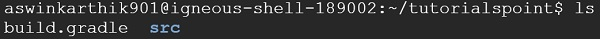

Now, execute the command gradle appengineDeploy and it will deploy your application into the Google Cloud appengine.

**Note** − GCP should be billing enabled and before deploying your application into appengine, you should create appengine platform in GCP.

It will take few minutes to deploy your application into GCP appengine platform.

After build successful you can see the Service URL in console window.


Now, hit the service URL and see the output.


## Google Cloud SQL
To connect the Google Cloud SQL into your Spring Boot application, you should add the following properties into your application.properties file.

### JDBC URL Format
```
jdbc:mysql://google/<DATABASE-NAME>?cloudSqlInstance = <GOOGLE_CLOUD_SQL_INSTANCE_NAME> &socketFactory = com.google.cloud.sql.mysql.SocketFactory&user = <USERNAME>&password = <PASSWORD>
```
**Note** − The Spring Boot application and Google Cloud SQL should be in same GCP project.

The application.properties file is given below.

```
spring.dbProductService.driverClassName = com.mysql.jdbc.Driver
spring.dbProductService.url = jdbc:mysql://google/PRODUCTSERVICE?cloudSqlInstance = springboot-gcp-cloudsql:asia-northeast1:springboot-gcp-cloudsql-instance&socketFactory = com.google.cloud.sql.mysql.SocketFactory&user = root&password = rootspring.dbProductService.username = root

spring.dbProductService.password = root
spring.dbProductService.testOnBorrow = true
spring.dbProductService.testWhileIdle = true
spring.dbProductService.timeBetweenEvictionRunsMillis = 60000
spring.dbProductService.minEvictableIdleTimeMillis = 30000
spring.dbProductService.validationQuery = SELECT 1
spring.dbProductService.max-active = 15
spring.dbProductService.max-idle = 10
spring.dbProductService.max-wait = 8000
```
YAML file users can add the below properties to your application.yml file.

```
spring:
   datasource: 
      driverClassName: com.mysql.jdbc.Driver
      url: "jdbc:mysql://google/PRODUCTSERVICE?cloudSqlInstance=springboot-gcp-cloudsql:asia-northeast1:springboot-gcp-cloudsql-instance&socketFactory=com.google.cloud.sql.mysql.SocketFactory&user=root&password=root"
      password: "root"
      username: "root"
      testOnBorrow: true
      testWhileIdle: true
      validationQuery: SELECT 1
      
      max-active: 15
      max-idle: 10
      max-wait: 8000
```
# Spring Boot - Google OAuth2 Sign-In
In this chapter, we are going to see how to add the Google OAuth2 Sign-In by using Spring Boot application with Gradle build.

First, add the Spring Boot OAuth2 security dependency in your build configuration file and your build configuration file is given below.

```
buildscript {
   ext {
      springBootVersion = '1.5.8.RELEASE'
   }
   repositories {
      mavenCentral()
   }
   dependencies {
      classpath("org.springframework.boot:spring-boot-gradle-plugin:${springBootVersion}")
   }
}

apply plugin: 'java'
apply plugin: 'eclipse'
apply plugin: 'org.springframework.boot'

group = 'com.tutorialspoint.projects'
version = '0.0.1-SNAPSHOT'
sourceCompatibility = 1.8

repositories {
   mavenCentral()
}
dependencies {
   compile('org.springframework.boot:spring-boot-starter')
   testCompile('org.springframework.boot:spring-boot-starter-test')
   compile('org.springframework.security.oauth:spring-security-oauth2')
   compile('org.springframework.boot:spring-boot-starter-web')
   testCompile('org.springframework.boot:spring-boot-starter-test')
}
```
Now, add the HTTP Endpoint to read the User Principal from the Google after authenticating via Spring Boot in main Spring Boot application class file as given below −

```
package com.tutorialspoint.projects.googleservice;

import java.security.Principal;

import org.springframework.boot.SpringApplication;
import org.springframework.boot.autoconfigure.SpringBootApplication;
import org.springframework.web.bind.annotation.RequestMapping;
import org.springframework.web.bind.annotation.RestController;

@SpringBootApplication
@RestController
public class GoogleserviceApplication {
   public static void main(String[] args) {
      SpringApplication.run(GoogleserviceApplication.class, args);
   }
   @RequestMapping(value = "/user")
   public Principal user(Principal principal) {
      return principal;
   }
}
```
Now, write a Configuration file to enable the OAuth2SSO for web security and remove the authentication for index.html file as shown −

```
package com.tutorialspoint.projects.googleservice;

import org.springframework.boot.autoconfigure.security.oauth2.client.EnableOAuth2Sso;
import org.springframework.context.annotation.Configuration;
import org.springframework.security.config.annotation.web.builders.HttpSecurity;
import org.springframework.security.config.annotation.web.configuration.WebSecurityConfigurerAdapter;

@Configuration
@EnableOAuth2Sso
public class WebSecurityConfiguration extends WebSecurityConfigurerAdapter {
   @Override
   protected void configure(HttpSecurity http) throws Exception {
      http
         .csrf()
         .disable()
         .antMatcher("/**")
         .authorizeRequests()
         .antMatchers("/", "/index.html")
         .permitAll()
         .anyRequest()
         .authenticated();
   }
}
```
Next, add the index.html file under static resources and add the link to redirect into user HTTP Endpoint to read the Google user Principal as shown below −

```
<!DOCTYPE html>
<html>
   <head>
      <meta charset = "ISO-8859-1">
      <title>Insert title here</title>
   </head>
   <body>
      <a href = "user">Click here to Google Login</a>
   </body>
</html>
```
**Note** − In Google Cloud console - Enable the Gmail Services, Analytics Services and Google+ service API(s).

Then, go the Credentials section and create a credentials and choose OAuth Client ID.

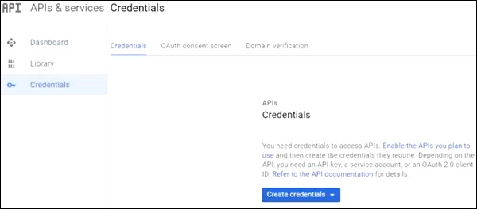

Next, provide a Product Name in OAuth2 consent screen.

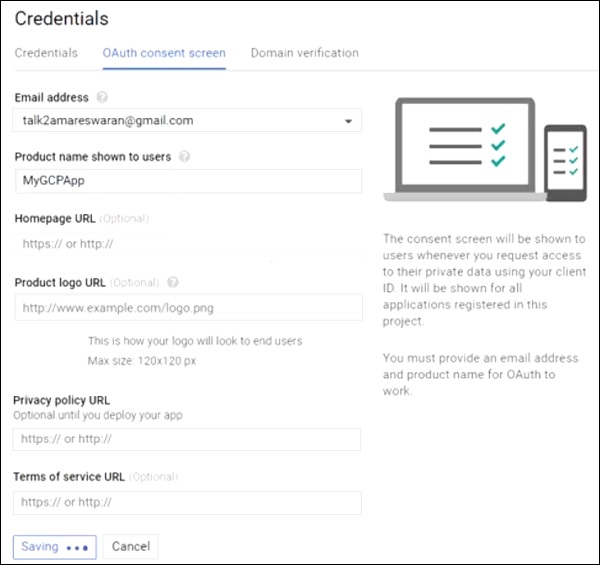

Next, choose the Application Type as “Web application”, provide the Authorized JavaScript origins and Authorized redirect URIs.

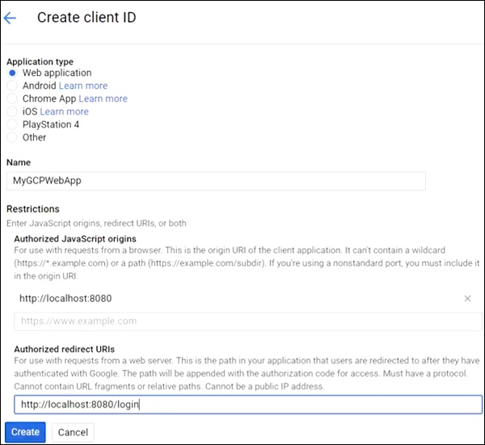

Now, your OAuth2 Client Id and Client Secret is created.

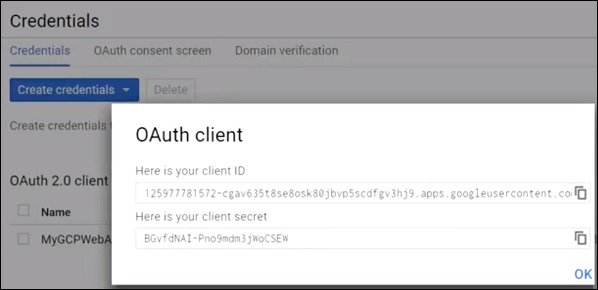

Next, add the Client Id and Client Secret in your application properties file.

```
security.oauth2.client.clientId = <CLIENT_ID>
security.oauth2.client.clientSecret = <CLIENT_SECRET>
security.oauth2.client.accessTokenUri  =  https://www.googleapis.com/oauth2/v3/token
security.oauth2.client.userAuthorizationUri  =  https://accounts.google.com/o/oauth2/auth
security.oauth2.client.tokenName = oauth_token
security.oauth2.client.authenticationScheme = query
security.oauth2.client.clientAuthenticationScheme = form
security.oauth2.client.scope = profile email

security.oauth2.resource.userInfoUri  =  https://www.googleapis.com/userinfo/v2/me
security.oauth2.resource.preferTokenInfo = false
```
Now, you can create an executable JAR file, and run the Spring Boot application by using the following Gradle command.

For Gradle, you can use the command as shown −

```
gradle clean build
```
After “BUILD SUCCESSFUL”, you can find the JAR file under the build/libs directory.

Run the JAR file by using the command java –jar &lt;JARFILE&gt; and application is started on the Tomcat port 8080.

Now hit the URL **http://localhost:8080/** and click the Google Login link.


It will redirect to the Google login screen and provide a Gmail login details.


If login success, we will receive the Principal object of the Gmail user.


[Previous Page](../spring_boot/spring_boot_google_oauth2_sign_in.md) [Next Page](../spring_boot/spring_boot_useful_resources.md) 
