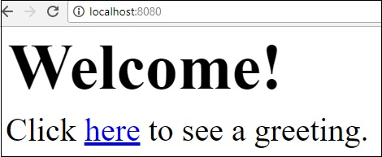
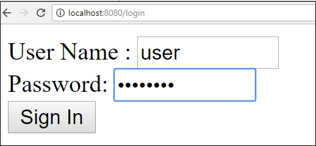
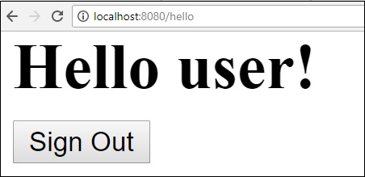
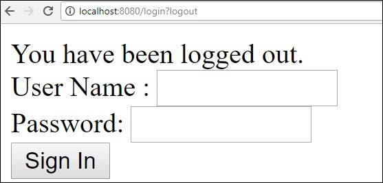
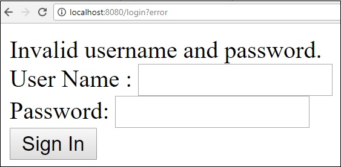

# Spring Boot - Securing Web Applications
If a Spring Boot Security dependency is added on the classpath, Spring Boot application automatically requires the Basic Authentication for all HTTP Endpoints. The Endpoint “/” and “/home” does not require any authentication. All other Endpoints require authentication.

For adding a Spring Boot Security to your Spring Boot application, we need to add the Spring Boot Starter Security dependency in our build configuration file.

Maven users can add the following dependency in the pom.xml file.

```
<dependency>
   <groupId>org.springframework.boot</groupId>
   <artifactId>spring-boot-starter-security</artifactId>
</dependency>
```
Gradle users can add the following dependency in the build.gradle file.

```
compile("org.springframework.boot:spring-boot-starter-security")
```
## Securing a Web application
First, create an unsecure web application by using Thymeleaf templates.

Then, create a home.html file under **src/main/resources/templates** directory.

```
<!DOCTYPE html>
<html xmlns = "http://www.w3.org/1999/xhtml" 
   xmlns:th = "http://www.thymeleaf.org" 
   xmlns:sec = "http://www.thymeleaf.org/thymeleaf-extras-springsecurity3">
   
   <head>
      <title>Spring Security Example</title>
   </head>
   <body>
      <h1>Welcome!</h1>
      <p>Click <a th:href = "@{/hello}">here</a> to see a greeting.</p>
   </body>
   
</html>
```
The simple view **/hello** defined in the HTML file by using Thymeleaf templates.

Now, create a hello.html under **src/main/resources/templates** directory.

```
<!DOCTYPE html>
<html xmlns = "http://www.w3.org/1999/xhtml" 
   xmlns:th = "http://www.thymeleaf.org" 
   xmlns:sec = "http://www.thymeleaf.org/thymeleaf-extras-springsecurity3">
   
   <head>
      <title>Hello World!</title>
   </head>
   <body>
      <h1>Hello world!</h1>
   </body>
   
</html>
```
Now, we need to setup the Spring MVC – View controller for home and hello views.

For this, create a MVC configuration file that extends WebMvcConfigurerAdapter.

```
package com.tutorialspoint.websecuritydemo;

import org.springframework.context.annotation.Configuration;
import org.springframework.web.servlet.config.annotation.ViewControllerRegistry;
import org.springframework.web.servlet.config.annotation.WebMvcConfigurerAdapter;

@Configuration
public class MvcConfig extends WebMvcConfigurerAdapter {
   @Override
   public void addViewControllers(ViewControllerRegistry registry) {
      registry.addViewController("/home").setViewName("home");
      registry.addViewController("/").setViewName("home");
      registry.addViewController("/hello").setViewName("hello");
      registry.addViewController("/login").setViewName("login");
   }
}
```
Now, add the Spring Boot Starter security dependency to your build configuration file.

Maven users can add the following dependency in your pom.xml file.

```
<dependency>
   <groupId>org.springframework.boot</groupId>
   <artifactId>spring-boot-starter-security</artifactId>
</dependency>
```
Gradle users can add the following dependency in the build.gradle file.

```
compile("org.springframework.boot:spring-boot-starter-security")
```
Now, create a Web Security Configuration file, that is used to secure your application to access the HTTP Endpoints by using basic authentication.

```
package com.tutorialspoint.websecuritydemo;

import org.springframework.beans.factory.annotation.Autowired;
import org.springframework.context.annotation.Configuration;
import org.springframework.security.config.annotation.authentication.builders.AuthenticationManagerBuilder;
import org.springframework.security.config.annotation.web.builders.HttpSecurity;
import org.springframework.security.config.annotation.web.configuration.WebSecurityConfigurerAdapter;
import org.springframework.security.config.annotation.web.configuration.EnableWebSecurity;

@Configuration
@EnableWebSecurity
public class WebSecurityConfig extends WebSecurityConfigurerAdapter {
   @Override
   protected void configure(HttpSecurity http) throws Exception {
      http
         .authorizeRequests()
            .antMatchers("/", "/home").permitAll()
            .anyRequest().authenticated()
            .and()
         .formLogin()
            .loginPage("/login")
            .permitAll()
            .and()
            .logout()
            .permitAll();
   }
   @Autowired
   public void configureGlobal(AuthenticationManagerBuilder auth) throws Exception {
      auth
         .inMemoryAuthentication()
         .withUser("user").password("password").roles("USER");
   }
}
```
Now, create a login.html file under the **src/main/resources** directory to allow the user to access the HTTP Endpoint via login screen.

```
<!DOCTYPE html>
<html xmlns = "http://www.w3.org/1999/xhtml" xmlns:th = "http://www.thymeleaf.org"
   xmlns:sec = "http://www.thymeleaf.org/thymeleaf-extras-springsecurity3">
   
   <head>
      <title>Spring Security Example </title>
   </head>
   <body>
      <div th:if = "${param.error}">
         Invalid username and password.
      </div>
      <div th:if = "${param.logout}">
         You have been logged out.
      </div>
      
      <form th:action = "@{/login}" method = "post">
         <div>
            <label> User Name : <input type = "text" name = "username"/> </label>
         </div>
         <div>
            <label> Password: <input type = "password" name = "password"/> </label>
         </div>
         <div>
            <input type = "submit" value = "Sign In"/>
         </div>
      </form>
      
   </body>
</html>
```
Finally, update the hello.html file – to allow the user to Sign-out from the application and display the current username as shown below −

```
<!DOCTYPE html>
<html xmlns = "http://www.w3.org/1999/xhtml" xmlns:th = "http://www.thymeleaf.org" 
   xmlns:sec = "http://www.thymeleaf.org/thymeleaf-extras-springsecurity3">
   
   <head>
      <title>Hello World!</title>
   </head>
   <body>
      <h1 th:inline = "text">Hello [[${#httpServletRequest.remoteUser}]]!</h1>
      <form th:action = "@{/logout}" method = "post">
         <input type = "submit" value = "Sign Out"/>
      </form>
   </body>
   
</html>
```
The code for main Spring Boot application is given below −

```
package com.tutorialspoint.websecuritydemo;

import org.springframework.boot.SpringApplication;
import org.springframework.boot.autoconfigure.SpringBootApplication;

@SpringBootApplication
public class WebsecurityDemoApplication {
   public static void main(String[] args) {
      SpringApplication.run(WebsecurityDemoApplication.class, args);
   }
}
```
The complete code for build configuration file is given below.

**Maven – pom.xml**

```
<?xml version  =  "1.0" encoding  =  "UTF-8"?>
<project xmlns = "http://maven.apache.org/POM/4.0.0" 
   xmlns:xsi = "http://www.w3.org/2001/XMLSchema-instance"
   xsi:schemaLocation = "http://maven.apache.org/POM/4.0.0 
   http://maven.apache.org/xsd/maven-4.0.0.xsd">
   
   <modelVersion>4.0.0</modelVersion>
   <groupId>com.tutorialspoint</groupId>
   <artifactId>websecurity-demo</artifactId>
   <version>0.0.1-SNAPSHOT</version>
   <packaging>jar</packaging>
   <name>websecurity-demo</name>
   <description>Demo project for Spring Boot</description>

   <parent>
      <groupId>org.springframework.boot</groupId>
      <artifactId>spring-boot-starter-parent</artifactId>
      <version>1.5.9.RELEASE</version>
      <relativePath/> <!-- lookup parent from repository -->
   </parent>

   <properties>
      <project.build.sourceEncoding>UTF-8</project.build.sourceEncoding>
      <project.reporting.outputEncoding>UTF-8</project.reporting.outputEncoding>
      <java.version>1.8</java.version>
   </properties>

   <dependencies>
      <dependency>
         <groupId>org.springframework.boot</groupId>
         <artifactId>spring-boot-starter-security</artifactId>
      </dependency>
      
      <dependency>
         <groupId>org.springframework.boot</groupId>
         <artifactId>spring-boot-starter-thymeleaf</artifactId>
      </dependency>
      
      <dependency>
         <groupId>org.springframework.boot</groupId>
         <artifactId>spring-boot-starter-web</artifactId>
      </dependency>

      <dependency>
         <groupId>org.springframework.boot</groupId>
         <artifactId>spring-boot-starter-test</artifactId>
         <scope>test</scope>
      </dependency>
      
      <dependency>
         <groupId>org.springframework.security</groupId>
         <artifactId>spring-security-test</artifactId>
         <scope>test</scope>
      </dependency>
   </dependencies>

   <build>
      <plugins>
         <plugin>
            <groupId>org.springframework.boot</groupId>
            <artifactId>spring-boot-maven-plugin</artifactId>
         </plugin>
      </plugins>
   </build>
   
</project>
```
**Gradle – build.gradle**

```
buildscript {
   ext {
      springBootVersion = '1.5.9.RELEASE'
   }
   repositories {
      mavenCentral()
   }
   dependencies {
      classpath("org.springframework.boot:spring-boot-gradle-plugin:${springBootVersion}")
   }
}

apply plugin: 'java'
apply plugin: 'eclipse'
apply plugin: 'org.springframework.boot'

group = 'com.tutorialspoint'
version = '0.0.1-SNAPSHOT'
sourceCompatibility = 1.8

repositories {
   mavenCentral()
}
dependencies {
   compile('org.springframework.boot:spring-boot-starter-security')
   compile('org.springframework.boot:spring-boot-starter-thymeleaf')
   compile('org.springframework.boot:spring-boot-starter-web')
   
   testCompile('org.springframework.boot:spring-boot-starter-test')
   testCompile('org.springframework.security:spring-security-test')
}
```
Now, create an executable JAR file, and run the Spring Boot application by using the following Maven or Gradle commands.

Maven users can use the command as given below −

```
mvn clean install
```
After “BUILD SUCCESS”, you can find the JAR file under target directory.

Gradle users can use the command as shown −

```
gradle clean build
```
After “BUILD SUCCESSFUL”, you can find the JAR file under the build/libs directory.

Now, run the JAR file by using the command shown below −

```
java –jar <JARFILE>
```
Hit the URL **http://localhost:8080/** in your web browser. You can see the output as shown.
















[Previous Page](../spring_boot/spring_boot_database_handling.md) [Next Page](../spring_boot/spring_boot_oauth2_with_jwt.md) 
