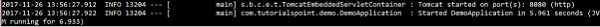
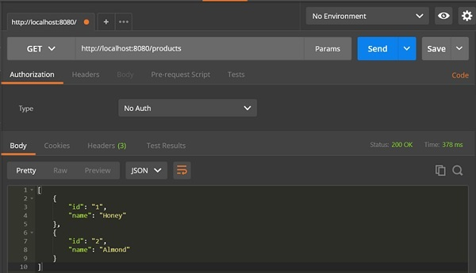
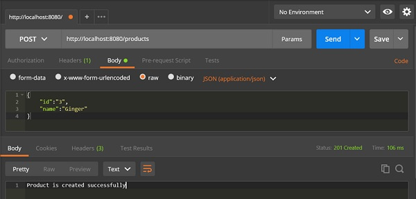
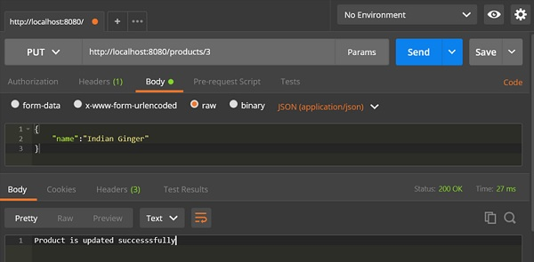
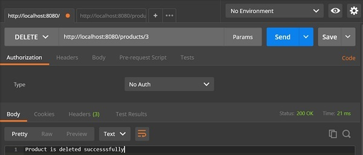

# Spring Boot - Service Components
Service Components are the class file which contains @Service annotation. These class files are used to write business logic in a different layer, separated from @RestController class file. The logic for creating a service component class file is shown here −

```
public interface ProductService {
}
```
The class that implements the Interface with @Service annotation is as shown −

```
@Service
public class ProductServiceImpl implements ProductService {
}
```
Observe that in this tutorial, we are using **Product Service API(s)** to store, retrieve, update and delete the products. We wrote the business logic in @RestController class file itself. Now, we are going to move the business logic code from controller to service component.

You can create an Interface which contains add, edit, get and delete methods using the code as shown below −

```
package com.tutorialspoint.demo.service;

import java.util.Collection;
import com.tutorialspoint.demo.model.Product;

public interface ProductService {
   public abstract void createProduct(Product product);
   public abstract void updateProduct(String id, Product product);
   public abstract void deleteProduct(String id);
   public abstract Collection<Product> getProducts();
}
```
The following code will let you to create a class which implements the ProductService interface with @Service annotation and write the business logic to store, retrieve, delete and updates the product.

```
package com.tutorialspoint.demo.service;

import java.util.Collection;
import java.util.HashMap;
import java.util.Map;
import org.springframework.stereotype.Service;
import com.tutorialspoint.demo.model.Product;

@Service
public class ProductServiceImpl implements ProductService {
   private static Map<String, Product> productRepo = new HashMap<>();
   static {
      Product honey = new Product();
      honey.setId("1");
      honey.setName("Honey");
      productRepo.put(honey.getId(), honey);

      Product almond = new Product();
      almond.setId("2");
      almond.setName("Almond");
      productRepo.put(almond.getId(), almond);
   }
   @Override
   public void createProduct(Product product) {
      productRepo.put(product.getId(), product);
   }
   @Override
   public void updateProduct(String id, Product product) {
      productRepo.remove(id);
      product.setId(id);
      productRepo.put(id, product);
   }
   @Override
   public void deleteProduct(String id) {
      productRepo.remove(id);

   }
   @Override
   public Collection<Product> getProducts() {
      return productRepo.values();
   }
}
```
The code here show the Rest Controller class file, here we @Autowired the ProductService interface and called the methods.

```
package com.tutorialspoint.demo.controller;

import org.springframework.beans.factory.annotation.Autowired;
import org.springframework.http.HttpStatus;
import org.springframework.http.ResponseEntity;
import org.springframework.web.bind.annotation.PathVariable;
import org.springframework.web.bind.annotation.RequestBody;
import org.springframework.web.bind.annotation.RequestMapping;
import org.springframework.web.bind.annotation.RequestMethod;
import org.springframework.web.bind.annotation.RestController;

import com.tutorialspoint.demo.model.Product;
import com.tutorialspoint.demo.service.ProductService;

@RestController
public class ProductServiceController {
   @Autowired
   ProductService productService;

   @RequestMapping(value = "/products")
   public ResponseEntity<Object> getProduct() {
      return new ResponseEntity<>(productService.getProducts(), HttpStatus.OK);
   }
   @RequestMapping(value = "/products/{id}", method = RequestMethod.PUT)
   public ResponseEntity<Object> 
      updateProduct(@PathVariable("id") String id, @RequestBody Product product) {
      
      productService.updateProduct(id, product);
      return new ResponseEntity<>("Product is updated successsfully", HttpStatus.OK);
   }
   @RequestMapping(value = "/products/{id}", method = RequestMethod.DELETE)
   public ResponseEntity<Object> delete(@PathVariable("id") String id) {
      productService.deleteProduct(id);
      return new ResponseEntity<>("Product is deleted successsfully", HttpStatus.OK);
   }
   @RequestMapping(value = "/products", method = RequestMethod.POST)
   public ResponseEntity<Object> createProduct(@RequestBody Product product) {
      productService.createProduct(product);
      return new ResponseEntity<>("Product is created successfully", HttpStatus.CREATED);
   }
}
```
The code for POJO class – Product.java is shown here −

```
package com.tutorialspoint.demo.model;

public class Product {
   private String id;
   private String name;

   public String getId() {
      return id;
   }
   public void setId(String id) {
      this.id = id;
   }
   public String getName() {
      return name;
   }
   public void setName(String name) {
      this.name = name;
   }
}
```
A main Spring Boot application is given below −

```
package com.tutorialspoint.demo;

import org.springframework.boot.SpringApplication;
import org.springframework.boot.autoconfigure.SpringBootApplication;

@SpringBootApplication
public class DemoApplication {
   public static void main(String[] args) {
      SpringApplication.run(DemoApplication.class, args);
   }
}
```
The code for Maven build – pom.xml is shown below −

```
<?xml version = "1.0" encoding = "UTF-8"?>
<project xmlns = "http://maven.apache.org/POM/4.0.0" 
   xmlns:xsi = "http://www.w3.org/2001/XMLSchema-instance"
   xsi:schemaLocation = "http://maven.apache.org/POM/4.0.0 
   http://maven.apache.org/xsd/maven-4.0.0.xsd">
   
   <modelVersion>4.0.0</modelVersion>
   <groupId>com.tutorialspoint</groupId>
   <artifactId>demo</artifactId>
   <version>0.0.1-SNAPSHOT</version>
   <packaging>jar</packaging>
   <name>demo</name>
   <description>Demo project for Spring Boot</description>

   <parent>
      <groupId>org.springframework.boot</groupId>
      <artifactId>spring-boot-starter-parent</artifactId>
      <version>1.5.8.RELEASE</version>
      <relativePath/> 
   </parent>

   <properties>
      <project.build.sourceEncoding>UTF-8</project.build.sourceEncoding>
      <project.reporting.outputEncoding>UTF-8</project.reporting.outputEncoding>
      <java.version>1.8</java.version>
   </properties>

   <dependencies>
      <dependency>
         <groupId>org.springframework.boot</groupId>
         <artifactId>spring-boot-starter-web</artifactId>
      </dependency>

      <dependency>
         <groupId>org.springframework.boot</groupId>
         <artifactId>spring-boot-starter-test</artifactId>
         <scope>test</scope>
      </dependency>
   </dependencies>

   <build>
      <plugins>
         <plugin>
            <groupId>org.springframework.boot</groupId>
            <artifactId>spring-boot-maven-plugin</artifactId>
         </plugin>
      </plugins>
   </build>

</project>
```
The code for Gradle Build – build.gradle is shown below −

```
buildscript {
   ext {
      springBootVersion = '1.5.8.RELEASE'
   }
   repositories {
      mavenCentral()
   }
   dependencies {
      classpath("org.springframework.boot:spring-boot-gradle-plugin:${springBootVersion}")
   }
}

apply plugin: 'java'
apply plugin: 'eclipse'
apply plugin: 'org.springframework.boot'

group = 'com.tutorialspoint'
version = '0.0.1-SNAPSHOT'
sourceCompatibility = 1.8

repositories {
   mavenCentral()
}
dependencies {
   compile('org.springframework.boot:spring-boot-starter-web')
   testCompile('org.springframework.boot:spring-boot-starter-test')
}
```
You can create an executable JAR file, and run the Spring Boot application by using the Maven or Gradle commands given below −

For Maven, use the command as shown below −

```
mvn clean install
```
After “BUILD SUCCESS”, you can find the JAR file under the target directory.

For Gradle, you can use the command as shown below −

```
gradle clean build
```
After “BUILD SUCCESSFUL”, you can find the JAR file under build/libs directory.

Run the JAR file by using the command given below −

```
java –jar <JARFILE>
```
Now, the application has started on the Tomcat port 8080 as shown in the image given below −



Now hit the below URL’s in POSTMAN application and you can see the output as shown below −

GET API URL is − **http://localhost:8080/products**



POST API URL is − **http://localhost:8080/products**



PUT API URL is − **http://localhost:8080/products/3**



DELETE API URL is − **http://localhost:8080/products/3**




[Previous Page](../spring_boot/spring_boot_file_handling.md) [Next Page](../spring_boot/spring_boot_thymeleaf.md) 
