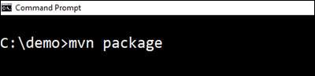
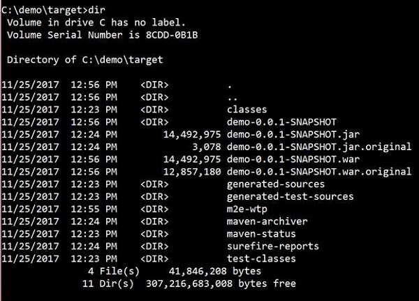
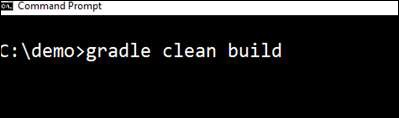
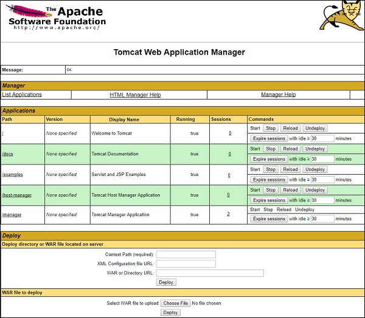
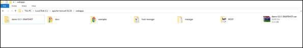
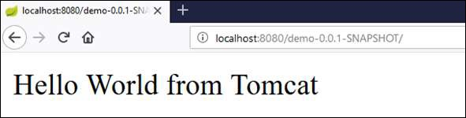

# Spring Boot - Tomcat Deployment
By using Spring Boot application, we can create a war file to deploy into the web server. In this chapter, you are going to learn how to create a WAR file and deploy the Spring Boot application in Tomcat web server.

## Spring Boot Servlet Initializer
The traditional way of deployment is making the Spring Boot Application **@SpringBootApplication** class extend the **SpringBootServletInitializer** class. Spring Boot Servlet Initializer class file allows you to configure the application when it is launched by using Servlet Container.

The code for Spring Boot Application class file for JAR file deployment is given below −

```
package com.tutorialspoint.demo;

import org.springframework.boot.SpringApplication;
import org.springframework.boot.autoconfigure.SpringBootApplication;

@SpringBootApplication
public class DemoApplication {
   public static void main(String[] args) {
      SpringApplication.run(DemoApplication.class, args);
   }
}
```
We need to extend the class **SpringBootServletInitializer** to support WAR file deployment. The code of Spring Boot Application class file is given below −

```
package com.tutorialspoint.demo;

import org.springframework.boot.SpringApplication;
import org.springframework.boot.autoconfigure.SpringBootApplication;
import org.springframework.boot.builder.SpringApplicationBuilder;
import org.springframework.boot.web.support.SpringBootServletInitializer;

@SpringBootApplication
public class DemoApplication  extends SpringBootServletInitializer {
   @Override
   protected SpringApplicationBuilder configure(SpringApplicationBuilder application) {
      return application.sources(DemoApplication.class);
   }
   public static void main(String[] args) {
      SpringApplication.run(DemoApplication.class, args);
   }
}
```
## Setting Main Class
In Spring Boot, we need to mention the main class that should start in the build file. For this purpose, you can use the following pieces of code −

For Maven, add the start class in **pom.xml** properties as shown below −

```
<start-class>com.tutorialspoint.demo.DemoApplication</start-class>
```
For Gradle, add the main class name in build.gradle as shown below −

```
mainClassName="com.tutorialspoint.demo.DemoApplication"
```
## Update packaging JAR into WAR
We have to update the packaging JAR into WAR using the following pieces of code −

For Maven, add the packaging as WAR in **pom.xml** as shown below −

```
<packaging>war</packaging>
```
For Gradle, add the application plugin and war plugin in the **build.gradle** as shown below −

```
apply plugin: ‘war’
apply plugin: ‘application’
```
Now, let us write a simple Rest Endpoint to return the string “Hello World from Tomcat”. To write a Rest Endpoint, we need to add the Spring Boot web starter dependency into our build file.

For Maven, add the Spring Boot starter dependency in pom.xml using the code as shown below −

```
<dependency>
   <groupId>org.springframework.boot</groupId>
   <artifactId>spring-boot-starter-web</artifactId>
</dependency>
```
For Gradle, add the Spring Boot starter dependency in **build.gradle** using the code as shown below −

```
dependencies {
   compile('org.springframework.boot:spring-boot-starter-web')
}
```
Now, write a simple Rest Endpoint in Spring Boot Application class file using the code as shown below −

```
package com.tutorialspoint.demo;

import org.springframework.boot.SpringApplication;
import org.springframework.boot.autoconfigure.SpringBootApplication;
import org.springframework.boot.builder.SpringApplicationBuilder;
import org.springframework.boot.web.support.SpringBootServletInitializer;
import org.springframework.web.bind.annotation.RequestMapping;
import org.springframework.web.bind.annotation.RestController;

@SpringBootApplication
@RestController
public class DemoApplication  extends SpringBootServletInitializer {
   @Override
   protected SpringApplicationBuilder configure(SpringApplicationBuilder application) {
      return application.sources(DemoApplication.class);
   }
   public static void main(String[] args) {
      SpringApplication.run(DemoApplication.class, args);
   }
   
   @RequestMapping(value = "/")
   public String hello() {
      return "Hello World from Tomcat";
   }
}
```
## Packaging your Application
Now, create a WAR file to deploy into the Tomcat server by using Maven and Gradle commands for packaging your application as given below −

For Maven, use the command **mvn package** for packaging your application. Then, the WAR file will be created and you can find it in the target directory as shown in the screenshots given below −






For Gradle, use the command **gradle clean build** for packaging your application. Then, your WAR file will be created and you can find it under **build/libs** directory. Observe the screenshots given here for a better understanding −




## Deploy into Tomcat
Now, run the Tomcat Server, and deploy the WAR file under the **webapps** directory. Observe the screenshots shown here for a better understanding −






After successful deployment, hit the URL in your web browser **http://localhost:8080/demo-0.0.1-SNAPSHOT/** and observe that the output will look as shown in the screenshot given below −



The full code for this purpose is given below.

**pom.xml**

```
<?xml version = "1.0" encoding = "UTF-8"?>
<project xmlns = "http://maven.apache.org/POM/4.0.0" 
   xmlns:xsi = "http://www.w3.org/2001/XMLSchema-instance"

xsi:schemaLocation = "http://maven.apache.org/POM/4.0.0 http://maven.apache.org/xsd/maven-4.0.0.xsd">
<modelVersion>4.0.0</modelVersion>

   <groupId>com.tutorialspoint</groupId>
   <artifactId>demo</artifactId>
   <version>0.0.1-SNAPSHOT</version>
   <packaging>war</packaging>
   <name>demo</name>
   <description>Demo project for Spring Boot</description>
   
   <parent>
      <groupId>org.springframework.boot</groupId>
      <artifactId>spring-boot-starter-parent</artifactId>
      <version>1.5.8.RELEASE</version>
      <relativePath/> <!-- lookup parent from repository -->
   </parent>

   <properties>
      <project.build.sourceEncoding>UTF-8</project.build.sourceEncoding>
      <project.reporting.outputEncoding>UTF-8</project.reporting.outputEncoding>
      <java.version>1.8</java.version>
      <start-class>com.tutorialspoint.demo.DemoApplication</start-class>
   </properties>

   <dependencies>
      <dependency>
         <groupId>org.springframework.boot</groupId>
         <artifactId>spring-boot-starter-web</artifactId>
      </dependency>
      <dependency>
         <groupId>org.springframework.boot</groupId>
         <artifactId>spring-boot-starter-test</artifactId>
         <scope>test</scope>
      </dependency>
   </dependencies>

   <build>
      <plugins>
         <plugin>
            <groupId>org.springframework.boot</groupId>
            <artifactId>spring-boot-maven-plugin</artifactId>
         </plugin>
      </plugins>
   </build>
   
</project>
```
**build.gradle**

```
buildscript {
   ext {
      springBootVersion = '1.5.8.RELEASE'
   }
   repositories {
      mavenCentral()
   }
dependencies {
      classpath("org.springframework.boot:spring-boot-gradle-plugin:${springBootVersion}")
   }
}

apply plugin: 'java'
apply plugin: 'eclipse'
apply plugin: 'org.springframework.boot'
apply plugin: 'war'
apply plugin: 'application'

group = 'com.tutorialspoint'
version = '0.0.1-SNAPSHOT'
sourceCompatibility = 1.8
mainClassName = "com.tutorialspoint.demo.DemoApplication"

repositories {
   mavenCentral()
}
dependencies {
   compile('org.springframework.boot:spring-boot-starter-web')
   testCompile('org.springframework.boot:spring-boot-starter-test')
}
```
The code for main Spring Boot application class file is given below −

```
package com.tutorialspoint.demo;

import org.springframework.boot.SpringApplication;
import org.springframework.boot.autoconfigure.SpringBootApplication;
import org.springframework.boot.builder.SpringApplicationBuilder;
import org.springframework.boot.web.support.SpringBootServletInitializer;
import org.springframework.web.bind.annotation.RequestMapping;
import org.springframework.web.bind.annotation.RestController;

@SpringBootApplication
@RestController
public class DemoApplication  extends SpringBootServletInitializer {
   @Override
   protected SpringApplicationBuilder configure(SpringApplicationBuilder application) {
      return application.sources(DemoApplication.class);
   }
   public static void main(String[] args) {
      SpringApplication.run(DemoApplication.class, args);
   }
   
   @RequestMapping(value = "/")
   public String hello() {
      return "Hello World from Tomcat";
   }
}
```

[Previous Page](../spring_boot/spring_boot_bootstrapping.md) [Next Page](../spring_boot/spring_boot_build_systems.md) 
