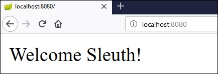
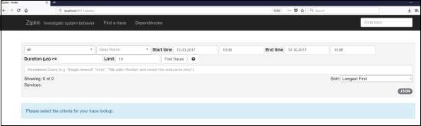

# Spring Boot - Tracing Micro Service Logs
Most developers face difficulty of tracing logs if any issue occurred. This can be solved by Spring Cloud Sleuth and ZipKin server for Spring Boot application.

## Spring Cloud Sleuth
Spring cloud Sleuth logs are printed in the following format −

```
[application-name,traceid,spanid,zipkin-export]
```
Where,

   * Application-name = Name of the application
   * Traceid = each request and response traceid is same when calling same service or one service to another service.
   * Spanid = Span Id is printed along with Trace Id. Span Id is different every request and response calling one service to another service.
   * Zipkin-export = By default it is false. If it is true, logs will be exported to the Zipkin server.

Now, add the Spring Cloud Starter Sleuth dependency in your build configuration file as follows −

Maven users can add the following dependency in your pom.xml file −

```
<dependency>
   <groupId>org.springframework.cloud</groupId>
   <artifactId>spring-cloud-starter-sleuth</artifactId>
</dependency>
```
Gradle users can add the following dependency in your build.gradle file −

```
compile('org.springframework.cloud:spring-cloud-starter-sleuth')
```
Now, add the Logs into your Spring Boot application Rest Controller class file as shown here −

```
package com.tutorialspoint.sleuthapp;

import java.util.logging.Level;
import java.util.logging.Logger;

import org.springframework.boot.SpringApplication;
import org.springframework.boot.autoconfigure.SpringBootApplication;
import org.springframework.web.bind.annotation.RequestMapping;
import org.springframework.web.bind.annotation.RestController;

@SpringBootApplication
@RestController
public class SleuthappApplication {
   private static final Logger LOG = Logger.getLogger(SleuthappApplication.class.getName());
   public static void main(String[] args) {
      SpringApplication.run(SleuthappApplication.class, args);
   }
   @RequestMapping("/")
   public String index() {
      LOG.log(Level.INFO, "Index API is calling");
      return "Welcome Sleuth!";
   }
}
```
Now, add the application name in application.properties file as shown −

```
spring.application.name = tracinglogs
```
The complete code for build configuration file is given below −

**Maven – pom.xml**

```
<?xml version = "1.0" encoding = "UTF-8"?>
<project xmlns = "http://maven.apache.org/POM/4.0.0" 
   xmlns:xsi = "http://www.w3.org/2001/XMLSchema-instance"
   xsi:schemaLocation = "http://maven.apache.org/POM/4.0.0 
   http://maven.apache.org/xsd/maven-4.0.0.xsd">
   
   <modelVersion>4.0.0</modelVersion>
   <groupId>com.tutorialspoint</groupId>
   <artifactId>sleuthapp</artifactId>
   <version>0.0.1-SNAPSHOT</version>
   <packaging>jar</packaging>

   <name>sleuthapp</name>
   <description>Demo project for Spring Boot</description>

   <parent>
      <groupId>org.springframework.boot</groupId>
      <artifactId>spring-boot-starter-parent</artifactId>
      <version>1.5.9.RELEASE</version>
      <relativePath/> <!-- lookup parent from repository -->
   </parent>

   <properties>
      <project.build.sourceEncoding>UTF-8</project.build.sourceEncoding>
      <project.reporting.outputEncoding>UTF-8</project.reporting.outputEncoding>
      <java.version>1.8</java.version>
      <spring-cloud.version>Edgware.RELEASE</spring-cloud.version>
   </properties>

   <dependencies>
      <dependency>
         <groupId>org.springframework.cloud</groupId>
         <artifactId>spring-cloud-starter-sleuth</artifactId>
      </dependency>
      <dependency>
         <groupId>org.springframework.boot</groupId>
         <artifactId>spring-boot-starter-web</artifactId>
      </dependency>
      <dependency>
         <groupId>org.springframework.boot</groupId>
         <artifactId>spring-boot-starter-test</artifactId>
         <scope>test</scope>
      </dependency>
   </dependencies>

   <dependencyManagement>
      <dependencies>
         <dependency>
            <groupId>org.springframework.cloud</groupId>
            <artifactId>spring-cloud-dependencies</artifactId>
            <version>${spring-cloud.version}</version>
            <type>pom</type>
            <scope>import</scope>
         </dependency>
      </dependencies>
   </dependencyManagement>

   <build>
      <plugins>
         <plugin>
            <groupId>org.springframework.boot</groupId>
            <artifactId>spring-boot-maven-plugin</artifactId>
         </plugin>
      </plugins>
   </build>
   
</project>
```
**Gradle – build.gradle**

```
buildscript {
   ext {
      springBootVersion = '1.5.9.RELEASE'
   }
   repositories {
      mavenCentral()
   }
   dependencies {
      classpath("org.springframework.boot:spring-boot-gradle-plugin:${springBootVersion}")
   }
}

apply plugin: 'java'
apply plugin: 'eclipse'
apply plugin: 'org.springframework.boot'

group = 'com.tutorialspoint'
version = '0.0.1-SNAPSHOT'
sourceCompatibility = 1.8

repositories {
   mavenCentral()
}
ext {
   springCloudVersion = 'Edgware.RELEASE'
}
dependencies {
   compile('org.springframework.cloud:spring-cloud-starter-sleuth')
   compile('org.springframework.boot:spring-boot-starter-web')
   testCompile('org.springframework.boot:spring-boot-starter-test')
}
dependencyManagement {
   imports {
      mavenBom "org.springframework.cloud:spring-cloud-dependencies:${springCloudVersion}"
   }
}
```
You can create an executable JAR file, and run the Spring Boot application by using the following Maven or Gradle commands.

For Maven, you can use the following command −

```
mvn clean install
```
After “BUILD SUCCESS”, you can find the JAR file under the target directory.

For Gradle, you can use the following command −

```
gradle clean build
```
After “BUILD SUCCESSFUL”, you can find the JAR file under the build/libs directory.

Now, run the JAR file by using the command shown here −

```
java –jar <JARFILE>
```
Now, the application has started on the Tomcat port 8080.


Now, hit the URL in your web browser and see the output in console log.

**http://localhost:8080/**



You can see the following logs in the console window. Observe that log is printed in the following format [application-name, traceid, spanid, zipkin-export]


## Zipkin Server
Zipkin is an application that monitors and manages the Spring Cloud Sleuth logs of your Spring Boot application. To build a Zipkin server, we need to add the Zipkin UI and Zipkin Server dependencies in our build configuration file.

Maven users can add the following dependency in your pom.xml file −

```
<dependency>
   <groupId>io.zipkin.java</groupId>
   <artifactId>zipkin-server</artifactId>
</dependency>
<dependency>
   <groupId>io.zipkin.java</groupId>
   <artifactId>zipkin-autoconfigure-ui</artifactId>
</dependency>
```
Gradle users can add the below dependency in your build.gradle file −

```
compile('io.zipkin.java:zipkin-autoconfigure-ui')
compile('io.zipkin.java:zipkin-server')
```
Now, configure the server.port = 9411 in application properties file.

For properties file users, add the below property in application.properties file.

```
server.port = 9411
```
For YAML users, add the below property in application.yml file.

```
server:
   port: 9411
```
Add the @EnableZipkinServer annotation in your main Spring Boot application class fie. The @EnableZipkinServer annotation is used to enable your application act as a Zipkin server.

```
package com.tutorialspoint.zipkinapp;

import org.springframework.boot.SpringApplication;
import org.springframework.boot.autoconfigure.SpringBootApplication;
import zipkin.server.EnableZipkinServer;

@SpringBootApplication
@EnableZipkinServer
public class ZipkinappApplication {
   public static void main(String[] args) {
      SpringApplication.run(ZipkinappApplication.class, args);
   }
}
```
The code for complete build configuration file is given below.

**Maven – pom.xml**

```
<?xml version = "1.0" encoding = "UTF-8"?>
<project xmlns = "http://maven.apache.org/POM/4.0.0" 
   xmlns:xsi = "http://www.w3.org/2001/XMLSchema-instance"
   xsi:schemaLocation = "http://maven.apache.org/POM/4.0.0 
   http://maven.apache.org/xsd/maven-4.0.0.xsd">
   
   <modelVersion>4.0.0</modelVersion>
   <groupId>com.tutorialspoint</groupId>
   <artifactId>zipkinapp</artifactId>
   <version>0.0.1-SNAPSHOT</version>
   <packaging>jar</packaging>
   <name>zipkinapp</name>
   <description>Demo project for Spring Boot</description>

   <parent>
      <groupId>org.springframework.boot</groupId>
      <artifactId>spring-boot-starter-parent</artifactId>
      <version>1.5.9.RELEASE</version>
      <relativePath /> <!-- lookup parent from repository -->
   </parent>

   <properties>
      <project.build.sourceEncoding>UTF-8</project.build.sourceEncoding>
      <project.reporting.outputEncoding>UTF-8</project.reporting.outputEncoding>
      <java.version>1.8</java.version>
      <spring-cloud.version>Edgware.RELEASE</spring-cloud.version>
   </properties>

   <dependencies>
      <dependency>
         <groupId>io.zipkin.java</groupId>
         <artifactId>zipkin-server</artifactId>
      </dependency>
      <dependency>
         <groupId>io.zipkin.java</groupId>
         <artifactId>zipkin-autoconfigure-ui</artifactId>
      </dependency>
      <dependency>
         <groupId>org.springframework.boot</groupId>
         <artifactId>spring-boot-starter-test</artifactId>
         <scope>test</scope>
      </dependency>
   </dependencies>

   <dependencyManagement>
      <dependencies>
         <dependency>
            <groupId>org.springframework.cloud</groupId>
            <artifactId>spring-cloud-dependencies</artifactId>
            <version>${spring-cloud.version}</version>
            <type>pom</type>
            <scope>import</scope>
         </dependency>
      </dependencies>
   </dependencyManagement>

   <build>
      <plugins>
         <plugin>
            <groupId>org.springframework.boot</groupId>
            <artifactId>spring-boot-maven-plugin</artifactId>
         </plugin>
      </plugins>
   </build>
   
</project>
```
**Gradle – build.gradle**

```
buildscript {
   ext {
      springBootVersion = '1.5.9.RELEASE'
   }
   repositories {
      mavenCentral()
   }
   dependencies {
      classpath("org.springframework.boot:spring-boot-gradle-plugin:${springBootVersion}")
   }
}
apply plugin: 'java'
apply plugin: 'eclipse'
apply plugin: 'org.springframework.boot'

group = 'com.tutorialspoint'
version = '0.0.1-SNAPSHOT'
sourceCompatibility = 1.8

repositories {
   mavenCentral()
}
ext {
   springCloudVersion = 'Edgware.RELEASE'
}
dependencies {
   compile('io.zipkin.java:zipkin-autoconfigure-ui')
   compile('io.zipkin.java:zipkin-server')
   testCompile('org.springframework.boot:spring-boot-starter-test')
}
dependencyManagement {
   imports {
      mavenBom "org.springframework.cloud:spring-cloud-dependencies:${springCloudVersion}"
   }
}
```
You can create an executable JAR file, and run the Spring Boot application by using the below Maven or Gradle commands −

For Maven, use the command given below −

```
mvn clean install
```
After “BUILD SUCCESS”, you can find the JAR file under the target directory.

For Gradle, use the command given below −

```
gradle clean build
```
After “BUILD SUCCESSFUL”, you can find the JAR file under the build/libs directory.

Run the JAR file by using the command shown −

```
java –jar <JARFILE>
```
Now, the application has started on the Tomcat port 9411 as shown below −


Now, hit the below URL and see the Zipkin server UI.

**http://localhost:9411/zipkin/**



Then, add the following dependency in your client service application and point out the Zipkin Server URL to trace the microservice logs via Zipkin UI.

Now, add the Spring Cloud Starter Zipkin dependency in your build configuration file as shown −

Maven users can add the following dependency in pom.xml file −

```
<dependency>
   <groupId>org.springframework.cloud</groupId>
   <artifactId>spring-cloud-sleuth-zipkin</artifactId>
</dependency>
```
Gradle users can add the below dependency in build.gradle file −

```
compile('org.springframework.cloud:spring-cloud-sleuth-zipkin')
```
Now, add the **Always Sampler Bean** in your Spring Boot application to export the logs into Zipkin server.

```
@Bean
public AlwaysSampler defaultSampler() {
   return new AlwaysSampler();
}
```
If you add the AlwaysSampler Bean, then automatically Spring Sleuth Zipkin Export option will change from false to true.

Next, configure your Zipkin Server base URL in client service application.properties file.

```
spring.zipkin.baseUrl = http://localhost:9411/zipkin/
```
Then, provide the trace id and find the traces in Zipkin UI.

**http://localhost:9411/zipkin/traces/{traceid}/**


[Previous Page](../spring_boot/spring_boot_creating_docker_image.md) [Next Page](../spring_boot/spring_boot_flyway_database.md) 
