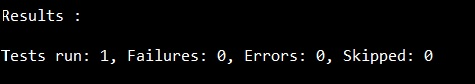
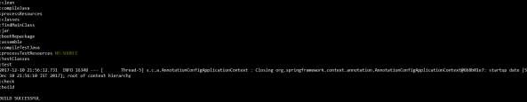

# Spring Boot - Unit Test Cases
Unit Testing is a one of the testing done by the developers to make sure individual unit or component functionalities are working fine.

In this tutorial, we are going to see how to write a unit test case by using Mockito and Web Controller.

## Mockito
For injecting Mockito Mocks into Spring Beans, we need to add the Mockito-core dependency in our build configuration file.

Maven users can add the following dependency in your pom.xml file.

```
<dependency>
   <groupId>org.mockito</groupId>
   <artifactId>mockito-core</artifactId>
   <version>2.13.0</version>
</dependency>
<dependency>
   <groupId>org.springframework.boot</groupId>
   <artifactId>spring-boot-starter-test</artifactId>
   <scope>test</scope>
</dependency>
```
Gradle users can add the following dependency in the build.gradle file.

```
compile group: 'org.mockito', name: 'mockito-core', version: '2.13.0'
testCompile('org.springframework.boot:spring-boot-starter-test')
```
The code to write a Service class which contains a method that returns the String value is given here.

```
package com.tutorialspoint.mockitodemo;

import org.springframework.stereotype.Service;

@Service
public class ProductService {
   public String getProductName() {
      return "Honey";
   } 
}
```
Now, inject the ProductService class into another Service class file as shown.

```
package com.tutorialspoint.mockitodemo;

import org.springframework.beans.factory.annotation.Autowired;
import org.springframework.stereotype.Service;

@Service
public class OrderService {
   @Autowired
   ProductService productService;

   public OrderService(ProductService productService) {
      this.productService = productService;
   }
   public String getProductName() {
      return productService.getProductName();
   }
}
```
The main Spring Boot application class file is given below −

```
package com.tutorialspoint.mockitodemo;

import org.springframework.boot.SpringApplication;
import org.springframework.boot.autoconfigure.SpringBootApplication;

@SpringBootApplication
public class MockitoDemoApplication {
   public static void main(String[] args) {
      SpringApplication.run(MockitoDemoApplication.class, args);
   }
}
```
Then, configure the Application context for the tests. The @Profile(“test”) annotation is used to configure the class when the Test cases are running.

```
package com.tutorialspoint.mockitodemo;

import org.mockito.Mockito;
import org.springframework.context.annotation.Bean;
import org.springframework.context.annotation.Configuration;
import org.springframework.context.annotation.Primary;
import org.springframework.context.annotation.Profile;

@Profile("test")
@Configuration
public class ProductServiceTestConfiguration {
   @Bean
   @Primary
   public ProductService productService() {
      return Mockito.mock(ProductService.class);
   }
}
```
Now, you can write a Unit Test case for Order Service under the **src/test/resources** package.

```
package com.tutorialspoint.mockitodemo;

import org.junit.Assert;
import org.junit.Test;
import org.junit.runner.RunWith;
import org.mockito.Mockito;
import org.springframework.beans.factory.annotation.Autowired;
import org.springframework.boot.test.context.SpringBootTest;
import org.springframework.test.context.ActiveProfiles;
import org.springframework.test.context.junit4.SpringJUnit4ClassRunner;

@SpringBootTest
@ActiveProfiles("test")
@RunWith(SpringJUnit4ClassRunner.class)
public class MockitoDemoApplicationTests {
   @Autowired
   private OrderService orderService;
   
   @Autowired
   private ProductService productService;

   @Test
   public void whenUserIdIsProvided_thenRetrievedNameIsCorrect() {
      Mockito.when(productService.getProductName()).thenReturn("Mock Product Name");
      String testName = orderService.getProductName();
      Assert.assertEquals("Mock Product Name", testName);
   }
}
```
The complete code for build configuration file is given below.

**Maven – pom.xml**

```
<?xml version = "1.0" encoding = "UTF-8"?>
<project xmlns = "http://maven.apache.org/POM/4.0.0" 
   xmlns:xsi = "http://www.w3.org/2001/XMLSchema-instance"
   xsi:schemaLocation = "http://maven.apache.org/POM/4.0.0 
   http://maven.apache.org/xsd/maven-4.0.0.xsd">
   
   <modelVersion>4.0.0</modelVersion>
   <groupId>com.tutorialspoint</groupId>
   <artifactId>mockito-demo</artifactId>
   <version>0.0.1-SNAPSHOT</version>
   <packaging>jar</packaging>

   <name>mockito-demo</name>
   <description>Demo project for Spring Boot</description>

   <parent>
      <groupId>org.springframework.boot</groupId>
      <artifactId>spring-boot-starter-parent</artifactId>
      <version>1.5.9.RELEASE</version>
      <relativePath /> <!-- lookup parent from repository -->
   </parent>

   <properties>
      <project.build.sourceEncoding>UTF-8</project.build.sourceEncoding>
      <project.reporting.outputEncoding>UTF-8</project.reporting.outputEncoding>
      <java.version>1.8</java.version>
   </properties>

   <dependencies>
      <dependency>
         <groupId>org.springframework.boot</groupId>
         <artifactId>spring-boot-starter</artifactId>
      </dependency>
      <dependency>
         <groupId>org.mockito</groupId>
         <artifactId>mockito-core</artifactId>
         <version>2.13.0</version>
      </dependency>
      <dependency>
         <groupId>org.springframework.boot</groupId>
         <artifactId>spring-boot-starter-test</artifactId>
         <scope>test</scope>
      </dependency>
   </dependencies>

   <build>
      <plugins>
         <plugin>
            <groupId>org.springframework.boot</groupId>
            <artifactId>spring-boot-maven-plugin</artifactId>
         </plugin>
      </plugins>
   </build>
   
</project>
```
**Gradle – build.gradle**

```
buildscript {
   ext {
      springBootVersion = '1.5.9.RELEASE'
   }
   repositories {
      mavenCentral()
   }
   dependencies {
      classpath("org.springframework.boot:spring-boot-gradle-plugin:${springBootVersion}")
   }
}

apply plugin: 'java'
apply plugin: 'eclipse'
apply plugin: 'org.springframework.boot'

group = 'com.tutorialspoint'
version = '0.0.1-SNAPSHOT'
sourceCompatibility = 1.8

repositories {
   mavenCentral()
}
dependencies {
   compile('org.springframework.boot:spring-boot-starter')
   compile group: 'org.mockito', name: 'mockito-core', version: '2.13.0'
   testCompile('org.springframework.boot:spring-boot-starter-test')
}
```
You can create an executable JAR file, and run the Spring Boot application by using the following Maven or Gradle1 commands.

For Maven, you can use the command as shown −

```
mvn clean install
```
You can see the test results in console window.



For Gradle, you can use the command as shown −

```
gradle clean build
```
You can see the rest results in console window.




[Previous Page](../spring_boot/spring_boot_twilio.md) [Next Page](../spring_boot/spring_boot_rest_controller_unit_test.md) 
