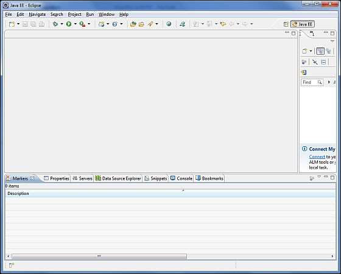

# Spring AOP - Quick Guide
# Spring AOP - Overview
One of the key components of Spring Framework is the **Aspect Oriented Programming (AOP)** framework. Aspect Oriented Programming entails breaking down program logic into distinct parts called **so-called concerns**. The functions that span multiple points of an application are called cross-cutting concerns. These **cross-cutting concerns** are conceptually separate from the application's business logic. There are various common good examples of aspects such as logging, auditing, declarative transactions, security, caching, etc.

The key unit of modularity in OOP is the class, whereas in AOP the unit of modularity is the aspect. Dependency Injection helps you decouple your application objects from each other, while AOP helps you decouple cross-cutting concerns from the objects that they affect. AOP is like triggers in programming languages such as Perl, .NET, Java, and others.

Spring AOP module lets interceptors intercept an application. For example, when a method is executed, you can add extra functionality before or after the method execution.

# Spring AOP - Environment Setup
This chapter takes you through the process of setting up Spring AOP on Windows and Linux based systems. Spring AOP can be easily installed and integrated with your current Java environment and MAVEN by following a few simple steps without any complex setup procedures. User administration is required while installation.

## System Requirements
Let us now look at the steps to install Spring AOP.

## Step 1: Verify your Java Installation
First of all, you need to have Java Software Development Kit (SDK) installed on your system. To verify this, execute any of the following two commands depending on the platform you are working on.

If the Java installation has been done properly, then it will display the current version and specification of your Java installation. A sample output is given in the following table.

We assume the readers of this tutorial have Java SDK version 1.7.0_60 installed on their system.

In case you do not have Java SDK, download its current version from [https://www.oracle.com/technetwork/java/javase/downloads/index.html](https://www.oracle.com/technetwork/java/javase/downloads/index.html)  and have it installed.

## Step 2: Set your Java Environment
Set the environment variable JAVA_HOME to point to the base directory location where Java is installed on your machine. For example,

Append the full path of Java compiler location to the System Path.

Execute the command **java -version** from the command prompt as explained above.

## Step 3: Download Maven Archive
Download Maven 3.3.3 from [https://maven.apache.org/download.cgi](https://maven.apache.org/download.cgi) 

## Step 4: Extract the Maven Archive
Extract the archive, to the directory you wish to install Maven 3.3.3. The subdirectory apache-maven-3.3.3 will be created from the archive.

## Step 5: Set Maven Environment Variables
Add M2_HOME, M2, MAVEN_OPTS to environment variables.

## Step 6: Add Maven Bin Directory Location to System Path
Now append M2 variable to System Path.

## Step 7: Verify Maven installation
Now open console, and execute the following **mvn** command.

Finally, verify the output of the above commands, which should be something as follows −

## Step 8 - Set Up Eclipse IDE
All the examples in this tutorial have been written using Eclipse IDE. So I would suggest you should have the latest version of Eclipse installed on your machine.

To install Eclipse IDE, download the latest Eclipse binaries from [https://www.eclipse.org/downloads/](https://www.eclipse.org/downloads/) . Once you download the installation, unpack the binary distribution into a convenient location. For example, in C:\eclipse on Windows, or /usr/local/eclipse on Linux/Unix and finally set PATH variable appropriately.

Eclipse can be started by executing the following commands on Windows machine, or you can double-click on eclipse.exe

```
%C:\eclipse\eclipse.exe
```
Eclipse can be started by executing the following commands on Unix (Solaris, Linux, etc.) machine −

```
$/usr/local/eclipse/eclipse
```
After a successful startup, if everything is fine then it should display the following result −



Once you are done with this last step, you are ready to proceed for your first AOP example, which you will see in the next chapter.

# Spring AOP - Core Concepts
Before we start working with AOP, let us become familiar with the AOP concepts and terminologies. These terms are not specific to Spring, rather they are related to AOP.

# Spring AOP - Advice Types
Spring aspects can work with five kinds of advice mentioned in the following table.

# Spring AOP - Implementations
Spring supports the **@AspectJ annotation style** approach and the **schema-based** approach to implement custom aspects.

## XML Schema Based
Aspects are implemented using regular classes along with XML based configuration.

To use the AOP namespace tags described in this section, you need to import the spring AOP schema, described as follows −

```
<?xml version = "1.0" encoding = "UTF-8"?>
<beans xmlns = "http://www.springframework.org/schema/beans"
   
   xmlns:xsi = "http://www.w3.org/2001/XMLSchema-instance" 
   xmlns:aop = "http://www.springframework.org/schema/aop"
   xsi:schemaLocation = "http://www.springframework.org/schema/beans
   http://www.springframework.org/schema/beans/spring-beans-3.0.xsd 
   http://www.springframework.org/schema/aop 
   http://www.springframework.org/schema/aop/spring-aop-3.0.xsd ">

   <!-- bean definition & AOP specific configuration -->

</beans>
```
## Declaring an Aspect
An **aspect** is declared using the **<aop:aspect>** element, and the backing bean is referenced using the **ref** attribute as follows.

```
<aop:config>
   <aop:aspect id = "myAspect" ref = "aBean">
   ...
   </aop:aspect>
</aop:config>

<bean id = "aBean" class = "...">
   ...
</bean>
```
Here "aBean" will be configured and dependency injected just like any other Spring bean as you have seen in the previous chapters.

## Declaring a PointCut
A **PointCut** helps in determining the join points (i.e. methods) of interest to be executed with different advices. While working with XML Schema based configuration, PointCut will be defined as follows −

```
<aop:config>
   <aop:aspect id = "myAspect" ref = "aBean">

   <aop:PointCut id = "businessService"
      expression = "execution(* com.xyz.myapp.service.*.*(..))"/>
      ...
   </aop:aspect>
</aop:config>

<bean id = "aBean" class = "...">
   ...
</bean>
```
The following example defines a PointCut named 'businessService' that will match the execution of getName() method available in Student class under the package com.tutorialspoint.

```
<aop:config>
   <aop:aspect id = "myAspect" ref = "aBean">

   <aop:PointCut id = "businessService"
      expression = "execution(* com.tutorialspoint.Student.getName(..))"/>
   ...
   </aop:aspect>
</aop:config>

<bean id = "aBean" class = "...">
   ...
</bean>
```
## Declaring Advices
You can declare any of the five advices inside an &lt;aop:aspect&gt; using the &lt;aop:{ADVICE NAME}&gt; element as follows.

```
<aop:config>
   <aop:aspect id = "myAspect" ref = "aBean">
      <aop:PointCut id = "businessService"
         expression = "execution(* com.xyz.myapp.service.*.*(..))"/>

      <!-- a before advice definition -->
      <aop:before PointCut-ref = "businessService" 
         method = "doRequiredTask"/>

      <!-- an after advice definition -->
      <aop:after PointCut-ref = "businessService" 
         method = "doRequiredTask"/>

      <!-- an after-returning advice definition -->
      <!--The doRequiredTask method must have parameter named retVal -->
      <aop:after-returning PointCut-ref = "businessService"
         returning = "retVal"
         method = "doRequiredTask"/>

      <!-- an after-throwing advice definition -->
      <!--The doRequiredTask method must have parameter named ex -->
      <aop:after-throwing PointCut-ref = "businessService"
        throwing = "ex"
         method = "doRequiredTask"/>

      <!-- an around advice definition -->
      <aop:around PointCut-ref = "businessService" 
         method = "doRequiredTask"/>
   ...
   </aop:aspect>
</aop:config>

<bean id = "aBean" class = "...">
   ...
</bean>
```
You can use same **doRequiredTask** or different methods for different advices. These methods will be defined as a part of aspect module.

## @AspectJ based
@AspectJ refers to a style of declaring aspects as regular Java classes annotated with Java 5 annotations. @AspectJ refers to a style of declaring aspects as regular Java classes annotated with Java 5 annotations. The @AspectJ support is enabled by including the following element inside your XML Schema-based configuration file.

```
<aop:aspectj-autoproxy/>
```
## Declaring an Aspect
Aspects classes are like any other normal bean and may have methods and fields just like any other class, except that they will be annotated with @Aspect as follows.

```
package org.xyz;

import org.aspectj.lang.annotation.Aspect;

@Aspect
public class AspectModule {

}
```
They will be configured in XML like any other bean as follows.

```
<bean id = "myAspect" class = "org.xyz.AspectModule">
   <!-- configure properties of aspect here as normal -->
</bean>
```
## Declaring a PointCut
A **PointCut** helps in determining the join points (i.e. methods) of interest to be executed with different advices. While working with @AspectJ based configuration, PointCut declaration has two parts −

   * A PointCut expression that determines exactly which method executions we are interested in.
   * A PointCut signature comprising a name and any number of parameters. The actual body of the method is irrelevant and in fact should be empty.

The following example defines a PointCut named 'businessService' that will match the execution of every method available in the classes under the package com.xyz.myapp.service.

```
import org.aspectj.lang.annotation.PointCut;

@PointCut("execution(* com.xyz.myapp.service.*.*(..))") // expression 
private void businessService() {}  // signature
```
The following example defines a PointCut named 'getname' that will match the execution of getName() method available in Student class under the package com.tutorialspoint.

```
import org.aspectj.lang.annotation.PointCut;

@PointCut("execution(* com.tutorialspoint.Student.getName(..))") 
private void getname() {}
```
## Declaring Advices
You can declare any of the five advices using @{ADVICE-NAME} annotations as given below. This assumes that you already have defined a PointCut signature method businessService().

```
@Before("businessService()")
public void doBeforeTask(){
   ...
}

@After("businessService()")
public void doAfterTask(){
   ...
}

@AfterReturning(PointCut = "businessService()", returning = "retVal")
public void doAfterReturnningTask(Object retVal){
   // you can intercept retVal here.
   ...
}

@AfterThrowing(PointCut = "businessService()", throwing = "ex")
public void doAfterThrowingTask(Exception ex){
   // you can intercept thrown exception here.
   ...
}

@Around("businessService()")
public void doAroundTask(){
   ...
}
```
You can define PointCut inline for any of the advices. Following is an example to define inline PointCut for before advice.

```
@Before("execution(* com.xyz.myapp.service.*.*(..))")
public doBeforeTask(){
   ...
}
```
# Spring AOP - XML Based Application
In this chapter, we will write actual AOP applications using Spring AOP Framework. Before you start writing your first example using Spring-WS framework, you have to make sure that you have set up your Spring AOP environment properly as explained in [Spring Web Services - Environment Setup](/springaop/springaop_environment.htm)  chapter.

Now, proceed to write a simple console-ased Spring AOP Application, which will demonstrate AOP concepts.

## Create a Project
**Step 1** − Open a command console, go the C:\MVN directory and execute the following **mvn** command.

```
C:\MVN>mvn archetype:generate -DgroupId = com.tutorialspoint -DartifactId = Student
	-DarchetypeArtifactId = maven-archetype-quickstart -DinteractiveMode = false
```
Maven will start processing and will create the complete Java application project structure.

```
[INFO] Scanning for projects...
[INFO]
[INFO] ------------------------------------------------------------------------
[INFO] Building Maven Stub Project (No POM) 1
[INFO] ------------------------------------------------------------------------
[INFO]
[INFO] >>> maven-archetype-plugin:2.4:generate (default-cli) > generate-sources
@ standalone-pom >>>
[INFO]
[INFO] <<< maven-archetype-plugin:2.4:generate (default-cli) < generate-sources
@ standalone-pom <<<
[INFO]
[INFO] --- maven-archetype-plugin:2.4:generate (default-cli) @ standalone-pom --
-
[INFO] Generating project in Batch mode
Downloading: https://repo.maven.apache.org/maven2/org/apache/maven/archetypes/ma
ven-archetype-quickstart/1.0/maven-archetype-quickstart-1.0.jar
Downloaded: https://repo.maven.apache.org/maven2/org/apache/maven/archetypes/mav
en-archetype-quickstart/1.0/maven-archetype-quickstart-1.0.jar (5 KB at 1.1 KB/s
ec)
Downloading: https://repo.maven.apache.org/maven2/org/apache/maven/archetypes/ma
ven-archetype-quickstart/1.0/maven-archetype-quickstart-1.0.pom
Downloaded: https://repo.maven.apache.org/maven2/org/apache/maven/archetypes/mav
en-archetype-quickstart/1.0/maven-archetype-quickstart-1.0.pom (703 B at 1.2 KB/
sec)
[INFO] -------------------------------------------------------------------------
---
[INFO] Using following parameters for creating project from Old (1.x) Archetype:
 maven-archetype-quickstart:1.0
[INFO] -------------------------------------------------------------------------
---
[INFO] Parameter: groupId, Value: com.tutorialspoint
[INFO] Parameter: packageName, Value: com.tutorialspoint
[INFO] Parameter: package, Value: com.tutorialspoint
[INFO] Parameter: artifactId, Value: Student
[INFO] Parameter: basedir, Value: C:\MVN
[INFO] Parameter: version, Value: 1.0-SNAPSHOT
[INFO] project created from Old (1.x) Archetype in dir: C:\MVN\Student
[INFO] ------------------------------------------------------------------------
[INFO] BUILD SUCCESS
[INFO] ------------------------------------------------------------------------
[INFO] Total time: 01:17 min
[INFO] Finished at: 2017-02-19T21:11:14+05:30
[INFO] Final Memory: 15M/114M
[INFO] ------------------------------------------------------------------------
```
**Step 2** − Go to C:/MVN directory. You'll see a Java application project created, named student (as specified in artifactId). Update the POM.xml to include Spring-AOP dependencies. Add MainApp.java, Student.java, and Logging.java files.

**POM.xml**

```
<project xmlns = "http://maven.apache.org/POM/4.0.0" 
   xmlns:xsi = "http://www.w3.org/2001/XMLSchema-instance"
   xsi:schemaLocation = "http://maven.apache.org/POM/4.0.0 
   http://maven.apache.org/maven-v4_0_0.xsd">
   <modelVersion>4.0.0</modelVersion>
   <groupId>com.tutorialspoint</groupId>
   <artifactId>Student</artifactId>
   <packaging>jar</packaging>
   <version>1.0-SNAPSHOT</version>
   <name>Student</name>
   <url>http://maven.apache.org</url>
   
   <dependencies>
      <dependency>
         <groupId>junit</groupId>
         <artifactId>junit</artifactId>
         <version>3.8.1</version>
         <scope>test</scope>
      </dependency>
      
      <dependency>
         <groupId>org.springframework</groupId>
         <artifactId>spring-aop</artifactId>
         <version>4.1.0.RELEASE</version>
      </dependency>
      
      <dependency>
         <groupId>org.springframework</groupId>
         <artifactId>spring-context</artifactId>
         <version>4.1.4.RELEASE</version>
      </dependency>
      
      <dependency>
         <groupId>org.aspectj</groupId>
         <artifactId>aspectjweaver</artifactId>
         <version>1.6.8</version>
      </dependency>
      
   </dependencies>
</project>
package com.tutorialspoint;

public class Logging {

   /** 
    * This is the method which I would like to execute
    * before a selected method execution.
    */
   public void beforeAdvice() {
      System.out.println("Going to setup student profile.");
   }

   /** 
    * This is the method which I would like to execute
    * after a selected method execution.
    */
   public void afterAdvice() {
      System.out.println("Student profile has been setup.");
   }

   /** 
    * This is the method which I would like to execute
    * when any method returns.
    */
   public void afterReturningAdvice(Object retVal){
      System.out.println("Returning:" + retVal.toString() );
   }

   /**
    * This is the method which I would like to execute
    * if there is an exception raised.
    */
   public void AfterThrowingAdvice(IllegalArgumentException ex) {
      System.out.println("There has been an exception: " + ex.toString());   
   }
   
}
```
Following is the content of the **Student.java** file.

```
package com.tutorialspoint;

public class Student {
   private Integer age;
   private String name;

   public void setAge(Integer age) {
      this.age = age;
   }
   public Integer getAge() {
      System.out.println("Age : " + age );
      return age;
   }

   public void setName(String name) {
      this.name = name;
   }
   public String getName() {
      System.out.println("Name : " + name );
      return name;
   }
   
   public void printThrowException(){
      System.out.println("Exception raised");
      throw new IllegalArgumentException();
   }
}
```
Following is the content of the **MainApp.java** file.

```
package com.tutorialspoint;

import org.springframework.context.ApplicationContext;
import org.springframework.context.support.ClassPathXmlApplicationContext;

public class MainApp {
   public static void main(String[] args) {
      ApplicationContext context = 
         new ClassPathXmlApplicationContext("Beans.xml");

      Student student = (Student) context.getBean("student");

      student.getName();
      student.getAge();
      
      student.printThrowException();
   }
}
```
**Step 3** − Add the configuration file **Beans.xml** under **src > main > resources** folder.

```
<?xml version = "1.0" encoding = "UTF-8"?>
<beans xmlns = "http://www.springframework.org/schema/beans"
   xmlns:xsi = "http://www.w3.org/2001/XMLSchema-instance" 
   xmlns:aop = "http://www.springframework.org/schema/aop"
   xsi:schemaLocation = "http://www.springframework.org/schema/beans
   http://www.springframework.org/schema/beans/spring-beans-3.0.xsd 
   http://www.springframework.org/schema/aop 
   http://www.springframework.org/schema/aop/spring-aop-3.0.xsd ">

   <aop:config>
      <aop:aspect id = "log" ref = "logging">
         <aop:PointCut id = "selectAll" 
            expression = "execution(* com.tutorialspoint.*.*(..))"/>
         <aop:before PointCut-ref = "selectAll" method = "beforeAdvice"/>
         <aop:after PointCut-ref = "selectAll" method = "afterAdvice"/>
         <aop:after-returning PointCut-ref = "selectAll" 
            returning = "retVal"
            method = "afterReturningAdvice"/>
         <aop:after-throwing PointCut-ref = "selectAll" 
           throwing = "ex"
            method = "AfterThrowingAdvice"/>
      </aop:aspect>
   </aop:config>

   <!-- Definition for student bean -->
   <bean id = "student" class = "com.tutorialspoint.Student">
      <property name = "name"  value = "Zara" />
      <property name = "age"  value = "11"/>      
   </bean>

   <!-- Definition for logging aspect -->
   <bean id = "logging" class = "com.tutorialspoint.Logging"/> 
      
</beans>
```
**Step 4** − Open the command console, go the C:\MVN directory and execute the following **mvn** command.

```
C:\MVN>Student> mvn package
```
Maven will start processing and downloading the required libraries.

```
[INFO] Scanning for projects...
[INFO]
[INFO] ------------------------------------------------------------------------
[INFO] Building Student 1.0-SNAPSHOT
[INFO] ------------------------------------------------------------------------
Downloading: https://repo.maven.apache.org/maven2/org/apache/maven/plugins/maven
-jar-plugin/2.4/maven-jar-plugin-2.4.pom
Downloaded: https://repo.maven.apache.org/maven2/org/apache/maven/plugins/maven-
jar-plugin/2.4/maven-jar-plugin-2.4.pom (6 KB at 2.2 KB/sec)
Downloading: https://repo.maven.apache.org/maven2/org/apache/maven/plugins/maven
-jar-plugin/2.4/maven-jar-plugin-2.4.jar
Downloaded: https://repo.maven.apache.org/maven2/org/apache/maven/plugins/maven-
jar-plugin/2.4/maven-jar-plugin-2.4.jar (34 KB at 31.6 KB/sec)
Downloading: https://repo.maven.apache.org/maven2/org/springframework/spring-aop
/4.1.0.RELEASE/spring-aop-4.1.0.RELEASE.pom
Downloaded: https://repo.maven.apache.org/maven2/org/springframework/spring-aop/
4.1.0.RELEASE/spring-aop-4.1.0.RELEASE.pom (3 KB at 3.7 KB/sec)
Downloading: https://repo.maven.apache.org/maven2/org/springframework/spring-bea
ns/4.1.0.RELEASE/spring-beans-4.1.0.RELEASE.pom
Downloaded: https://repo.maven.apache.org/maven2/org/springframework/spring-bean
s/4.1.0.RELEASE/spring-beans-4.1.0.RELEASE.pom (3 KB at 4.1 KB/sec)
Downloading: https://repo.maven.apache.org/maven2/org/springframework/spring-cor
e/4.1.0.RELEASE/spring-core-4.1.0.RELEASE.pom
Downloaded: https://repo.maven.apache.org/maven2/org/springframework/spring-core
/4.1.0.RELEASE/spring-core-4.1.0.RELEASE.pom (3 KB at 4.0 KB/sec)
Downloading: https://repo.maven.apache.org/maven2/org/springframework/spring-aop
/4.1.0.RELEASE/spring-aop-4.1.0.RELEASE.jar
Downloading: https://repo.maven.apache.org/maven2/org/springframework/spring-cor
e/4.1.0.RELEASE/spring-core-4.1.0.RELEASE.jar
Downloading: https://repo.maven.apache.org/maven2/org/springframework/spring-bea
ns/4.1.0.RELEASE/spring-beans-4.1.0.RELEASE.jar
Downloaded: https://repo.maven.apache.org/maven2/org/springframework/spring-aop/
4.1.0.RELEASE/spring-aop-4.1.0.RELEASE.jar (351 KB at 43.9 KB/sec)
Downloaded: https://repo.maven.apache.org/maven2/org/springframework/spring-bean
s/4.1.0.RELEASE/spring-beans-4.1.0.RELEASE.jar (685 KB at 37.5 KB/sec)
Downloaded: https://repo.maven.apache.org/maven2/org/springframework/spring-core
/4.1.0.RELEASE/spring-core-4.1.0.RELEASE.jar (982 KB at 47.1 KB/sec)
[INFO]
[INFO] --- maven-resources-plugin:2.6:resources (default-resources) @ Student --
-
[WARNING] Using platform encoding (Cp1252 actually) to copy filtered resources,
i.e. build is platform dependent!
[INFO] skip non existing resourceDirectory C:\MVN\Student\src\main\resources
[INFO]
[INFO] --- maven-compiler-plugin:3.1:compile (default-compile) @ Student ---
[INFO] Changes detected - recompiling the module!
[WARNING] File encoding has not been set, using platform encoding Cp1252, i.e. b
uild is platform dependent!
[INFO] Compiling 1 source file to C:\MVN\Student\target\classes
[INFO]
[INFO] --- maven-resources-plugin:2.6:testResources (default-testResources) @ St
udent ---
[WARNING] Using platform encoding (Cp1252 actually) to copy filtered resources,
i.e. build is platform dependent!
[INFO] skip non existing resourceDirectory C:\MVN\Student\src\test\resources
[INFO]
[INFO] --- maven-compiler-plugin:3.1:testCompile (default-testCompile) @ Student
 ---
[INFO] Changes detected - recompiling the module!
[WARNING] File encoding has not been set, using platform encoding Cp1252, i.e. b
uild is platform dependent!
[INFO] Compiling 1 source file to C:\MVN\Student\target\test-classes
[INFO]
[INFO] --- maven-surefire-plugin:2.12.4:test (default-test) @ Student ---
[INFO] Surefire report directory: C:\MVN\Student\target\surefire-reports
Downloading: https://repo.maven.apache.org/maven2/org/apache/maven/surefire/sure
fire-junit3/2.12.4/surefire-junit3-2.12.4.pom
Downloaded: https://repo.maven.apache.org/maven2/org/apache/maven/surefire/suref
ire-junit3/2.12.4/surefire-junit3-2.12.4.pom (2 KB at 1.3 KB/sec)
Downloading: https://repo.maven.apache.org/maven2/org/apache/maven/surefire/sure
fire-junit3/2.12.4/surefire-junit3-2.12.4.jar
Downloaded: https://repo.maven.apache.org/maven2/org/apache/maven/surefire/suref
ire-junit3/2.12.4/surefire-junit3-2.12.4.jar (26 KB at 27.7 KB/sec)

-------------------------------------------------------
 T E S T S
-------------------------------------------------------
Running com.tutorialspoint.AppTest
Tests run: 1, Failures: 0, Errors: 0, Skipped: 0, Time elapsed: 0.002 sec

Results :

Tests run: 1, Failures: 0, Errors: 0, Skipped: 0

[INFO]
[INFO] --- maven-jar-plugin:2.4:jar (default-jar) @ Student ---
Downloading: https://repo.maven.apache.org/maven2/classworlds/classworlds/1.1-al
pha-2/classworlds-1.1-alpha-2.jar
Downloaded: https://repo.maven.apache.org/maven2/classworlds/classworlds/1.1-alp
ha-2/classworlds-1.1-alpha-2.jar (37 KB at 35.8 KB/sec)
[INFO] Building jar: C:\MVN\Student\target\Student-1.0-SNAPSHOT.jar
[INFO] ------------------------------------------------------------------------
[INFO] BUILD SUCCESS
[INFO] ------------------------------------------------------------------------
[INFO] Total time: 38.441 s
[INFO] Finished at: 2017-02-19T21:18:59+05:30
[INFO] Final Memory: 18M/109M
[INFO] ------------------------------------------------------------------------
```
## Import Project in Eclipse
**Step 1** − Open Eclipse.

**Step 2** − Select **File → Import →** option.

**Step 3** − Select Maven Projects Option. Click the Next Button.

**Step 4** − Select Project location, where Student project was created using Maven.

**Step 5** − Click Finish Button.

## Run Project
Once you are done creating the source and configuration files, run your application. Rightclick on MainApp.java in your application and use **run as Java Application** command. If everything is fine with your application, it will print the following message.

```
Going to setup student profile.
Name : Zara
Student profile has been setup.
Returning:Zara
Going to setup student profile.
Age : 11
Student profile has been setup.
Returning:11
Going to setup student profile.
Exception raised
Student profile has been setup.
There has been an exception: java.lang.IllegalArgumentException
Exception in thread "main" java.lang.IllegalArgumentException
   at com.tutorialspoint.Student.printThrowException(Student.java:25)
   
   at com.tutorialspoint.Student$$FastClassBySpringCGLIB$$7dc55815.invoke(<generated>)
   
   at org.springframework.cglib.proxy.MethodProxy.invoke(MethodProxy.java:204)
   
   at org.springframework.aop.framework.CglibAopProxy$CglibMethodInvocation.invokeJoinpoint(CglibAopProxy.java:717)
   
   at org.springframework.aop.framework.ReflectiveMethodInvocation.proceed(ReflectiveMethodInvocation.java:157)
   
   at org.springframework.aop.framework.adapter.MethodBeforeAdviceInterceptor.invoke(MethodBeforeAdviceInterceptor.java:52)
   
   at org.springframework.aop.framework.ReflectiveMethodInvocation.proceed(ReflectiveMethodInvocation.java:179)
   
   at org.springframework.aop.aspectj.AspectJAfterAdvice.invoke(AspectJAfterAdvice.java:43)
   
   at org.springframework.aop.framework.ReflectiveMethodInvocation.proceed(ReflectiveMethodInvocation.java:179)
   
   at org.springframework.aop.framework.adapter.AfterReturningAdviceInterceptor.invoke(AfterReturningAdviceInterceptor.java:52)
   
   at org.springframework.aop.framework.ReflectiveMethodInvocation.proceed(ReflectiveMethodInvocation.java:179)
   
   at org.springframework.aop.aspectj.AspectJAfterThrowingAdvice.invoke(AspectJAfterThrowingAdvice.java:58)
   
   at org.springframework.aop.framework.ReflectiveMethodInvocation.proceed(ReflectiveMethodInvocation.java:179)
   
   at org.springframework.aop.interceptor.ExposeInvocationInterceptor.invoke(ExposeInvocationInterceptor.java:92)
   
   at org.springframework.aop.framework.ReflectiveMethodInvocation.proceed(ReflectiveMethodInvocation.java:179)
   
   at org.springframework.aop.framework.CglibAopProxy$DynamicAdvisedInterceptor.intercept(CglibAopProxy.java:653)
   
   at com.tutorialspoint.Student$$EnhancerBySpringCGLIB$$56a970f2.printThrowException(<generated>)
   
   at com.tutorialspoint.MainApp.main(MainApp.java:16)
```
# Spring AOP - XML Based PointCut
## Join Point
A JoinPoint represents a point in your application where you can plug-in AOP aspect. You can also say, it is the actual place in the application where an action will be taken using Spring AOP framework. Consider the following examples −

   * All methods classes contained in a package(s).
   * A particular methods of a class.

## PointCut
PointCut is a set of one or more JoinPoints where an advice should be executed. You can specify PointCuts using expressions or patterns as we will see in our AOP examples. In Spring, PointCut helps to use specific JoinPoints to apply the advice. Consider the following examples −

   * expression = "execution(* com.tutorialspoint.*.*(..))"
   * expression = "execution(* com.tutorialspoint.Student.getName(..))"

## Syntax
```
<aop:config>
   <aop:aspect id = "log" ref = "adviceClass">
      <aop:PointCut id = "PointCut-id" expression = "execution( expression )"/>    
   </aop:aspect>
</aop:config>
```
Where,

   * **adviceClass** − ref of the class containing advice methods
   * **PointCut-id** − id of the PointCut
   * **execution( expression )** − Expression covering methods on which advice is to be applied.

To understand the above-mentioned concepts related to JoinPoint and PointCut, let us write an example which will implement few of the PointCuts. To write our example with few advices, let us have a working Eclipse IDE in place and use the following steps to create a Spring application.

Following is the content of **Logging.java** file. This is actually a sample of aspect module, which defines the methods to be called at various points.

```
package com.tutorialspoint;

public class Logging {

   /** 
    * This is the method which I would like to execute
    * before a selected method execution.
    */
   public void beforeAdvice(){
      System.out.println("Going to setup student profile.");
   }   
}
```
Following is the content of the **Student.java** file.

```
package com.tutorialspoint;

public class Student {
   private Integer age;
   private String name;

   public void setAge(Integer age) {
      this.age = age;
   }
   public Integer getAge() {
      System.out.println("Age : " + age );
      return age;
   }

   public void setName(String name) {
      this.name = name;
   }
   public String getName() {
      System.out.println("Name : " + name );
      return name;
   }
   
   public void printThrowException(){
      System.out.println("Exception raised");
      throw new IllegalArgumentException();
   }
}
```
Following is the content of the **MainApp.java** file.

```
package com.tutorialspoint;

import org.springframework.context.ApplicationContext;
import org.springframework.context.support.ClassPathXmlApplicationContext;

public class MainApp {
   public static void main(String[] args) {
      ApplicationContext context = 
         new ClassPathXmlApplicationContext("Beans.xml");

      Student student = (Student) context.getBean("student");

      student.getName();
      student.getAge();     
   }
}
```
Following is the configuration file **Beans.xml**.

```
<?xml version = "1.0" encoding = "UTF-8"?>
<beans xmlns = "http://www.springframework.org/schema/beans"
   xmlns:xsi = "http://www.w3.org/2001/XMLSchema-instance" 
   xmlns:aop = "http://www.springframework.org/schema/aop"
   xsi:schemaLocation = "http://www.springframework.org/schema/beans
   http://www.springframework.org/schema/beans/spring-beans-3.0.xsd 
   http://www.springframework.org/schema/aop 
   http://www.springframework.org/schema/aop/spring-aop-3.0.xsd ">

   <aop:config>
      <aop:aspect id = "log" ref = "logging">
         <aop:PointCut id = "selectAll" 
         expression = "execution(* com.tutorialspoint.*.*(..))"/>
         <aop:before PointCut-ref = "selectAll" method = "beforeAdvice"/>         
      </aop:aspect>
   </aop:config>

   <!-- Definition for student bean -->
   <bean id = "student" class = "com.tutorialspoint.Student">
      <property name = "name"  value = "Zara" />
      <property name = "age"  value = "11"/>      
   </bean>

   <!-- Definition for logging aspect -->
   <bean id = "logging" class = "com.tutorialspoint.Logging"/> 
      
</beans>
```
Once you are done with creating the source and bean configuration files, run the application. If everything is fine with your application, it will print the following message.

```
Going to setup student profile.
Name : Zara
Going to setup student profile.
Age : 11
```
The above-defined &lt;aop:pointcut&gt; selects all the methods defined under the package com.tutorialspoint. Let us suppose, you want to execute your advice before or after a particular method, you can define your PointCut to narrow down your execution by replacing stars (*) in PointCut definition with actual class and method names. Following is a modified XML configuration file to show the concept.

```
<?xml version = "1.0" encoding = "UTF-8"?>
<beans xmlns = "http://www.springframework.org/schema/beans"
   xmlns:xsi = "http://www.w3.org/2001/XMLSchema-instance" 
   xmlns:aop = "http://www.springframework.org/schema/aop"
   xsi:schemaLocation = "http://www.springframework.org/schema/beans
   http://www.springframework.org/schema/beans/spring-beans-3.0.xsd 
   http://www.springframework.org/schema/aop 
   http://www.springframework.org/schema/aop/spring-aop-3.0.xsd ">

   <aop:config>
      <aop:aspect id = "log" ref = "logging">
         <aop:PointCut id = "selectAll" 
            expression = "execution(* com.tutorialspoint.Student.getName(..))"/>
         <aop:before PointCut-ref = "selectAll" method = "beforeAdvice"/>
      </aop:aspect>
   </aop:config>

   <!-- Definition for student bean -->
   <bean id = "student" class = "com.tutorialspoint.Student">
      <property name = "name"  value = "Zara" />
      <property name = "age"  value = "11"/>      
   </bean>

   <!-- Definition for logging aspect -->
   <bean id = "logging" class = "com.tutorialspoint.Logging"/> 
      
</beans>
```
## Run Project
Once you are done creating the source and configuration files, run your application. Rightclick on MainApp.java in your application and use **run as Java Application** command. If everything is fine with your application, it will print the following message.

```
Going to setup student profile.
Name : Zara
Age : 11
```
# Spring AOP - XML Based Before Advice
**Before** is an advice type which ensures that an advice runs before the method execution. Following is the syntax of before advice.

## Syntax
```
<aop:config>
   <aop:aspect id = "log" ref = "logging">
      <aop:PointCut id = "PointCut-id" expression = "execution( expression )"/>    
      <aop:before PointCut-ref = "PointCut-id" method = "methodName"/>
   </aop:aspect>
</aop:config>
```
Where,

   * **PointCut-id** − id of the PointCut.
   * **methodName** − Method name of the function to be called before a called function.

To understand the above-mentioned concepts related to Before Advice, let us write an example, which will implement Before Advice. To write our example with few advices, let us have a working Eclipse IDE in place and use the following steps to create a Spring application.

Following is the content of **Logging.java** file. This is actually a sample of aspect module, which defines the methods to be called at various points.

```
package com.tutorialspoint;

public class Logging {

   /** 
    * This is the method which I would like to execute
    * before a selected method execution.
    */
   public void beforeAdvice(){
      System.out.println("Going to setup student profile.");
   }   
}
```
Following is the content of the **Student.java** file.

```
package com.tutorialspoint;

public class Student {
   private Integer age;
   private String name;

   public void setAge(Integer age) {
      this.age = age;
   }
   
   public Integer getAge() {
      System.out.println("Age : " + age );
      return age;
   }

   public void setName(String name) {
      this.name = name;
   }
   
   public String getName() {
      System.out.println("Name : " + name );
      return name;
   }
   
   public void printThrowException(){
      System.out.println("Exception raised");
      throw new IllegalArgumentException();
   }
}
```
Following is the content of the **MainApp.java** file.

```
package com.tutorialspoint;

import org.springframework.context.ApplicationContext;

import org.springframework.context.support.ClassPathXmlApplicationContext;

public class MainApp {
   public static void main(String[] args) {
      ApplicationContext context = 
         new ClassPathXmlApplicationContext("Beans.xml");

      Student student = (Student) context.getBean("student");

      student.getName();
      student.getAge();     
   }
}
```
Following is the configuration file **Beans.xml**.

```
<?xml version = "1.0" encoding = "UTF-8"?>
<beans xmlns = "http://www.springframework.org/schema/beans"
   xmlns:xsi = "http://www.w3.org/2001/XMLSchema-instance" 
   xmlns:aop = "http://www.springframework.org/schema/aop"
   xsi:schemaLocation = "http://www.springframework.org/schema/beans
   http://www.springframework.org/schema/beans/spring-beans-3.0.xsd 
   http://www.springframework.org/schema/aop 
   http://www.springframework.org/schema/aop/spring-aop-3.0.xsd ">

   <aop:config>
      <aop:aspect id = "log" ref = "logging">
         <aop:PointCut id = "selectAll" 
            expression = "execution(* com.tutorialspoint.Student.getName(..))"/>
         <aop:before PointCut-ref = "selectAll" method = "beforeAdvice"/>
      </aop:aspect>
   </aop:config>

   <!-- Definition for student bean -->
   <bean id = "student" class = "com.tutorialspoint.Student">
      <property name = "name"  value = "Zara" />
      <property name = "age"  value = "11"/>      
   </bean>

   <!-- Definition for logging aspect -->
   <bean id = "logging" class = "com.tutorialspoint.Logging"/> 
      
</beans>
```
## Run Project
Once you are done creating source and configuration files, run your application. Right-click on MainApp.java in your application and use **run as Java Application** command. If everything is fine with your application, it will print the following message.

```
Going to setup student profile.
Name : Zara
Age : 11
```
# Spring AOP - XML Based After Advice
**After** is an advice type which ensures that an advice runs after the method execution. Following is the syntax of after advice.

## Syntax
```
<aop:config>
   <aop:aspect id = "log" ref = "logging">
      <aop:PointCut id = "PointCut-id" expression = "execution( expression )"/>    
      <aop:after PointCut-ref = "PointCut-id" method = "methodName"/>
   </aop:aspect>
</aop:config>
```
Where,

   * **PointCut-id** − id of the PointCut.
   * **methodName** − Method name of the function to be called after a called function.

To understand the above-mentioned concepts related to After Advice, let us write an example which will implement After Advice. To write our example with few advices, let us have a working Eclipse IDE in place and use the following steps to create a Spring application.

Following is the content of **Logging.java** file. This is actually a sample of aspect module, which defines the methods to be called at various points.

```
package com.tutorialspoint;

public class Logging {

   /** 
    * This is the method which I would like to execute
    * after a selected method execution.
    */
   public void afterAdvice(){
      System.out.println("Student profile setup complete.");
   }   
}
```
Following is the content of the **Student.java** file.

```
package com.tutorialspoint;

public class Student {
   private Integer age;
   private String name;

   public void setAge(Integer age) {
      this.age = age;
   }
   public Integer getAge() {
      System.out.println("Age : " + age );
      return age;
   }

   public void setName(String name) {
      this.name = name;
   }
   public String getName() {
      System.out.println("Name : " + name );
      return name;
   }
   
   public void printThrowException(){
      System.out.println("Exception raised");
      throw new IllegalArgumentException();
   }
}
```
Following is the content of the **MainApp.java** file.

```
package com.tutorialspoint;

import org.springframework.context.ApplicationContext;
import org.springframework.context.support.ClassPathXmlApplicationContext;

public class MainApp {
   public static void main(String[] args) {
      ApplicationContext context = 
         new ClassPathXmlApplicationContext("Beans.xml");

      Student student = (Student) context.getBean("student");

      student.getName();
      student.getAge();     
   }
}
```
Following is the configuration file **Beans.xml**.

```
<?xml version = "1.0" encoding = "UTF-8"?>
<beans xmlns = "http://www.springframework.org/schema/beans"
   xmlns:xsi = "http://www.w3.org/2001/XMLSchema-instance" 
   xmlns:aop = "http://www.springframework.org/schema/aop"
   xsi:schemaLocation = "http://www.springframework.org/schema/beans
   http://www.springframework.org/schema/beans/spring-beans-3.0.xsd 
   http://www.springframework.org/schema/aop 
   http://www.springframework.org/schema/aop/spring-aop-3.0.xsd ">

   <aop:config>
      <aop:aspect id = "log" ref = "logging">
         <aop:PointCut id = "selectAll" 
            expression = "execution(* com.tutorialspoint.Student.getAge(..))"/>
         <aop:after PointCut-ref = "selectAll" method = "afterAdvice"/>
      </aop:aspect>
   </aop:config>

   <!-- Definition for student bean -->
   <bean id = "student" class = "com.tutorialspoint.Student">
      <property name = "name"  value = "Zara" />
      <property name = "age"  value = "11"/>      
   </bean>

   <!-- Definition for logging aspect -->
   <bean id = "logging" class = "com.tutorialspoint.Logging"/> 
      
</beans>
```
## Run Project
Once you are done creating source and configuration files, run your application. Right-click on MainApp.java in your application and use **run as Java Application** command. If everything is fine with your application, this will print the following message.

```
Name : Zara
Age : 11
Student profile setup complete.
```
# Spring AOP - XML Based After Returning Advice
**After** is an advice type which ensures that an advice runs after the method execution only if the method completes successfully. Following is the syntax of after advice.

## Syntax
```
<aop:config>
   <aop:aspect id = "log" ref = "logging">
      <aop:PointCut id = "PointCut-id" expression = "execution( expression )"/>    
      <aop:after-returning PointCut-ref = "PointCut-id" 
         returning = "retVal" method = "methodName"/>
   </aop:aspect>
</aop:config>
```
Where,

   * **PointCut-id** − id of the PointCut.
   * **methodName** − Method name of the function to be called after a called function returns successfully.

To understand the above-mentioned concepts related to After Returning Advice, let us write an example which will implement After Returning advice. To write our example with few advices, let us have a working Eclipse IDE in place and use the following steps to create a Spring application −

Following is the content of **Logging.java** file. This is actually a sample of aspect module, which defines the methods to be called at various points.

```
package com.tutorialspoint;

public class Logging {

   /** 
    * This is the method which I would like to execute
    * when any method returns.
    */
   public void afterReturningAdvice(Object retVal){
      System.out.println("Returning:" + retVal.toString() );
   }
}
```
Following is the content of the **Student.java** file.

```
package com.tutorialspoint;

public class Student {
   private Integer age;
   private String name;

   public void setAge(Integer age) {
      this.age = age;
   }
   
   public Integer getAge() {
      System.out.println("Age : " + age );
      System.out.println("Exception raised");
      throw new IllegalArgumentException();
      return age;
   }

   public void setName(String name) {
      this.name = name;
   }
   
   public String getName() {
      System.out.println("Name : " + name );
      return name;
   }
   
   public void printThrowException(){
      System.out.println("Exception raised");
      throw new IllegalArgumentException();
   }
}
```
Following is the content of the **MainApp.java** file.

```
package com.tutorialspoint;

import org.springframework.context.ApplicationContext;
import org.springframework.context.support.ClassPathXmlApplicationContext;

public class MainApp {
   public static void main(String[] args) {
      ApplicationContext context = 
         new ClassPathXmlApplicationContext("Beans.xml");

      Student student = (Student) context.getBean("student");

      student.getName();
      student.getAge();     
   }
}
```
Following is the configuration file **Beans.xml**.

```
<?xml version = "1.0" encoding = "UTF-8"?>
<beans xmlns = "http://www.springframework.org/schema/beans"
   xmlns:xsi = "http://www.w3.org/2001/XMLSchema-instance" 
   xmlns:aop = "http://www.springframework.org/schema/aop"
   xsi:schemaLocation = "http://www.springframework.org/schema/beans
   http://www.springframework.org/schema/beans/spring-beans-3.0.xsd 
   http://www.springframework.org/schema/aop 
   http://www.springframework.org/schema/aop/spring-aop-3.0.xsd ">

   <aop:config>
      <aop:aspect id = "log" ref = "logging">
         <aop:PointCut id = "selectAll" 
         expression = "execution(* com.tutorialspoint.*.*(..))"/>
         <aop:after-returning PointCut-ref = "selectAll" 
            method = "afterReturningAdvice" returning = "retVal"/>         
      </aop:aspect>
   </aop:config>

   <!-- Definition for student bean -->
   <bean id = "student" class = "com.tutorialspoint.Student">
      <property name = "name"  value = "Zara" />
      <property name = "age"  value = "11"/>      
   </bean>

   <!-- Definition for logging aspect -->
   <bean id = "logging" class = "com.tutorialspoint.Logging"/> 
      
</beans>
```
## Run Project
Once you are done creating the source and configuration files, run your application. Rightclick on MainApp.java in your application and use **run as Java Application** command. If everything is fine with your application, it will print the following message.

```
Name : Zara
Returning : Name
Age : 11
Exception raised
```
# Spring AOP - XML Based After Throwing Advice
**After-throwing** is an advice type which ensures that an advice runs after the method execution, only if the method exits by throwing an exception. Following is the syntax of after-throwing advice.

## Syntax
```
<aop:config>
   <aop:aspect id = "log" ref = "logging">
      <aop:PointCut id = "PointCut-id" expression = "execution( expression )"/>    
      <aop:after-throwing PointCut-ref = "PointCut-id" throwing = "ex" 
         method = "methodName"/>
   </aop:aspect>
</aop:config>
```
Where,

   * **PointCut-id** − id of the PointCut.
   * **ex** − Exception to be thrown.
   * **methodName** − Method name of the function to be called when a called function throws an exception and exits.

To understand the above-mentioned concepts related to After Throwing Advice, let us write an example which will implement After Throwing Advice. To write our example with few advices, let us have a working Eclipse IDE in place and use the following steps to create a Spring application −

Following is the content of **Logging.java** file. This is actually a sample of aspect module, which defines the methods to be called at various points.

```
package com.tutorialspoint;

public class Logging {
   /**
    * This is the method which I would like to execute
    * if there is an exception raised.
    */
   public void afterThrowingAdvice(IllegalArgumentException ex) {
      System.out.println("There has been an exception: " + ex.toString());   
   } 
}
```
Following is the content of the **Student.java** file.

```
package com.tutorialspoint;

public class Student {
   private Integer age;
   private String name;

   public void setAge(Integer age) {
      this.age = age;
   }
   public Integer getAge() {
      System.out.println("Age : " + age );
	  return age;
   }

   public void setName(String name) {
      this.name = name;
   }
   
   public String getName() {
      System.out.println("Name : " + name );
      return name;
   }
   
   public void printThrowException(){
      System.out.println("Exception raised");
      throw new IllegalArgumentException();
   }
}
```
Following is the content of the **MainApp.java** file.

```
package com.tutorialspoint;

import org.springframework.context.ApplicationContext;
import org.springframework.context.support.ClassPathXmlApplicationContext;

public class MainApp {
   public static void main(String[] args) {
      ApplicationContext context = 
         new ClassPathXmlApplicationContext("Beans.xml");

      Student student = (Student) context.getBean("student");

      student.printThrowException();     
   }
}
```
Following is the configuration file **Beans.xml**.

```
<?xml version = "1.0" encoding = "UTF-8"?>
<beans xmlns = "http://www.springframework.org/schema/beans"
   xmlns:xsi = "http://www.w3.org/2001/XMLSchema-instance" 
   xmlns:aop = "http://www.springframework.org/schema/aop"
   xsi:schemaLocation = "http://www.springframework.org/schema/beans
   http://www.springframework.org/schema/beans/spring-beans-3.0.xsd 
   http://www.springframework.org/schema/aop 
   http://www.springframework.org/schema/aop/spring-aop-3.0.xsd ">

   <aop:config>
      <aop:aspect id = "log" ref = "logging">
         <aop:PointCut id = "selectAll" 
         expression = "execution(* com.tutorialspoint.*.*(..))"/>
         <aop:after-throwing PointCut-ref = "selectAll" 
            throwing = "ex" method = "afterThrowingAdvice"/>         
      </aop:aspect>
   </aop:config>

   <!-- Definition for student bean -->
   <bean id = "student" class = "com.tutorialspoint.Student">
      <property name = "name"  value = "Zara" />
      <property name = "age"  value = "11"/>      
   </bean>

   <!-- Definition for logging aspect -->
   <bean id = "logging" class = "com.tutorialspoint.Logging"/> 
      
</beans>
```
## Run Project
Once you are done creating the source and configuration files, run your application. Rightclick on MainApp.java in your application and use **run as Java Application** command. If everything is fine with your application, it will print the following message.

```
Exception raised
There has been an exception: java.lang.IllegalArgumentException
Exception in thread "main" java.lang.IllegalArgumentException
   at com.tutorialspoint.Student.printThrowException(Student.java:25)
	
   at com.tutorialspoint.Student$$FastClassBySpringCGLIB$$7dc55815.invoke(<generated>>)
	
   at org.springframework.cglib.proxy.MethodProxy.invoke(MethodProxy.java:204)
	
   at org.springframework.aop.framework.CglibAopProxy$CglibMethodInvocation.invokeJoinpoint(CglibAopProxy.java:717)
	
   at org.springframework.aop.framework.ReflectiveMethodInvocation.proceed(ReflectiveMethodInvocation.java:157)
	
   at org.springframework.aop.aspectj.AspectJAfterThrowingAdvice.invoke(AspectJAfterThrowingAdvice.java:58)
	
   at org.springframework.aop.framework.ReflectiveMethodInvocation.proceed(ReflectiveMethodInvocation.java:179)
	
   at org.springframework.aop.interceptor.ExposeInvocationInterceptor.invoke(ExposeInvocationInterceptor.java:92)
	
   at org.springframework.aop.framework.ReflectiveMethodInvocation.proceed(ReflectiveMethodInvocation.java:179)
	
   at org.springframework.aop.framework.CglibAopProxy$DynamicAdvisedInterceptor.intercept(CglibAopProxy.java:653)
	
   at com.tutorialspoint.Student$$EnhancerBySpringCGLIB$$8514cd8.printThrowException(<generated>)
	
   at com.tutorialspoint.MainApp.main(MainApp.java:15)
```
# Spring AOP - XML Based Around Advice
**Around** is an advice type which ensures that an advice runs before and after the method execution. Following is the syntax of around advice.

## Syntax
```
<aop:config>
   <aop:aspect id = "log" ref = "logging">
      <aop:PointCut id = "PointCut-id" expression = "execution( expression )"/>    
      <aop:around PointCut-ref = "PointCut-id" method = "methodName"/>
   </aop:aspect>
</aop:config>
```
Where,

   * **PointCut-id** − id of the PointCut.
   * **methodName** − Method name of the function to be called before a called function.

To understand the above-mentioned concepts related to Around Advice, let us write an example which will implement Around Advice. To write our example with few advices, let us have a working Eclipse IDE in place and use the following steps to create a Spring application −

Following is the content of **Logging.java** file. This is actually a sample of aspect module, which defines the methods to be called at various points.

```
package com.tutorialspoint;
import org.aspectj.lang.ProceedingJoinPoint;

public class Logging {

   /** 
    * This is the method which I would like to execute
    * around a selected method execution.
    */
   public String aroundAdvice(ProceedingJoinPoint jp) throws Throwable{
      System.out.println("Around advice");
      Object[] args = jp.getArgs();
      if(args.length>0){
         System.out.print("Arguments passed: " );
         for (int i = 0; i < args.length; i++) {
            System.out.print("arg "+(i+1)+": "+args[i]);
         }
      }

      Object result = jp.proceed(args);
      System.out.println("Returning " + result);
      return result.toString();
   }   
}
```
Following is the content of the **Student.java** file.

```
package com.tutorialspoint;

public class Student {
   private Integer age;
   private String name;

   public void setAge(Integer age) {
      this.age = age;
   }
   
   public Integer getAge() {
      System.out.println("Age : " + age );
      return age;
   }

   public void setName(String name) {
      this.name = name;
   }
   
   public String getName() {
      System.out.println("Name : " + name );
      return name;
   }
   
   public void printThrowException(){
      System.out.println("Exception raised");
      throw new IllegalArgumentException();
   }
}
```
Following is the content of the **MainApp.java** file.

```
package com.tutorialspoint;

import org.springframework.context.ApplicationContext;
import org.springframework.context.support.ClassPathXmlApplicationContext;

public class MainApp {
   public static void main(String[] args) {
      ApplicationContext context = 
         new ClassPathXmlApplicationContext("Beans.xml");

      Student student = (Student) context.getBean("student");

      student.getName();    
   }
}
```
Following is the configuration file **Beans.xml**.

```
<?xml version = "1.0" encoding = "UTF-8"?>
<beans xmlns = "http://www.springframework.org/schema/beans"
   xmlns:xsi = "http://www.w3.org/2001/XMLSchema-instance" 
   xmlns:aop = "http://www.springframework.org/schema/aop"
   xsi:schemaLocation = "http://www.springframework.org/schema/beans
   http://www.springframework.org/schema/beans/spring-beans-3.0.xsd 
   http://www.springframework.org/schema/aop 
   http://www.springframework.org/schema/aop/spring-aop-3.0.xsd ">

   <aop:config>
      <aop:aspect id = "log" ref = "logging">
         <aop:PointCut id = "selectName" 
            expression = "execution(* com.tutorialspoint.Student.getName(..))"/>
         <aop:around PointCut-ref = "selectName" method = "aroundAdvice"/>
      </aop:aspect>
   </aop:config>

   <!-- Definition for student bean -->
   <bean id = "student" class = "com.tutorialspoint.Student">
      <property name = "name"  value = "Zara" />
      <property name = "age"  value = "11"/>      
   </bean>

   <!-- Definition for logging aspect -->
   <bean id = "logging" class = "com.tutorialspoint.Logging"/> 
      
</beans>
```
## Run Project
Once you are done creating the source and configuration files, run your application. Rightclick on MainApp.java in your application and use **run as Java Application** command. If everything is fine with your application, it will print the following message.

```
Around advice
Name : Zara
Returning Zara
```
# Spring AOP - Annotation Based Application
Let us write an example which will implement advice using Annotation based configuration. For this, let us have a working Eclipse IDE in place and use the following steps to create a Spring application.

Following is the content of **Logging.java** file. This is actually a sample of aspect module, which defines the methods to be called at various points.

```
package com.tutorialspoint;

import org.aspectj.lang.annotation.Aspect;
import org.aspectj.lang.annotation.Before;
import org.aspectj.lang.annotation.PointCut;

@Aspect
public class Logging {

   /** Following is the definition for a PointCut to select
    *  all the methods available. So advice will be called
    *  for all the methods.
    */
   @PointCut("execution(* com.tutorialspoint.*.*(..))")
   private void selectAll(){}

   /** 
    * This is the method which I would like to execute
    * before a selected method execution.
    */
   @Before("selectAll()")
   public void beforeAdvice(){
      System.out.println("Going to setup student profile.");
   }  
}
```
Following is the content of the **Student.java** file.

```
package com.tutorialspoint;

public class Student {
   private Integer age;
   private String name;

   public void setAge(Integer age) {
      this.age = age;
   }
   
   public Integer getAge() {
      System.out.println("Age : " + age );
      return age;
   }

   public void setName(String name) {
      this.name = name;
   }
   
   public String getName() {
      System.out.println("Name : " + name );
      return name;
   }
   
   public void printThrowException(){
      System.out.println("Exception raised");
      throw new IllegalArgumentException();
   }
}
```
Following is the content of the **MainApp.java** file.

```
package com.tutorialspoint;

import org.springframework.context.ApplicationContext;
import org.springframework.context.support.ClassPathXmlApplicationContext;

public class MainApp {
   public static void main(String[] args) {
      ApplicationContext context = 
         new ClassPathXmlApplicationContext("Beans.xml");

      Student student = (Student) context.getBean("student");

      student.getName();
      student.getAge();   
   }
}
```
Following is the configuration file **Beans.xml**.

```
<?xml version = "1.0" encoding = "UTF-8"?>
<beans xmlns = "http://www.springframework.org/schema/beans"
   xmlns:xsi = "http://www.w3.org/2001/XMLSchema-instance" 
   xmlns:aop = "http://www.springframework.org/schema/aop"
   xsi:schemaLocation = "http://www.springframework.org/schema/beans
   http://www.springframework.org/schema/beans/spring-beans-3.0.xsd 
   http://www.springframework.org/schema/aop 
   http://www.springframework.org/schema/aop/spring-aop-3.0.xsd ">

   <aop:aspectj-autoproxy/>

   <!-- Definition for student bean -->
   <bean id = "student" class = "com.tutorialspoint.Student">
      <property name = "name"  value = "Zara" />
      <property name = "age"  value = "11"/>      
   </bean>

   <!-- Definition for logging aspect -->
   <bean id = "logging" class = "com.tutorialspoint.Logging"/> 
      
</beans>
```
## Run Project
Once you are done creating the source and configuration files, run your application. Rightclick on MainApp.java in your application and use **run as Java Application** command. If everything is fine with your application, it will print the following message.

```
Going to setup student profile.
Name : Zara
Going to setup student profile.
Age : 11
```
# Spring AOP - Annotation Based PointCut
## JoinPoint
A JoinPoint represents a point in your application where you can plug-in AOP aspect. You can also say, it is the actual place in the application where an action will be taken using Spring AOP framework. Consider the following examples −

   * All methods classes contained in a package(s).
   * A particular methods of a class.

## PointCut
PointCut is a set of one or more JoinPoint where an advice should be executed. You can specify PointCuts using expressions or patterns as we will see in our AOP examples. In Spring, PointCut helps to use specific JoinPoints to apply the advice. Consider the following examples −

   * @PointCut("execution(* com.tutorialspoint.*.*(..))")
   * @PointCut("execution(* com.tutorialspoint.Student.getName(..))")

## Syntax
```
@Aspect
public class Logging {

   @PointCut("execution(* com.tutorialspoint.*.*(..))")
   private void selectAll(){}

}
```
Where,

   * **@Aspect** − Mark a class as a class containing advice methods.
   * **@PointCut** − Mark a function as a PointCut
   * **execution( expression )** − Expression covering methods on which advice is to be applied.

To understand the above-mentioned concepts related to JoinPoint and PointCut, let us write an example which will implement few of the PointCuts. To write our example with few advices, let us have a working Eclipse IDE in place and use the following steps to create a Spring application −

Following is the content of **Logging.java** file. This is actually a sample of aspect module, which defines the methods to be called at various points.

```
package com.tutorialspoint;

import org.aspectj.lang.annotation.Aspect;
import org.aspectj.lang.annotation.PointCut;
import org.aspectj.lang.annotation.Before;

@Aspect
public class Logging {

   /** Following is the definition for a PointCut to select
    *  all the methods available. So advice will be called
    *  for all the methods.
    */
   @PointCut("execution(* com.tutorialspoint.*.*(..))")
   private void selectAll(){}

   /** 
    * This is the method which I would like to execute
    * before a selected method execution.
    */
   @Before("selectAll()")
   public void beforeAdvice(){
      System.out.println("Going to setup student profile.");
   }  
}
```
Following is the content of the **Student.java** file.

```
package com.tutorialspoint;

public class Student {
   private Integer age;
   private String name;

   public void setAge(Integer age) {
      this.age = age;
   }
   
   public Integer getAge() {
      System.out.println("Age : " + age );
      return age;
   }

   public void setName(String name) {
      this.name = name;
   }
   
   public String getName() {
      System.out.println("Name : " + name );
      return name;
   }
   
   public void printThrowException(){
      System.out.println("Exception raised");
      throw new IllegalArgumentException();
   }
}
```
Following is the content of the **MainApp.java** file.

```
package com.tutorialspoint;

import org.springframework.context.ApplicationContext;
import org.springframework.context.support.ClassPathXmlApplicationContext;

public class MainApp {
   public static void main(String[] args) {
      ApplicationContext context = 
         new ClassPathXmlApplicationContext("Beans.xml");

      Student student = (Student) context.getBean("student");

      student.getName();
      student.getAge();     
   }
}
```
Following is the configuration file **Beans.xml**.

```
<?xml version = "1.0" encoding = "UTF-8"?>
<beans xmlns = "http://www.springframework.org/schema/beans"
   xmlns:xsi = "http://www.w3.org/2001/XMLSchema-instance" 
   xmlns:aop = "http://www.springframework.org/schema/aop"
   xsi:schemaLocation = "http://www.springframework.org/schema/beans
   http://www.springframework.org/schema/beans/spring-beans-3.0.xsd 
   http://www.springframework.org/schema/aop 
   http://www.springframework.org/schema/aop/spring-aop-3.0.xsd ">

   <aop:aspectj-autoproxy/>

   <!-- Definition for student bean -->
   <bean id = "student" class = "com.tutorialspoint.Student">
      <property name = "name"  value = "Zara" />
      <property name = "age"  value = "11"/>      
   </bean>

   <!-- Definition for logging aspect -->
   <bean id = "logging" class = "com.tutorialspoint.Logging"/> 
      
</beans>
```
## Run Project
Once you are done creating the source and configuration files, run your application. Rightclick on MainApp.java in your application and use **run as Java Application** command. If everything is fine with your application, it will print the following message.

```
Going to setup student profile.
Name : Zara
Going to setup student profile.
Age : 11
```
The above-defined @Pointcut uses an expression to select all the methods defined under the package com.tutorialspoint. @Before advice uses the above-defined PointCut as a parameter. Effectively beforeAdvice() method will be called before every method covered by above PointCut.

# Spring AOP - Annotation Based Before Advice
**@Before** is an advice type which ensures that an advice runs before the method execution. Following is the syntax of @Before advice.

## Syntax
```
@PointCut("execution(* com.tutorialspoint.Student.getName(..))")
private void selectGetName(){}

@Before("selectGetName()")
public void beforeAdvice(){
   System.out.println("Going to setup student profile.");
}
```
Where,

   * **@PointCut** − Mark a function as a PointCut
   * **execution( expression )** − Expression covering methods on which advice is to be applied.
   * **@Before** − Mark a function as an advice to be executed before method(s) covered by PointCut.

To understand the above-mentioned concepts related to @Before Advice, let us write an example which will implement @Before Advice. To write our example with few advices, let us have a working Eclipse IDE in place and use the following steps to create a Spring application −

Following is the content of **Logging.java** file. This is actually a sample of aspect module, which defines the methods to be called at various points.

```
package com.tutorialspoint;

import org.aspectj.lang.annotation.Aspect;
import org.aspectj.lang.annotation.PointCut;
import org.aspectj.lang.annotation.Before;

@Aspect
public class Logging {

   /** Following is the definition for a PointCut to select
    *  all the methods available. So advice will be called
    *  for all the methods.
    */
   @PointCut("execution(* com.tutorialspoint.Student.getName(..))")
   private void selectGetName(){}

   /** 
    * This is the method which I would like to execute
    * before a selected method execution.
    */
   @Before("selectGetName()")
   public void beforeAdvice(){
      System.out.println("Going to setup student profile.");
   }  
}
```
Following is the content of the **Student.java** file.

```
package com.tutorialspoint;

public class Student {
   private Integer age;
   private String name;

   public void setAge(Integer age) {
      this.age = age;
   }
   
   public Integer getAge() {
      System.out.println("Age : " + age );
      return age;
   }

   public void setName(String name) {
      this.name = name;
   }
   
   public String getName() {
      System.out.println("Name : " + name );
      return name;
   }
   
   public void printThrowException(){
      System.out.println("Exception raised");
      throw new IllegalArgumentException();
   }
}
```
Following is the content of the **MainApp.java** file.

```
package com.tutorialspoint;

import org.springframework.context.ApplicationContext;
import org.springframework.context.support.ClassPathXmlApplicationContext;

public class MainApp {
   public static void main(String[] args) {
      ApplicationContext context = 
         new ClassPathXmlApplicationContext("Beans.xml");

      Student student = (Student) context.getBean("student");

      student.getName();
      student.getAge();     
   }
}
```
Following is the configuration file **Beans.xml**.

```
<?xml version = "1.0" encoding = "UTF-8"?>
<beans xmlns = "http://www.springframework.org/schema/beans"
   xmlns:xsi = "http://www.w3.org/2001/XMLSchema-instance" 
   xmlns:aop = "http://www.springframework.org/schema/aop"
   xsi:schemaLocation = "http://www.springframework.org/schema/beans
   http://www.springframework.org/schema/beans/spring-beans-3.0.xsd 
   http://www.springframework.org/schema/aop 
   http://www.springframework.org/schema/aop/spring-aop-3.0.xsd ">

   <aop:aspectj-autoproxy/>

   <!-- Definition for student bean -->
   <bean id = "student" class = "com.tutorialspoint.Student">
      <property name = "name"  value = "Zara" />
      <property name = "age"  value = "11"/>      
   </bean>

   <!-- Definition for logging aspect -->
   <bean id = "logging" class = "com.tutorialspoint.Logging"/> 
      
</beans>
```
## Run Project
Once you are done creating the source and configuration files, run your application. Rightclick on MainApp.java in your application and use **run as Java Application** command. If everything is fine with your application, it will print the following message.

```
Going to setup student profile.
Name : Zara
Age : 11
```
The above-defined @Pointcut uses an expression to select method getAge() defined in class(es) under the package com.tutorialspoint. @After advice uses the above-defined PointCut as a parameter. Effectively afterAdvice() method will be called before every method covered by the above PointCut.

# Spring AOP - Annotation Based After Advice
**@After** is an advice type which ensures that an advice runs after the method execution. Following is the syntax of @After advice.

## Syntax
```
@PointCut("execution(* com.tutorialspoint.Student.getAge(..))")
private void selectGetName(){}

@After("selectGetAge()")
public void afterAdvice(){
   System.out.println("Student profile setup completed.");
}
```
Where,

   * **@PointCut** − Mark a function as a PointCut
   * **execution( expression )** − Expression covering methods on which advice is to be applied.
   * **@After** − Mark a function as an advice to be executed before method(s) covered by PointCut.

To understand the above-mentioned concepts related to @After Advice, let us write an example which will implement @After Advice. To write our example with few advices, let us have a working Eclipse IDE in place and use the following steps to create a Spring application.

Following is the content of **Logging.java** file. This is actually a sample of aspect module, which defines the methods to be called at various points.

```
package com.tutorialspoint;

import org.aspectj.lang.annotation.Aspect;
import org.aspectj.lang.annotation.PointCut;
import org.aspectj.lang.annotation.After;

@Aspect
public class Logging {

   /** Following is the definition for a PointCut to select
    *  all the methods available. So advice will be called
    *  for all the methods.
    */
   @PointCut("execution(* com.tutorialspoint.Student.getAge(..))")
   private void selectGetAge(){}

   /** 
    * This is the method which I would like to execute
    * after a selected method execution.
    */
   @After("selectGetAge()")
   public void afterAdvice(){
      System.out.println("Student profile setup completed.");
   }  
}
```
Following is the content of the **Student.java** file.

```
package com.tutorialspoint;

public class Student {
   private Integer age;
   private String name;

   public void setAge(Integer age) {
      this.age = age;
   }
   
   public Integer getAge() {
      System.out.println("Age : " + age );
      return age;
   }

   public void setName(String name) {
      this.name = name;
   }
   
   public String getName() {
      System.out.println("Name : " + name );
      return name;
   }
   
   public void printThrowException(){
      System.out.println("Exception raised");
      throw new IllegalArgumentException();
   }
}
```
Following is the content of the **MainApp.java** file.

```
package com.tutorialspoint;

import org.springframework.context.ApplicationContext;
import org.springframework.context.support.ClassPathXmlApplicationContext;

public class MainApp {
   public static void main(String[] args) {
      ApplicationContext context = 
         new ClassPathXmlApplicationContext("Beans.xml");

      Student student = (Student) context.getBean("student");

      student.getName();
      student.getAge();     
   }
}
```
Following is the configuration file **Beans.xml**.

```
<?xml version = "1.0" encoding = "UTF-8"?>
<beans xmlns = "http://www.springframework.org/schema/beans"
   xmlns:xsi = "http://www.w3.org/2001/XMLSchema-instance" 
   xmlns:aop = "http://www.springframework.org/schema/aop"
   xsi:schemaLocation = "http://www.springframework.org/schema/beans
   http://www.springframework.org/schema/beans/spring-beans-3.0.xsd 
   http://www.springframework.org/schema/aop 
   http://www.springframework.org/schema/aop/spring-aop-3.0.xsd ">

   <aop:aspectj-autoproxy/>

   <!-- Definition for student bean -->
   <bean id = "student" class = "com.tutorialspoint.Student">
      <property name = "name"  value = "Zara" />
      <property name = "age"  value = "11"/>      
   </bean>

   <!-- Definition for logging aspect -->
   <bean id = "logging" class = "com.tutorialspoint.Logging"/> 
      
</beans>
```
## Run Project
Once you are done creating the source and configuration files, run your application. Rightclick on MainApp.java in your application and use **run as Java Application** command. If everything is fine with your application, it will print the following message.

```
Name : Zara
Age : 11
Student profile setup completed.
```
The above-defined @Pointcut uses an expression to select method getAge() defined in class(es) under the package com.tutorialspoint. @After advice uses the above-defined PointCut as a parameter. Effectively afterAdvice() method will be called before every method covered by the above PointCut.

# Spring AOP - Annotation Based After Returning Advice
**@AfterReturning** is an advice type, which ensures that an advice runs after the method executes successfully. Following is the syntax of @AfterReturning advice.

## Syntax
```
@AfterReturning(PointCut = "execution(* com.tutorialspoint.Student.*(..))", 
   returning = "retVal")
public void afterReturningAdvice(JoinPoint jp, Object retVal){
   System.out.println("Method Signature: "  + jp.getSignature());  
   System.out.println("Returning:" + retVal.toString() );
}
```
Where,

   * **@AfterReturning** − Mark a function as an advice to be executed before method(s) covered by PointCut, if the method returns successfully.
   * **PointCut** − Provides an expression to select a function
   * **execution( expression )** − Expression covering methods on which advice is to be applied.
   * **returning** − Name of the variable to be returned.

To understand the above-mentioned concepts related to @AfterReturning Advice, let us write an example, which will implement @AfterReturning Advice. To write our example with few advices, let us have a working Eclipse IDE in place and use the following steps to create a Spring application.

Following is the content of **Logging.java** file. This is actually a sample of aspect module, which defines the methods to be called at various points.

```
package com.tutorialspoint;

import org.aspectj.lang.annotation.Aspect;
import org.aspectj.lang.JoinPoint;  
import org.aspectj.lang.annotation.AfterReturning; 

@Aspect
public class Logging {

   /** 
    * This is the method which I would like to execute
    * after a selected method execution.
    */
   @AfterReturning(PointCut = "execution(* com.tutorialspoint.Student.*(..))", 
      returning = "retVal")
   public void afterReturningAdvice(JoinPoint jp, Object retVal){
      System.out.println("Method Signature: "  + jp.getSignature());  
      System.out.println("Returning:" + retVal.toString() );
   }
}
```
Following is the content of the **Student.java** file.

```
package com.tutorialspoint;

public class Student {
   private Integer age;
   private String name;

   public void setAge(Integer age) {
      this.age = age;
   }
   
   public Integer getAge() {
      System.out.println("Age : " + age );
      return age;
   }

   public void setName(String name) {
      this.name = name;
   }
   
   public String getName() {
      System.out.println("Name : " + name );
      return name;
   }
   
   public void printThrowException(){
      System.out.println("Exception raised");
      throw new IllegalArgumentException();
   }
}
```
Following is the content of the **MainApp.java** file.

```
package com.tutorialspoint;

import org.springframework.context.ApplicationContext;
import org.springframework.context.support.ClassPathXmlApplicationContext;

public class MainApp {
   public static void main(String[] args) {
      ApplicationContext context = 
         new ClassPathXmlApplicationContext("Beans.xml");

      Student student = (Student) context.getBean("student");

      student.getAge();     
   }
}
```
Following is the configuration file **Beans.xml**.

```
<?xml version = "1.0" encoding = "UTF-8"?>
<beans xmlns = "http://www.springframework.org/schema/beans"
   xmlns:xsi = "http://www.w3.org/2001/XMLSchema-instance" 
   xmlns:aop = "http://www.springframework.org/schema/aop"
   xsi:schemaLocation = "http://www.springframework.org/schema/beans
   http://www.springframework.org/schema/beans/spring-beans-3.0.xsd 
   http://www.springframework.org/schema/aop 
   http://www.springframework.org/schema/aop/spring-aop-3.0.xsd ">

   <aop:aspectj-autoproxy/>

   <!-- Definition for student bean -->
   <bean id = "student" class = "com.tutorialspoint.Student">
      <property name = "name"  value = "Zara" />
      <property name = "age"  value = "11"/>      
   </bean>

   <!-- Definition for logging aspect -->
   <bean id = "logging" class = "com.tutorialspoint.Logging"/> 
      
</beans>
```
## Run Project
Once you are done creating the source and configuration files, run your application. Rightclick on MainApp.java in your application and use **run as Java Application** command. If everything is fine with your application, it will print the following message.

```
Age : 11
Method Signature: Integer com.tutorialspoint.Student.getAge()  
Returning 11
```
# Spring AOP - Annotation Based After Throwing Advice
**@AfterThrowing** is an advice type which ensures that an advice runs if the method throws an exception. Following is the syntax of @AfterThrowing advice.

## Syntax
```
@AfterThrowing(PointCut = "execution(* com.tutorialspoint.Student.*(..))", 
   throwing = "error")
public void afterThrowingAdvice(JoinPoint jp, Throwable error){
   System.out.println("Method Signature: "  + jp.getSignature());  
   System.out.println("Exception: "+error);  
}
```
Where,

   * **@AfterThrowing** − Mark a function as an advice to be executed before method(s) covered by PointCut, if the method throws an exception.
   * **PointCut** − Provides an expression to select a function.
   * **execution( expression )** − Expression covering methods on which advice is to be applied.
   * **throwing** − Name of the exception to be returned.

To understand the above-mentioned concepts related to @AfterThrowing Advice, let us write an example which will implement @AfterThrowing Advice. To write our example with few advices, let us have a working Eclipse IDE in place and use the following steps to create a Spring application.

Following is the content of **Logging.java** file. This is actually a sample of aspect module, which defines the methods to be called at various points.

```
package com.tutorialspoint;

import org.aspectj.lang.annotation.Aspect;
import org.aspectj.lang.JoinPoint;  
import org.aspectj.lang.annotation.AfterThrowing;  

@Aspect
public class Logging {

   /** 
    * This is the method which I would like to execute
    * after a selected method execution throws exception.
    */
   @AfterThrowing(PointCut = "execution(* com.tutorialspoint.Student.*(..))", 
      throwing = "error")
   public void afterThrowingAdvice(JoinPoint jp, Throwable error){
      System.out.println("Method Signature: "  + jp.getSignature());  
      System.out.println("Exception: "+error);  
   }
}
```
Following is the content of the **Student.java** file.

```
package com.tutorialspoint;

public class Student {
   private Integer age;
   private String name;

   public void setAge(Integer age) {
      this.age = age;
   }
   
   public Integer getAge() {
      System.out.println("Age : " + age );
      return age;
   }

   public void setName(String name) {
      this.name = name;
   }
   
   public String getName() {
      System.out.println("Name : " + name );
      return name;
   }
   
   public void printThrowException(){
      System.out.println("Exception raised");
      throw new IllegalArgumentException();
   }
}
```
Following is the content of the **MainApp.java** file.

```
package com.tutorialspoint;

import org.springframework.context.ApplicationContext;
import org.springframework.context.support.ClassPathXmlApplicationContext;

public class MainApp {
   public static void main(String[] args) {
      ApplicationContext context = 
         new ClassPathXmlApplicationContext("Beans.xml");

      Student student = (Student) context.getBean("student");

      student.printThrowException();     
   }
}
```
Following is the configuration file **Beans.xml**.

```
<?xml version = "1.0" encoding = "UTF-8"?>
<beans xmlns = "http://www.springframework.org/schema/beans"
   xmlns:xsi = "http://www.w3.org/2001/XMLSchema-instance" 
   xmlns:aop = "http://www.springframework.org/schema/aop"
   xsi:schemaLocation = "http://www.springframework.org/schema/beans
   http://www.springframework.org/schema/beans/spring-beans-3.0.xsd 
   http://www.springframework.org/schema/aop 
   http://www.springframework.org/schema/aop/spring-aop-3.0.xsd ">

   <aop:aspectj-autoproxy/>

   <!-- Definition for student bean -->
   <bean id = "student" class = "com.tutorialspoint.Student">
      <property name = "name"  value = "Zara" />
      <property name = "age"  value = "11"/>      
   </bean>

   <!-- Definition for logging aspect -->
   <bean id = "logging" class = "com.tutorialspoint.Logging"/> 
      
</beans>
```
## Run Project
Once you are done creating the source and configuration files, run your application. Rightclick on MainApp.java in your application and use **run as Java Application** command. If everything is fine with your application, it will print the following message.

```
Exception raised
Method Signature: void com.tutorialspoint.Student.printThrowException()
Exception: java.lang.IllegalArgumentException
Exception in thread "main" java.lang.IllegalArgumentException
   
   at com.tutorialspoint.Student.printThrowException(Student.java:25)
   
   at com.tutorialspoint.Student$$FastClassBySpringCGLIB$$7dc55815.invoke(<generated>)
   
   at org.springframework.cglib.proxy.MethodProxy.invoke(MethodProxy.java:204)
   
   at org.springframework.aop.framework.CglibAopProxy$CglibMethodInvocation.invokeJoinpoint(CglibAopProxy.java:717)
   
   at org.springframework.aop.framework.ReflectiveMethodInvocation.proceed(ReflectiveMethodInvocation.java:157)
   
   at org.springframework.aop.aspectj.AspectJAfterThrowingAdvice.invoke(AspectJAfterThrowingAdvice.java:58)
   
   at org.springframework.aop.framework.ReflectiveMethodInvocation.proceed(ReflectiveMethodInvocation.java:179)
   
   at org.springframework.aop.interceptor.ExposeInvocationInterceptor.invoke(ExposeInvocationInterceptor.java:92)
   
   at org.springframework.aop.framework.ReflectiveMethodInvocation.proceed(ReflectiveMethodInvocation.java:179)
   
   at org.springframework.aop.framework.CglibAopProxy$DynamicAdvisedInterceptor.intercept(CglibAopProxy.java:653)
   
   at com.tutorialspoint.Student$$EnhancerBySpringCGLIB$$99b0a988.printThrowException(<generated>)
   
   at com.tutorialspoint.MainApp.main(MainApp.java:13)
```
# Spring AOP - Annotation Based Around Advice
**@Around** is an advice type, which ensures that an advice can run before and after the method execution. Following is the syntax of @Around advice.

## Syntax
```
@PointCut("execution(* com.tutorialspoint.Student.getAge(..))")
private void selectGetName(){}

@Around("selectGetAge()")
public void aroundAdvice(ProceedingJoinPoint proceedingJoinPoint){
   System.out.println("Around advice");
   Object[] args = jp.getArgs();
   if(args.length>0){
      System.out.print("Arguments passed: " );
      for (int i = 0; i < args.length; i++) {
         System.out.print("arg "+(i+1)+": "+args[i]);
      }
   }

   Object result = jp.proceed(args);
   System.out.println("Returning " + result);
   return result.toString();   
}
```
Where,

   * **@PointCut** − Mark a function as a PointCut
   * **execution( expression )** − Expression covering methods on which advice is to be applied.
   * **@Around** − Mark a function as an advice to be executed before method(s) covered by PointCut.

To understand the above-mentioned concepts related to @Around Advice, let us write an example which will implement @Around Advice. To write our example with few advices, let us have a working Eclipse IDE in place and use the following steps to create a Spring application −

Following is the content of **Logging.java** file. This is actually a sample of aspect module, which defines the methods to be called at various points.

```
package com.tutorialspoint;

import org.aspectj.lang.annotation.Aspect;
import org.aspectj.lang.annotation.PointCut;
import org.aspectj.lang.annotation.Around;
import org.aspectj.lang.ProceedingJoinPoint; 

@Aspect
public class Logging {

   /** Following is the definition for a PointCut to select
    *  all the methods available. So advice will be called
    *  for all the methods.
    */
   @PointCut("execution(* com.tutorialspoint.Student.getAge(..))")
   private void selectGetAge(){}

   /** 
    * This is the method which I would like to execute
    * around a selected method execution.
    */
   @Around("selectGetAge()")
   public void aroundAdvice(ProceedingJoinPoint proceedingJoinPoint) throws Throwable{
      System.out.println("Around advice");
      Object[] args = proceedingJoinPoint.getArgs();
      if(args.length>0){
         System.out.print("Arguments passed: " );
         for (int i = 0; i < args.length; i++) {
            System.out.print("arg "+(i+1)+": "+args[i]);
         }
      }

      Object result = proceedingJoinPoint.proceed(args);
      System.out.println("Returning " + result);
   }  
}
```
Following is the content of the **Student.java** file.

```
package com.tutorialspoint;

public class Student {
   private Integer age;
   private String name;

   public void setAge(Integer age) {
      this.age = age;
   }
   
   public Integer getAge() {
      System.out.println("Age : " + age );
      return age;
   }

   public void setName(String name) {
      this.name = name;
   }
   
   public String getName() {
      System.out.println("Name : " + name );
      return name;
   }
   
   public void printThrowException(){
      System.out.println("Exception raised");
      throw new IllegalArgumentException();
   }
}
```
Following is the content of the **MainApp.java** file.

```
package com.tutorialspoint;

import org.springframework.context.ApplicationContext;
import org.springframework.context.support.ClassPathXmlApplicationContext;

public class MainApp {
   public static void main(String[] args) {
      ApplicationContext context = 
         new ClassPathXmlApplicationContext("Beans.xml");

      Student student = (Student) context.getBean("student");

      student.getAge();     
   }
}
```
Following is the configuration file **Beans.xml**.

```
<?xml version = "1.0" encoding = "UTF-8"?>
<beans xmlns = "http://www.springframework.org/schema/beans"
   xmlns:xsi = "http://www.w3.org/2001/XMLSchema-instance" 
   xmlns:aop = "http://www.springframework.org/schema/aop"
   xsi:schemaLocation = "http://www.springframework.org/schema/beans
   http://www.springframework.org/schema/beans/spring-beans-3.0.xsd 
   http://www.springframework.org/schema/aop 
   http://www.springframework.org/schema/aop/spring-aop-3.0.xsd ">

   <aop:aspectj-autoproxy/>

   <!-- Definition for student bean -->
   <bean id = "student" class = "com.tutorialspoint.Student">
      <property name = "name"  value = "Zara" />
      <property name = "age"  value = "11"/>      
   </bean>

   <!-- Definition for logging aspect -->
   <bean id = "logging" class = "com.tutorialspoint.Logging"/> 
      
</beans>
```
## Run Project
Once you are done creating the source and configuration files, run your application. Rightclick on MainApp.java in your application and use **run as Java Application** command. If everything is fine with your application, it will print the following message.

```
Around advice
Age : 11
Returning 11
```
# Spring AOP - Proxy
So far, we've declared aspects using **<aop:config>** or **< aop:aspectj-autoproxy>**. We can create a proxy programmatically as well as invoke the aspects programmatically using the proxy object. 

## Syntax
```
//Create object to be proxied
Student student = new Student();

//Create the Proxy Factory
AspectJProxyFactory proxyFactory = new AspectJProxyFactory(student);

//Add Aspect class to the factory
proxyFactory.addAspect(Logging.class);

//Get the proxy object
Student proxyStudent = proxyFactory.getProxy();

//Invoke the proxied method.
proxyStudent.getAge();
```
Where,

   * **AspectJProxyFactory** − Factory class to create a proxy object.
   * **Logging.class** − Class of the Aspect containing advices.
   * **Student** − Business class to be advised.

To understand the above-mentioned concepts related to proxy, let us write an example which will implement proxy. To write our example with few advices, let us have a working Eclipse IDE in place and use the following steps to create a Spring application −

Following is the content of **Logging.java** file. This is actually a sample of aspect module, which defines the methods to be called at various points.

```
package com.tutorialspoint;

import org.aspectj.lang.annotation.Aspect;
import org.aspectj.lang.annotation.PointCut;
import org.aspectj.lang.annotation.Before;

@Aspect
public class Logging {

   /** Following is the definition for a PointCut to select
    *  all the methods available. So advice will be called
    *  for all the methods.
    */
   @PointCut("execution(* com.tutorialspoint.Student.getAge(..))")
   private void selectGetAge(){}

   /** 
    * This is the method which I would like to execute
    * before a selected method execution.
    */
   @Before("selectGetAge()")
   public void beforeAdvice(){
      System.out.println("Going to setup student profile.");
   }  
}
```
Following is the content of the **Student.java** file.

```
package com.tutorialspoint;

public class Student {
   private Integer age;
  
   public void setAge(Integer age) {
      this.age = age;
   }
   
   public Integer getAge() {
      System.out.println("Age : " + age );
      return age;
   }   
}
```
Following is the content of the **MainApp.java** file.

```
package com.tutorialspoint;

import org.springframework.context.ApplicationContext;
import org.springframework.context.support.ClassPathXmlApplicationContext;
import org.springframework.aop.aspectj.annotation.AspectJProxyFactory;

public class MainApp {
   public static void main(String[] args) {
      ApplicationContext context = 
         new ClassPathXmlApplicationContext("Beans.xml");

      Student student = (Student) context.getBean("student");

      //Create the Proxy Factory
      AspectJProxyFactory proxyFactory = new AspectJProxyFactory(student);

      //Add Aspect class to the factory
      proxyFactory.addAspect(Logging.class);

      //Get the proxy object
      Student proxyStudent = proxyFactory.getProxy();

      //Invoke the proxied method.
      proxyStudent.getAge();
 
   }
}
```
Following is the configuration file **Beans.xml**.

```
<?xml version = "1.0" encoding = "UTF-8"?>
<beans xmlns = "http://www.springframework.org/schema/beans"
   xmlns:xsi = "http://www.w3.org/2001/XMLSchema-instance" 
   xmlns:aop = "http://www.springframework.org/schema/aop"
   xsi:schemaLocation = "http://www.springframework.org/schema/beans
   http://www.springframework.org/schema/beans/spring-beans-3.0.xsd 
   http://www.springframework.org/schema/aop 
   http://www.springframework.org/schema/aop/spring-aop-3.0.xsd ">

   <!-- Definition for student bean -->
   <bean id = "student" class = "com.tutorialspoint.Student">
      <property name = "age"  value = "11"/>      
   </bean>

   <!-- Definition for logging aspect -->
   <bean id = "logging" class = "com.tutorialspoint.Logging"/> 
      
</beans>
```
## Run Project
Once you are done creating the source and configuration files, run your application. Rightclick on MainApp.java in your application and use **run as Java Application** command. If everything is fine with your application, it will print the following message.

```
Going to setup student profile.
Age : 11
```
# Spring AOP - Custom Annotation
As per PointCut expressions, it may be the case that they get applied to some other beans for which advice is not intended. For example, consider the following expression.

```
execution(* com.tutorialspoint.*.getAge(..))
```
A new spring bean is added with getAge() method and the advice will start getting applied to it although it may not be intended. To achieve this, we can create a custom annotation and annotate the methods on which the advice is to be applied.

```
@Before("@annotation(com.tutorialspoint.Loggable)")
```
To understand the above-mentioned concepts related to @Before Advice, let us write an example which will implement @Before Advice. To write our example with few advices, let us have a working Eclipse IDE in place and use the following steps to create a Spring application.

Following is the content of **Logging.java** file. This is actually a sample of aspect module, which defines the methods to be called at various points.

```
package com.tutorialspoint;

import org.aspectj.lang.annotation.Aspect;
import org.aspectj.lang.annotation.Before;

@Aspect
public class Logging {

   /** 
    * This is the method which I would like to execute
    * before a selected method execution.
    */
   @Before("@annotation(com.tutorialspoint.Loggable)")
   public void beforeAdvice(){
      System.out.println("Going to setup student profile.");
   }  
}
```
Following is the content of the **Loggable.java** file −

```
package com.tutorialspoint;

public @interface Loggable {

}
```
Following is the content of the **Student.java** file.

```
package com.tutorialspoint;

public class Student {
   private Integer age;
   private String name;

   public void setAge(Integer age) {
      this.age = age;
   }
   
   public Integer getAge() {
      System.out.println("Age : " + age );
      return age;
   }
   
   public void setName(String name) {
      this.name = name;
   }
   
   @Loggable
   public String getName() {
      System.out.println("Name : " + name );
      return name;
   }
   
   public void printThrowException(){
      System.out.println("Exception raised");
      throw new IllegalArgumentException();
   }
}
```
Following is the content of the **MainApp.java** file.

```
package com.tutorialspoint;

import org.springframework.context.ApplicationContext;
import org.springframework.context.support.ClassPathXmlApplicationContext;

public class MainApp {
   public static void main(String[] args) {
      ApplicationContext context = 
         new ClassPathXmlApplicationContext("Beans.xml");

      Student student = (Student) context.getBean("student");

      student.getName();
      student.getAge();     
   }
}
```
Following is the configuration file **Beans.xml**.

```
<?xml version = "1.0" encoding = "UTF-8"?>
<beans xmlns = "http://www.springframework.org/schema/beans"
   xmlns:xsi = "http://www.w3.org/2001/XMLSchema-instance" 
   xmlns:aop = "http://www.springframework.org/schema/aop"
   xsi:schemaLocation = "http://www.springframework.org/schema/beans
   http://www.springframework.org/schema/beans/spring-beans-3.0.xsd 
   http://www.springframework.org/schema/aop 
   http://www.springframework.org/schema/aop/spring-aop-3.0.xsd ">

   <aop:aspectj-autoproxy/>

   <!-- Definition for student bean -->
   <bean id = "student" class = "com.tutorialspoint.Student">
      <property name = "name"  value = "Zara" />
      <property name = "age"  value = "11"/>      
   </bean>

   <!-- Definition for logging aspect -->
   <bean id = "logging" class = "com.tutorialspoint.Logging"/> 
      
</beans>
```
## Run Project
Once you are done creating the source and configuration files, run your application. Rightclick on MainApp.java in your application and use **run as Java Application** command. If everything is fine with your application, it will print the following message.

```
Going to setup student profile.
Name : Zara
Age : 11
```

[Previous Page](../springaop/springaop_custom_annotation.md) [Next Page](../springaop/springaop_useful_resources.md) 
