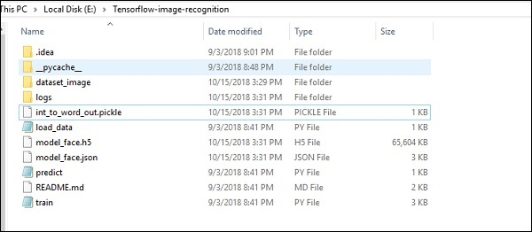
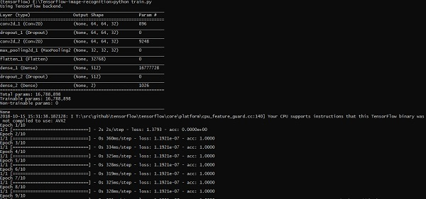
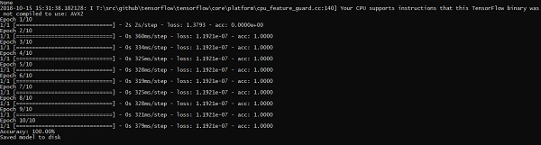

# Image Recognition using TensorFlow
TensorFlow includes a special feature of image recognition and these images are stored in a specific folder. With relatively same images, it will be easy to implement this logic for security purposes.

The folder structure of image recognition code implementation is as shown below −



The dataset_image includes the related images, which need to be loaded. We will focus on image recognition with our logo defined in it. The images are loaded with “load_data.py” script, which helps in keeping a note on various image recognition modules within them.

```
import pickle
from sklearn.model_selection import train_test_split
from scipy import misc

import numpy as np
import os

label = os.listdir("dataset_image")
label = label[1:]
dataset = []

for image_label in label:
   images = os.listdir("dataset_image/"+image_label)
   
   for image in images:
      img = misc.imread("dataset_image/"+image_label+"/"+image)
      img = misc.imresize(img, (64, 64))
      dataset.append((img,image_label))
X = []
Y = []

for input,image_label in dataset:
   X.append(input)
   Y.append(label.index(image_label))

X = np.array(X)
Y = np.array(Y)

X_train,y_train, = X,Y

data_set = (X_train,y_train)

save_label = open("int_to_word_out.pickle","wb")
pickle.dump(label, save_label)
save_label.close()
```
The training of images helps in storing the recognizable patterns within specified folder.

```
import numpy
import matplotlib.pyplot as plt

from keras.layers import Dropout
from keras.layers import Flatten
from keras.constraints import maxnorm
from keras.optimizers import SGD
from keras.layers import Conv2D
from keras.layers.convolutional import MaxPooling2D
from keras.utils import np_utils
from keras import backend as K

import load_data
from keras.models import Sequential
from keras.layers import Dense

import keras
K.set_image_dim_ordering('tf')

# fix random seed for reproducibility
seed = 7
numpy.random.seed(seed)

# load data
(X_train,y_train) = load_data.data_set

# normalize inputs from 0-255 to 0.0-1.0
X_train = X_train.astype('float32')

#X_test = X_test.astype('float32')
X_train = X_train / 255.0

#X_test = X_test / 255.0
# one hot encode outputs
y_train = np_utils.to_categorical(y_train)

#y_test = np_utils.to_categorical(y_test)
num_classes = y_train.shape[1]

# Create the model
model = Sequential()
model.add(Conv2D(32, (3, 3), input_shape = (64, 64, 3), padding = 'same', 
   activation = 'relu', kernel_constraint = maxnorm(3)))

model.add(Dropout(0.2))
model.add(Conv2D(32, (3, 3), activation = 'relu', padding = 'same', 
   kernel_constraint = maxnorm(3)))

model.add(MaxPooling2D(pool_size = (2, 2)))
model.add(Flatten())
model.add(Dense(512, activation = 'relu', kernel_constraint = maxnorm(3)))
model.add(Dropout(0.5))
model.add(Dense(num_classes, activation = 'softmax'))

# Compile model
epochs = 10
lrate = 0.01
decay = lrate/epochs
sgd = SGD(lr = lrate, momentum = 0.9, decay = decay, nesterov = False)
model.compile(loss = 'categorical_crossentropy', optimizer = sgd, metrics = ['accuracy'])
print(model.summary())

#callbacks = [keras.callbacks.EarlyStopping(
   monitor = 'val_loss', min_delta = 0, patience = 0, verbose = 0, mode = 'auto')]
callbacks = [keras.callbacks.TensorBoard(log_dir='./logs', 
   histogram_freq = 0, batch_size = 32, write_graph = True, write_grads = False, 
   write_images = True, embeddings_freq = 0, embeddings_layer_names = None, 
   embeddings_metadata = None)]

# Fit the model

model.fit(X_train, y_train, epochs = epochs, 
   batch_size = 32,shuffle = True,callbacks = callbacks)

# Final evaluation of the model
scores = model.evaluate(X_train, y_train, verbose = 0)
print("Accuracy: %.2f%%" % (scores[1]*100))

# serialize model to JSONx
model_json = model.to_json()
with open("model_face.json", "w") as json_file:
   json_file.write(model_json)

# serialize weights to HDF5
model.save_weights("model_face.h5")
print("Saved model to disk")
```
The above line of code generates an output as shown below −







[Previous Page](../tensorflow/tensorflow_forming_graphs.md) [Next Page](../tensorflow/tensorflow_recommendations_for_neural_network_training.md) 
