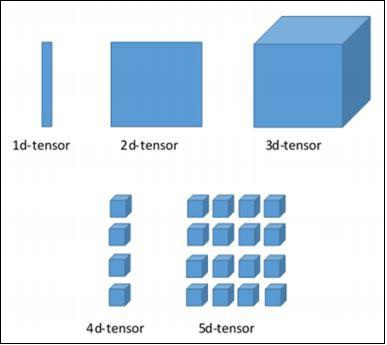
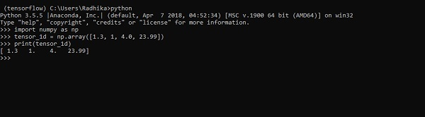
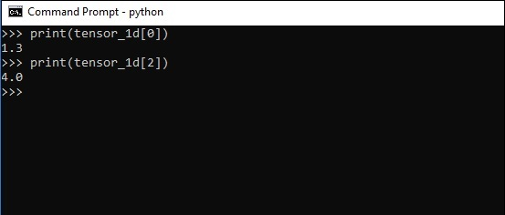
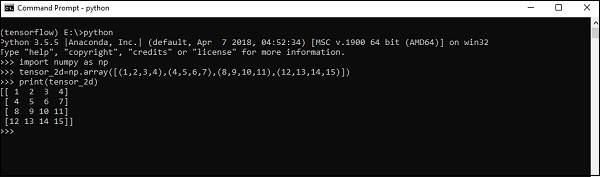
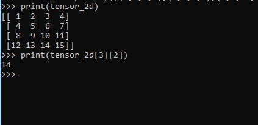
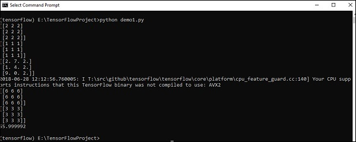

# TensorFlow - Basics
In this chapter, we will learn about the basics of TensorFlow. We will begin by understanding the data structure of tensor.

## Tensor Data Structure
Tensors are used as the basic data structures in TensorFlow language. Tensors represent the connecting edges in any flow diagram called the Data Flow Graph. Tensors are defined as multidimensional array or list.

Tensors are identified by the following three parameters −

### Rank
Unit of dimensionality described within tensor is called rank. It identifies the number of dimensions of the tensor. A rank of a tensor can be described as the order or n-dimensions of a tensor defined.

### Shape
The number of rows and columns together define the shape of Tensor.

### Type
Type describes the data type assigned to Tensor’s elements.

A user needs to consider the following activities for building a Tensor −

   * Build an n-dimensional array
   * Convert the n-dimensional array.



## Various Dimensions of TensorFlow
TensorFlow includes various dimensions. The dimensions are described in brief below −

### One dimensional Tensor
One dimensional tensor is a normal array structure which includes one set of values of the same data type.

**Declaration**

```
>>> import numpy as np
>>> tensor_1d = np.array([1.3, 1, 4.0, 23.99])
>>> print tensor_1d
```
The implementation with the output is shown in the screenshot below −



The indexing of elements is same as Python lists. The first element starts with index of 0; to print the values through index, all you need to do is mention the index number.

```
>>> print tensor_1d[0]
1.3
>>> print tensor_1d[2]
4.0
```




## Two dimensional Tensors
Sequence of arrays are used for creating “two dimensional tensors”.

The creation of two-dimensional tensors is described below −



Following is the complete syntax for creating two dimensional arrays −

```
>>> import numpy as np
>>> tensor_2d = np.array([(1,2,3,4),(4,5,6,7),(8,9,10,11),(12,13,14,15)])
>>> print(tensor_2d)
[[ 1 2 3 4]
[ 4 5 6 7]
[ 8 9 10 11]
[12 13 14 15]]
>>>
```
The specific elements of two dimensional tensors can be tracked with the help of row number and column number specified as index numbers.

```
>>> tensor_2d[3][2]
14
```




## Tensor Handling and Manipulations
In this section, we will learn about Tensor Handling and Manipulations.

To begin with, let us consider the following code −

```
import tensorflow as tf
import numpy as np

matrix1 = np.array([(2,2,2),(2,2,2),(2,2,2)],dtype = 'int32')
matrix2 = np.array([(1,1,1),(1,1,1),(1,1,1)],dtype = 'int32')

print (matrix1)
print (matrix2)

matrix1 = tf.constant(matrix1)
matrix2 = tf.constant(matrix2)
matrix_product = tf.matmul(matrix1, matrix2)
matrix_sum = tf.add(matrix1,matrix2)
matrix_3 = np.array([(2,7,2),(1,4,2),(9,0,2)],dtype = 'float32')
print (matrix_3)

matrix_det = tf.matrix_determinant(matrix_3)
with tf.Session() as sess:
   result1 = sess.run(matrix_product)
   result2 = sess.run(matrix_sum)
   result3 = sess.run(matrix_det)

print (result1)
print (result2)
print (result3)
```
**Output**

The above code will generate the following output −



### Explanation
We have created multidimensional arrays in the above source code. Now, it is important to understand that we created graph and sessions, which manage the Tensors and generate the appropriate output. With the help of graph, we have the output specifying the mathematical calculations between Tensors.


[Previous Page](../tensorflow/tensorflow_machine_learning_deep_learning.md) [Next Page](../tensorflow/tensorflow_convolutional_neural_networks.md) 
