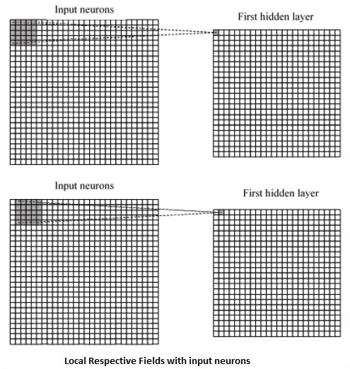

# TensorFlow - Convolutional Neural Networks
After understanding machine-learning concepts, we can now shift our focus to deep learning concepts. Deep learning is a division of machine learning and is considered as a crucial step taken by researchers in recent decades. The examples of deep learning implementation include applications like image recognition and speech recognition.

Following are the two important types of deep neural networks −

   * Convolutional Neural Networks
   * Recurrent Neural Networks

In this chapter, we will focus on the CNN, Convolutional Neural Networks.

## Convolutional Neural Networks
Convolutional Neural networks are designed to process data through multiple layers of arrays. This type of neural networks is used in applications like image recognition or face recognition. The primary difference between CNN and any other ordinary neural network is that CNN takes input as a two-dimensional array and operates directly on the images rather than focusing on feature extraction which other neural networks focus on.

The dominant approach of CNN includes solutions for problems of recognition. Top companies like Google and Facebook have invested in research and development towards recognition projects to get activities done with greater speed.

A convolutional neural network uses three basic ideas −

   * Local respective fields
   * Convolution
   * Pooling

Let us understand these ideas in detail.

CNN utilizes spatial correlations that exist within the input data. Each concurrent layer of a neural network connects some input neurons. This specific region is called local receptive field. Local receptive field focusses on the hidden neurons. The hidden neurons process the input data inside the mentioned field not realizing the changes outside the specific boundary.

Following is a diagram representation of generating local respective fields −



If we observe the above representation, each connection learns a weight of the hidden neuron with an associated connection with movement from one layer to another. Here, individual neurons perform a shift from time to time. This process is called “convolution”.

The mapping of connections from the input layer to the hidden feature map is defined as “shared weights” and bias included is called “shared bias”.

CNN or convolutional neural networks use pooling layers, which are the layers, positioned immediately after CNN declaration. It takes the input from the user as a feature map that comes out of convolutional networks and prepares a condensed feature map. Pooling layers helps in creating layers with neurons of previous layers.

## TensorFlow Implementation of CNN
In this section, we will learn about the TensorFlow implementation of CNN. The steps,which require the execution and proper dimension of the entire network, are as shown below −

**Step 1** − Include the necessary modules for TensorFlow and the data set modules, which are needed to compute the CNN model.

```
import tensorflow as tf
import numpy as np
from tensorflow.examples.tutorials.mnist import input_data
```
**Step 2** − Declare a function called **run_cnn()**, which includes various parameters and optimization variables with declaration of data placeholders. These optimization variables will declare the training pattern.

```
def run_cnn():
   mnist = input_data.read_data_sets("MNIST_data/", one_hot = True)
   learning_rate = 0.0001
   epochs = 10
   batch_size = 50
```
**Step 3** − In this step, we will declare the training data placeholders with input parameters - for 28 x 28 pixels = 784. This is the flattened image data that is drawn from **mnist.train.nextbatch()**.

We can reshape the tensor according to our requirements. The first value (-1) tells function to dynamically shape that dimension based on the amount of data passed to it. The two middle dimensions are set to the image size (i.e. 28 x 28).

```
x = tf.placeholder(tf.float32, [None, 784])
x_shaped = tf.reshape(x, [-1, 28, 28, 1])
y = tf.placeholder(tf.float32, [None, 10])
```
**Step 4** − Now it is important to create some convolutional layers −

```
layer1 = create_new_conv_layer(x_shaped, 1, 32, [5, 5], [2, 2], name = 'layer1')
layer2 = create_new_conv_layer(layer1, 32, 64, [5, 5], [2, 2], name = 'layer2')
```
**Step 5** − Let us flatten the output ready for the fully connected output stage - after two layers of stride 2 pooling with the dimensions of 28 x 28, to dimension of 14 x 14 or minimum 7 x 7 x,y co-ordinates, but with 64 output channels. To create the fully connected with "dense" layer, the new shape needs to be [-1, 7 x 7 x 64]. We can set up some weights and bias values for this layer, then activate with ReLU.

```
flattened = tf.reshape(layer2, [-1, 7 * 7 * 64])

wd1 = tf.Variable(tf.truncated_normal([7 * 7 * 64, 1000], stddev = 0.03), name = 'wd1')
bd1 = tf.Variable(tf.truncated_normal([1000], stddev = 0.01), name = 'bd1')

dense_layer1 = tf.matmul(flattened, wd1) + bd1
dense_layer1 = tf.nn.relu(dense_layer1)
```
**Step 6** − Another layer with specific softmax activations with the required optimizer defines the accuracy assessment, which makes the setup of initialization operator.

```
wd2 = tf.Variable(tf.truncated_normal([1000, 10], stddev = 0.03), name = 'wd2')
bd2 = tf.Variable(tf.truncated_normal([10], stddev = 0.01), name = 'bd2')

dense_layer2 = tf.matmul(dense_layer1, wd2) + bd2
y_ = tf.nn.softmax(dense_layer2)

cross_entropy = tf.reduce_mean(
   tf.nn.softmax_cross_entropy_with_logits(logits = dense_layer2, labels = y))

optimiser = tf.train.AdamOptimizer(learning_rate = learning_rate).minimize(cross_entropy)

correct_prediction = tf.equal(tf.argmax(y, 1), tf.argmax(y_, 1))
accuracy = tf.reduce_mean(tf.cast(correct_prediction, tf.float32))

init_op = tf.global_variables_initializer()
```
**Step 7** − We should set up recording variables. This adds up a summary to store the accuracy of data.

```
tf.summary.scalar('accuracy', accuracy)
   merged = tf.summary.merge_all()
   writer = tf.summary.FileWriter('E:\TensorFlowProject')
   
   with tf.Session() as sess:
      sess.run(init_op)
      total_batch = int(len(mnist.train.labels) / batch_size)
      
      for epoch in range(epochs):
         avg_cost = 0
      for i in range(total_batch):
         batch_x, batch_y = mnist.train.next_batch(batch_size = batch_size)
            _, c = sess.run([optimiser, cross_entropy], feed_dict = {
            x:batch_x, y: batch_y})
            avg_cost += c / total_batch
         test_acc = sess.run(accuracy, feed_dict = {x: mnist.test.images, y:
            mnist.test.labels})
            summary = sess.run(merged, feed_dict = {x: mnist.test.images, y:
            mnist.test.labels})
         writer.add_summary(summary, epoch)

   print("\nTraining complete!")
   writer.add_graph(sess.graph)
   print(sess.run(accuracy, feed_dict = {x: mnist.test.images, y:
      mnist.test.labels}))

def create_new_conv_layer(
   input_data, num_input_channels, num_filters,filter_shape, pool_shape, name):

   conv_filt_shape = [
      filter_shape[0], filter_shape[1], num_input_channels, num_filters]

   weights = tf.Variable(
      tf.truncated_normal(conv_filt_shape, stddev = 0.03), name = name+'_W')
   bias = tf.Variable(tf.truncated_normal([num_filters]), name = name+'_b')

#Out layer defines the output
   out_layer =
      tf.nn.conv2d(input_data, weights, [1, 1, 1, 1], padding = 'SAME')

   out_layer += bias
   out_layer = tf.nn.relu(out_layer)
   ksize = [1, pool_shape[0], pool_shape[1], 1]
   strides = [1, 2, 2, 1]
   out_layer = tf.nn.max_pool(
      out_layer, ksize = ksize, strides = strides, padding = 'SAME')

   return out_layer

if __name__ == "__main__":
run_cnn()
```
Following is the output generated by the above code −

```
See @{tf.nn.softmax_cross_entropy_with_logits_v2}.

2018-09-19 17:22:58.802268: I
T:\src\github\tensorflow\tensorflow\core\platform\cpu_feature_guard.cc:140]
Your CPU supports instructions that this TensorFlow binary was not compiled to
use: AVX2

2018-09-19 17:25:41.522845: W
T:\src\github\tensorflow\tensorflow\core\framework\allocator.cc:101] Allocation
of 1003520000 exceeds 10% of system memory.

2018-09-19 17:25:44.630941: W
T:\src\github\tensorflow\tensorflow\core\framework\allocator.cc:101] Allocation
of 501760000 exceeds 10% of system memory.

Epoch: 1 cost = 0.676 test accuracy: 0.940

2018-09-19 17:26:51.987554: W
T:\src\github\tensorflow\tensorflow\core\framework\allocator.cc:101] Allocation
of 1003520000 exceeds 10% of system memory.
```

[Previous Page](../tensorflow/tensorflow_basics.md) [Next Page](../tensorflow/tensorflow_recurrent_neural_networks.md) 
