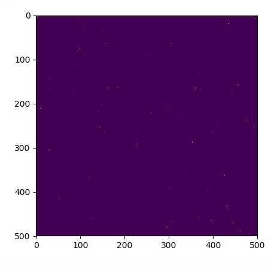
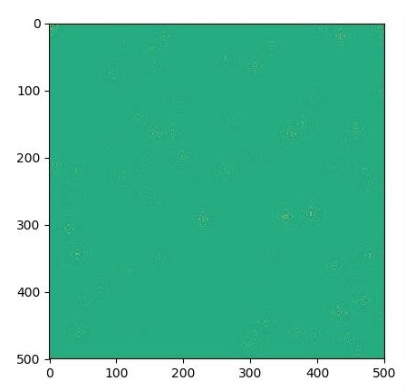

# TensorFlow - Forming Graphs
A partial differential equation (PDE) is a differential equation, which involves partial derivatives with unknown function of several independent variables. With reference to partial differential equations, we will focus on creating new graphs.

Let us assume there is a pond with dimension 500*500 square −

**N = 500**

Now, we will compute partial differential equation and form the respective graph using it. Consider the steps given below for computing graph.

**Step 1** − Import libraries for simulation.

```
import tensorflow as tf
import numpy as np
import matplotlib.pyplot as plt
```
**Step 2** − Include functions for transformation of a 2D array into a convolution kernel and simplified 2D convolution operation.

```
def make_kernel(a):
   a = np.asarray(a)
   a = a.reshape(list(a.shape) + [1,1])
   return tf.constant(a, dtype=1)

def simple_conv(x, k):
   """A simplified 2D convolution operation"""
   x = tf.expand_dims(tf.expand_dims(x, 0), -1)
   y = tf.nn.depthwise_conv2d(x, k, [1, 1, 1, 1], padding = 'SAME')
   return y[0, :, :, 0]

def laplace(x):
   """Compute the 2D laplacian of an array"""
   laplace_k = make_kernel([[0.5, 1.0, 0.5], [1.0, -6., 1.0], [0.5, 1.0, 0.5]])
   return simple_conv(x, laplace_k)
   
sess = tf.InteractiveSession()
```
**Step 3** − Include the number of iterations and compute the graph to display the records accordingly.

```
N = 500

# Initial Conditions -- some rain drops hit a pond

# Set everything to zero
u_init = np.zeros([N, N], dtype = np.float32)
ut_init = np.zeros([N, N], dtype = np.float32)

# Some rain drops hit a pond at random points
for n in range(100):
   a,b = np.random.randint(0, N, 2)
   u_init[a,b] = np.random.uniform()

plt.imshow(u_init)
plt.show()

# Parameters:
# eps -- time resolution
# damping -- wave damping
eps = tf.placeholder(tf.float32, shape = ())
damping = tf.placeholder(tf.float32, shape = ())

# Create variables for simulation state
U = tf.Variable(u_init)
Ut = tf.Variable(ut_init)

# Discretized PDE update rules
U_ = U + eps * Ut
Ut_ = Ut + eps * (laplace(U) - damping * Ut)

# Operation to update the state
step = tf.group(U.assign(U_), Ut.assign(Ut_))

# Initialize state to initial conditions
tf.initialize_all_variables().run()

# Run 1000 steps of PDE
for i in range(1000):
   # Step simulation
   step.run({eps: 0.03, damping: 0.04})
   
   # Visualize every 50 steps
   if i % 500 == 0:
      plt.imshow(U.eval())
      plt.show()
```
The graphs are plotted as shown below −







[Previous Page](../tensorflow/tensorflow_gradient_descent_optimization.md) [Next Page](../tensorflow/image_recognition_using_tensorflow.md) 
