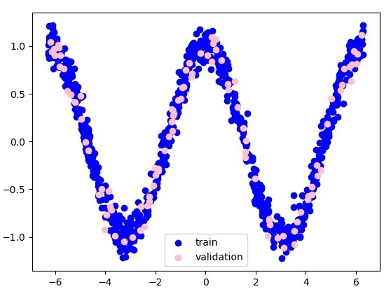
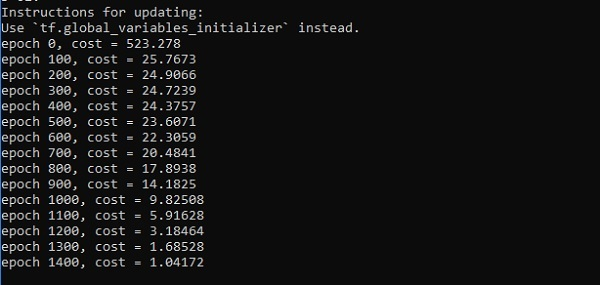
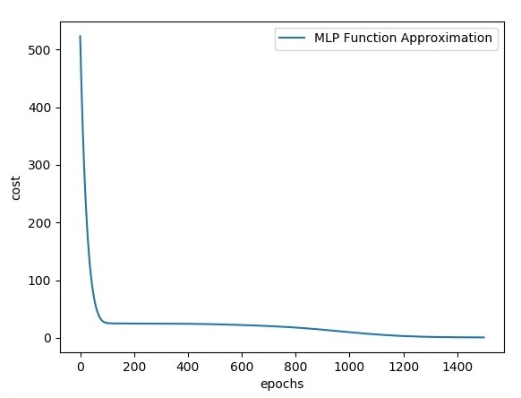

# TensorFlow - Hidden Layers of Perceptron
In this chapter, we will be focus on the network we will have to learn from known set of points called x and f(x). A single hidden layer will build this simple network.

The code for the explanation of hidden layers of perceptron is as shown below −

```
#Importing the necessary modules 
import tensorflow as tf 
import numpy as np 
import math, random 
import matplotlib.pyplot as plt 

np.random.seed(1000) 
function_to_learn = lambda x: np.cos(x) + 0.1*np.random.randn(*x.shape) 
layer_1_neurons = 10 
NUM_points = 1000 

#Training the parameters 
batch_size = 100 
NUM_EPOCHS = 1500 

all_x = np.float32(np.random.uniform(-2*math.pi, 2*math.pi, (1, NUM_points))).T 
   np.random.shuffle(all_x) 

train_size = int(900) 
#Training the first 700 points in the given set x_training = all_x[:train_size] 
y_training = function_to_learn(x_training)

#Training the last 300 points in the given set x_validation = all_x[train_size:] 
y_validation = function_to_learn(x_validation) 

plt.figure(1) 
plt.scatter(x_training, y_training, c = 'blue', label = 'train') 
plt.scatter(x_validation, y_validation, c = 'pink', label = 'validation') 
plt.legend() 
plt.show()

X = tf.placeholder(tf.float32, [None, 1], name = "X")
Y = tf.placeholder(tf.float32, [None, 1], name = "Y")

#first layer 
#Number of neurons = 10 
w_h = tf.Variable(
   tf.random_uniform([1, layer_1_neurons],\ minval = -1, maxval = 1, dtype = tf.float32)) 
b_h = tf.Variable(tf.zeros([1, layer_1_neurons], dtype = tf.float32)) 
h = tf.nn.sigmoid(tf.matmul(X, w_h) + b_h)

#output layer 
#Number of neurons = 10 
w_o = tf.Variable(
   tf.random_uniform([layer_1_neurons, 1],\ minval = -1, maxval = 1, dtype = tf.float32)) 
b_o = tf.Variable(tf.zeros([1, 1], dtype = tf.float32)) 

#build the model 
model = tf.matmul(h, w_o) + b_o 

#minimize the cost function (model - Y) 
train_op = tf.train.AdamOptimizer().minimize(tf.nn.l2_loss(model - Y)) 

#Start the Learning phase 
sess = tf.Session() sess.run(tf.initialize_all_variables()) 

errors = [] 
for i in range(NUM_EPOCHS): 
   for start, end in zip(range(0, len(x_training), batch_size),\ 
      range(batch_size, len(x_training), batch_size)): 
      sess.run(train_op, feed_dict = {X: x_training[start:end],\ Y: y_training[start:end]})
   cost = sess.run(tf.nn.l2_loss(model - y_validation),\ feed_dict = {X:x_validation}) 
   errors.append(cost) 
   
   if i%100 == 0: 
      print("epoch %d, cost = %g" % (i, cost)) 
      
plt.plot(errors,label='MLP Function Approximation') plt.xlabel('epochs') 
plt.ylabel('cost') 
plt.legend() 
plt.show()
```
### Output
Following is the representation of function layer approximation −



Here two data are represented in shape of W. The two data are: train and validation which are represented in distinct colors as visible in legend section.







[Previous Page](../tensorflow/tensorflow_multi_layer_perceptron_learning.md) [Next Page](../tensorflow/tensorflow_optimizers.md) 
