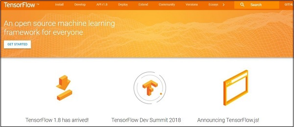

# TensorFlow - Introduction
TensorFlow is a software library or framework, designed by the Google team to implement machine learning and deep learning concepts in the easiest manner. It combines the computational algebra of optimization techniques for easy calculation of many mathematical expressions.

The official website of TensorFlow is mentioned below −

[www.tensorflow.org](https://www.tensorflow.org) 

Let us now consider the following important features of TensorFlow −

   * It includes a feature of that defines, optimizes and calculates mathematical expressions easily with the help of multi-dimensional arrays called tensors.
   * It includes a programming support of deep neural networks and machine learning techniques.
   * It includes a high scalable feature of computation with various data sets.
   * TensorFlow uses GPU computing, automating management. It also includes a unique feature of optimization of same memory and the data used.

## Why is TensorFlow So Popular?
TensorFlow is well-documented and includes plenty of machine learning libraries. It offers a few important functionalities and methods for the same.

TensorFlow is also called a “Google” product. It includes a variety of machine learning and deep learning algorithms. TensorFlow can train and run deep neural networks for handwritten digit classification, image recognition, word embedding and creation of various sequence models.

[Previous Page](../tensorflow/index.md) [Next Page](../tensorflow/tensorflow_installation.md) 
