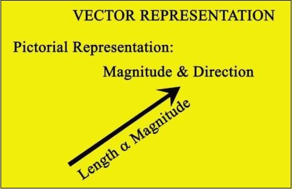
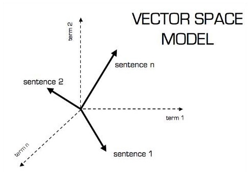
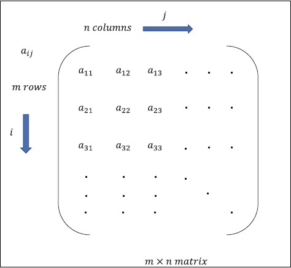

# TensorFlow - Mathematical Foundations
It is important to understand mathematical concepts needed for TensorFlow before creating the basic application in TensorFlow. Mathematics is considered as the heart of any machine learning algorithm. It is with the help of core concepts of Mathematics, a solution for specific machine learning algorithm is defined.

## Vector
An array of numbers, which is either continuous or discrete, is defined as a vector. Machine learning algorithms deal with fixed length vectors for better output generation.

Machine learning algorithms deal with multidimensional data so vectors play a crucial role.

The pictorial representation of vector model is as shown below −

### Scalar
Scalar can be defined as one-dimensional vector. Scalars are those, which include only magnitude and no direction. With scalars, we are only concerned with the magnitude.

Examples of scalar include weight and height parameters of children.

### Matrix
Matrix can be defined as multi-dimensional arrays, which are arranged in the format of rows and columns. The size of matrix is defined by row length and column length. Following figure shows the representation of any specified matrix.

Consider the matrix with “m” rows and “n” columns as mentioned above, the matrix representation will be specified as “m*n matrix” which defined the length of matrix as well.

## Mathematical Computations
In this section, we will learn about the different Mathematical Computations in TensorFlow.

### Addition of matrices
Addition of two or more matrices is possible if the matrices are of the same dimension. The addition implies addition of each element as per the given position.

Consider the following example to understand how addition of matrices works −

$$Example:A=\begin{bmatrix}1 &amp; 2 \\3 &amp; 4 \end{bmatrix}B=\begin{bmatrix}5 &amp; 6 \\7 &amp; 8 \end{bmatrix}\:then\:A+B=\begin{bmatrix}1+5 &amp; 2+6 \\3+7 &amp; 4+8 \end{bmatrix}=\begin{bmatrix}6 &amp; 8 \\10 &amp; 12 \end{bmatrix}$$

### Subtraction of matrices
The subtraction of matrices operates in similar fashion like the addition of two matrices. The user can subtract two matrices provided the dimensions are equal.

$$Example:A-\begin{bmatrix}1 &amp; 2 \\3 &amp; 4 \end{bmatrix}B-\begin{bmatrix}5 &amp; 6 \\7 &amp; 8 \end{bmatrix}\:then\:A-B-\begin{bmatrix}1-5 &amp; 2-6 \\3-7 &amp; 4-8 \end{bmatrix}-\begin{bmatrix}-4 &amp; -4 \\-4 &amp; -4 \end{bmatrix}$$

### Multiplication of matrices
For two matrices A m*n and B p*q to be multipliable, **n** should be equal to **p**. The resulting matrix is −

C m*q

$$A=\begin{bmatrix}1 &amp; 2 \\3 &amp; 4 \end{bmatrix}B=\begin{bmatrix}5 &amp; 6 \\7 &amp; 8 \end{bmatrix}$$

$$c_{11}=\begin{bmatrix}1 &amp; 2 \end{bmatrix}\begin{bmatrix}5 \\7 \end{bmatrix}=1\times5+2\times7=19\:c_{12}=\begin{bmatrix}1 &amp; 2 \end{bmatrix}\begin{bmatrix}6 \\8 \end{bmatrix}=1\times6+2\times8=22$$

$$c_{21}=\begin{bmatrix}3 &amp; 4 \end{bmatrix}\begin{bmatrix}5 \\7 \end{bmatrix}=3\times5+4\times7=43\:c_{22}=\begin{bmatrix}3 &amp; 4 \end{bmatrix}\begin{bmatrix}6 \\8 \end{bmatrix}=3\times6+4\times8=50$$

$$C=\begin{bmatrix}c_{11} &amp; c_{12} \\c_{21} &amp; c_{22} \end{bmatrix}=\begin{bmatrix}19 &amp; 22 \\43 &amp; 50 \end{bmatrix}$$

### Transpose of matrix
The transpose of a matrix A, m*n is generally represented by AT (transpose) n*m and is obtained by transposing the column vectors as row vectors.

$$Example:A=\begin{bmatrix}1 &amp; 2 \\3 &amp; 4 \end{bmatrix}\:then\:A^{T}\begin{bmatrix}1 &amp; 3 \\2 &amp; 4 \end{bmatrix}$$

### Dot product of vectors
Any vector of dimension n can be represented as a matrix v = R^n*1.

$$v_{1}=\begin{bmatrix}v_{11} \\v_{12} \\\cdot\\\cdot\\\cdot\\v_{1n}\end{bmatrix}v_{2}=\begin{bmatrix}v_{21} \\v_{22} \\\cdot\\\cdot\\\cdot\\v_{2n}\end{bmatrix}$$

The dot product of two vectors is the sum of the product of corresponding components − Components along the same dimension and can be expressed as

$$v_{1}\cdot v_{2}=v_1^Tv_{2}=v_2^Tv_{1}=v_{11}v_{21}+v_{12}v_{22}+\cdot\cdot+v_{1n}v_{2n}=\displaystyle\sum\limits_{k=1}^n v_{1k}v_{2k}$$

The example of dot product of vectors is mentioned below −

$$Example:v_{1}=\begin{bmatrix}1 \\2 \\3\end{bmatrix}v_{2}=\begin{bmatrix}3 \\5 \\-1\end{bmatrix}v_{1}\cdot v_{2}=v_1^Tv_{2}=1\times3+2\times5-3\times1=10$$

[Previous Page](../tensorflow/tensorflow_understanding_artificial_intelligence.md) [Next Page](../tensorflow/tensorflow_machine_learning_deep_learning.md) 
