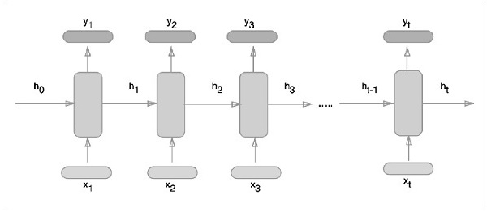
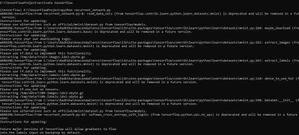
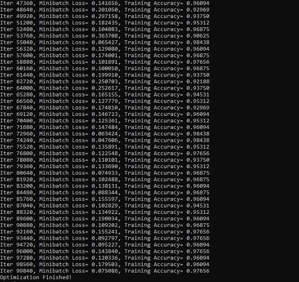

# TensorFlow - Recurrent Neural Networks
Recurrent neural networks is a type of deep learning-oriented algorithm, which follows a sequential approach. In neural networks, we always assume that each input and output is independent of all other layers. These type of neural networks are called recurrent because they perform mathematical computations in sequential manner.

Consider the following steps to train a recurrent neural network −

**Step 1** − Input a specific example from dataset.

**Step 2** − Network will take an example and compute some calculations using randomly initialized variables.

**Step 3** − A predicted result is then computed.

**Step 4** − The comparison of actual result generated with the expected value will produce an error.

**Step 5** − To trace the error, it is propagated through same path where the variables are also adjusted.

**Step 6** − The steps from 1 to 5 are repeated until we are confident that the variables declared to get the output are defined properly.

**Step 7** − A systematic prediction is made by applying these variables to get new unseen input.

The schematic approach of representing recurrent neural networks is described below −



## Recurrent Neural Network Implementation with TensorFlow
In this section, we will learn how to implement recurrent neural network with TensorFlow.

**Step 1** − TensorFlow includes various libraries for specific implementation of the recurrent neural network module.

```
#Import necessary modules
from __future__ import print_function

import tensorflow as tf
from tensorflow.contrib import rnn
from tensorflow.examples.tutorials.mnist import input_data
mnist = input_data.read_data_sets("/tmp/data/", one_hot = True)
```
As mentioned above, the libraries help in defining the input data, which forms the primary part of recurrent neural network implementation.

**Step 2** − Our primary motive is to classify the images using a recurrent neural network, where we consider every image row as a sequence of pixels. MNIST image shape is specifically defined as 28*28 px. Now we will handle 28 sequences of 28 steps for each sample that is mentioned. We will define the input parameters to get the sequential pattern done.

```
n_input = 28 # MNIST data input with img shape 28*28
n_steps = 28
n_hidden = 128
n_classes = 10

# tf Graph input
x = tf.placeholder("float", [None, n_steps, n_input])
y = tf.placeholder("float", [None, n_classes]
weights = {
   'out': tf.Variable(tf.random_normal([n_hidden, n_classes]))
}
biases = {
   'out': tf.Variable(tf.random_normal([n_classes]))
}
```
**Step 3** − Compute the results using a defined function in RNN to get the best results. Here, each data shape is compared with current input shape and the results are computed to maintain the accuracy rate.

```
def RNN(x, weights, biases):
   x = tf.unstack(x, n_steps, 1)

   # Define a lstm cell with tensorflow
   lstm_cell = rnn.BasicLSTMCell(n_hidden, forget_bias=1.0)

   # Get lstm cell output
   outputs, states = rnn.static_rnn(lstm_cell, x, dtype = tf.float32)

   # Linear activation, using rnn inner loop last output
   return tf.matmul(outputs[-1], weights['out']) + biases['out']

pred = RNN(x, weights, biases)

# Define loss and optimizer
cost = tf.reduce_mean(tf.nn.softmax_cross_entropy_with_logits(logits = pred, labels = y))
optimizer = tf.train.AdamOptimizer(learning_rate = learning_rate).minimize(cost)

# Evaluate model
correct_pred = tf.equal(tf.argmax(pred,1), tf.argmax(y,1))
accuracy = tf.reduce_mean(tf.cast(correct_pred, tf.float32))

# Initializing the variables
init = tf.global_variables_initializer()
```
**Step 4** − In this step, we will launch the graph to get the computational results. This also helps in calculating the accuracy for test results.

```
with tf.Session() as sess:
   sess.run(init)
   step = 1
   # Keep training until reach max iterations
   
   while step * batch_size < training_iters:
      batch_x, batch_y = mnist.train.next_batch(batch_size)
      batch_x = batch_x.reshape((batch_size, n_steps, n_input))
      sess.run(optimizer, feed_dict={x: batch_x, y: batch_y})
      
      if step % display_step == 0:
         # Calculate batch accuracy
         acc = sess.run(accuracy, feed_dict={x: batch_x, y: batch_y})
         
         # Calculate batch loss
         loss = sess.run(cost, feed_dict={x: batch_x, y: batch_y})
         
         print("Iter " + str(step*batch_size) + ", Minibatch Loss= " + \
            "{:.6f}".format(loss) + ", Training Accuracy= " + \
            "{:.5f}".format(acc))
      step += 1
   print("Optimization Finished!")
      test_len = 128
   test_data = mnist.test.images[:test_len].reshape((-1, n_steps, n_input))
   
   test_label = mnist.test.labels[:test_len]
   print("Testing Accuracy:", \
      sess.run(accuracy, feed_dict={x: test_data, y: test_label}))
```
The screenshots below show the output generated −







[Previous Page](../tensorflow/tensorflow_convolutional_neural_networks.md) [Next Page](../tensorflow/tensorflow_tensorboard_visualization.md) 
