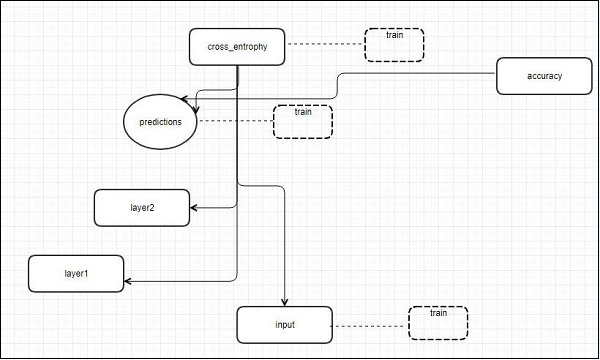
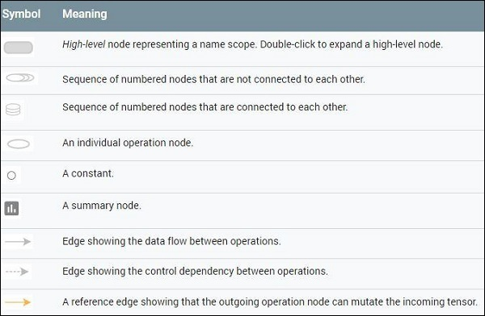

# TensorFlow - TensorBoard Visualization
TensorFlow includes a visualization tool, which is called the TensorBoard. It is used for analyzing Data Flow Graph and also used to understand machine-learning models. The important feature of TensorBoard includes a view of different types of statistics about the parameters and details of any graph in vertical alignment.

Deep neural network includes up to 36,000 nodes. TensorBoard helps in collapsing these nodes in high-level blocks and highlighting the identical structures. This allows better analysis of graph focusing on the primary sections of the computation graph. The TensorBoard visualization is said to be very interactive where a user can pan, zoom and expand the nodes to display the details.

The following schematic diagram representation shows the complete working of TensorBoard visualization −



The algorithms collapse nodes into high-level blocks and highlight the specific groups with identical structures, which separate high-degree nodes. The TensorBoard thus created is useful and is treated equally important for tuning a machine learning model. This visualization tool is designed for the configuration log file with summary information and details that need to be displayed.

Let us focus on the demo example of TensorBoard visualization with the help of the following code −

```
import tensorflow as tf 

# Constants creation for TensorBoard visualization 
a = tf.constant(10,name = "a") 
b = tf.constant(90,name = "b") 
y = tf.Variable(a+b*2,name = 'y') 
model = tf.initialize_all_variables() #Creation of model 

with tf.Session() as session: 
   merged = tf.merge_all_summaries() 
   writer = tf.train.SummaryWriter("/tmp/tensorflowlogs",session.graph) 
   session.run(model) 
   print(session.run(y))
```
The following table shows the various symbols of TensorBoard visualization used for the node representation −




[Previous Page](../tensorflow/tensorflow_recurrent_neural_networks.md) [Next Page](../tensorflow/tensorflow_word_embedding.md) 
