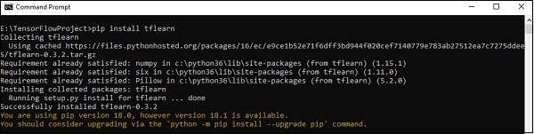

# TensorFlow - TFLearn And Its Installation
TFLearn can be defined as a modular and transparent deep learning aspect used in TensorFlow framework. The main motive of TFLearn is to provide a higher level API to TensorFlow for facilitating and showing up new experiments.

Consider the following important features of TFLearn −

   * TFLearn is easy to use and understand.
   * It includes easy concepts to build highly modular network layers, optimizers and various metrics embedded within them.
   * It includes full transparency with TensorFlow work system.
   * It includes powerful helper functions to train the built in tensors which accept multiple inputs, outputs and optimizers.
   * It includes easy and beautiful graph visualization.
   * The graph visualization includes various details of weights, gradients and activations.

Install TFLearn by executing the following command −

```
pip install tflearn
```
Upon execution of the above code, the following output will be generated −



The following illustration shows the implementation of TFLearn with Random Forest classifier −

```
from __future__ import division, print_function, absolute_import

#TFLearn module implementation
import tflearn
from tflearn.estimators import RandomForestClassifier

# Data loading and pre-processing with respect to dataset
import tflearn.datasets.mnist as mnist
X, Y, testX, testY = mnist.load_data(one_hot = False)

m = RandomForestClassifier(n_estimators = 100, max_nodes = 1000)
m.fit(X, Y, batch_size = 10000, display_step = 10)

print("Compute the accuracy on train data:")
print(m.evaluate(X, Y, tflearn.accuracy_op))

print("Compute the accuracy on test set:")
print(m.evaluate(testX, testY, tflearn.accuracy_op))

print("Digits for test images id 0 to 5:")
print(m.predict(testX[:5]))

print("True digits:")
print(testY[:5])
```

[Previous Page](../tensorflow/tensorflow_linear_regression.md) [Next Page](../tensorflow/tensorflow_cnn_and_rnn_difference.md) 
