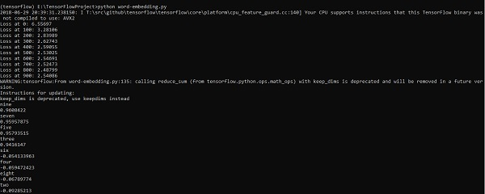

# TensorFlow - Word Embedding
Word embedding is the concept of mapping from discrete objects such as words to vectors and real numbers. It is important for input for machine learning. The concept includes standard functions, which effectively transform discrete input objects to useful vectors.

The sample illustration of input of word embedding is as shown below −

```
blue: (0.01359, 0.00075997, 0.24608, ..., -0.2524, 1.0048, 0.06259)
blues: (0.01396, 0.11887, -0.48963, ..., 0.033483, -0.10007, 0.1158)
orange: (-0.24776, -0.12359, 0.20986, ..., 0.079717, 0.23865, -0.014213)
oranges: (-0.35609, 0.21854, 0.080944, ..., -0.35413, 0.38511, -0.070976)
```
## Word2vec
Word2vec is the most common approach used for unsupervised word embedding technique. It trains the model in such a way that a given input word predicts the word’s context by using skip-grams.

TensorFlow enables many ways to implement this kind of model with increasing levels of sophistication and optimization and using multithreading concepts and higher-level abstractions.

```
import os 
import math 
import numpy as np 
import tensorflow as tf 

from tensorflow.contrib.tensorboard.plugins import projector 
batch_size = 64 
embedding_dimension = 5 
negative_samples = 8 
LOG_DIR = "logs/word2vec_intro" 

digit_to_word_map = {
   1: "One", 
   2: "Two", 
   3: "Three", 
   4: "Four", 
   5: "Five", 
   6: "Six", 
   7: "Seven", 
   8: "Eight", 
   9: "Nine"} 
sentences = [] 

# Create two kinds of sentences - sequences of odd and even digits. 
   for i in range(10000): 
   rand_odd_ints = np.random.choice(range(1, 10, 2), 3) 
      sentences.append(" ".join([digit_to_word_map[r] for r in rand_odd_ints])) 
   rand_even_ints = np.random.choice(range(2, 10, 2), 3) 
      sentences.append(" ".join([digit_to_word_map[r] for r in rand_even_ints])) 
   
# Map words to indices
word2index_map = {} 
index = 0 

for sent in sentences: 
   for word in sent.lower().split(): 
   
   if word not in word2index_map: 
      word2index_map[word] = index 
      index += 1 
index2word_map = {index: word for word, index in word2index_map.items()} 

vocabulary_size = len(index2word_map) 

# Generate skip-gram pairs 
skip_gram_pairs = [] 

for sent in sentences: 
   tokenized_sent = sent.lower().split() 
   
   for i in range(1, len(tokenized_sent)-1):        
      word_context_pair = [[word2index_map[tokenized_sent[i-1]], 
         word2index_map[tokenized_sent[i+1]]], word2index_map[tokenized_sent[i]]] 
      
      skip_gram_pairs.append([word_context_pair[1], word_context_pair[0][0]]) 
      skip_gram_pairs.append([word_context_pair[1], word_context_pair[0][1]]) 

def get_skipgram_batch(batch_size): 
   instance_indices = list(range(len(skip_gram_pairs))) 
      np.random.shuffle(instance_indices)
   batch = instance_indices[:batch_size] 
   x = [skip_gram_pairs[i][0] for i in batch] 
   y = [[skip_gram_pairs[i][1]] for i in batch] 
   return x, y 
   
# batch example 
x_batch, y_batch = get_skipgram_batch(8) 
x_batch 
y_batch 
[index2word_map[word] for word in x_batch] [index2word_map[word[0]] for word in y_batch] 

# Input data, labels train_inputs = tf.placeholder(tf.int32, shape = [batch_size]) 
   train_labels = tf.placeholder(tf.int32, shape = [batch_size, 1]) 

# Embedding lookup table currently only implemented in CPU with 
   tf.name_scope("embeddings"): 
   embeddings = tf.Variable(    
      tf.random_uniform([vocabulary_size, embedding_dimension], -1.0, 1.0), 
         name = 'embedding') 
   # This is essentialy a lookup table 
   embed = tf.nn.embedding_lookup(embeddings, train_inputs) 
   
# Create variables for the NCE loss
nce_weights = tf.Variable(     
   tf.truncated_normal([vocabulary_size, embedding_dimension], stddev = 1.0 / 
      math.sqrt(embedding_dimension))) 
   
nce_biases = tf.Variable(tf.zeros([vocabulary_size])) 

loss = tf.reduce_mean(     
   tf.nn.nce_loss(weights = nce_weights, biases = nce_biases, inputs = embed, 
   labels = train_labels,num_sampled = negative_samples, 
   num_classes = vocabulary_size)) tf.summary.scalar("NCE_loss", loss) 
   
# Learning rate decay 
global_step = tf.Variable(0, trainable = False) 
   learningRate = tf.train.exponential_decay(learning_rate = 0.1, 
   global_step = global_step, decay_steps = 1000, decay_rate = 0.95, staircase = True) 

train_step = tf.train.GradientDescentOptimizer(learningRate).minimize(loss) 
   merged = tf.summary.merge_all() 
with tf.Session() as sess: 
   train_writer = tf.summary.FileWriter(LOG_DIR,    
      graph = tf.get_default_graph()) 
   saver = tf.train.Saver() 
   
   with open(os.path.join(LOG_DIR, 'metadata.tsv'), "w") as metadata: 
      metadata.write('Name\tClass\n') for k, v in index2word_map.items(): 
      metadata.write('%s\t%d\n' % (v, k)) 
   
   config = projector.ProjectorConfig() 
   embedding = config.embeddings.add() embedding.tensor_name = embeddings.name 
   
   # Link this tensor to its metadata file (e.g. labels). 
   embedding.metadata_path = os.path.join(LOG_DIR, 'metadata.tsv') 
      projector.visualize_embeddings(train_writer, config) 
   
   tf.global_variables_initializer().run() 
   
   for step in range(1000): 
      x_batch, y_batch = get_skipgram_batch(batch_size) summary, _ = sess.run(
         [merged, train_step], feed_dict = {train_inputs: x_batch, train_labels: y_batch})
      train_writer.add_summary(summary, step)
      
      if step % 100 == 0:
         saver.save(sess, os.path.join(LOG_DIR, "w2v_model.ckpt"), step)
         loss_value = sess.run(loss, feed_dict = {
            train_inputs: x_batch, train_labels: y_batch})
         print("Loss at %d: %.5f" % (step, loss_value))

   # Normalize embeddings before using
   norm = tf.sqrt(tf.reduce_sum(tf.square(embeddings), 1, keep_dims = True))
   normalized_embeddings = embeddings /
      norm normalized_embeddings_matrix = sess.run(normalized_embeddings)
   
ref_word = normalized_embeddings_matrix[word2index_map["one"]]

cosine_dists = np.dot(normalized_embeddings_matrix, ref_word)
ff = np.argsort(cosine_dists)[::-1][1:10] for f in ff: print(index2word_map[f])
print(cosine_dists[f])
```
### Output
The above code generates the following output −




[Previous Page](../tensorflow/tensorflow_tensorboard_visualization.md) [Next Page](../tensorflow/tensorflow_single_layer_perceptron.md) 
