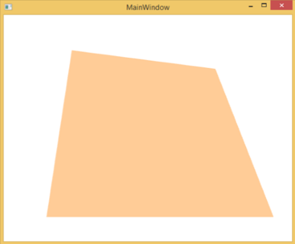
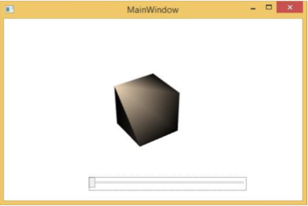
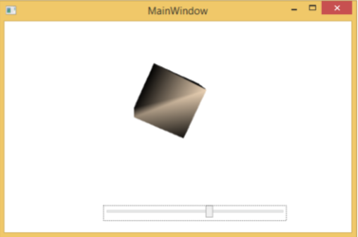

# WPF - 3D Graphics
Windows Presentation Foundation (WPF) provides a functionality to draw, transform, and animate 3D graphics as per your application requirement. It doesn’t support full fledge 3D game development, but to some level, you can create 3D graphics.

By combining 2D and 3D graphics, you can also create rich controls, provide complex illustrations of data, or enhance the user experience of an application's interface. The Viewport3D element hosts a 3D model into our WPF application.

## Example
Let’s take a simple example to understand how to use 3D graphics.

   * Create a new WPF project with the name **WPF3DGraphics**.
   * The following XAML code shows how to create a 2D object using in 3D geometry.

```
<Window x:Class = "WPF3DGraphics.MainWindow" 
   xmlns = "http://schemas.microsoft.com/winfx/2006/xaml/presentation" 
   xmlns:x = "http://schemas.microsoft.com/winfx/2006/xaml" 
   xmlns:mc = "http://schemas.openxmlformats.org/markup-compatibility/2006" 
   xmlns:local = "clr-namespace:WPF3DGraphics" 
   mc:Ignorable = "d" Title = "MainWindow" Height = "500" Width = "604"> 
	
   <Grid> 
      <Viewport3D> 
		
         <Viewport3D.Camera> 
            <PerspectiveCamera Position = "2,0,10" LookDirection = "0.2,0.4,-1"
               FieldOfView = "65" UpDirection = "0,1,0" /> 
         </Viewport3D.Camera> 
			
         <ModelVisual3D> 
            <ModelVisual3D.Content> 
               <Model3DGroup> 
                  <AmbientLight Color = "Bisque" /> 
						
                  <GeometryModel3D> 
                     <GeometryModel3D.Geometry> 
                        <MeshGeometry3D Positions = "0,0,0 0,8,0 10,0,0 8,8,0"
                           Normals = "0,0,1 0,0,1 0,0,1 0,0,1" TriangleIndices = "0,2,1 1,2,3"/> 
                     </GeometryModel3D.Geometry>
							
                     <GeometryModel3D.Material> 
                        <DiffuseMaterial Brush = "Bisque" /> 
                     </GeometryModel3D.Material> 
                  </GeometryModel3D>
						
               </Model3DGroup> 
            </ModelVisual3D.Content> 
         </ModelVisual3D> 
			
      </Viewport3D> 
   </Grid> 
	
</Window>
```
When you compile and execute the above code, it will produce a 2D object in 3D.



## Example
Let’s have a look at another example which shows a 3D object.

   * Create a new WPF project with the name **WPF3DGraphics1**
   * The following XAML code creates a 3D object and a slider. With the help of the slider, you can rotate this 3D object.

```
<Window x:Class = "WPF3DGraphics1.MainWindow" 
   xmlns = "http://schemas.microsoft.com/winfx/2006/xaml/presentation" 
   xmlns:x = "http://schemas.microsoft.com/winfx/2006/xaml" 
   xmlns:d = "http://schemas.microsoft.com/expression/blend/2008" 
   xmlns:mc = "http://schemas.openxmlformats.org/markup-compatibility/2006" 
   xmlns:local = "clr-namespace:WPF3DGraphics1" 
   mc:Ignorable = "d" Title = "MainWindow" Height = "350" Width = "525"> 
	
   <Grid>
      <Viewport3D Name="viewport3D1">
		
         <Viewport3D.Camera> 
            <PerspectiveCamera x:Name = "camMain" Position = "6 5 4" LookDirection = "-6 -5 -4"> 
            </PerspectiveCamera> 
         </Viewport3D.Camera>
		
         <ModelVisual3D> 
            <ModelVisual3D.Content> 
               <DirectionalLight x:Name = "dirLightMain" Direction = "-1,-1,-1"> 
               </DirectionalLight> 
            </ModelVisual3D.Content> 
         </ModelVisual3D>
		
         <ModelVisual3D x:Name = "MyModel"> 
            <ModelVisual3D.Content> 
               <GeometryModel3D>
				
                  <GeometryModel3D.Geometry>
                     <MeshGeometry3D x:Name = "meshMain"
                        Positions = "0 0 0  1 0 0  0 1 0  1 1 0  0 0 1  1 0 1  0 1 1  0 1 1"  
                        TriangleIndices = "2 3 1  3 1 0  7 1 3  7 5 1  6 5 7  6 4 5  6 2 0
                        2 0 4  2 7 3  2 6 7  0 1 5  0 5 4"> 
                     </MeshGeometry3D> 
                  </GeometryModel3D.Geometry> 
					
                  <GeometryModel3D.Material> 
                     <DiffuseMaterial x:Name = "matDiffuseMain">
                        <DiffuseMaterial.Brush> 
                           <SolidColorBrush Color = "Bisque"/> 
                        </DiffuseMaterial.Brush> 
                     </DiffuseMaterial> 
                  </GeometryModel3D.Material> 
					
               </GeometryModel3D>
            </ModelVisual3D.Content>
			 
            <ModelVisual3D.Transform>                         
               <RotateTransform3D> 
                  <RotateTransform3D.Rotation> 
                     <AxisAngleRotation3D x:Name = "rotate" Axis = "1 2 1"/> 
                  </RotateTransform3D.Rotation> 
               </RotateTransform3D>
            </ModelVisual3D.Transform> 
			 
         </ModelVisual3D> 
      </Viewport3D>
		
      <Slider Height = "23" HorizontalAlignment = "Left"  
         Margin = "145,271,0,0" Name = "slider1" 
         VerticalAlignment = "Top" Width = "269"  
         Maximum = "360" 
         Value = "{Binding ElementName = rotate, Path=Angle}" /> 
			
   </Grid> 
	
</Window>
```
When you run your application, it will produce a 3D object and a slider on your window.



When you slide the slider, the object on your window will also rotate.



We recommend that you execute the above code and try more 3D geometry.


[Previous Page](../wpf/wpf_2d_graphics.md) [Next Page](../wpf/wpf_multimedia.md) 
