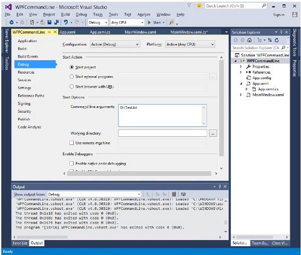
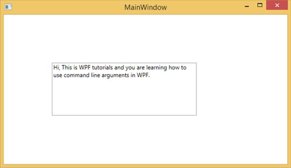
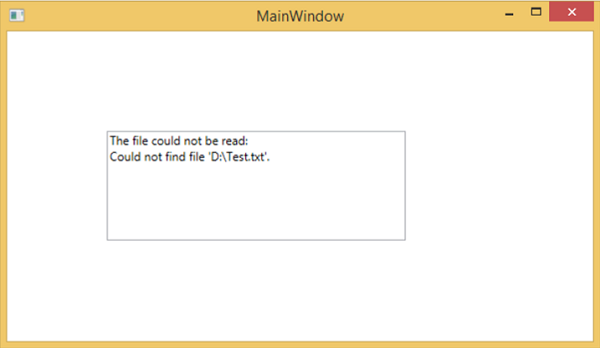

# WPF - Command Line
Command line argument is a mechanism where a user can pass a set of parameters or values to a WPF application when it is executed. These arguments are very important to control an application from outside, for example, if you want to open a Word document from the command prompt, then you can use this command “**C:\> start winword word1.docx**” and it will open **word1.docx** document.

Command line arguments are handled in Startup function. Following is a simple example which shows how to pass command line arguments to a WPF application. Let’s create a new WPF application with the name **WPFCommandLine**.

   * Drag one textbox from the toolbox to the design window.
   * In this example, we will pass a txt file path to our application as command line parameter.
   * The program will read the txt file and then write all the text on the text box.
   * The following XAML code creates a textbox and initializes it with some properties.

```
<Window x:Class = "WPFCommandLine.MainWindow" 
   xmlns = "http://schemas.microsoft.com/winfx/2006/xaml/presentation" 
   xmlns:x = "http://schemas.microsoft.com/winfx/2006/xaml" 
   xmlns:d = "http://schemas.microsoft.com/expression/blend/2008" 
   xmlns:mc = "http://schemas.openxmlformats.org/markup-compatibility/2006" 
   xmlns:local = "clr-namespace:WPFCommandLine" 
   mc:Ignorable = "d" Title = "MainWindow" Height = "350" Width = "525"> 
	
   <Grid> 
      <TextBox x:Name = "textBox" HorizontalAlignment = "Left"  
         Height = "180" Margin = "100" TextWrapping = "Wrap" 
         VerticalAlignment = "Top" Width = "300"/> 
   </Grid> 
	
</Window>
```
   * Now subscribe the Startup event in App.xaml file as shown below.

```
<Application x:Class = "WPFCommandLine.App" 
   xmlns = "http://schemas.microsoft.com/winfx/2006/xaml/presentation" 
   xmlns:x = "http://schemas.microsoft.com/winfx/2006/xaml"
   xmlns:local = "clr-namespace:WPFCommandLine" 
   StartupUri = "MainWindow.xaml" Startup = "app_Startup"> 
	
   <Application.Resources> 
          
   </Application.Resources>
	
</Application>
```
   * Given below is the implementation of the app_Startup event in App.xaml.cs which will get the command line arguments.

```
using System.Windows;
  
namespace WPFCommandLine { 
   /// <summary> 
      /// Interaction logic for App.xaml 
   /// </summary> 
	
   public partial class App : Application { 
      public static string[] Args;
		
      void app_Startup(object sender, StartupEventArgs e) { 
         // If no command line arguments were provided, don't process them 
         if (e.Args.Length == 0) return;
			
         if (e.Args.Length > 0) { 
            Args = e.Args; 
         } 
      } 
   } 
}
```
   * Now, in the MainWindow class, the program will open the txt file and write all the text on textbox.
   * If there is some error found, then the program will display an error message on textbox.

```
using System; 
using System.IO; 
using System.Windows;  

namespace WPFCommandLine { 

   public partial class MainWindow : Window { 
	
      public MainWindow() { 
         InitializeComponent(); 
         String[] args = App.Args;
			
         try {
            // Open the text file using a stream reader. 
            using (StreamReader sr = new StreamReader(args[0])) { 
               // Read the stream to a string, and write  
               // the string to the text box 
               String line = sr.ReadToEnd(); 
               textBox.AppendText(line.ToString()); 
               textBox.AppendText("\n"); 
            } 
         } 
         catch (Exception e) { 
            textBox.AppendText("The file could not be read:"); 
            textBox.AppendText("\n"); 
            textBox.AppendText(e.Message); 
         } 
      } 
   } 
}
```
   * When the above code is compiled and executed, it will produce a blank window with a textbox because this program needs a command line argument. So Visual Studio provides an easy way to execute your application with command line parameters.
   * Right click on your WPF project in the solution explorer and select properties, it will display the following window.



   * Select Debug option and write the file path in the Command line argument.
   * Create a txt file with Test.txt and write some text in that file and save it on any location. In this case, the txt file is saved on “**D:\**” hard drive.
   * Save the changes in your project and compile and execute your application now. You will see the text in TextBox which the program reads from the Text.txt file.



Now let’s try and change the file name on your machine from **Test.txt** to **Test1.txt** and execute your program again, then you will see that error message in the text box.



We recommend that you execute the above code and follow all the steps to execute your application successfully.


[Previous Page](../wpf/wpf_input.md) [Next Page](../wpf/wpf_data_binding.md) 
