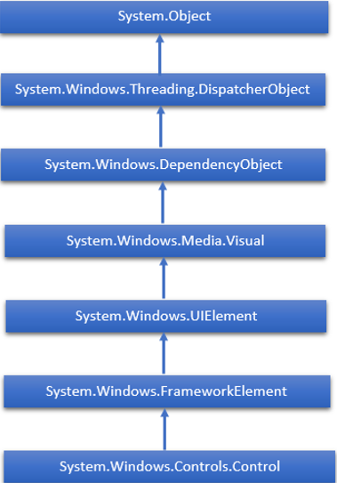

# WPF - Controls
Windows Presentation Foundation (WPF) allows developers to easily build and create visually enriched UI based applications.

   * The classical UI elements or controls in other UI frameworks are also enhanced in WPF applications.
   * All of the standard WPF controls can be found in the Toolbox which is a part of the System.Windows.Controls.
   * These controls can also be created in XAML markup language.

The complete inheritance hierarchy of WPF controls are as follows −

The following table contains a list of controls which we will discuss in the subsequent chapters.

We will discuss all these controls one by one with their implementation.

[Previous Page](../wpf/wpf_routed_events.md) [Next Page](../wpf/wpf_layouts.md) 
