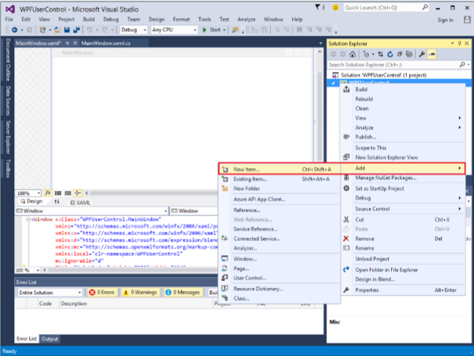
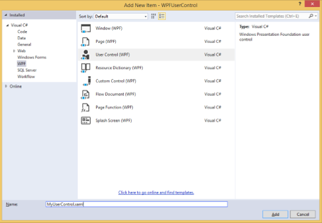
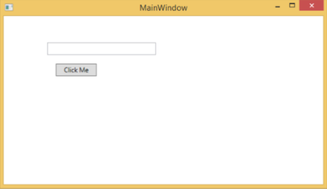
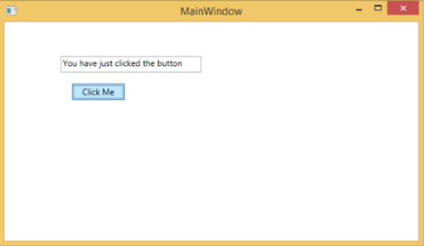
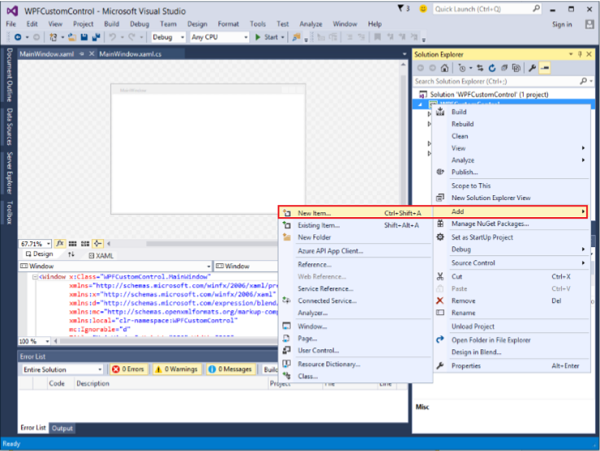
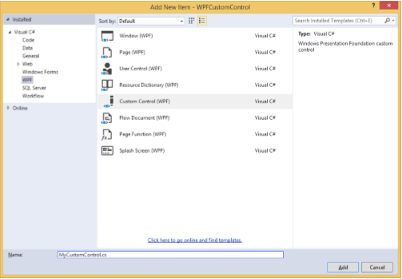
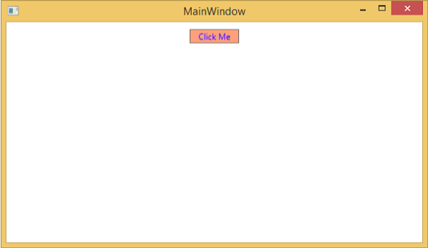
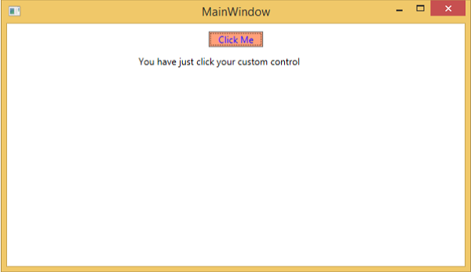

# WPF - Custom Controls
WPF applications allows to create custom controls which makes it very easy to create feature-rich and customizable controls. Custom controls are used when all the built-in controls provided by Microsoft are not fulfilling your criteria or you don’t want to pay for third-party controls.

In this chapter, you will learn how to create custom controls. Before we start taking a look at Custom Controls, let's take a quick look at a User Control first.

## User Control
User Controls provide a way to collect and combine different built-in controls together and package them into re-usable XAML. User controls are used in following scenarios −

   * If the control consists of existing controls, i.e., you can create a single control of multiple, already existing controls.
   * If the control doesn't need support for theming. User Controls do not support complex customization, control templates, and difficult to style.
   * If a developer prefers to write controls using the code-behind model where a view and then a direct code behind for event handlers.
   * You won't be sharing your control across applications.

### Example
Let’s go to an example of User control and follow the steps given below.

   * Create a new WPF project and then right-click on your solution and select Add &gt; New Item...



   * The following window will open. Now select **User Control (WPF)** and name it MyUserControl.



   * Click the Add button and you will see that two new files (MyUserControl.xaml and MyUserControl.cs) will be added in your solution.

Here is the XAML code in which a button and a text box is created with some properties in MyUserControl.xaml file.

```
<UserControl x:Class = "WPFUserControl.MyUserControl" 
   xmlns = "http://schemas.microsoft.com/winfx/2006/xaml/presentation" 
   xmlns:x = "http://schemas.microsoft.com/winfx/2006/xaml" 
   xmlns:mc = "http://schemas.openxmlformats.org/markup-compatibility/2006"  
   xmlns:d = "http://schemas.microsoft.com/expression/blend/2008"  
   mc:Ignorable = "d" d:DesignHeight = "300" d:DesignWidth = "300"> 
	
   <Grid> 
      <TextBox Height = "23"  
         HorizontalAlignment = "Left"  
         Margin = "80,49,0,0" Name = "txtBox"  
         VerticalAlignment = "Top" Width = "200" /> 
			
      <Button Content = "Click Me"  
         Height = "23" HorizontalAlignment = "Left"  
         Margin = "96,88,0,0" Name = "button"  
         VerticalAlignment = "Top" Click = "button_Click" />    
   </Grid>
	
</UserControl>
```
Given below is the C# code for button click event in MyUserControl.cs file which updates the text box.

```
using System; 
using System.Windows; 
using System.Windows.Controls; 
 
namespace WPFUserControl {
   /// <summary>
      /// Interaction logic for MyUserControl.xaml 
   /// </summary> 
	
   public partial class MyUserControl : UserControl { 
	
      public MyUserControl() { 
         InitializeComponent(); 
      }  
		
      private void button_Click(object sender, RoutedEventArgs e) { 
         txtBox.Text = "You have just clicked the button"; 
      } 
   } 
}
```
Here is the implementation in MainWindow.xaml to add the user control.

```
<Window x:Class = "XAMLUserControl.MainWindow" 
   xmlns = "http://schemas.microsoft.com/winfx/2006/xaml/presentation" 
   xmlns:x = "http://schemas.microsoft.com/winfx/2006/xaml" 
   xmlns:control = "clr-namespace:WPFUserControl" 
   Title = "MainWindow" Height = "350" Width = "525"> 
	
   <Grid> 
      <control:MyUserControl/> 
   </Grid> 
	
</Window>
```
When you compile and execute the above code, it will produce the following window.



Upon clicking the "Click Me" button, you will notice that the text inside the textbox is updated.



## Custom Controls
A custom control is a class which offers its own style and template which are normally defined in generic.xaml. Custom controls are used in the following scenarios −

   * If the control doesn't exist and you have to create it from scratch.
   * If you want to extend or add functionality to a preexisting control by adding an extra property or an extra functionality to fit your specific scenario.
   * If your controls need to support theming and styling.
   * If you want to share your control across applications.

### Example
Let’s take an example to understand how custom controls work. Create a new WPF project and then right-click on your solution and select Add &gt; New Item...



It will open the following window. Now select **Custom Control (WPF)** and name it **MyCustomControl**.



Click the Add button and you will see that two new files (Themes/Generic.xaml and MyCustomControl.cs) will be added in your solution.

Here is the XAML code in which style is set for the custom control in Generic.xaml file.

```
<ResourceDictionary 
   xmlns = "http://schemas.microsoft.com/winfx/2006/xaml/presentation" 
   xmlns:x = "http://schemas.microsoft.com/winfx/2006/xaml" 
   xmlns:local = "clr-namespace:WPFCustomControls">  
	
   <Style TargetType = "{x:Type local:MyCustomControl}"
      BasedOn = "{StaticResource {x:Type Button}}"> 
      <Setter Property = "Background" Value = "LightSalmon" /> 
      <Setter Property = "Foreground" Value = "Blue"/> 
   </Style> 
	
</ResourceDictionary>
```
Here is the C# code for MyCustomControl class which is inherited from the button class and in constructor it overrides the metadata.

```
using System; 
using System.Windows; 
using System.Windows.Controls; 
 
namespace WPFCustomControls { 

   public class MyCustomControl : Button { 
	
      static MyCustomControl() { 
         DefaultStyleKeyProperty.OverrideMetadata(typeof(MyCustomControl), new
            FrameworkPropertyMetadata(typeof(MyCustomControl))); 
      } 
		
   } 
}
```
Here is the custom control click event implementation in C# which updates the text of the text block.

```
using System; 
using System.Windows; 
using System.Windows.Controls;

namespace WPFCustomControls { 
   /// <summary> 
      /// Interaction logic for MainWindow.xaml 
   /// </summary> 
	
   public partial class MainWindow : Window { 
	
      public MainWindow() { 
         InitializeComponent(); 
      }  
		
      private void customControl_Click(object sender, RoutedEventArgs e) { 
         txtBlock.Text = "You have just click your custom control"; 
      }
		
   } 
}
```
Here is implementation in MainWindow.xaml to add the custom control and a TextBlock.

```
<Window x:Class = "WPFCustomControls.MainWindow" 
   xmlns = "http://schemas.microsoft.com/winfx/2006/xaml/presentation" 
   xmlns:x = "http://schemas.microsoft.com/winfx/2006/xaml" 
   xmlns:control = "clr-namespace:WPFCustomControls" 
   Title = "MainWindow" Height = "350" Width = "604"> 
	
   <StackPanel> 
      <control:MyCustomControl x:Name = "customControl"  
         Content = "Click Me" Width = "70" 
         Margin = "10" Click = "customControl_Click"/> 
			
      <TextBlock Name = "txtBlock"  
         Width = "250" Height = "30"/> 
   </StackPanel>
	
</Window>
```
When you compile and execute the above code, it will produce the following window with a custom control which is a customized button.



Upon clicking the customized button, you will see that the text inside text block is updated.




[Previous Page](../wpf/wpf_debugging.md) [Next Page](../wpf/wpf_exception_handling.md) 
