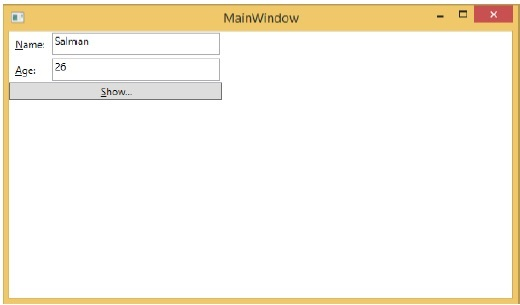
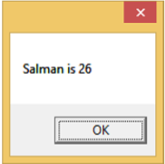
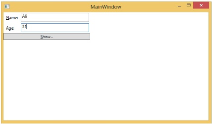
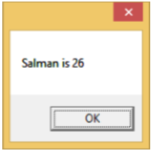
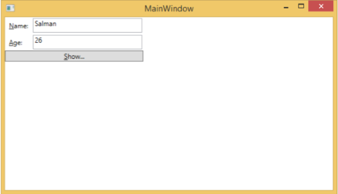
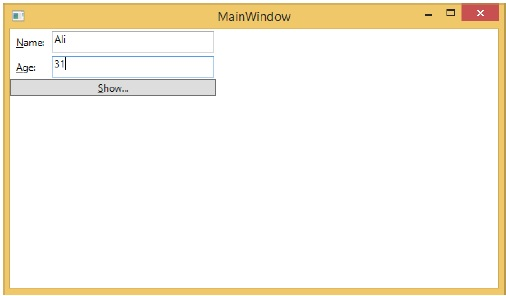
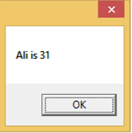

# WPF - Data Binding
Data binding is a mechanism in WPF applications that provides a simple and easy way for Windows Runtime apps to display and interact with data. In this mechanism, the management of data is entirely separated from the way data.

Data binding allows the flow of data between UI elements and data object on user interface. When a binding is established and the data or your business model changes, then it reflects the updates automatically to the UI elements and vice versa. It is also possible to bind, not to a standard data source, but to another element on the page.

Data binding is of two types − **one-way data binding** and **two-way data binding**.

## One-Way Data Binding
In one-way binding, data is bound from its source (that is the object that holds the data) to its target (that is the object that displays the data)

   * Let’s take a simple example to understand one-way data binding in detail. First of all, create a new WPF project with the name **WPFDataBinding**.
   * The following XAML code creates two labels, two textboxes, and one button and initializes them with some properties.

```
<Window x:Class = "WPFDataBinding.MainWindow" 
   xmlns = "http://schemas.microsoft.com/winfx/2006/xaml/presentation" 
   xmlns:x = "http://schemas.microsoft.com/winfx/2006/xaml" 
   xmlns:d = "http://schemas.microsoft.com/expression/blend/2008" 
   xmlns:mc = "http://schemas.openxmlformats.org/markup-compatibility/2006" 
   xmlns:local = "clr-namespace:WPFDataBinding" 
   mc:Ignorable = "d" Title = "MainWindow" Height = "350" Width = "604"> 
	
   <Grid> 
	
      <Grid.RowDefinitions> 
         <RowDefinition Height = "Auto" /> 
         <RowDefinition Height = "Auto" /> 
         <RowDefinition Height = "*" /> 
      </Grid.RowDefinitions> 
		
      <Grid.ColumnDefinitions> 
         <ColumnDefinition Width = "Auto" /> 
         <ColumnDefinition Width = "200" /> 
      </Grid.ColumnDefinitions>
		
      <Label Name = "nameLabel" Margin = "2">_Name:</Label> 
		
      <TextBox Name = "nameText" Grid.Column = "1" Margin = "2" 
         Text = "{Binding Name, Mode = OneWay}"/>  
			
      <Label Name = "ageLabel" Margin = "2" Grid.Row = "1">_Age:</Label> 
		
      <TextBox Name = "ageText" Grid.Column = "1" Grid.Row = "1" Margin = "2" 
         Text = "{Binding Age, Mode = OneWay}"/>  
			
      <StackPanel Grid.Row = "2" Grid.ColumnSpan = "2"> 
         <Button Content = "_Show..." Click="Button_Click" /> 
      </StackPanel> 
		
   </Grid> 
</Window>
```
   * The text properties of both the textboxes bind to “Name” and “Age” which are class variables of Person class which is shown below.
   * In Person class, we have just two variables **Name** and **Age**, and its object is initialized in **MainWindow** class.
   * In XAML code, we are binding to a property Name and Age, but we have not selected what object that property belongs to.
   * The easier way is to assign an object to **DataContext** whose properties we are binding in the following C# code in **MainWindowconstructor**.

```
using System.Windows;  
namespace WPFDataBinding { 

   public partial class MainWindow : Window {
	
      Person person = new Person { Name = "Salman", Age = 26 };
		
      public MainWindow() { 
         InitializeComponent(); 
         this.DataContext = person; 
      } 
		
      private void Button_Click(object sender, RoutedEventArgs e) { 
         string message = person.Name + " is " + person.Age; 
         MessageBox.Show(message); 
      } 
   } 
	
   public class Person { 
	
      private string nameValue;
		
      public string Name { 
         get { return nameValue; } 
         set { nameValue = value; } 
      } 
		
      private double ageValue; 
		
      public double Age { 
         get { return ageValue; } 
				
         set { 
            if (value != ageValue) { 
               ageValue = value; 
            } 
         } 
      }
		
   } 
}
```
   * Let's run this application and you can see immediately in our MainWindow that we have successfully bound to the Name and Age of that Person object.



When you press the **Show** button, it will display the name and age on the message box.



Let’s change the Name and Age in the dialog box.



If you now click the Show button, it will again display the same message.



This because data binding mode is set to one-way in the XAML code. To show the updated data, you will need to understand two-way data binding.

## Two-Way Data Binding
In two-way binding, the user can modify the data through the user interface and have that data updated in the source. If the source changes while the user is looking at the view, you want the view to be updated.

Let’s take the same example but here, we will change the binding mode from One Way to Two Way in the XAML code.

```
<Window x:Class = "WPFDataBinding.MainWindow" 
   xmlns = "http://schemas.microsoft.com/winfx/2006/xaml/presentation" 
   xmlns:x = "http://schemas.microsoft.com/winfx/2006/xaml" 
   xmlns:d = "http://schemas.microsoft.com/expression/blend/2008" 
   xmlns:mc = "http://schemas.openxmlformats.org/markup-compatibility/2006" 
   xmlns:local = "clr-namespace:WPFDataBinding" 
   mc:Ignorable = "d" Title = "MainWindow" Height = "350" Width = "604"> 
	
   <Grid> 
	
      <Grid.RowDefinitions> 
         <RowDefinition Height = "Auto" /> 
         <RowDefinition Height = "Auto" /> 
         <RowDefinition Height = "*" /> 
      </Grid.RowDefinitions> 
		
      <Grid.ColumnDefinitions> 
         <ColumnDefinition Width = "Auto" /> 
         <ColumnDefinition Width = "200" /> 
      </Grid.ColumnDefinitions> 
		
      <Label Name = "nameLabel" Margin = "2">_Name:</Label> 
      <TextBox Name = "nameText" Grid.Column = "1" Margin = "2" 
         Text = "{Binding Name, Mode = TwoWay}"/>  
      <Label Name = "ageLabel" Margin = "2" Grid.Row = "1">_Age:</Label> 
      <TextBox Name = "ageText" Grid.Column = "1" Grid.Row = "1" Margin = "2" 
         Text = "{Binding Age, Mode = TwoWay}"/> 
			
      <StackPanel Grid.Row = "2" Grid.ColumnSpan = "2"> 
         <Button Content = "_Show..." Click = "Button_Click" /> 
      </StackPanel>
		
   </Grid>
	
</Window>
```
Let's run this application again.



It will produce the same output −


Let’s now change the Name and Age values −



If you click the Show button now, it will display the updated message.



We recommend that you execute the above code with both the cases for a better understanding of the concept.


[Previous Page](../wpf/wpf_command_line.md) [Next Page](../wpf/wpf_resources.md) 
