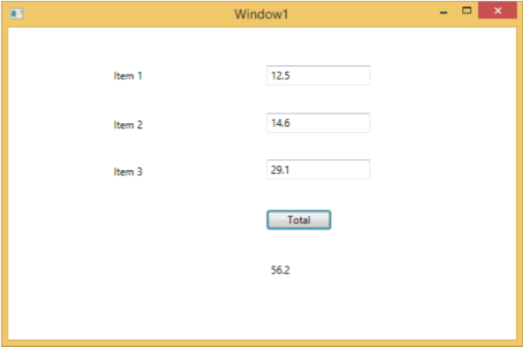
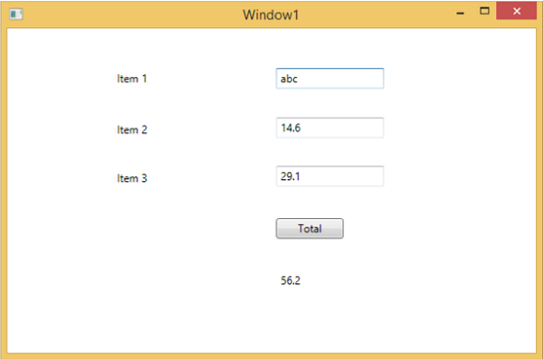
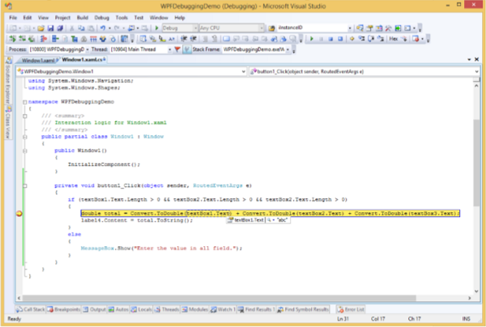
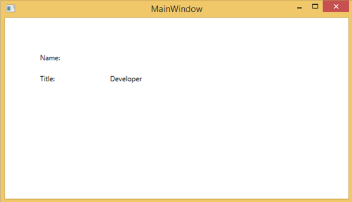
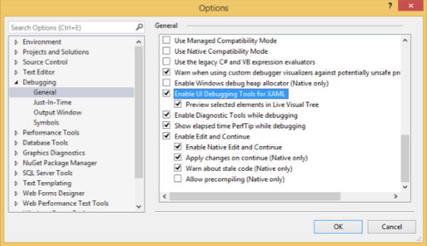
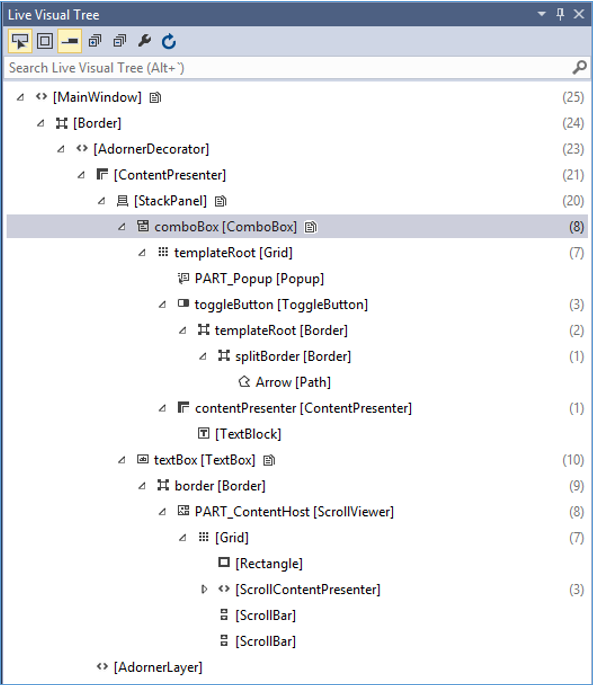

# WPF - Debugging
It is a systematic mechanism of identifying and fixing the bugs or defects in a piece of code which are not behaving the same as you are expecting. Debugging a complex application where the subsystems are tightly coupled are not that easy, because fixing bugs in one subsystem can create bugs in another subsystem.

## Debugging in C#
In WPF applications, programmers deal with two languages such as C# and XAML. If you are familiar with debugging in any procedural language such as C# or C/C++ and you also know the usage of break points, then you can debug the C# part of your application easily.

Let’s take a simple example to demonstrate how to debug a C# code. Create a new WPF project with the name **WPFDebuggingDemo**. Drag four labels, three textboxes, and one button from the toolbox. Take a look at the following XAML code.

```
<Window x:Class = "WPFDebuggingDemo.Window1" 
   xmlns = "http://schemas.microsoft.com/winfx/2006/xaml/presentation" 
   xmlns:x = "http://schemas.microsoft.com/winfx/2006/xaml" 
   Title = "Window1" Height = "400" Width = "604"> 
	
   <Grid> 
      <TextBox Height = "23" Margin = "0,44,169,0" Name = "textBox1"  
         VerticalAlignment = "Top" HorizontalAlignment = "Right" Width = "120" /> 
			
      <TextBox Height = "23" Margin = "0,99,169,0" Name = "textBox2"  
         VerticalAlignment = "Top" HorizontalAlignment = "Right" Width = "120" /> 
			
      <TextBox HorizontalAlignment = "Right" Margin = "0,153,169,0"  
         Name = "textBox3" Width = "120" Height = "23" VerticalAlignment = "Top" /> 
			
      <Label Height = "28" Margin = "117,42,0,0" Name = "label1"  
         VerticalAlignment = "Top" HorizontalAlignment = "Left" Width = "120">
         Item 1</Label> 
			
      <Label Height = "28" HorizontalAlignment = "Left"  
         Margin = "117,99,0,0" Name = "label2" VerticalAlignment = "Top" Width = "120">
         Item 2</Label> 
			
      <Label HorizontalAlignment = "Left" Margin = "117,153,0,181"  
         Name = "label3" Width = "120">Item 3</Label>
			
      <Button Height = "23" HorizontalAlignment = "Right" Margin = "0,0,214,127"
         Name = "button1" VerticalAlignment = "Bottom" Width = "75"  
         Click = "button1_Click">Total</Button> 
			
      <Label Height = "28" HorizontalAlignment = "Right"  
         Margin = "0,0,169,66" Name = "label4" VerticalAlignment = "Bottom" Width = "120"/> 
			
   </Grid> 
	
</Window>
```
Given below is the C# code in which a button click event is implemented.

```
using System; 
using System.Collections.Generic; 
using System.Linq; 
using System.Text;
 
using System.Windows; 
using System.Windows.Controls; 
using System.Windows.Data; 
using System.Windows.Documents; 
using System.Windows.Input; 
using System.Windows.Media; 
using System.Windows.Media.Imaging; 
using System.Windows.Navigation; 
using System.Windows.Shapes;  

namespace WPFDebuggingDemo { 
   /// <summary> 
      /// Interaction logic for Window1.xaml 
   /// </summary> 
	
   public partial class Window1 : Window { 
	
      public Window1() {
         InitializeComponent();
      }
		
      private void button1_Click(object sender, RoutedEventArgs e) {
		
         if (textBox1.Text.Length > 0 && textBox2.Text.Length > 0 && textBox2.Text.Length > 0) {
            double total = Convert.ToDouble(textBox1.Text) + 
            Convert.ToDouble(textBox2.Text) + Convert.ToDouble(textBox3.Text); 
            label4.Content = total.ToString(); 
         } 
         else { 
            MessageBox.Show("Enter the value in all field.");
         } 
      } 
   } 
}
```
When you compile and execute the above code, it will produce the following window. Now enter values in the textboxes and press the Total button. You will get the total value after summation of all the values entered in the textboxes.



If you try to enter values other than real values, then the above application will crash. To find and resolve the issue (why it is crashing), you can insert break points in the button click event.

Let’s write "abc" in item 1 as shown below.



Upon clicking the Total button, you will see that the program stops at the break point.



Now move the cursor towards the textbox1.Text and you will see that the program is trying to add **abc** value with the other values which is why the program is crashing.

## Debugging in XAML
If you are expecting the same kind of debugging in XAML, then you will be surprised to know that it is not possible yet to debug the XAML code like debugging any other procedural language code. When you hear the term debugging in XAML code, it means try and find an error.

   * In data binding, your data doesn't show up on screen and you don't know why
   * Or an issue is related to complex layouts.
   * Or an alignment issue or issues in margin color, overlays, etc. with some extensive templates like ListBox and combo box.

Debugging an XAML program is something you typically do to check if your bindings work; and if it is not working, then to check what's wrong. Unfortunately setting breakpoints in XAML bindings isn't possible except in Silverlight, but we can use the Output window to check for data binding errors. Let's take a look at the following XAML code to find the error in data binding.

```
<Window x:Class = "DataBindingOneWay.MainWindow" 
   xmlns = "http://schemas.microsoft.com/winfx/2006/xaml/presentation" 
   xmlns:x = "http://schemas.microsoft.com/winfx/2006/xaml" 
   Title = "MainWindow" Height = "350" Width = "604"> 
	
   <Grid> 
      <StackPanel Name = "Display"> 
         <StackPanel Orientation = "Horizontal" Margin = "50, 50, 0, 0"> 
            <TextBlock Text = "Name: " Margin = "10" Width = "100"/> 
            <TextBlock Margin = "10" Width = "100" Text = "{Binding FirstName}"/> 
         </StackPanel> 
			
         <StackPanel Orientation = "Horizontal" Margin = "50,0,50,0"> 
            <TextBlock Text = "Title: " Margin = "10" Width = "100"/> 
            <TextBlock Margin = "10" Width = "100" Text = "{Binding Title}" /> 
         </StackPanel> 
			
      </StackPanel> 
   </Grid> 
	
</Window>
```
Text properties of two text blocks are set to “Name” and “Title” statically, while other two text blocks Text properties are bind to “FirstName” and “Title” but class variables are Name and Title in Employee class which is shown below.

We have intentionally written an incorrect variable name so as to understand where can we find this type of a mistake when the desired output is not shown.

```
using System; 
using System.Collections.Generic; 
using System.Linq; 
using System.Text; 
using System.Threading.Tasks;  

namespace DataBindingOneWay { 

   public class Employee { 
      public string Name { get; set; } 
      public string Title { get; set; }  
		
      public static Employee GetEmployee() { 
		
         var emp = new Employee() { 
            Name = "Ali Ahmed", Title = "Developer" 
         }; 
			
         return emp; 
      }  
   } 
}
```
Here is the implementation of MainWindow class in C# code.

```
using System; 
using System.Windows; 
using System.Windows.Controls; 
 
namespace DataBindingOneWay { 
   /// <summary> 
      /// Interaction logic for MainWindow.xaml
   /// </summary> 
	
   public partial class MainWindow : Window { 
	
      public MainWindow() { 
         InitializeComponent(); 
         DataContext = Employee.GetEmployee(); 
      } 
   } 
}
```
Let's run this application and you can see immediately in our MainWindow that we have successfully bound to the Title of that Employee object but the name is not bound.



To check what happened with the name, let’s look into the output window where a lot of log is generated.

The easy to find an error is just to search for the error and you will find the following error which says 

```
System.Windows.Data Error: 40 : BindingExpression path error: 'FirstName'
   property not found on 'object' ''Employee' (HashCode=11611730)'.
   BindingExpression:Path = FirstName; DataItem = 'Employee' (HashCode = 11611730);
   target element is 'TextBlock' (Name=''); target property is 'Text' (type 'String')
```
Which clearly indicate that FirstName is not a member of Employee class, so it helps to fix this type of issues in your application.

When you change the FirstName to Name again, then you will see the desired output.

## UI Debugging Tools for XAML
UI debugging tools were introduced for XAML with Visual Studio 2015 to inspect the XAML code at runtime. With the help of these tools, XAML code is presented in the form of a visual tree of your running WPF application and also the different UI element properties in the tree. To enable these tools, follow the steps given below.

   * Go to the Tools menu and select Options from the Tools menu.
   * It will open the following dialog box.



   * Go to the General Options under Debugging item on the left side.
   * Tick the highlighted option, i.e., “Enable UI Debugging Tools for XAML” and click the OK button.

Now run any XAML application or use the following XAML code.

```
<Window x:Class = "XAMLTestBinding.MainWindow" 
   xmlns = "http://schemas.microsoft.com/winfx/2006/xaml/presentation" 
   xmlns:x = "http://schemas.microsoft.com/winfx/2006/xaml" 
   Title = "MainWindow" Height = "350" Width = "604"> 
	
   <StackPanel> 
      <ComboBox Name = "comboBox"  Margin = "50" Width = "100"> 
         <ComboBoxItem Content = "Green" /> 
         <ComboBoxItem  Content = "Yellow" IsSelected = "True" />
         <ComboBoxItem Content = "Orange" /> 
      </ComboBox> 
		
      <TextBox  Name = "textBox" Margin = "50" Width = "100" Height = "23"
         VerticalAlignment = "Top" Text  =
         "{Binding ElementName = comboBox, Path = SelectedItem.Content, Mode = TwoWay, UpdateSourceTrigger = PropertyChanged}" 
         Background = "{Binding ElementName = comboBox, Path = SelectedItem.Content}"> 
      </TextBox> 
		
   </StackPanel> 
	
</Window>
```
When you execute the application, it will show the Live Visual Tree where all the elements are shown in a tree.



This Live Visual Tree shows the complete layout structure to understand where the UI elements are located. But this option is only available in Visual Studio 2015. If you are using an older option of Visual Studio, then you can’t use this tool, however there is another tool which can be integrated with Visual Studio such as XAML Spy for Visual Studio. You can download it from [xamlspy](http://xamlspy.com/download) 


[Previous Page](../wpf/wpf_triggers.md) [Next Page](../wpf/wpf_custom_controls.md) 
