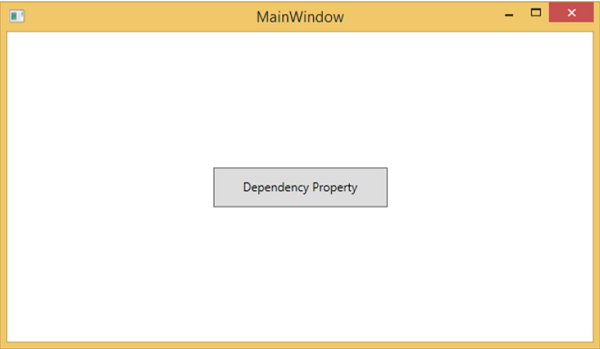
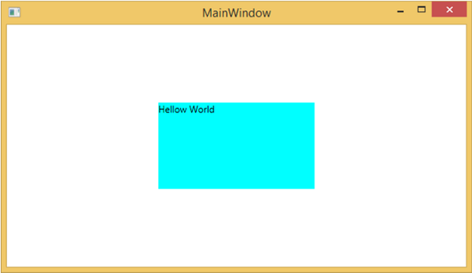

# WPF - Dependency Properties
In WPF applications, dependency property is a specific type of property which extends the CLR property. It takes the advantage of specific functionalities available in the WPF property system.

A class which defines a dependency property must be inherited from the **DependencyObject** class. Many of the UI controls class which are used in XAML are derived from the **DependencyObject** class and they support dependency properties, e.g. Button class supports the **IsMouseOver** dependency property.

The following XAML code creates a button with some properties.

```
<Window x:Class = "WPFDependencyProperty.MainWindow" 
   xmlns = "http://schemas.microsoft.com/winfx/2006/xaml/presentation" 
   xmlns:x = "http://schemas.microsoft.com/winfx/2006/xaml" 
   xmlns:local = "clr-namespace:WPFDependencyProperty"
   Title = "MainWindow" Height = "350" Width = "604"> 
	
   <Grid> 
      <Button  Height = "40" Width = "175" Margin = "10" Content = "Dependency Property"> 
         <Button.Style> 
            <Style TargetType = "{x:Type Button}"> 
               <Style.Triggers> 
					
                  <Trigger Property = "IsMouseOver" Value = "True"> 
                     <Setter Property = "Foreground" Value = "Red" /> 
                  </Trigger>
						
               </Style.Triggers>
            </Style> 
         </Button.Style> 
      </Button> 
   </Grid> 
	
</Window>
```
The x:Type markup extension in XAML has a similar functionality like typeof() in C#. It is used when attributes are specified which take the type of the object such as &lt;Style TargetType = "{x:Type Button}"&gt;

When the above code is compiled and executed, you would get the following **MainWindow**. When the mouse is over the button, it will change the foreground color of a button. When the mouse leaves the button, it changes back to its original color.



## Why We Need Dependency Properties
Dependency property gives you all kinds of benefits when you use it in your application. Dependency Property can used over a CLR property in the following scenarios −

   * If you want to set the style
   * If you want data binding
   * If you want to set with a resource (a static or a dynamic resource)
   * If you want to support animation

Basically, Dependency Properties offer a lot of functionalities that you won’t get by using a CLR property.

The main difference between **dependency properties** and other **CLR properties** are listed below −

   * CLR properties can directly read/write from the private member of a class by using **getter** and **setter**. In contrast, dependency properties are not stored in local object.
   * Dependency properties are stored in a dictionary of key/value pairs which is provided by the DependencyObject class. It also saves a lot of memory because it stores the property when changed. It can be bound in XAML as well.

## Custom Dependency Properties
In .NET framework, custom dependency properties can also be defined. Follow the steps given below to define custom dependency property in C#.

   * Declare and register your **dependency property** with system call register.
   * Provide the **setter** and **getter** for the property.
   * Define a **static handler** which will handle any changes that occur globally
   * Define an **instance handler** which will handle any changes that occur to that particular instance.

The following C# code defines a dependency property to set the **SetText** property of the user control.

```
using System; 
using System.Collections.Generic; 
using System.Linq; 
using System.Text; 
using System.Threading.Tasks; 

using System.Windows; 
using System.Windows.Controls; 
using System.Windows.Data; 
using System.Windows.Documents; 
using System.Windows.Input; 
using System.Windows.Media; 
using System.Windows.Media.Imaging; 
using System.Windows.Navigation; 
using System.Windows.Shapes;  

namespace WpfApplication3 { 
   /// <summary> 
      /// Interaction logic for UserControl1.xaml 
   /// </summary> 
	
   public partial class UserControl1 : UserControl { 
	
      public UserControl1() { 
         InitializeComponent(); 
      }
		
      public static readonly DependencyProperty SetTextProperty = 
         DependencyProperty.Register("SetText", typeof(string), typeof(UserControl1), new 
            PropertyMetadata("", new PropertyChangedCallback(OnSetTextChanged))); 
				
      public string SetText { 
         get { return (string)GetValue(SetTextProperty); } 
         set { SetValue(SetTextProperty, value); } 
      } 
		
      private static void OnSetTextChanged(DependencyObject d,
         DependencyPropertyChangedEventArgs e) { 
         UserControl1 UserControl1Control = d as UserControl1; 
         UserControl1Control.OnSetTextChanged(e); 
      } 
		
      private void OnSetTextChanged(DependencyPropertyChangedEventArgs e) { 
         tbTest.Text = e.NewValue.ToString(); 
      }  
   } 
}
```
Here is the XAML file in which the TextBlock is defined as a user control and the Text property will be assigned to it by the SetText dependency property.

The following XAML code creates a user control and initializes its **SetText** dependency property.

```
<Window x:Class = "WpfApplication3.MainWindow" 
   xmlns = "http://schemas.microsoft.com/winfx/2006/xaml/presentation" 
   xmlns:x = "http://schemas.microsoft.com/winfx/2006/xaml" 
   xmlns:views = "clr-namespace:WpfApplication3"
   Title = "MainWindow" Height = "350" Width = "604"> 
	
   <Grid> 
      <views:UserControl1 SetText = "Hellow World"/> 
   </Grid> 
	
</Window>
```
Let's run this application. You can immediately observe that in our MainWindow, the dependency property for user control has been successfully used as a Text.




[Previous Page](../wpf/wpf_elements_tree.md) [Next Page](../wpf/wpf_routed_events.md) 
