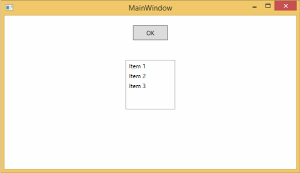
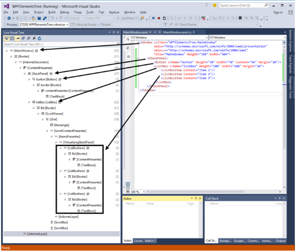

# WPF - Elements Tree
There are many technologies where the elements and components are ordered in a tree structure so that the programmers can easily handle the object and change the behavior of an application. Windows Presentation Foundation (WPF) has a comprehensive tree structure in the form of objects. In WPF, there are two ways that a complete object tree is conceptualized −

   * Logical Tree Structure
   * Visual Tree Structure

With the help of these tree structures, you can easily create and identify the relationship between UI elements. Mostly, WPF developers and designers either use procedural language to create an application or design the UI part of the application in XAML keeping in mind the object tree structure.

## Logical Tree Structure
In WPF applications, the structure of the UI elements in XAML represents the logical tree structure. In XAML, the basic elements of UI are declared by the developer. The logical tree in WPF defines the following −

   * Dependency properties
   * Static and dynamic resources
   * Binding the elements on its name etc.

Let’s have a look at the following example in which a button and a list box are created.

```
<Window x:Class = "WPFElementsTree.MainWindow" 
   xmlns = "http://schemas.microsoft.com/winfx/2006/xaml/presentation" 
   xmlns:x = "http://schemas.microsoft.com/winfx/2006/xaml"
   Title = "MainWindow" Height = "350" Width = "604"> 
	
   <StackPanel> 
      <Button x:Name = "button" Height = "30" Width = "70" Content = "OK" Margin = "20" /> 
		
      <ListBox x:Name = "listBox" Height = "100" Width = "100" Margin = "20"> 
         <ListBoxItem Content = "Item 1" /> 
         <ListBoxItem Content = "Item 2" /> 
         <ListBoxItem Content = "Item 3" /> 
      </ListBox> 
		
   </StackPanel> 
	
</Window>
```
If you look at the XAML code, you will observe a tree structure, i.e. the root node is the Window and inside the root node, there is only one child, that is StackPanel. But StackPanel contains two child elements, button and list box. List box has three more child list box items.

## Visual Tree Structure
In WPF, the concept of the visual tree describes the structure of visual objects, as represented by the Visual Base Class. It signifies all the UI elements which are rendered to the output screen.

When a programmer wants to create a template for a particular control, he is actually rendering the visual tree of that control. The visual tree is also very useful for those who want to draw lower level controls for performance and optimization reasons.

In WPF applications, visual tree is used for −

   * Rendering the visual objects. 
   * Rendering the layouts.
   * The routed events mostly travel along the visual tree, not the logical tree.

To see the visual tree of the above simple application which contains a button and a list box, let’s compile and execute the XAML code and you will see the following window.



When the application is running, you can see the visual tree of the running application in Live Visual Tree window which shows the complete hierarchy of this application, as shown below.



The visual tree is typically a superset of the logical tree. You can see here that all the logical elements are also present in the visual tree. So these two trees are really just two different views of the same set of objects that make up the UI.

   * The logical tree leaves out a lot of detail enabling you to focus on the core structure of the user interface and to ignore the details of exactly how it has been presented.
   * The logical tree is what you use to create the basic structure of the user interface.
   * The visual tree will be of interest if you're focusing on the presentation. For example, if you wish to customize the appearance of any UI element, you will need to use the visual tree.


[Previous Page](../wpf/wpf_xaml_overview.md) [Next Page](../wpf/wpf_dependency_properties.md) 
